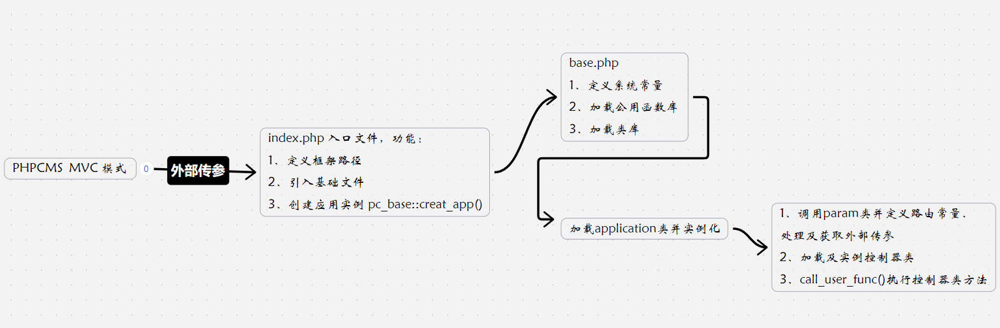
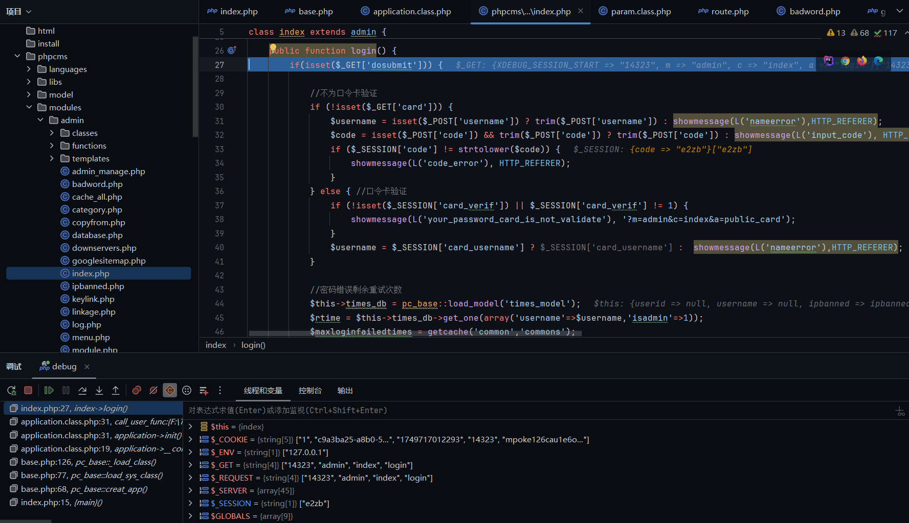
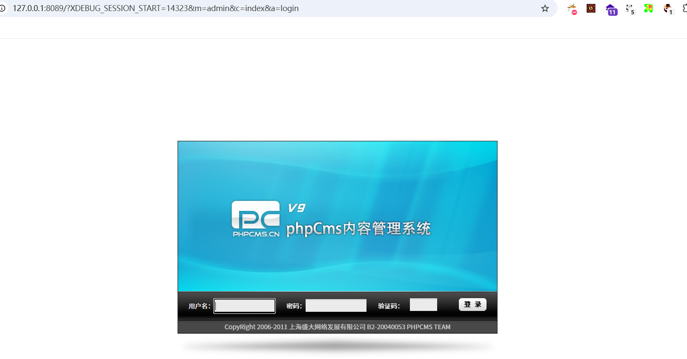

# PHPCMSv9 MVC模式学习


这次学习了其他优秀文章的风格，将许多分析直接嵌在代码块内，这是我实际阅读文章得到的体验，截图不如代码块直观简洁好读
# 全局分析

项目结构
```
api 接口文件目录
caches 缓存文件目录
	– configs 系统配置文件目录
    – caches_* 系统缓存目录
phpcms  phpcms框架主目录
    – languages 框架语言包目录
    – libs 框架主类库、主函数库目录
    – model 框架数据库模型目录
    – modules 框架模块目录
    – templates 框架系统模板目录
phpsso_server  phpsso主目录
statics 系统附件包
    – css 系统css包
    – images 系统图片包
    – js 系统js包
uploadfile 网站附件目录
admin.php 后台管理入口
index.php 程序主入口
crossdomain.xml FLASH跨域传输文件
robots.txt 搜索引擎蜘蛛限制配置文件
favicon.ico 系统icon图标
```
## 路由机制
PHPCMS 使用的是 MVC 模式，这是一种现代化的设计思想，借鉴了 Java 的设计模式。首先理解一下 MVC 与传统 PHP 模式的区别
传统 PHP 模式，直接访问文件并执行文件中的函数，外部传参通常携在指定文件路径中进行操作，文件即代表路由，并没有专门路由控制机制，任何人都可以直接访问对应的文件和功能。。
MVC 模式(Model-View-Controller)，采用一个入口文件来进行统一的路由控制。所有的请求必须通过这个入口文件才能访问相应的页面。用户传参时携带规范化的参数，入口文件作为统一的访问点，程序通过 Controller（控制器）进行请求转发，控制器调用 Model（模型）来处理请求，模型处理完请求后返回数据，最后控制器将数据传递给 View（视图）进行格式化并展示给用户
PHPCMS 是通过如下方式来实现路由限制：

```
defined('IN_PHPCMS') or exit('No permission resources.');
//IN_PHPCMS 在访问入口文件后会被定义，defined 检查是否被定义，如果没有则终止程序
//该代码通常位于每个业务文件的开头，以防止直接访问内部文件
```
先从入口文件开始读起
```
#index.php
define('PHPCMS_PATH', dirname(__FILE__).DIRECTORY_SEPARATOR);
include PHPCMS_PATH.'/phpcms/base.php';
pc_base::creat_app();
```
define 包含 base.php 文件，index.php -> base.php
PHPCMS 整个内容管理系统有两大框架，PHPCMS(系统的核心框架，负责处理内容管理、前端展示、数据库交互等功能)、PHPSSO_SERVER（负责单点登录的功能，后面再了解），base.php 也是作为 PHPCMS 框架入口文件
继续分析 base.php
```
define('IN_PHPCMS', true);  
//PHPCMS框架路径  
define('PC_PATH', dirname(__FILE__).DIRECTORY_SEPARATOR);  
define(//先定义一些系统环境变量...);

//然后加载公用函数库  
pc_base::load_sys_func('global');
  =>public static function load_sys_func($func) {  
		return self::_load_func($func); 
		//调用类方法 _load_func，$func为要调用的函数名
	}
	  =>private static function _load_func($func, $path = '') {  
		static $funcs = array();  
		if (empty($path)) $path = 'libs'.DIRECTORY_SEPARATOR.'functions';
		// lib/functions 这个目录下存放着公用函数库  
		$path .= DIRECTORY_SEPARATOR.$func.'.func.php';  
		$key = md5($path);  
		if (isset($funcs[$key])) return true;  
		if (file_exists(PC_PATH.$path)) {  
		   include PC_PATH.$path;  
		   // 最终包含公用函数库，这里包含的是 lib/functions/glocal.func.php
		} else {  
		   $funcs[$key] = false;  
		   return false;  
		}  
		$funcs[$key] = true;  
		return true;  
pc_base::load_sys_func('extention');  //同理包含 lib/functions/extention.func.php
pc_base::auto_load_func();
  =>public static function auto_load_func($path='') {  
    return self::_auto_load_func($path);  
    // 调用私有方法
	}
	  =>private static function _auto_load_func($path = '') {  
		    if (empty($path)) $path = 'libs'.DIRECTORY_SEPARATOR.'functions'.DIRECTORY_SEPARATOR.'autoload';
		    // libs/functions/autoload 路径  
		    $path .= DIRECTORY_SEPARATOR.'*.func.php';  
		    $auto_funcs = glob(PC_PATH.DIRECTORY_SEPARATOR.$path);
		    // 这里是包含 libs/functions/autoload 路径下的所有类方法文件
		    if(!empty($auto_funcs) && is_array($auto_funcs)) {  
		       foreach($auto_funcs as $func_path) {  
		          include $func_path;  
		       }  
		    }
}

pc_base::load_config('system','errorlog') ? set_error_handler('my_error_handler') : error_reporting(E_ERROR | E_WARNING | E_PARSE);
//加载配置文件，并返回 key 的值
```
继续定义变量和加载配置文件
```
define('CHARSET' ,pc_base::load_config('system','charset'));
//输出页面字符集
header('Content-type: text/html; charset='.CHARSET);
define(//继续定义一些系统环境变量...);

if(pc_base::load_config('system','gzip') && function_exists('ob_gzhandler')) {
	ob_start('ob_gzhandler');
} else {
	ob_start();
}
```

至此 include PHPCMS_PATH.'/phpcms/base.php'; 做的事情已经结束，继续看 index.php，静态调用 creat_app()，如下调用
```
pc_base::creat_app();
  =>public static function creat_app() {  
	    return self::load_sys_class('application');  
	    // creat_app 会调用 load_sys_class 方法，它负责加载并实例化系统类
	}
	  =>public static function load_sys_class($classname, $path = '', $initialize = 1) {  
		       return self::_load_class($classname, $path, $initialize);  
		}
		  =>private static function _load_class($classname, $path = '', $initialize = 1) {
					static $classes = array();
					// 使用静态变量 $classes 来缓存已加载的类，避免重复加载
					if (empty($path)) $path = 'libs'.DIRECTORY_SEPARATOR.'classes';
			
					$key = md5($path.$classname);
					// 生成类文件的唯一标识符，以便缓存已加载的类
					if (isset($classes[$key])) {
						if (!empty($classes[$key])) {
							return $classes[$key];
						} else {
							return true;
						}
					}
					if (file_exists(PC_PATH.$path.DIRECTORY_SEPARATOR.$classname.'.class.php')) {
						// 如果类文件存在，则包含该类文件
						include PC_PATH.$path.DIRECTORY_SEPARATOR.$classname.'.class.php';
						$name = $classname;
						if ($my_path = self::my_path(PC_PATH.$path.DIRECTORY_SEPARATOR.$classname.'.class.php')) {
							include $my_path;
							$name = 'MY_'.$classname;
						}
						if ($initialize) {
							$classes[$key] = new $name;
							// 实例该类，PHP的spl_autoload_register()机制会自动找到路径下的类文件并实例对应类
						} else {
							$classes[$key] = true;
						}
						return $classes[$key];
					} else {
						return false;
					}
				}
```
入口页代码到此就结束，但分析显然不止于此，$classes[$key] = new $name; 这里看到实例化了 application 类，去看看它的构造函数
```
class application {
	public function __construct() {
		$param = pc_base::load_sys_class('param');
		//加载类文件 param.class.php
		define('ROUTE_M', $param->route_m());
		define('ROUTE_C', $param->route_c());
		define('ROUTE_A', $param->route_a());
		$this->init();
	}
...
}
```
load_sys_class 加载类文件 param.class.php，并且调用类文件函数 route_m、route_c、route_a，仔细看看这个文件内功能实现做了什么
```
class param {
	//路由配置
	private $route_config = '';
	
	public function __construct() {
	//传统过滤方式，实例时对外部传参进行 addslashes 转义
		if(!get_magic_quotes_gpc()) {
			$_POST = new_addslashes($_POST);
			$_GET = new_addslashes($_GET);
			$_REQUEST = new_addslashes($_REQUEST);
			$_COOKIE = new_addslashes($_COOKIE);
		}

		$this->route_config = pc_base::load_config('route', SITE_URL) ? pc_base::load_config('route', SITE_URL) : pc_base::load_config('route', 'default');
		  =>#route.php
			return array(
				'default'=>array('m'=>'content', 'c'=>'index', 'a'=>'init'),
				//定义默认参数项，当用户没传参时会使用到
			);
		//加载配置文件route.php并将赋给 route_config

		if(isset($this->route_config['data']['POST']) && is_array($this->route_config['data']['POST'])) {
			foreach($this->route_config['data']['POST'] as $_key => $_value) {
				if(!isset($_POST[$_key])) $_POST[$_key] = $_value;
				//定义POST全局变量
			}
		}
		if(isset($this->route_config['data']['GET']) && is_array($this->route_config['data']['GET'])) {
			foreach($this->route_config['data']['GET'] as $_key => $_value) {
				if(!isset($_GET[$_key])) $_GET[$_key] = $_value;
				//定义GET全局变量
			}
		}
		if(isset($_GET['page'])) $_GET['page'] = max(intval($_GET['page']),1);
		return true;
	}
```
构造函数先对外部传参进行转义处理，然后赋值给程序全局变量
再看调用的三个类函数，功能很简单就是获取外部规划化的三个参数 m、c、a 值并返回
那么 param.class.php 类文件功能也就清晰了，就是对外部传参进行转义处理，并处理外部请求的路由参数（`m`、`c`、`a`），同时根据配置文件提供默认值。

```
public function route_m() {
	$m = isset($_GET['m']) && !empty($_GET['m']) ? $_GET['m'] : (isset($_POST['m']) && !empty($_POST['m']) ? $_POST['m'] : '');
	if (empty($m)) {
		return $this->route_config['m'];
	} else {
		return $m;
	}
	//获取外部传参 m
}

public function route_c() {
	$c = isset($_GET['c']) && !empty($_GET['c']) ? $_GET['c'] : (isset($_POST['c']) && !empty($_POST['c']) ? $_POST['c'] : '');
	if (empty($c)) {
		return $this->route_config['c'];
	} else {
		return $c;
	}
	//获取外部传参 c
}

public function route_a() {
	$a = isset($_GET['a']) && !empty($_GET['a']) ? $_GET['a'] : (isset($_POST['a']) && !empty($_POST['a']) ? $_POST['a'] : '');
	if (empty($a)) {
		return $this->route_config['a'];
	} else {
		return $a;
	}
	//获取外部传参 a
}
```
同时构造函数中也导入了配置文件 route.php，定义了 m、c、a 的默认值，默认 a = init，即若没有传入 a 则默认会调用指定类的 init 方法

```
$this->route_config = pc_base::load_config('route', SITE_URL) ? pc_base::load_config('route', SITE_URL) : pc_base::load_config('route', 'default');
  =>#route.php
    return array(
        'default'=>array('m'=>'content', 'c'=>'index', 'a'=>'init'),
        //定义默认参数项，当用户没传参时会使用到
    );
//加载配置文件route.php并将赋给 route_config
```

回到 application.class.php，来到 $this->init(); ，这里的控制器就是指要访问的 php 业务文件。

$filepath = PC_PATH.'modules'.DIRECTORY_SEPARATOR.$m.DIRECTORY_SEPARATOR.$filename.'.php'; 这意味着用户从外部能调用的类文件业务服务仅包括 PC_PATH.'modules'. 文件夹的子文件

```
public function __construct() {  
    $this->init();  
}  
//调用 init()
  =>private function init() {  
	    $controller = $this->load_controller();  
	    // 加载控制器
	    if (method_exists($controller, ROUTE_A)) {  
	       if (preg_match('/^[_]/i', ROUTE_A)) {  
	          exit('You are visiting the action is to protect the private action');  
	       } else {  
	          call_user_func(array($controller, ROUTE_A));  
	          // ROUTE_A 即传参 a，执行实例化对象内部类方法
	       }  
	    } else {  
	       exit('Action does not exist.');  
	    }  
	}
	  =>private function load_controller($filename = '', $m = '') {  
		    if (empty($filename)) $filename = ROUTE_C;  
		    if (empty($m)) $m = ROUTE_M;  
		    $filepath = PC_PATH.'modules'.DIRECTORY_SEPARATOR.$m.DIRECTORY_SEPARATOR.$filename.'.php';  
		    if (file_exists($filepath)) {  
		       $classname = $filename;  
		       include $filepath;  
		       // 包含指定控制器
		       if ($mypath = pc_base::my_path($filepath)) {  
		          $classname = 'MY_'.$filename;  
		          include $mypath;  
		       }  
		       return new $classname;
		       //实例控制器，执行构造函数并返回实例化对象
		    } else {  
		       exit('Controller does not exist.');  
		    }  
		}
```
首先根据路由信息确定控制器和方法，然后加载相应的控制器文件，最后通过 call_user_func 调用指定的方法进行处理。同时，程序还具有基本的访问保护和错误处理机制，确保只有符合条件的方法能够被访问。

```
call_user_func(array($controller, ROUTE_A));  
  // ROUTE_A 即传参 a，执行实例化对象内部类方法
```

总结

调用链

```
index.php
	base.php::creat_app()
			base.php::load_sys_class()
				base.php::_load_class()
					application.class.php::__construt()
						application.class.php::init()
							application.class.php::call_user_func()
```
这就是 phpcms 的路由机制，假设我们想要访问 phpcms/modules/admin/index.php，即 phpcms 后台，那么则需要如下参数，实际 a=login 仅仅返回前端页面应该不需要，但为了调用内部方法，也加上演示

```
http://ip/?m=admin&c=index&a=login
```
此时就成功走进 admin/index.php#login() 了




PS. phpcms 是一个非常经典的内容管理系统，在网上有很多分析和讨论，值得学习。


---

> Author: [L1nq](https://github.com/L1nq0)  
> URL: https://sw1mblu3.fun/posts/phpcmsv9-mvc%E6%A8%A1%E5%BC%8F%E5%AD%A6%E4%B9%A0/  

